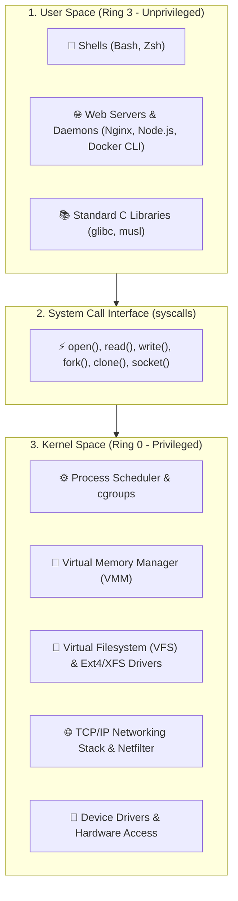
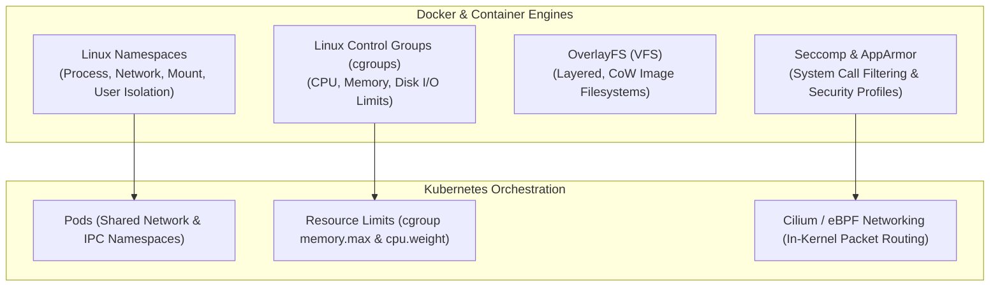

# Why Linux Is the Backbone of Modern Infrastructure

Over **96% of the world's top 1 million web servers**, 100% of the world's top 500 supercomputers, all Android devices, and virtually every public cloud instance (AWS EC2, Google Cloud Compute, Azure VMs) run on Linux. If you work in DevOps, Site Reliability Engineering (SRE), Cloud Architecture, or Backend Engineering, Linux is not optional — it is the operating system of the internet.

```mermaid
flowchart TD
    APP["🚀 Web Applications\n(Node.js, Go, Python, Java)"]
    CONTAINER["🐳 Container Engine\n(Docker, containerd, runc)"]
    ORCHESTRATION["☸️ Cluster Orchestration\n(Kubernetes, K3s)"]
    CLOUD["☁️ Cloud Infrastructure\n(AWS EC2, GCP Compute, Azure Linux)"]
    KERNEL["🐧 Linux Kernel\n(Namespaces, cgroups, eBPF, TCP/IP, VFS)"]

    APP --> CONTAINER --> ORCHESTRATION --> CLOUD --> KERNEL

    style KERNEL fill:#1e3a5f,stroke:#3b82f6,stroke-width:2px
```



---

## 1. Linux Architecture: Kernel vs. User Space

Linux is an operating system kernel originally created by **Linus Torvalds** in 1991. The complete operating system consists of two distinct operational realms:



- **Kernel Space (Ring 0)**: The core software that has direct, unrestricted access to the physical CPU, memory, disks, and network interface cards (NICs).
- **User Space (Ring 3)**: Where your applications, shells (`bash`, `zsh`), system daemons (`systemd`, `ssh`), and development tools run in an isolated, protected mode. Applications request kernel operations safely via **system calls** (`syscalls`).

---

## 2. The Linux Distribution (Distro) Landscape

Because the Linux kernel is open source (GPLv2), various organizations bundle the kernel with different package managers, core utilities, and system software into **Distributions**:

| Distro Family | Package Manager | Init System | Primary Use Cases | Examples |
| :--- | :--- | :--- | :--- | :--- |
| **Debian / Ubuntu** | `apt` / `dpkg` | `systemd` | Default cloud VMs, web servers, developer laptops | Ubuntu Server 22.04/24.04 LTS, Debian 12 |
| **RHEL / Fedora** | `dnf` / `rpm` | `systemd` | Enterprise corporate environments, banking, defense | Red Hat Enterprise Linux, Rocky Linux, AlmaLinux |
| **Alpine Linux** | `apk` | `OpenRC` | Ultra-minimal Docker base images (musl libc, ~5MB size) | `alpine:latest`, `node:alpine`, `python:alpine` |
| **Arch Linux** | `pacman` | `systemd` | Rolling release, bleeding-edge packages, power users | Arch, Manjaro |

<Callout type="tip" title="Enterprise Linux Tip: Rocky vs. Ubuntu">
In public cloud deployments, **Ubuntu LTS** is the industry standard for fast-moving startups and web platforms, while **RHEL / Rocky Linux** dominates regulated enterprise and banking architectures due to long 10-year support lifecycles.
</Callout>

---

## 3. The Linux Filesystem Hierarchy Standard (FHS)

Unlike Windows, which assigns separate drive letters (`C:\`, `D:\`), Linux unifies all storage disks, partitions, mounted volumes, and virtual hardware into a single root tree starting at `/`:

```
/ (Root Directory)
├── bin/          → Essential system binaries (ls, cp, mv, cat, sh)
├── sbin/         → System administration binaries (iptables, fdisk, reboot)
├── etc/          → System configuration files (nginx.conf, /etc/hosts, /etc/resolv.conf)
├── home/         → User personal home directories (/home/ubuntu, /home/alice)
├── root/         → Home directory of the superuser (root)
├── var/          → Variable data (logs in /var/log, web data in /var/www, caches)
├── opt/          → Optional third-party software packages
├── tmp/          → Ephemeral temporary files (cleared on system reboot)
├── usr/          → User utilities and shared libraries (/usr/bin, /usr/lib)
├── proc/         → Virtual filesystem exposing active kernel and process metrics
├── sys/          → Virtual filesystem exposing hardware and kernel subsystems
└── dev/          → Device nodes representing physical/virtual hardware (/dev/sda, /dev/null)
```

---

## 4. Why DevOps Relies on Linux Primitives

Every major containerization and orchestration technology is built directly on native Linux kernel features:



1. **Linux Namespaces**: Provide process isolation (PID, Mount, Network, IPC, UTS, User namespaces). When you run a Docker container, it is not a virtual machine — it is simply a standard Linux process running inside isolated namespaces!
2. **Control Groups (cgroups)**: Enforce hardware resource limits (e.g. restricting a container to maximum 2 CPU cores and 512MB RAM, preventing OOM crashes on the host).
3. **eBPF (Extended Berkeley Packet Filter)**: Allows running sandboxed programs directly inside the Linux kernel for ultra-high-performance networking (Cilium), observability, and real-time security auditing.

---

## 5. POSIX Standards & Shell Flavors

A **Shell** is a command-line interpreter that reads your typed text commands and invokes the corresponding kernel system calls:

- **`sh` (Bourne Shell)**: The original POSIX standard shell found on all Unix systems.
- **`bash` (Bourne Again Shell)**: The default shell on most Linux distributions; supports rich arrays, functions, and programmable completion.
- **`zsh` (Z Shell)**: The modern default on macOS and popular for developer productivity with Oh My Zsh.

```bash
# Check your current active shell
echo $SHELL
# Output: /bin/bash

# Check Linux kernel release version
uname -r
# Output: 6.5.0-44-generic

# Inspect operating system distribution details
cat /etc/os-release
```

---

## Summary

- Linux is the foundational runtime for 96%+ of web infrastructure, containers, and cloud VMs.
- The **Linux Kernel (Ring 0)** manages hardware and resources, while **User Space (Ring 3)** executes user applications and shells.
- All files, disks, and virtual metrics live under a unified hierarchy standard (`/`).
- Modern DevOps tools like Docker and Kubernetes are thin abstractions over Linux kernel primitives (**Namespaces**, **cgroups**, **VFS**, and **eBPF**).

In the next lesson, you will master navigating the Linux shell environment, prompt anatomy, and high-speed terminal shortcuts!
