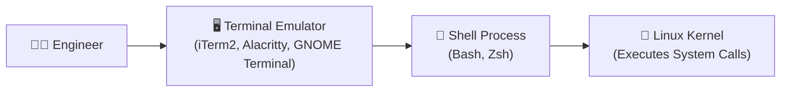

# Navigating the Linux Shell Environment

When connecting to a remote cloud virtual machine or debugging a container shell, your primary interface is the terminal. Mastering shell navigation and command-line shortcuts transforms tedious typing into fast, instinctual muscle memory.



---

## 1. Terminal vs. Shell vs. TTY

Before typing commands, let's clarify the terminology:

- **Terminal Emulator**: The graphical desktop application that displays text and catches keystrokes (e.g. iTerm2, macOS Terminal, Windows Terminal, Kitty).
- **TTY (Teletypewriter)**: A virtual terminal device within the Linux kernel (`/dev/tty1`, `/dev/pts/0`) that handles input/output streams.
- **Shell**: The command-line interpreter program (e.g. `/bin/bash`, `/bin/zsh`) that parses typed text, expands variables, and launches processes.

---

## 2. Anatomy of the Command Prompt

When you open a shell session, the prompt string (defined by the `$PS1` environment variable) conveys essential context:

```text
ubuntu@production-k8s-node01:~/projects/api$ 
  │               │              │        │
  │               │              │        └── User Privilege ($ = Normal User, # = Root)
  │               │              └────────── Current Working Directory (~ = /home/ubuntu)
  │               └───────────────────────── Hostname / Server Name
  └───────────────────────────────────────── Active Username
```

<Callout type="warning" title="Pay Close Attention to the Prompt Suffix">
- **`$`**: Indicates a normal, unprivileged user. Commands affecting system files will require `sudo`.
- **`#`**: Indicates the **`root` superuser**. Commands execute with full administrative privileges — typos can alter the host operating system!
</Callout>

---

## 3. Structure of a Linux Command

Every Linux command follows a standard syntax convention:

```text
command   -short_flags   --long_options   argument1   argument2
  │            │               │              │           │
  │            │               │              └───────────┴── Target Files / Paths
  │            │               └───────────────────────────── Word Options
  │            └───────────────────────────────────────────── Single-letter Switches
  └────────────────────────────────────────────────────────── Executable Binary or Builtin
```

```bash
# Example: List all files in human-readable format sorted by modification time
ls -lah -t /var/log/nginx/

# Flags can be passed individually:
ls -l -a -h

# Or combined into a single flag group:
ls -lah
```

---

## 4. The 4 Essential Navigation Commands

### 1. `pwd` — Print Working Directory
Prints the exact absolute path from the root `/` to where you are standing:

```bash
pwd
# Output: /home/ubuntu/projects/devops-zero-to-hero
```

### 2. `ls` — List Directory Contents
The most versatile directory inspection tool in Linux:

```bash
# Basic list of visible files
ls

# Long listing format: shows permissions, owner, group, file size, modification date
ls -l

# Show ALL files, including hidden dotfiles (.env, .git, .bashrc)
ls -la

# Long listing with Human-readable sizes (KB, MB, GB instead of raw bytes)
ls -lh

# Sort files by Last Modified Time (newest files appear first)
ls -lt

# Sort files by Size (largest files first) — great for finding disk-hogging logs!
ls -lS

# Reverse sort order
ls -ltr   # Oldest files first, newest at the bottom of screen
```

### 3. `cd` — Change Directory
Move across the filesystem hierarchy using absolute or relative paths:

```bash
# Move into a child folder
cd src/components

# Move up one level (parent directory)
cd ..

# Move up two directory levels
cd ../..

# Return to the previous working directory (like the "Back" button in a browser)
cd -

# Return straight to your personal home directory (/home/username)
cd ~
# Or simply type cd with no arguments:
cd

# Jump to the root directory
cd /
```

### 4. `clear` & `history` — Screen and Command Management

```bash
# Clear screen viewport (or press Ctrl + L)
clear

# Display numbered list of previously executed commands
history

# Search command history using grep
history | grep "docker run"

# Re-run specific command by history number
!142
```

---

## 5. History Expansion Shortcuts (DevOps Pro Tricks)

```bash
# Repeat the very last executed command
!!

# Example: Forgot sudo? Quickly rerun the last command with root privileges!
apt install nginx
# Permission denied
sudo !!
# Executes: sudo apt install nginx

# !$ extracts the LAST argument of the previous command
mkdir -p /var/www/my-application
cd !$
# Executes: cd /var/www/my-application

# Search past commands interactively by keyword:
# Press Ctrl + R, then start typing "docker"
(reverse-i-search)`doc': docker compose up -d
```

---

## 6. GNU Readline Keyboard Shortcuts

The bash shell uses the GNU Readline library for command-line editing. Memorizing these shortcuts will drastically speed up your terminal workflow:

| Key Combination | Action | Practical DevOps Scenario |
| :--- | :--- | :--- |
| **`Tab`** | Autocomplete path or command | Avoid typing long 50-character Kubernetes resource names |
| **`Ctrl + A`** | Move cursor to **beginning** of line | Jump to start to prepend `sudo` or environment variable |
| **`Ctrl + E`** | Move cursor to **end** of line | Jump to end to append output redirection `> out.log` |
| **`Alt + F` / `Esc + F`** | Move cursor **forward one word** | Fast navigation across directory slashes |
| **`Alt + B` / `Esc + B`** | Move cursor **backward one word** | Fast navigation across command flags |
| **`Ctrl + U`** | Cut line from cursor to **start** | Discard mistyped command quickly |
| **`Ctrl + K`** | Cut line from cursor to **end** | Trim unwanted trailing arguments |
| **`Ctrl + W`** | Delete previous **word** | Fix mistyped filename without backspacing 20 times |
| **`Ctrl + Y`** | Paste (yank) previously cut text | Recover text deleted with `Ctrl + U` or `Ctrl + W` |
| **`Ctrl + C`** | Send `SIGINT` (Kill foreground job) | Stop runaway scripts, infinite loops, or stuck ping commands |
| **`Ctrl + L`** | Clear screen | Clean terminal display while keeping active command |

---

## Summary

- The command prompt (`PS1`) shows your active **username**, **hostname**, **path**, and **privilege level** (`$` vs `#`).
- Combine `ls` flags like `ls -lahrt` to inspect hidden files, human-readable sizes, and chronological sort orders.
- Use `cd -` to toggle back and forth between two directories.
- Master Readline shortcuts like `Ctrl + A`, `Ctrl + E`, `Ctrl + W`, and `Ctrl + R` to navigate without touching the arrow keys.

In the next lesson, you will master managing files and directories, absolute vs. relative paths, and live log streaming with `tail -f`!
