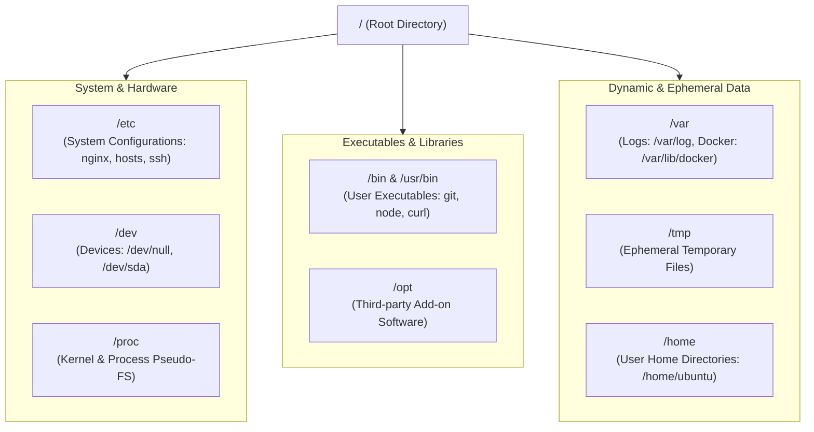

# Manipulating the Linux Filesystem

In DevOps, virtually every task involves filesystem interaction: reading Docker configuration files, mounting volumes, streaming live web server logs, managing file trees, and ensuring build artifacts land in the right directories.



---

## 1. The Filesystem Hierarchy Standard (FHS) in Detail

Understanding standard directory locations allows you to immediately locate configuration files and diagnostic logs across any Linux distribution:

| Directory | Purpose in DevOps & Cloud Engineering | Key Files & Subdirectories |
| :--- | :--- | :--- |
| **`/etc`** | Central repository for all static system and service configurations. | `/etc/nginx/nginx.conf`, `/etc/hosts`, `/etc/ssh/sshd_config`, `/etc/resolv.conf` |
| **`/var/log`** | Standard location where system daemons and servers write log files. | `/var/log/syslog`, `/var/log/nginx/access.log`, `/var/log/auth.log` |
| **`/var/lib`** | State and persistent data for local services and container runtimes. | `/var/lib/docker` (Docker layers & volumes), `/var/lib/postgresql/data` |
| **`/proc`** | Virtual pseudo-filesystem exposing live Linux kernel and process statistics. | `/proc/cpuinfo`, `/proc/meminfo`, `/proc/<PID>/cmdline` |
| **`/dev`** | Special device nodes representing physical and virtual hardware interfaces. | `/dev/null` (the bit bucket), `/dev/zero`, `/dev/urandom` (cryptographic random data) |
| **`/tmp`** | Ephemeral scratch directory; wiped automatically upon system reboot. | Temporary build artifacts, socket files, PID locks |
| **`/usr/local/bin`** | Custom binaries and command-line tools installed by administrators. | Manually downloaded `kubectl`, `helm`, `terraform` or `docker-compose` binaries |

---

## 2. Absolute vs. Relative Paths

```text
Absolute Path:   /var/log/nginx/access.log   (Always starts with leading / root)
Relative Path:   ./nginx/access.log          (Relative to current location)
Parent Path:     ../logs/access.log          (Step up one folder, then enter logs)
Home Path:       ~/projects/api              (Expands to /home/username/projects/api)
```

<Callout type="important" title="Always Use Absolute Paths in CI/CD and Cron Jobs">
In automated scripts (like GitHub Actions, Dockerfiles, or crontabs), the working directory can vary. Always use explicit **absolute paths** (e.g. `/opt/app/start.sh`) rather than relative paths (`./start.sh`) to prevent path-resolution errors.
</Callout>

---

## 3. Creating Files and Directories with Brace Expansion

```bash
# 1. Create an empty file (or update timestamp of existing file)
touch app.config

# 2. Create multiple files simultaneously
touch Dockerfile docker-compose.yml .env.example

# 3. Create nested directory hierarchies in a single command (-p flag)
mkdir -p deployments/production/k3s/manifests

# 4. Supercharge creation with Bash Brace Expansion ({...})
# Creates: src/, tests/, docs/, and config/ in one step
mkdir -p app/{src,tests,docs,config}

# Generate 5 test data files: test-1.log, test-2.log, ..., test-5.log
touch app/tests/test-{1..5}.log
```

---

## 4. Copying and Moving Files Safely

```bash
# Copy a single file
cp app.config app.config.bak

# Copy a directory RECURSIVELY (-r flag is required for directories)
cp -r src/ src.backup/

# Copy preserving permissions, timestamps, and ownership (-a Archive mode)
# CRITICAL for preserving executable bits on deployment scripts!
cp -a /var/www/html /var/www/html.backup

# Move (relocate) a file to a new directory
mv Dockerfile deployments/production/

# Rename a file in place
mv old-config.yaml new-config.yaml
```

---

## 5. File Viewing & Diagnostic Tools

In headless production environments without GUI editors, command-line inspection tools are essential:

### `cat` — Quick Inspection of Short Files
```bash
# Print contents of file to terminal
cat /etc/os-release

# Print with line numbers (-n flag)
cat -n package.json
```

### `less` — Interactive Pager for Large Files
Never use `cat` on a 500MB log file! Use `less` to scroll and search without overloading terminal memory:

```bash
less /var/log/syslog
```

**Essential `less` Navigation Keys**:
- <kbd>Space</kbd> / <kbd>f</kbd> — Scroll down one page.
- <kbd>b</kbd> — Scroll up one page.
- <kbd>G</kbd> — Jump to the **end** of the file.
- <kbd>g</kbd> — Jump to the **start** of the file.
- <kbd>/</kbd>`keyword` — Search forward for text match.
- <kbd>n</kbd> — Jump to the **next** search match.
- <kbd>N</kbd> — Jump to the **previous** search match.
- <kbd>q</kbd> — **Quit** and return to shell prompt.

### `head` and `tail` — File Boundaries
```bash
# View the first 15 lines of a file
head -n 15 /etc/passwd

# View the last 20 lines of a log file
tail -n 20 /var/log/nginx/access.log
```

### `tail -f` and `tail -F` — Live Log Streaming

```bash
# Stream new incoming log entries in real time (follow mode)
tail -f /var/log/nginx/access.log

# tail -F (capital F) — Follow and retry if log file is rotated (e.g. logrotate)
tail -F /var/log/app.log
```

<Callout type="tip" title="DevOps Pro Command: Real-Time Polling with watch">
Use `watch` to periodically execute a command and display full-screen output differences:
```bash
# Monitor disk space or directory growth every 2 seconds
watch -n 2 df -h
watch -n 1 ls -lh /var/log/nginx/
```
</Callout>

---

## 6. Deletion Safety & Best Practices

```bash
# Delete a single file
rm old-config.yaml

# Delete an empty directory
rmdir empty-dir

# Delete directory and all contents recursively (-r) without interactive prompts (-f)
rm -rf temporary-build/
```

<Callout type="danger" title="The rm -rf Danger Zone">
There is **NO Recycle Bin or Trash folder** in the Linux command line. When a file is removed via `rm`, its inodes are unlinked and data blocks are marked available for overwriting immediately.

**Best Practice Safety Habits**:
1. Never run `rm -rf *` inside a directory without confirming `pwd` first.
2. Avoid using shell variables in deletion commands without validation (e.g. if `$DIR` is empty, `rm -rf /$DIR` becomes `rm -rf /`!).
3. Dry-run first with `ls` to verify the target glob: `ls *.bak` before running `rm *.bak`.
</Callout>

---

## Summary

- The **Filesystem Hierarchy Standard (FHS)** organizes system configs in `/etc`, logs in `/var/log`, and device nodes in `/dev`.
- Always use **absolute paths** in automation pipelines to avoid working directory ambiguity.
- Use **brace expansion** (`mkdir -p app/{src,dist,config}`) for rapid directory scaffolding.
- Use `cp -a` (archive mode) to retain file timestamps, permissions, and symlink integrity.
- Use `less` for large files, `tail -F` for live rotating logs, and `watch` for continuous command monitoring.

In the next lesson, you will master text editing in the terminal (`nano`, `vim`), searching with `grep` and `find`, and stream transformation with `sed` & `awk`!
