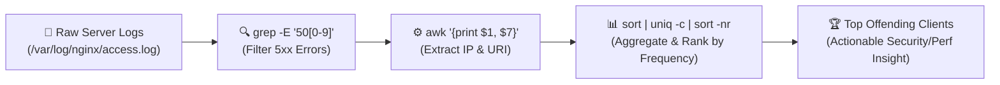
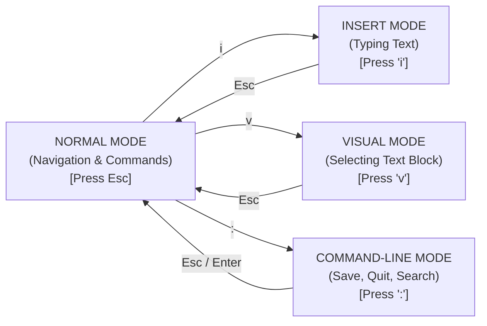

# Searching, Filtering & Editing Text in Linux

In cloud infrastructure and DevOps, configuration files (YAML, JSON, INI, Nginx configs) and server logs are plain text. Being able to edit files directly inside a remote shell and parse gigabytes of log output with `grep`, `find`, `sed`, and `awk` is a required engineering skill.



---

## 1. Terminal Text Editors: `nano` vs. `vim`

When you SSH into a remote Linux server or enter a container, there is no VS Code GUI. You must use a terminal-based editor:

### `nano` — The Beginner-Friendly Editor
`nano` is intuitive and displays keyboard shortcuts at the bottom of the screen (`^` represents the <kbd>Ctrl</kbd> key):

```bash
nano /etc/nginx/nginx.conf
```
- <kbd>Ctrl + O</kbd> — **WriteOut (Save)** changes. Press <kbd>Enter</kbd> to confirm filename.
- <kbd>Ctrl + W</kbd> — **Where Is (Search)** for text.
- <kbd>Ctrl + K</kbd> — **Cut** line.
- <kbd>Ctrl + U</kbd> — **Paste (Uncut)** line.
- <kbd>Ctrl + X</kbd> — **Exit** nano (prompts to save if modified).

---

### `vim` — The Ubiquitous Powerhouse
`vim` (Vi IMproved) is pre-installed on virtually every Linux distribution and container base image. It is a **modal editor**:



### Essential `vim` Cheat Sheet:

1. **Open a file**: `vim app.config` (starts in **Normal Mode**).
2. **Start typing**: Press <kbd>i</kbd> to switch to **Insert Mode**.
3. **Stop typing / return to command mode**: Press <kbd>Esc</kbd>.
4. **Save and Exit**:
   - `:w` — Save (Write).
   - `:q` — Quit.
   - `:wq` or `ZZ` — **Save and Quit**.
   - `:q!` — **Force Quit (Discard all unsaved changes)**.
5. **Navigation & Editing in Normal Mode**:
   - `dd` — Delete (cut) current line.
   - `yy` — Copy (yank) current line.
   - `p` — Paste below cursor.
   - `u` — **Undo** last change.
   - `Ctrl + r` — **Redo** undone change.
   - `/keyword` — Search for `keyword` forward (press `n` for next match).
   - `:%s/old/new/g` — Find and replace all occurrences across entire file.
   - `:set number` — Display line numbers.

---

## 2. Searching File Contents with `grep`

`grep` (Global Regular Expression Print) scans files or standard input for text patterns:

```bash
# Basic case-sensitive search
grep "ERROR" /var/log/syslog

# Case-insensitive search (-i)
grep -i "database connection failed" app.log

# Recursive directory search (-r) with line numbers (-n)
grep -rn "API_SECRET_KEY" ./src/

# Invert match (-v): Print all lines that DO NOT match
grep -v "^#" /etc/ssh/sshd_config   # Show config ignoring comment lines (#)
grep -v "^$" /etc/ssh/sshd_config   # Show config ignoring empty lines

# Search using Extended Regular Expressions (-E)
grep -E "(404|500|502)" /var/log/nginx/access.log

# Context lines: Show 2 lines Before (-B), After (-A), or Both (-C)
grep -C 3 "FATAL EXCEPTION" /var/log/app.log

# Print ONLY matching text (-o) and count occurrences (-c)
grep -c "GET /api/v1/checkout" access.log
```

---

## 3. Locating Files with `find`

While `grep` searches *inside* files, `find` searches the filesystem *for* files by attributes:

```bash
# Find files by name (case-sensitive)
find /etc -name "nginx.conf"

# Find files by name pattern (case-insensitive -iname)
find . -iname "*.yaml"

# Find only Directories (-type d) or Regular Files (-type f)
find /var/log -type f -name "*.log"

# Find files modified in the last 24 hours (-mtime -1) or older than 7 days (+7)
find /tmp -type f -mtime +7

# Find files larger than 100MB (-size +100M)
find /var -type f -size +100M

# Find files with specific permissions
find ~/.ssh -type f -perm 600

# Execute a command on every found file (-exec ... {})
# Automatically compress logs older than 30 days:
find /var/log/apps -type f -name "*.log" -mtime +30 -exec gzip {} \;

# Delete temporary socket files safely
find /tmp -type s -name "*.sock" -delete
```

---

## 4. Stream Editing with `sed`

`sed` (Stream Editor) modifies text streams on the fly without opening an editor:

```bash
# Replace 'localhost:5432' with 'postgres-db:5432' in output stream
sed 's/localhost:5432/postgres-db:5432/g' config.env

# In-place file modification (-i flag) — updates the file directly on disk!
sed -i 's/DEBUG=true/DEBUG=false/g' .env

# In-place modification with automatic backup creation
sed -i.bak 's/PORT=3000/PORT=8080/g' .env

# Delete lines matching a pattern
sed -i '/^#/d' config.ini       # Delete all comment lines
sed -i '/^$/d' config.ini       # Delete all blank lines
```

---

## 5. Column Extraction & Analysis with `awk`

`awk` is a complete pattern-scanning and text-processing language designed for structured column data (like CSVs, access logs, or command output):

```bash
# Print specific columns ($1 = first column, $4 = fourth column)
# Example: List usernames and default shells from /etc/passwd (delimiter -F :)
awk -F: '{print $1, $7}' /etc/passwd

# Parse Nginx access log to extract IP ($1) and HTTP Status ($9)
awk '{print $1, $9}' /var/log/nginx/access.log

# Conditional filtering: Print processes consuming > 10% CPU from ps aux
ps aux | awk '$3 > 10.0 {print $2, $3, $11}'
```

---

## 6. Text Manipulation Toolkit: `wc`, `sort`, `uniq`, `cut`, `tr`

```bash
# 1. wc (Word Count): lines (-l), words (-w), bytes (-c)
wc -l /var/log/syslog

# 2. cut: Extract delimited fields
# Extract only IP addresses from /etc/hosts
cut -d' ' -f1 /etc/hosts

# 3. tr: Translate or delete characters
# Convert text to uppercase
echo "hello devops" | tr '[:lower:]' '[:upper:]'
# Delete Windows carriage returns (\r) from file
cat windows.sh | tr -d '\r' > unix.sh

# 4. sort & uniq: Count unique occurrences
# Real-world DevOps recipe: Top 5 IP addresses hitting your web server
awk '{print $1}' /var/log/nginx/access.log | sort | uniq -c | sort -nr | head -n 5
```

---

## Summary

- Use **`nano`** for quick simple edits; master **`vim`** (`i` to insert, <kbd>Esc</kbd> + `:wq` to save, `:q!` to abort).
- Use **`grep -rnE`** for fast recursive keyword and regex searching across codebases.
- Use **`find`** to locate files by name, size, type, or age, and execute batch operations with `-exec`.
- Use **`sed -i`** for automated in-place configuration replacements in CI/CD scripts.
- Chain **`awk`**, **`sort`**, and **`uniq -c`** into high-speed log-analysis pipelines.

In the next lesson, you will master Linux permissions, ownership, octal modes (`chmod 755/600`), and superuser delegation with `sudo`!
