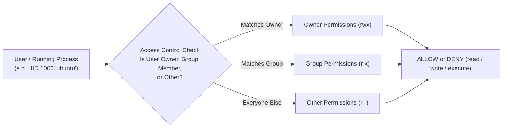
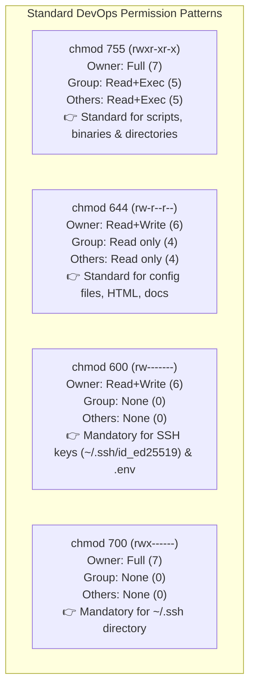

# Linux Security Model: Permissions & Ownership

Linux is a multi-user, multi-tenant operating system by design. Every process, file, and directory is bound to a specific **User ID (UID)** and **Group ID (GID)**. Understanding how Linux enforces access control prevents common production pitfalls like `Permission denied` errors in CI/CD pipelines or accidental permission leaks (`chmod 777`).



---

## 1. Users, Groups & Identity

Every account on Linux has a unique numerical identifier:

| Account Type | Typical UID Range | Examples | Purpose |
| :--- | :--- | :--- | :--- |
| **Superuser (root)** | `0` | `root` | Unrestricted administrative control across the kernel |
| **System Accounts** | `1` – `999` | `www-data`, `nginx`, `postgres`, `daemon` | Unprivileged service daemons (cannot log in directly) |
| **Human / Regular Users** | `1000`+ | `ubuntu`, `alice`, `deploy` | Interactive users and DevOps deployment workers |

```bash
# Check current username
whoami
# Output: ubuntu

# Inspect your numerical UID, GID, and all group memberships
id
# Output: uid=1000(ubuntu) gid=1000(ubuntu) groups=1000(ubuntu),4(adm),27(sudo),998(docker)

# View all groups configured on the system
cat /etc/group | cut -d: -f1
```

---

## 2. Deconstructing the 10-Character Permission String

When you run `ls -l`, each entry begins with a 10-character mode string:

```text
-  r w x  r - x  r - -    1  ubuntu  developers   4096  Aug 18 10:00  deploy.sh
┬  ─────  ─────  ─────
│    │      │      │
│    │      │      └──────── Others / World Permissions (Everyone else)
│    │      └─────────────── Group Permissions (Members of 'developers')
│    └────────────────────── Owner / User Permissions (The user 'ubuntu')
└─────────────────────────── File Type (- = Regular File, d = Directory, l = Symlink)
```

### File vs. Directory Permission Semantics

The permissions `r`, `w`, and `x` have fundamentally different meanings for files versus directories:

| Permission | Octal Value | Meaning for a File | Meaning for a Directory |
| :--- | :---: | :--- | :--- |
| **`r` (Read)** | **`4`** | Open and read file contents (`cat`, `less`) | List files within the folder (`ls`) |
| **`w` (Write)** | **`2`** | Modify, save, or truncate file content | Create, rename, or delete files inside the folder |
| **`x` (Execute)** | **`1`** | Run file as a binary program or shell script | Enter directory (`cd`) and access file metadata |

<Callout type="important" title="Directories ALWAYS Need Execute (+x) Permission!">
If a directory lacks the `x` (execute) bit, users cannot `cd` into it or access any files inside it, even if the individual files have `r` (read) permissions!
</Callout>

---

## 3. The Octal Mode Calculation

Permissions are represented by three octal digits (one each for Owner, Group, and Others). Each digit is the sum of its permission values (`r=4`, `w=2`, `x=1`):

```text
r w x   =   4 + 2 + 1   =   7   (Full access)
r w -   =   4 + 2 + 0   =   6   (Read + Write)
r - x   =   4 + 0 + 1   =   5   (Read + Execute)
r - -   =   4 + 0 + 0   =   4   (Read only)
- - -   =   0 + 0 + 0   =   0   (No access)
```



---

## 4. Modifying Permissions with `chmod`

### Numeric Mode (Fast & Explicit)
```bash
# Make a deployment script executable for everyone, writable only by owner
chmod 755 deploy.sh

# Restrict sensitive environment secrets to owner only
chmod 600 .env.production

# Restrict SSH directory
chmod 700 ~/.ssh
```

### Symbolic Mode (Targeted Add/Remove)
Use symbols: Users (`u`), Groups (`g`), Others (`o`), All (`a`), with operators `+` (add), `-` (remove), `=` (set exact):

```bash
# Add execute permission for user/owner (+x)
chmod u+x build.sh

# Make executable for all users (shorthand for a+x)
chmod +x build.sh

# Remove write permission from group and others (go-w)
chmod go-w application.config

# Set exact permissions: user gets read/write, group gets read, others get none
chmod u=rw,g=r,o= secrets.txt
```

---

## 5. Special Permission Bits: SUID, SGID & Sticky Bit

Beyond basic `rwx`, Linux provides three special permission bits for advanced access control:

| Special Bit | Octal Value | Symbol in `ls -l` | Practical Purpose | Real-World Example |
| :--- | :---: | :---: | :--- | :--- |
| **SUID (Set User ID)** | **`4000`** | `s` in owner (`rwsr-xr-x`) | Executable runs with privileges of the **file owner**, not the invoking user. | `/usr/bin/passwd` (allows normal users to update `/etc/shadow`) |
| **SGID (Set Group ID)** | **`2000`** | `s` in group (`rwxr-sr-x`) | New files created in directory automatically inherit the **parent directory's group**. | Shared team collaboration folders (`/var/www/shared`) |
| **Sticky Bit** | **`1000`** | `t` in others (`rwxrwxrwt`) | Users can only delete or rename files that **they personally own**, even in a world-writable directory. | `/tmp` and `/var/tmp` |

```bash
# Enable Sticky Bit on shared directory (1777)
chmod 1777 /tmp/shared-data

# Enable SGID on shared team directory so all new files belong to 'developers' group (2775)
chmod 2775 /var/www/project
```

---

## 6. Changing File Ownership with `chown` & `chgrp`

```bash
# Change owner to user 'node'
chown node app.js

# Change BOTH owner and group simultaneously (user:group syntax)
chown ubuntu:docker /var/run/docker.sock

# Change ownership recursively across an entire directory tree (-R flag)
chown -R www-data:www-data /var/www/html/

# Change group only
chgrp developers /opt/shared-scripts/
```

---

## 7. Default File Creation Mask: `umask`

When an application creates a new file, the initial permissions are calculated by subtracting the **`umask`** value from system defaults:

```text
Default Directory Base:   777 (rwxrwxrwx)     Default File Base:   666 (rw-rw-rw-)
Minus Standard umask:    -022 (----w--w-)     Minus Standard umask: -022 (----w--w-)
────────────────────────────────────────     ────────────────────────────────────────
Resulting Directory:      755 (rwxr-xr-x)     Resulting File:       644 (rw-r--r--)
```

```bash
# Check current umask
umask
# Output: 0022

# Set stricter umask for security-sensitive shell (files created as 600, dirs as 700)
umask 077
```

---

## 8. Administrative Elevation: `sudo` & `visudo`

`sudo` (SuperUser DO) allows authorized users to run security-sensitive commands without sharing the root password:

```bash
# Run a single command with root privileges
sudo apt update

# Open an interactive root shell session
sudo -i
# Or:
sudo su -
```

### Safe Editing of `/etc/sudoers` with `visudo`
Never edit `/etc/sudoers` directly with `nano` or `vim`. Always use **`visudo`**, which performs strict syntax validation before writing changes to disk (preventing accidental system lockout):

```bash
sudo visudo
```

```text
# Allow members of group 'sudo' to execute any command
%sudo   ALL=(ALL:ALL) ALL

# Configure automated CI/CD deployment user without requiring password prompt:
github-runner ALL=(ALL) NOPASSWD: ALL

# Allow user 'deploy' to restart Nginx only:
deploy ALL=(ALL) NOPASSWD: /usr/sbin/systemctl restart nginx
```

---

## Summary

- Every file is governed by three permission triplets: **Owner**, **Group**, **Others**.
- Read = 4, Write = 2, Execute = 1.
- Standard configurations: **`755`** (binaries, scripts, directories), **`644`** (configs, code), **`600`** (SSH keys, secrets).
- Special bits: **SUID (`4000`)**, **SGID (`2000`)**, and **Sticky Bit (`1000`)** handle shared team folders and `/tmp`.
- Change ownership with `chown -R user:group path`.
- Always configure passwordless elevation or restricted commands using **`visudo`**.

In the next lesson, you will master Linux process management, PID hierarchies, resource monitoring with `htop`, signals (`SIGTERM`, `SIGKILL`), and `systemd` services!
