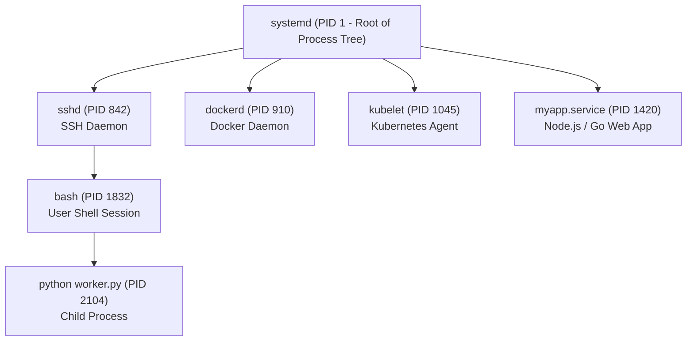

# Monitoring Processes, Signals & Systemd in Production

Every application, database engine, container daemon, and background job running on a Linux system is a **Process**. When an application freezes, consumes 100% CPU, or exhausts RAM, DevOps engineers must quickly identify the offending process, inspect its state, gracefully signal or terminate it, and configure reliable background service recovery using **Systemd**.



---

## 1. The Linux Process Lifecycle & States

Every process in Linux is spawned by a parent process calling the `fork()` and `execve()` system calls. The very first process initialized by the kernel during boot is **PID 1 (`systemd`)**, which adopts orphaned child processes and manages the entire system lifecycle.

### Process States in Linux

| State Code | Name | Description | DevOps Significance |
| :---: | :--- | :--- | :--- |
| **`R`** | Running / Runnable | Actively executing instructions on CPU or queued in CPU run-queue. | High `%CPU` processes during spikes |
| **`S`** | Interruptible Sleep | Waiting for an event, network packet, timer, or I/O operation. | Normal state for idle web servers |
| **`D`** | Uninterruptible Sleep | Blocked waiting directly on hardware disk I/O (cannot be killed!). | Indicates failing disks or saturated NFS mounts |
| **`Z`** | Zombie / Defunct | Terminated process whose parent has not yet read its exit code via `wait()`. | Harmless alone, but indicates parent process bug |
| **`T`** | Stopped / Traced | Suspended via signal (e.g. <kbd>Ctrl + Z</kbd> or debugger). | Paused job in background |

---

## 2. Inspecting Active Processes: `ps`, `pstree` & `pgrep`

```bash
# 1. BSD Format (Most Popular in DevOps):
# a = all users, u = display user/owner format, x = include processes without a controlling tty
ps aux

# 2. System V Standard Format:
ps -ef

# 3. Find specific process by name
ps aux | grep node
pgrep -fl nginx

# 4. View hierarchical Process Tree with PIDs
pstree -p

# 5. Identify the Top 5 Memory-Consuming Processes (Instant Troubleshooting!)
ps aux --sort=-%mem | head -n 6

# 6. Identify the Top 5 CPU-Consuming Processes
ps aux --sort=-%cpu | head -n 6
```

### Deconstructing `ps aux` Columns

```text
USER       PID  %CPU %MEM    VSZ   RSS TTY      STAT START   TIME COMMAND
ubuntu    1420   4.2  8.5 950420 72100 ?        Sl   10:30   1:15 node server.js
```
- **`PID`**: Unique Process ID.
- **`%CPU` / `%MEM`**: Percentage of total host CPU cores and physical RAM consumed.
- **`VSZ`**: Virtual Memory Size (total memory the process can access).
- **`RSS`**: Resident Set Size (actual physical RAM pages in use).
- **`STAT`**: Current process state (e.g. `Sl` = Sleeping multi-threaded).

---

## 3. Real-Time Resource Monitoring: `top` & `htop`

```bash
# Launch interactive monitor
top

# Interactive colored viewer (Recommended: sudo apt install -y htop)
htop
```

### Decoding the `top` Header Metrics

```text
top - 14:22:05 up 12 days,  3:14,  2 users,  load average: 0.42, 0.85, 1.12
Tasks: 184 total,   2 running, 182 sleeping,   0 stopped,   0 zombie
%Cpu(s):  6.2 us,  2.1 sy,  0.0 ni, 89.4 id,  1.8 wa,  0.0 hi,  0.5 si,  0.0 st
MiB Mem :   7960.2 total,   2140.4 free,   3820.1 used,   1999.7 buff/cache
```

1. **Load Average (1m, 5m, 15m)**: Average number of processes running or waiting for CPU/Disk. On a 4-core machine:
   - `Load = 2.0` → System is 50% utilized (Healthy).
   - `Load = 4.0` → System is 100% utilized (Fully loaded).
   - `Load = 8.0` → System is overloaded; processes are queueing.
2. **CPU State Breakdown**:
   - **`us` (User)**: Time spent executing user application code.
   - **`sy` (System)**: Time spent in kernel system calls.
   - **`id` (Idle)**: Percentage of available spare CPU capacity.
   - **`wa` (I/O Wait)**: CPU waiting on slow disk reads/writes (indicates storage bottleneck).
   - **`st` (Steal)**: CPU cycles stolen by the hypervisor in shared cloud VMs.

---

## 4. Linux Signals & Terminating Processes

Linux signals are asynchronous notifications sent to a process to request an action:

| Signal | Number | Name | Action & Purpose | Can Be Caught / Ignored? |
| :---: | :---: | :--- | :--- | :---: |
| **`SIGHUP`** | `1` | Hangup | Request daemon to reload configuration without restarting. | Yes |
| **`SIGINT`** | `2` | Interrupt | Terminal interrupt (<kbd>Ctrl + C</kbd>). | Yes |
| **`SIGQUIT`**| `3` | Quit | Request termination with core dump (<kbd>Ctrl + Backslash</kbd>). | Yes |
| **`SIGKILL`**| **`9`** | Kill | **Immediate kernel termination.** Process cannot intercept or block this. | ❌ NO |
| **`SIGTERM`**| **`15`** | Terminate | **Graceful shutdown request (Default).** Allows process to close DB connections. | Yes |

```bash
# 1. Graceful termination (SIGTERM - Signal 15) — ALWAYS TRY THIS FIRST!
kill 1420
# Or explicitly:
kill -15 1420

# 2. Forceful emergency termination (SIGKILL - Signal 9)
# Use only if process is frozen and unresponsive to SIGTERM
kill -9 1420

# 3. Terminate by process name directly
pkill -f "python worker.py"
killall -15 nginx

# 4. Tell Nginx to reload config without dropping active HTTP connections (SIGHUP)
kill -1 $(pgrep -f "nginx: master")
```

<Callout type="warning" title="Why SIGKILL (-9) is a Last Resort">
When you send `SIGKILL` (`kill -9`), the kernel destroys the process immediately. The application has **zero opportunity** to write state to disk, flush write buffers, close database transactions, or delete temporary socket files.
</Callout>

---

## 5. Terminal Job Control: `&`, `Ctrl+Z`, `bg`, `fg` & `nohup`

```bash
# 1. Launch a command directly in the background by appending &
python backup-database.py &
# Output: [1] 28941  (Job number 1, PID 28941)

# 2. List all background jobs in current terminal session
jobs -l

# 3. Suspend a running foreground command:
# Press Ctrl + Z in terminal
# Output: [1]+  Stopped   npm run build

# 4. Resume the paused job in the background
bg %1

# 5. Bring a background job back to the foreground
fg %1

# 6. Run a command immune to SIGHUP when closing SSH session (No Hangup)
nohup python app.py > app.log 2>&1 &
```

---

## 6. Production Background Services: Writing Systemd Units

In modern Linux distributions, production applications are managed by **Systemd** so they automatically restart on failure and start on system boot.

### Creating a Custom Service: `/etc/systemd/system/web-api.service`

```ini
[Unit]
Description=Node.js Production Web API Service
After=network.target postgresql.service
Wants=postgresql.service

[Service]
Type=simple
User=ubuntu
Group=ubuntu
WorkingDirectory=/opt/web-api
ExecStart=/usr/bin/node /opt/web-api/dist/server.js
Restart=always
RestartSec=5s

# Security Hardening Sandbox Directives:
NoNewPrivileges=true
ProtectSystem=full
ProtectHome=read-only

# Environment Variables:
Environment=NODE_ENV=production
Environment=PORT=3000
EnvironmentFile=/etc/web-api/.env

# Standard Output and Logging:
StandardOutput=journal
StandardError=journal

[Install]
WantedBy=multi-user.target
```

### Managing the Service with `systemctl`

```bash
# 1. Reload systemd manager configuration after editing unit files
sudo systemctl daemon-reload

# 2. Start the service
sudo systemctl start web-api

# 3. Check live status and active PID
sudo systemctl status web-api

# 4. Enable service to start automatically on system boot
sudo systemctl enable web-api

# 5. Restart or Reload
sudo systemctl restart web-api
sudo systemctl reload web-api

# 6. Stop service
sudo systemctl stop web-api
```

### Inspecting Service Logs with `journalctl`

```bash
# Stream live logs for a specific service in real time (follow mode)
journalctl -u web-api -f

# View logs since 1 hour ago
journalctl -u web-api --since "1 hour ago"

# View logs with specific priority level (errors only)
journalctl -u web-api -p err
```

---

## Summary

- Every Linux process has a **PID** and a **PPID** descending from **`systemd` (PID 1)**.
- Use `ps aux --sort=-%mem` and `ps aux --sort=-%cpu` for fast root-cause performance diagnosis.
- Understand CPU states in `top`: `us` (application), `sy` (kernel), `wa` (disk bottleneck), and `st` (hypervisor steal).
- Always terminate gracefully with **`SIGTERM` (15)** before forcing with **`SIGKILL` (9)**.
- Deploy long-running production workloads as **Systemd units** (`/etc/systemd/system/*.service`) with automated restarts and `journalctl` centralized logging.

In the next lesson, you will master Linux package management across Debian/Ubuntu (`apt`), RHEL (`dnf`), and Alpine Docker containers (`apk`)!
