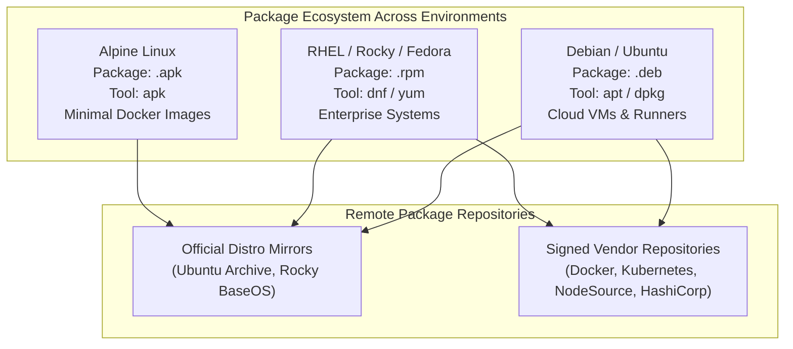
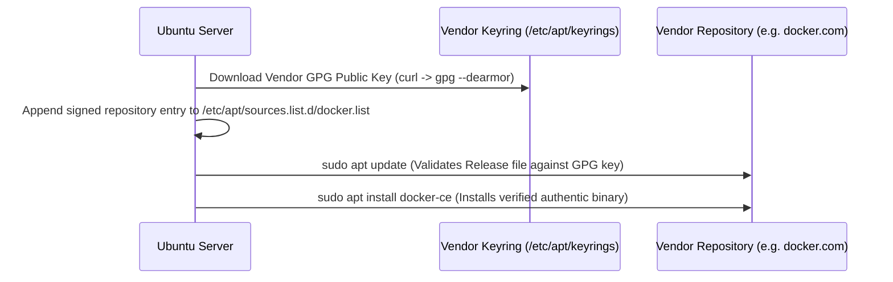

# Package Management Across Distros & Containers

In Linux, software is packaged, compiled, signed, and distributed through centralized repositories. As a DevOps engineer, you will manage dependencies across Ubuntu/Debian virtual machines (`apt`), enterprise Red Hat/Rocky Linux servers (`dnf`), and lightweight Alpine Docker containers (`apk`).



---

## 1. Package Manager Comparison

| Distro Family | High-Level Tool (Resolves Dependencies) | Low-Level Tool (Direct Package Operations) | Local Cache / Config Paths |
| :--- | :--- | :--- | :--- |
| **Ubuntu / Debian** | `apt` / `apt-get` | `dpkg` | `/etc/apt/sources.list`, `/var/cache/apt/archives` |
| **RHEL / Rocky / CentOS** | `dnf` / `yum` | `rpm` | `/etc/yum.repos.d/`, `/var/cache/dnf` |
| **Alpine Linux** | `apk` | `apk` | `/etc/apk/repositories`, `/etc/apk/keys` |

---

## 2. Advanced APT Management (Debian & Ubuntu)

### The Core Lifecycle: Update vs. Upgrade
A classic beginner confusion is the difference between `apt update` and `apt upgrade`:

```bash
# 1. apt update: Downloads the latest package INDEX lists from repositories.
# It does NOT install or upgrade any software!
sudo apt update

# 2. apt upgrade: Actually downloads and installs newer versions of installed packages.
sudo apt upgrade -y

# 3. apt full-upgrade (or dist-upgrade): Smart upgrade that handles changing dependencies,
# removing obsolete packages or installing new sub-dependencies.
sudo apt full-upgrade -y
```

<Callout type="important" title="Always Run apt update Before apt install">
If you attempt to install a package on a fresh cloud VM without running `sudo apt update` first, APT will attempt to fetch outdated version URLs and fail with `404 Not Found`.
</Callout>

### Installing, Removing & Cleaning Packages

```bash
# Install packages
sudo apt install -y nginx curl git jq

# Search for available packages matching keyword
apt search postgresql

# View detailed package metadata, version, and dependencies
apt show nginx

# Remove package (leaves configuration files in /etc intact)
sudo apt remove nginx

# Purge package (completely deletes package AND all /etc configs)
sudo apt purge nginx

# Automatically clean up unused orphaned dependencies
sudo apt autoremove -y

# Clear downloaded .deb archives from local disk cache (/var/cache/apt/archives)
sudo apt clean
```

### Low-Level Package Inspection with `dpkg`

```bash
# Install a standalone downloaded .deb file
sudo dpkg -i package_name.deb

# List all installed packages on the system
dpkg -l

# Search if a specific package is installed
dpkg -l | grep docker

# List all files and directories installed by a specific package
dpkg -L nginx

# Find which package owns a specific file on disk (Great for troubleshooting!)
dpkg -S /etc/nginx/nginx.conf
# Output: nginx-common: /etc/nginx/nginx.conf
```

---

## 3. Adding Signed Third-Party Repositories (Docker / NodeSource)

Modern DevOps installations (like Docker Engine, Kubernetes tools `kubectl`, or HashiCorp `terraform`) require adding vendor-signed GPG keys and custom repository sources to `/etc/apt/sources.list.d/`:



### Production Example: Installing Docker CE on Ubuntu

```bash
# 1. Install prerequisite utilities
sudo apt update
sudo apt install -y ca-certificates curl gnupg lsb-release

# 2. Create modern secure keyring directory
sudo install -m 0755 -d /etc/apt/keyrings

# 3. Download Docker official GPG key and convert to dearmored binary format
curl -fsSL https://download.docker.com/linux/ubuntu/gpg | \
  sudo gpg --dearmor -o /etc/apt/keyrings/docker.gpg
sudo chmod a+r /etc/apt/keyrings/docker.gpg

# 4. Add Docker repository source to APT sources.list.d
echo \
  "deb [arch=$(dpkg --print-architecture) signed-by=/etc/apt/keyrings/docker.gpg] https://download.docker.com/linux/ubuntu \
  $(lsb_release -cs) stable" | sudo tee /etc/apt/sources.list.d/docker.list > /dev/null

# 5. Update index and install
sudo apt update
sudo apt install -y docker-ce docker-ce-cli containerd.io docker-compose-plugin
```

---

## 4. Enterprise Package Management: DNF & RPM (RHEL / Rocky)

```bash
# 1. Check for updates and refresh repository metadata
sudo dnf check-update

# 2. Upgrade all system packages
sudo dnf upgrade -y

# 3. Install packages
sudo dnf install -y nginx git

# 4. Search and show package information
dnf search postgresql
dnf info nginx

# 5. Low-level RPM queries:
rpm -qa               # Query all installed RPM packages
rpm -ql nginx         # Query list of files installed by nginx
rpm -qf /bin/ls       # Query which RPM package owns /bin/ls
```

---

## 5. Container Package Management: APK (Alpine Linux)

In Dockerfiles using Alpine base images (`alpine:3.19` or `node:alpine`), `apk` (Alpine Package Keeper) installs minimal packages with no caching to keep images small:

```dockerfile
FROM alpine:3.19

# --no-cache avoids downloading index archives to /var/cache/apk/
# reducing final Docker image size by 10-20MB!
RUN apk update && apk add --no-cache \
    curl \
    git \
    jq \
    ca-certificates

CMD ["sh"]
```

---

## Summary

- Use **`apt update`** to refresh repository index metadata; use **`apt upgrade`** to install software patches.
- Use **`dpkg -S <path>`** to discover which package owns a specific configuration file.
- Securely install vendor tools (Docker, Kubernetes, HashiCorp) by downloading GPG keys into **`/etc/apt/keyrings/`** and adding source lines to **`/etc/apt/sources.list.d/`**.
- On Enterprise Linux, use **`dnf`** and **`rpm`**.
- In Docker containers, use **`apk add --no-cache`** for ultra-minimal, layer-optimized base images.

In the next lesson, you will master Linux networking, inspecting IP routing, checking open socket ports with `ss -tulnp`, and testing HTTP APIs with `curl`!
