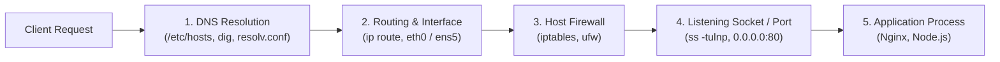

# Linux Networking & Service Diagnostics

When a container cannot reach a database, an API returns 502 Bad Gateway, or a microservice port is inaccessible, DevOps engineers rely on Linux networking tools to trace packets, verify listening sockets, test DNS resolution, and simulate HTTP calls.



---

## 1. Network Interfaces & IP Addressing: `ip`

Modern Linux replaces the deprecated `ifconfig` with the `iproute2` suite (`ip` command):

```bash
# 1. Inspect all network interfaces and assigned IP addresses
ip addr
# Or compact summary:
ip -brief addr

# 2. Inspect default gateway and routing table
ip route

# 3. Bring an interface up or down
sudo ip link set dev eth0 down
sudo ip link set dev eth0 up
```

### Common Linux Network Interface Types

| Interface Name | Type | Typical IP Address | Purpose |
| :--- | :--- | :--- | :--- |
| **`lo`** | Loopback | `127.0.0.1` (`localhost`) | Internal communication on the same machine |
| **`eth0` / `ens5`** | Physical / Cloud NIC | `10.0.1.25` or Public IP | Primary network card connected to VPC / Internet |
| **`docker0`** | Virtual Bridge | `172.17.0.1` | Default container bridge network in Docker |
| **`cni0` / `flannel.1`** | Kubernetes Overlay | `10.244.0.1` | Container Network Interface (CNI) in Kubernetes |

---

## 2. DNS Resolution & Troubleshooting: `dig` & `nslookup`

When an application fails to connect to `api.stripe.com` or `postgres.internal`, diagnose the DNS lookup chain:


### Inspecting DNS Configuration
```bash
# View local static IP-to-hostname mappings
cat /etc/hosts

# View configured upstream DNS nameservers
cat /etc/resolv.conf
# nameserver 127.0.0.53 (Local systemd-resolved DNS cache)
# nameserver 8.8.8.8     (Google Public DNS)
```

### Querying DNS with `dig`

```bash
# Standard DNS query (returns A records, query time, server response)
dig github.com

# Short output (prints ONLY the resolved IP address) — Great for scripts!
dig +short github.com

# Query specific DNS record types (MX = Mail, TXT = Verification, CNAME)
dig MX google.com
dig TXT _github-challenge.example.com +short

# Query a specific DNS server directly (bypassing local resolver)
dig @1.1.1.1 github.com

# Reverse DNS lookup (resolve IP address back to domain name)
dig -x 140.82.121.4 +short
```

---

## 3. Sockets, Ports & Listening Services: `ss` & `lsof`

In TCP/IP networking, applications bind to numerical ports (0–65535). System ports (1–1023) require `root`/`sudo` privileges to bind.

Modern Linux uses **`ss` (Socket Statistics)** instead of the deprecated `netstat`:

```bash
# Display all Listening TCP and UDP ports with Process names and Numeric IPs
# -t (TCP), -u (UDP), -l (Listening), -n (Numeric ports/IPs), -p (Show Process/PID)
sudo ss -tulnp
```

### Decoding `ss -tulnp` Output

```text
Netid  State   Recv-Q  Send-Q   Local Address:Port   Peer Address:Port   Process
tcp    LISTEN  0       511            0.0.0.0:80          0.0.0.0:*       users:(("nginx",pid=1420,fd=6))
tcp    LISTEN  0       128          127.0.0.1:5432        0.0.0.0:*       users:(("postgres",pid=910,fd=3))
tcp    LISTEN  0       511                  *:3000              *:*       users:(("node",pid=2104,fd=18))
```

<Callout type="important" title="0.0.0.0 vs 127.0.0.1 (Security Architecture)">
- **`127.0.0.1:5432`**: Bound *strictly* to localhost. Accessible ONLY from processes on the local machine (safe for private databases).
- **`0.0.0.0:80` (or `*:80`)**: Bound to **ALL network interfaces**. Accessible from the public internet or external VPC network!
</Callout>

### Finding What Process is Hogging a Port with `lsof`

```bash
# Discover which PID is using port 3000
sudo lsof -i :3000
# Output:
# COMMAND   PID   USER   FD   TYPE DEVICE SIZE/OFF NODE NAME
# node     2104 ubuntu   18u  IPv4  38291      0t0  TCP *:3000 (LISTEN)

# Terminate the process occupying the port
sudo kill -9 2104
```

---

## 4. Connectivity Diagnostics: `ping`, `nc` & `mtr`

```bash
# 1. Test ICMP network reachability and packet latency (-c 4 limits to 4 pings)
ping -c 4 8.8.8.8

# 2. Test if a remote TCP port is OPEN without sending application data (Netcat)
# -z (Zero-I/O scan mode), -v (Verbose), -w 3 (3-second timeout)
nc -zv 10.0.1.50 5432
# Output: Connection to 10.0.1.50 5432 port [tcp/postgresql] succeeded!

# 3. Trace packet path and diagnose hop-by-hop latency/packet loss (MTR)
mtr --report --report-cycles 10 github.com
```

---

## 5. HTTP Testing & API Probing with `curl`

`curl` (Client URL) is the Swiss Army knife for testing web servers, REST APIs, and container health endpoints:

```bash
# 1. Simple GET request
curl https://api.mycompany.com/health

# 2. Inspect HTTP Response Headers ONLY (-I / --head)
curl -I https://api.mycompany.com/

# 3. Verbose debugging mode (-v): Shows TLS handshake, request & response headers
curl -v https://api.mycompany.com/

# 4. Fail silently in CI/CD on HTTP 4xx/5xx errors (-f / --fail)
# Exits with non-zero exit code so GitHub Actions fails if API returns error!
curl -f -s https://api.mycompany.com/health || exit 1

# 5. Follow HTTP 301/302 Redirects (-L)
curl -L http://github.com

# 6. Send HTTP POST with JSON Body & Custom Headers
curl -X POST https://api.mycompany.com/v1/orders \
  -H "Content-Type: application/json" \
  -H "Authorization: Bearer my_jwt_token" \
  -d '{"productId": "prod_123", "quantity": 2}'

# 7. Time Breakdown for Performance Auditing (-w formatted output)
curl -s -o /dev/null -w "DNS: %{time_namelookup}s | Connect: %{time_connect}s | TTFB: %{time_starttransfer}s | Total: %{time_total}s\n" https://api.mycompany.com
```

---

## 6. Host Firewall Management with `ufw`

On Ubuntu/Debian, **UFW (Uncomplicated Firewall)** configures Linux `iptables`/`nftables` packet filtering:

```bash
# Check firewall status and active rules
sudo ufw status verbose

# Allow SSH traffic (CRITICAL: Do this BEFORE enabling firewall to prevent lockout!)
sudo ufw allow 22/tcp

# Allow HTTP and HTTPS web traffic
sudo ufw allow 80/tcp
sudo ufw allow 443/tcp

# Allow access only from a specific trusted bastion IP address
sudo ufw allow from 203.0.113.50 to any port 22

# Enable the firewall
sudo ufw enable

# Delete a rule
sudo ufw delete allow 80/tcp
```

---

## Summary

- Use **`ip addr`** and **`ip route`** to inspect network interfaces, bridges (`docker0`, `cni0`), and default gateways.
- Trace DNS resolution with **`dig +short domain.com`** and direct server queries (**`dig @8.8.8.8`**).
- Check listening ports with **`sudo ss -tulnp`** and identify port conflicts using **`sudo lsof -i :<port>`**.
- Test raw TCP port connectivity using Netcat: **`nc -zv host port`**.
- Master **`curl`** flags: **`-I`** (headers), **`-v`** (debug), **`-f`** (CI/CD error exit code), and **`-X POST -d`** (API testing).
- Protect hosts by allowing essential traffic with **`ufw allow`**.

In the next lesson, you will master SSH cryptography, Ed25519 keypairs, bastion host jumping with `~/.ssh/config`, and server hardening!
