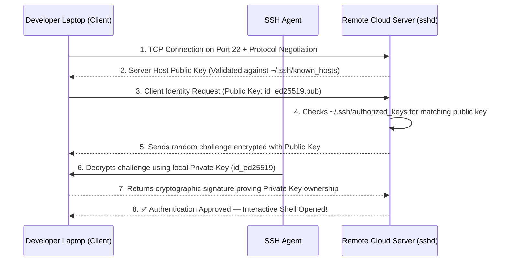

# Secure Remote Server Access & Automation

**Secure Shell (SSH)** is the cryptographic network protocol that enables encrypted communication and remote administrative command execution over unsecured networks. In DevOps, SSH is used for managing cloud virtual machines, executing CI/CD deployment jobs, tunneling database connections, and authenticating to Git repositories.



---

## 1. Asymmetric Cryptography: Public vs. Private Keys

SSH authentication relies on asymmetric public-key cryptography:

- **Public Key (`id_ed25519.pub`)**: Represents an open **padlock**. You can freely share this public string with GitHub, AWS EC2, or append it to `~/.ssh/authorized_keys` on any number of servers.
- **Private Key (`id_ed25519`)**: Represents the **physical master key** that opens that padlock. It must **NEVER** leave your personal laptop, be shared with colleagues, or be committed to a Git repository.

---

## 2. Generating Modern SSH Keypairs with `ssh-keygen`

Always generate keys using the modern **Ed25519** elliptic-curve algorithm (faster, shorter, and cryptographically superior to legacy RSA):

```bash
# Generate a new Ed25519 SSH keypair with an identifying comment/email
ssh-keygen -t ed25519 -C "devops.engineer@mycompany.com"
```

1. **Location**: Press <kbd>Enter</kbd> to accept the default file path (`~/.ssh/id_ed25519`).
2. **Passphrase**: Enter a strong passphrase to encrypt your private key at rest on your laptop.
3. This creates two files in `~/.ssh/`:
   - `id_ed25519` (Private Key — permissions must be `600`)
   - `id_ed25519.pub` (Public Key — safe to distribute)

```bash
# View your public key string (ready to copy to GitHub or cloud servers)
cat ~/.ssh/id_ed25519.pub
# Output: ssh-ed25519 AAAAC3NzaC1lZDI1NTE5AAAAI... devops.engineer@mycompany.com
```

---

## 3. Authorizing Keys on Remote Servers: `ssh-copy-id`

To allow logging into a remote server using your keypair, your public key must be added to the server's `~/.ssh/authorized_keys` file:

```bash
# Automated copy (prompts for server password once, then installs public key):
ssh-copy-id -i ~/.ssh/id_ed25519.pub ubuntu@203.0.113.50

# Manual installation (if ssh-copy-id is unavailable):
cat ~/.ssh/id_ed25519.pub | ssh ubuntu@203.0.113.50 "mkdir -p ~/.ssh && chmod 700 ~/.ssh && cat >> ~/.ssh/authorized_keys && chmod 600 ~/.ssh/authorized_keys"
```

### Mandatory File Permissions (Strictly Enforced by SSH)

The SSH daemon (`sshd`) will **deliberately reject** connection attempts if permissions on client or server SSH files are too permissive:

```bash
# On your local machine (Client):
chmod 700 ~/.ssh
chmod 600 ~/.ssh/id_ed25519
chmod 644 ~/.ssh/id_ed25519.pub
chmod 644 ~/.ssh/known_hosts

# On the remote server:
chmod 700 ~/.ssh
chmod 600 ~/.ssh/authorized_keys
```

---

## 4. Masterclass: Advanced `~/.ssh/config` Architecture

Instead of memorizing IP addresses, custom ports, and long key paths, configure aliases in `~/.ssh/config`:

```text
# ~/.ssh/config

# Global settings for all hosts
Host *
    ServerAliveInterval 60
    ServerAliveCountMax 3
    AddKeysToAgent yes
    UseKeychain yes
    IdentitiesOnly yes

# Public-facing Bastion / Jump Host
Host bastion
    HostName 203.0.113.10
    User ec2-user
    Port 22
    IdentityFile ~/.ssh/id_ed25519

# Private Production Kubernetes Master (Hidden inside VPC — Jumps through Bastion!)
Host k8s-prod-master
    HostName 10.0.10.45
    User ubuntu
    IdentityFile ~/.ssh/id_ed25519
    ProxyJump bastion

# Staging Web Server with Non-Standard Port
Host staging-web
    HostName staging.mycompany.com
    User deploy
    Port 2222
    IdentityFile ~/.ssh/id_staging
```

With this configuration, you can SSH into an isolated private VPC node with a single command:

```bash
# Automatically tunnels through the bastion host securely!
ssh k8s-prod-master
```

---

## 5. Secure File Transfer: `scp` vs. `rsync`

While `scp` handles simple one-off file transfers, **`rsync`** is the gold-standard tool for DevOps because it transfers only changed file differences (delta-transfer), supports resume on disconnect, and preserves file metadata:

```bash
# 1. SCP: Copy a local file to remote server
scp docker-compose.yml staging-web:/opt/app/

# 2. RSYNC: Sync an entire build directory with compression and progress
# -a (Archive: preserves permissions, symlinks, timestamps)
# -v (Verbose)
# -z (Compress data during network transfer)
# -P (Show Progress bar and keep Partial files for resume)
# --delete (Remove files on destination that no longer exist in source)
rsync -avzP --delete ./dist/ staging-web:/var/www/html/

# 3. RSYNC over custom SSH port or through SSH config alias
rsync -avzP -e "ssh -p 2222" ./data/ deploy@203.0.113.50:/opt/data/
```

---

## 6. Production SSH Server Hardening (`/etc/ssh/sshd_config`)

When provisioning cloud servers, secure the SSH daemon against brute-force scanners:

```bash
sudo nano /etc/ssh/sshd_config
```

```ini
# /etc/ssh/sshd_config — Production Hardened Settings

# 1. Disable Root Login (Enforce logging in as normal user, then using sudo)
PermitRootLogin no

# 2. Disable Password Authentication (Mandate SSH Public Keys Only!)
PasswordAuthentication no
PermitEmptyPasswords no
PubkeyAuthentication yes

# 3. Restrict Authentication Attempts to prevent brute-force
MaxAuthTries 3
MaxSessions 5

# 4. Restrict allowed users
AllowUsers ubuntu deploy-runner

# 5. Disable legacy X11 & agent forwarding
X11Forwarding no
AllowAgentForwarding no
```

### Applying Changes Safely

<Callout type="danger" title="Always Validate Syntax Before Reloading sshd!">
Never close your active terminal session when modifying `sshd_config`. If there is a syntax error and sshd fails to restart, you will be locked out of the server permanently!

```bash
# 1. Test configuration file for syntax errors
sudo sshd -t

# 2. If no errors are returned, reload the daemon cleanly
sudo systemctl reload ssh

# 3. Open a SECOND terminal window and verify you can log in before closing the first!
ssh ubuntu@myserver
```
</Callout>

---

## Summary

- Use **Ed25519** (`ssh-keygen -t ed25519`) for modern, high-performance cryptography.
- Public keys live in `~/.ssh/authorized_keys`; Private keys remain strictly confidential.
- Permissions must be locked down: **`700`** on `~/.ssh` and **`600`** on private keys.
- Manage multi-node VPC infrastructure cleanly using **`~/.ssh/config`** and **`ProxyJump`**.
- Use **`rsync -avzP`** for efficient delta-compressed file synchronization.
- Harden production servers by setting **`PasswordAuthentication no`** and **`PermitRootLogin no`**.

In the final lesson, you will master Unix pipes, stream redirection (`>`, `2>&1`), shell scripting best practices (`set -euo pipefail`), and terminal multiplexing with `tmux`!
