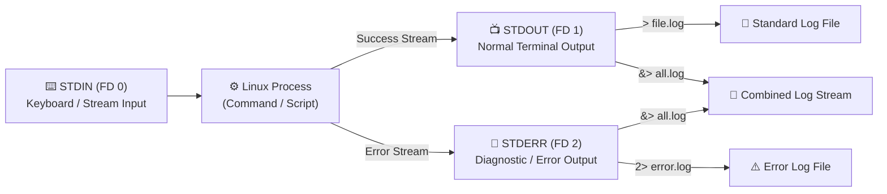
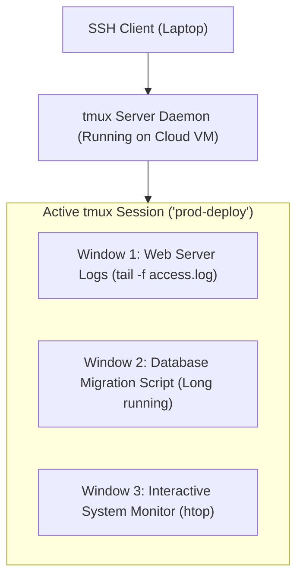

# Unix Streams, Production Bash & Terminal Multiplexing

Welcome to the capstone lesson of **Linux Command Line for DevOps**! In this comprehensive guide, you will master the Unix streaming model (STDIN, STDOUT, STDERR), input/output redirection, production-grade Bash scripting with strict safety modes (`set -euo pipefail`), and persistent terminal sessions with **`tmux`**.



---

## 1. Standard Streams & File Descriptors

Every process started by the Linux kernel automatically opens three standard file descriptors (FD):

| Stream Name | File Descriptor | Default Source / Destination | Redirection Symbol |
| :--- | :---: | :--- | :--- |
| **Standard Input (`stdin`)** | **`0`** | Keyboard or piped input stream | `<` |
| **Standard Output (`stdout`)** | **`1`** | Terminal screen display (Standard messages) | `>`, `>>`, `1>` |
| **Standard Error (`stderr`)** | **`2`** | Terminal screen display (Error/diagnostic messages) | `2>`, `2>>` |

---

## 2. Redirection Mastery: `>`, `>>`, `2>`, `2>&1` & `/dev/null`

```bash
# 1. Overwrite STDOUT to a file (> operator) — ERASED previous content!
echo "APP_PORT=8080" > .env

# 2. Append STDOUT to a file (>> operator) — Adds to the bottom without erasing!
echo "LOG_LEVEL=debug" >> .env

# 3. Redirect STDERR (Errors only) to a separate file (2>)
./deploy-script.sh 2> errors.log

# 4. Redirect BOTH STDOUT and STDERR to the same log file (Modern syntax: &>)
npm run build &> build.log

# 5. Legacy equivalent of &> (Redirect FD 2 to wherever FD 1 is pointing)
./migrate-database.sh > migration.log 2>&1

# 6. Discard unwanted noisy output to /dev/null (The Linux Bit Bucket)
curl -s https://api.mycompany.com/health > /dev/null 2>&1

# 7. Provide file content as STDIN input (< operator)
mysql -u root -p database_name < schema.sql
```

### The `tee` Command: Split Streams (View AND Save)

When running a deployment, you often want to watch output live in your terminal while simultaneously logging it to disk:

```bash
# Pipes STDOUT to terminal screen AND writes to deploy.log
./deploy.sh | tee deploy.log

# Append to log file instead of overwriting (-a flag)
docker compose up -d | tee -a runtime.log

# Write to a root-protected file using sudo and tee
echo "nameserver 1.1.1.1" | sudo tee /etc/resolv.conf
```

---

## 3. Command Chaining & Control Flow Operators

```bash
# 1. && (AND) — Run second command ONLY if the first succeeds (Exit code 0)
# Standard CI/CD pipeline pattern:
npm run lint && npm run test && npm run build

# 2. || (OR) — Run second command ONLY if the first FAILS (Non-zero exit code)
# Great for fallback notifications or emergency alerts:
ping -c 1 10.0.1.50 || echo "🚨 Server unreachable! Sending alert to PagerDuty..."

# 3. ; (Sequential) — Execute commands in order regardless of pass/fail
echo "Starting cleanup..." ; rm -rf /tmp/cache ; echo "Done!"

# 4. () (Subshell) — Execute commands inside an isolated subshell environment
# Temporarily cd into directory without changing parent terminal path:
(cd /opt/app && git pull && npm run build)
pwd # Still in your original directory!
```

---

## 4. Production Bash Scripting: The Unofficial Strict Mode

When writing shell scripts for CI/CD pipelines, Docker entrypoints, or deployment automation, always include **strict safety flags** at the top of your script:

```bash
#!/usr/bin/env bash

# ==============================================================================
# BASH STRICT MODE
# -e : Exit immediately if any command exits with a non-zero status.
# -u : Treat unset variables as an error and exit immediately.
# -o pipefail : If any command in a pipe fails, return that failure code.
# ==============================================================================
set -euo pipefail

# Optional debug mode (prints each command before executing it):
# set -x

# Temporary workspace directory
TEMP_DIR="/tmp/deploy-$$"
mkdir -p "$TEMP_DIR"

# Automated Cleanup Hook using trap
# Ensures temporary files are deleted on normal exit, error, or Ctrl+C!
cleanup() {
  echo "🧹 Cleaning up temporary workspace: $TEMP_DIR"
  rm -rf "$TEMP_DIR"
}
trap cleanup EXIT INT TERM

# Script logic starts here
echo "🚀 Starting automated deployment..."
ENVIRONMENT="${1:-staging}" # Default to 'staging' if argument $1 is not provided

echo "Deploying to environment: $ENVIRONMENT"

if [[ "$ENVIRONMENT" == "production" ]]; then
  echo "🔒 Validating production secrets..."
  [[ -z "${DATABASE_URL:-}" ]] && { echo "❌ ERROR: DATABASE_URL is required!"; exit 1; }
fi

echo "✅ Deployment completed successfully!"
```

---

## 5. Terminal Multiplexing with `tmux`

When executing long-running database migrations, builds, or backups over SSH, an accidental WiFi disconnect or closed laptop lid will kill your shell process immediately. 

**`tmux` (Terminal Multiplexer)** runs persistent shell sessions in the background on the server:



### Essential `tmux` Commands

```bash
# 1. Start a new named session
tmux new -s deploy-session

# 2. List active running tmux sessions
tmux ls
# Output: deploy-session: 2 windows (created Sun Aug 18 10:00:00 2026)

# 3. Reconnect (attach) to an existing session after logging back into server
tmux attach -t deploy-session

# 4. Kill an obsolete session
tmux kill-session -t deploy-session
```

### `tmux` Keyboard Shortcuts (Default Prefix: <kbd>Ctrl + b</kbd>)

Press <kbd>Ctrl + b</kbd>, release, then press:
- <kbd>d</kbd> — **Detach** from session (leaves everything running in background on server!).
- <kbd>%</kbd> — Split current window **vertically** into two side-by-side panes.
- <kbd>"</kbd> — Split current window **horizontally** into top and bottom panes.
- <kbd>Arrow Keys</kbd> — Switch between panes.
- <kbd>c</kbd> — Create a **new window** (tab).
- <kbd>n</kbd> / <kbd>p</kbd> — Next / Previous window.
- <kbd>x</kbd> — Close current pane.
- <kbd>[</kbd> — Enter scroll/copy mode (use arrow keys to scroll past logs, press <kbd>q</kbd> to exit).

---

## 6. Top 10 DevOps Emergency Troubleshooting Recipes

```bash
# 1. Find who is eating all disk space:
du -ah /var | sort -rh | head -n 10

# 2. Check live disk partition capacity:
df -hT

# 3. Live check for established external TCP connections:
ss -t state established

# 4. Kill all frozen Node.js processes immediately:
pkill -9 -f node

# 5. Extract distinct IP addresses attempting brute-force SSH logins:
grep "Failed password" /var/log/auth.log | awk '{print $(NF-3)}' | sort | uniq -c | sort -nr

# 6. Test HTTP response code and total latency:
curl -o /dev/null -s -w "HTTP: %{http_code} | Total: %{time_total}s\n" https://api.mycompany.com/health

# 7. Delete all files older than 30 days in a log directory:
find /var/log/custom-apps -type f -name "*.log" -mtime +30 -delete

# 8. Check RAM swap usage:
free -h

# 9. Test remote TCP port without telnet/nc:
timeout 3 bash -c "</dev/tcp/10.0.1.50/5432" && echo "Port is OPEN" || echo "Port is CLOSED"

# 10. Check recent system reboot and login history:
last -n 10
```

---

## Course 0 Complete! 🎉

Congratulations! You have officially conquered the complete **Linux Command Line for DevOps** foundational curriculum:
- **Lesson 1:** Linux kernel architecture, FHS, and cloud/container primitives.
- **Lesson 2:** Terminal navigation, prompt anatomy, and Readline shortcuts.
- **Lesson 3:** Filesystem operations, absolute vs relative paths, and live log streaming (`tail -F`).
- **Lesson 4:** Text editing (`vim`, `nano`), pattern matching (`grep`), indexing (`find`), and stream transformation (`sed`, `awk`).
- **Lesson 5:** Linux security model, octal permissions (`chmod 755/600`), ownership (`chown`), and `visudo`.
- **Lesson 6:** Process lifecycles, resource auditing (`htop`), Linux signals (`SIGTERM`/`SIGKILL`), and `systemd` services.
- **Lesson 7:** Package management across distros (`apt`, `dnf`, `apk`) and secure GPG keyrings.
- **Lesson 8:** Network interface inspection (`ip a`), DNS querying (`dig`), sockets (`ss -tulnp`), and HTTP diagnostics (`curl`).
- **Lesson 9:** Asymmetric SSH cryptography (Ed25519), bastion host jumping (`~/.ssh/config`), and daemon hardening.
- **Lesson 10:** Unix I/O streams, strict Bash scripting (`set -euo pipefail`), and `tmux` session multiplexing.

---

## What's Next in Your Zero-to-Hero Roadmap?

Now that your Linux foundation is rock solid, you are ready to advance through the rest of the DevOps curriculum:
1. **Course 1: Git & GitHub Fundamentals** — Branching strategies, atomic commits, PR code reviews, and Git Flow.
2. **Course 2: GitHub Actions Automation** — CI/CD pipelines, service containers, and automated deployments.
3. **Course 3: CI/CD Pipeline Architecture** — Deployment strategies (Blue-Green, Canary), DORA metrics, and automated rollbacks.
4. **Course 4: Docker Fundamentals** — Minimal multi-stage builds, layer caching, and rootless containerization.
5. **Course 5: Docker Compose** — Multi-service microservice orchestration, volumes, and networking.
6. **Course 6 & 7: Kubernetes & K3s** — Cluster administration, Pods, Deployments, Ingresses, and StatefulSets.
7. **Course 8: Capstone Project** — Full-stack GitOps CI/CD to live Kubernetes!
