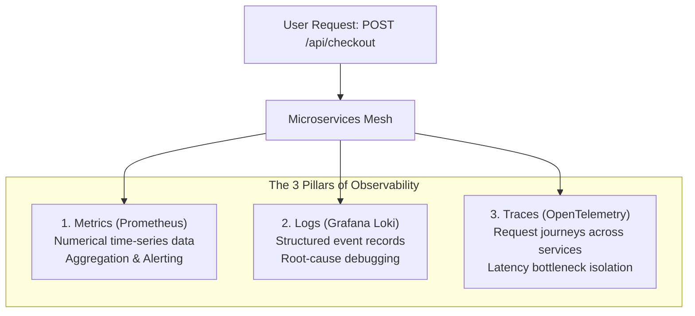
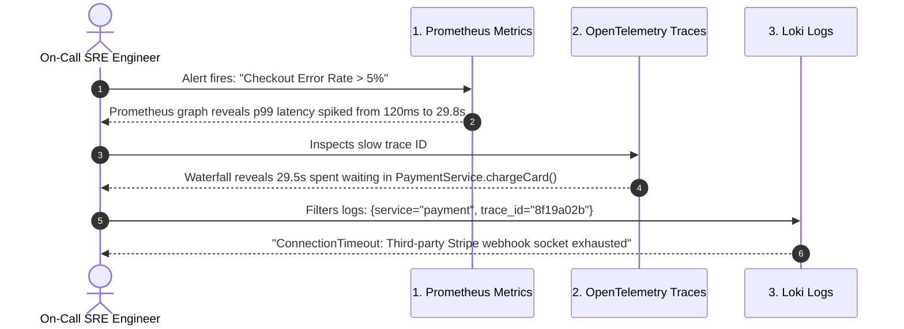

# The 3 Pillars of Observability

In modern distributed architectures (Kubernetes clusters, microservices, multi-cloud platforms), systems fail in unpredictable, complex ways.

Traditional **Monitoring** answers: *"Is the system working?"* (e.g. pinging an endpoint every 60 seconds).
**Observability** answers: *"Why is the system behaving this way?"* by inferring internal state from external outputs.

---

## Comparing the Three Pillars

| Dimension | Metrics (Prometheus) | Logs (Grafana Loki) | Traces (OpenTelemetry / Tempo) |
| :--- | :--- | :--- | :--- |
| **Data Format** | Float64 + Key/Value Labels | Structured JSON / String Lines | Spans with timestamps & metadata |
| **Volume & Cost** | Lowest (compact time-series) | Highest (huge text volume) | Medium (often sampled e.g. 10%) |
| **Best For** | Real-time alerts, CPU/RAM rates, p99 latency | Exact error stack traces & audit events | Distributed latency bottlenecks across services |
| **Query Speed** | Instant (< 50ms) | Fast with labels (< 1s) | Fast per Trace ID (< 200ms) |

---

## The Core SRE Frameworks

When instrumenting systems, top SRE teams follow standard frameworks rather than collecting random data:

### 1. The 4 Golden Signals (Google SRE)
- **Latency**: How long requests take (distinguish successful requests from failed requests).
- **Traffic**: Demand on your system (HTTP requests/sec or network I/O).
- **Errors**: Rate of failed requests (explicit 5xx errors or unexpected payload content).
- **Saturation**: How "full" the service is (CPU, memory limits, database connection pool exhaustion).

### 2. The RED Method (Best for Web APIs & Microservices)
- **Rate**: Number of requests per second.
- **Errors**: Number of failing requests per second.
- **Duration**: Amount of time requests take (p50, p95, p99 percentiles).

### 3. The USE Method (Best for Host Hardware & Virtual Machines)
- **Utilization**: Percentage of time a resource is busy (e.g. 85% CPU core usage).
- **Saturation**: Degree to which work is queued (e.g. Linux 1-min load average > core count).
- **Errors**: Count of hardware or device driver error events.

---

## Real-World Incident Case Study: Debugging a 504 Gateway Timeout

Imagine your e-commerce checkout service starts returning `504 Gateway Timeout` during Black Friday. How do the 3 pillars work together?

1. **Metrics** alerted you that an issue existed and narrowed down the blast radius.
2. **Traces** isolated the exact microservice hop causing the 29-second bottleneck.
3. **Logs** provided the exact code stack trace and error message to patch the bug.
