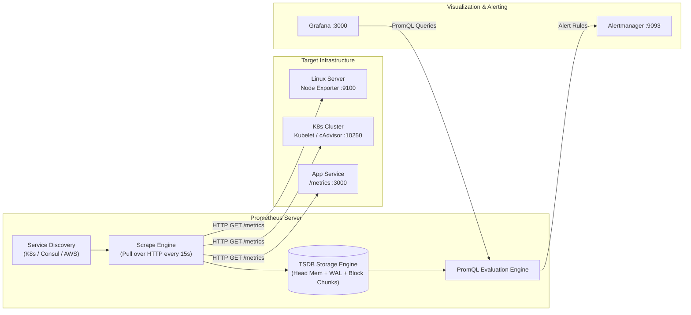

# Prometheus Architecture & Pull-Based Scraping

Prometheus is the de facto cloud-native standard for metrics collection, originally developed at SoundCloud and now a graduated CNCF project.



---

## Why Pull over Push?

Unlike traditional agents (e.g. Datadog or CloudWatch) that push metrics outbound, Prometheus **pulls (scrapes)** metrics over HTTP:

1. **Centralized Rate Control**: The server decides when and how often to scrape, preventing target servers from being overwhelmed.
2. **Built-In Liveness Detection**: If Prometheus fails to scrape an endpoint, it immediately records `up{instance="..."} = 0`. You know the target died without relying on the dead server to send a failure alert.
3. **Multiple Scrapers**: Staging and monitoring clusters can scrape the same application without modifying application configuration.

---

## TSDB Internal Storage Engine

Prometheus stores time-series data using a specialized append-only engine:
- **Head Chunk**: Recent samples are buffered in memory and appended to a **Write-Ahead Log (WAL)** on disk to survive process crashes.
- **Compacted Blocks**: Every 2 hours, memory chunks are compacted into immutable 2-hour disk blocks containing a chunks directory, index, and metadata.

```
/data/prometheus/
├── 01HMG7VZ8X... (2-hour block)
│   ├── chunks/000001
│   ├── index
│   └── meta.json
├── wal/
└── queries.active
```

---

## Hands-On: Production `prometheus.yml` Configuration

Let's write a production configuration file with global settings, alert rules, and target scrape jobs:

```yaml
# prometheus.yml
global:
  scrape_interval: 15s     # Scrape targets every 15 seconds
  evaluation_interval: 15s # Evaluate alert rules every 15 seconds
  scrape_timeout: 10s      # Timeout if target takes longer than 10s

# Alertmanager configuration
alerting:
  alertmanagers:
    - static_configs:
        - targets: ["alertmanager:9093"]

# Rule files to load
rule_files:
  - "/etc/prometheus/alert_rules.yml"

# Scrape targets
scrape_configs:
  # 1. Prometheus self-monitoring
  - job_name: "prometheus"
    static_configs:
      - targets: ["localhost:9090"]

  # 2. Host Linux metrics
  - job_name: "node_exporter"
    scrape_interval: 10s
    static_configs:
      - targets: ["node-exporter:9100"]

  # 3. Docker container metrics
  - job_name: "cadvisor"
    static_configs:
      - targets: ["cadvisor:8080"]

  # 4. Production Application API
  - job_name: "nextjs_app"
    metrics_path: "/api/metrics"
    static_configs:
      - targets: ["app:3000"]
        labels:
          environment: "production"
          tier: "frontend"
```

---

## Running the Monitoring Stack with Docker Compose

Create a `docker-compose.yml`:

```yaml
version: "3.8"

services:
  prometheus:
    image: prom/prometheus:v2.52.0
    container_name: prometheus
    restart: unless-stopped
    command:
      - "--config.file=/etc/prometheus/prometheus.yml"
      - "--storage.tsdb.path=/prometheus"
      - "--storage.tsdb.retention.time=30d"
      - "--web.enable-lifecycle"
    ports:
      - "9090:9090"
    volumes:
      - ./prometheus.yml:/etc/prometheus/prometheus.yml:ro
      - prometheus_data:/prometheus

volumes:
  prometheus_data:
```

Start Prometheus:
```bash
docker compose up -d
```

Open your browser to `http://localhost:9090` and navigate to **Status -> Targets** to verify all endpoints are in the `UP` state!
