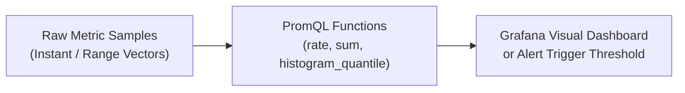
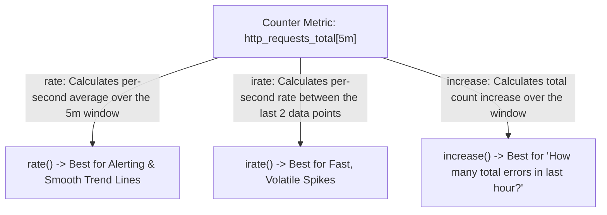

# PromQL Mastery: Rates, Histograms, and Quantiles

**PromQL (Prometheus Query Language)** is a domain-specific query language that allows you to slice, aggregate, and calculate real-time trends over time-series data.



---

## The 4 Core Metric Types

1. **Counter**: A cumulative metric that can only increase or reset to zero on restart (e.g. `http_requests_total`, `errors_total`).
2. **Gauge**: A value that goes up and down arbitrarily (e.g. `node_memory_MemAvailable_bytes`, `cpu_temperature`).
3. **Histogram**: Samples observations in configurable buckets (e.g. `http_request_duration_seconds_bucket`).
4. **Summary**: Similar to histogram, but calculates percentiles client-side.

---

## Instant Vectors vs. Range Vectors

- **Instant Vector**: A set of time series containing a single sample for each time series, all at the same timestamp.
  ```promql
  http_requests_total{status="200"}
  ```
- **Range Vector**: A set of time series containing a range of samples over time.
  ```promql
  http_requests_total{status="200"}[5m]
  ```

> [!IMPORTANT]
> You **cannot directly graph a range vector**. You must apply a rate or aggregation function (such as `rate()`, `avg_over_time()`, or `count_over_time()`) to convert a range vector into an instant vector for graphing!

---

## `rate()` vs `irate()` vs `increase()`

When dealing with Counters, choosing the right function is crucial:



### Example:
```promql
# Rate of 5xx errors per second over last 5 minutes
rate(http_requests_total{status=~"5.."}[5m])

# Total number of 5xx errors in the last 1 hour
increase(http_requests_total{status=~"5.."}[1h])
```

---

## Calculating Percentiles with `histogram_quantile()`

Averages are dangerous in engineering. If 99 users experience 10ms latency and 1 user experiences 30,000ms latency, the average is ~310ms. You miss the critical outage experienced by that user.

**Percentiles** show real user experience:
- **p50 (Median)**: 50% of users experience this latency or faster.
- **p95**: 95% of users experience this latency or faster.
- **p99**: 99% of users experience this latency or faster (catches tail latency).

```promql
# Calculate 99th percentile request latency per service over last 5 minutes:
histogram_quantile(
  0.99,
  sum(rate(http_request_duration_seconds_bucket[5m])) by (le, service)
)
```

---

## 10 Production PromQL Cheat-Sheet Queries

### 1. CPU Usage Percentage across Nodes
```promql
100 - (avg by (instance) (rate(node_cpu_seconds_total{mode="idle"}[5m])) * 100)
```

### 2. Available Memory Percentage
```promql
(node_memory_MemAvailable_bytes / node_memory_MemTotal_bytes) * 100
```

### 3. Disk Space Usage Percentage
```promql
100 - ((node_filesystem_avail_bytes{mountpoint="/"} / node_filesystem_size_bytes{mountpoint="/"}) * 100)
```

### 4. HTTP Error Rate Percentage (5xx vs Total)
```promql
(sum(rate(http_requests_total{status=~"5.."}[5m])) / sum(rate(http_requests_total[5m]))) * 100
```

### 5. Network Receive Bandwidth (Megabits / sec)
```promql
sum(rate(node_network_receive_bytes_total{device!~"lo|docker.*|veth.*"}[5m])) by (instance) * 8 / 1000000
```

### 6. Top 5 Memory Consuming Containers
```promql
topk(5, sum(container_memory_working_set_bytes{name!=""}) by (name))
```

### 7. Container CPU Throttling Rate
```promql
rate(container_cpu_cfs_throttled_periods_total[5m]) / rate(container_cpu_cfs_periods_total[5m]) * 100
```

### 8. Target Down Alert Condition
```promql
up == 0
```
