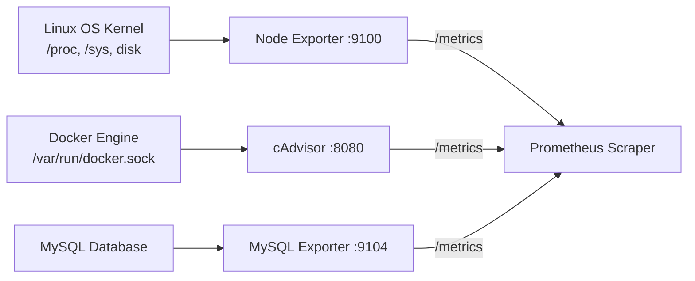

# System & Container Exporters (Node Exporter & cAdvisor)

Applications cannot always expose Prometheus metrics natively. **Exporters** act as translators: they query third-party systems, databases, or operating systems and expose metrics in the standard Prometheus text exposition format.



---

## The Prometheus Text Exposition Format

When you run `curl http://localhost:9100/metrics`, you see the OpenMetrics standard format:

```text
# HELP node_cpu_seconds_total Seconds the CPUs spent in each mode.
# TYPE node_cpu_seconds_total counter
node_cpu_seconds_total{cpu="0",mode="idle"} 438291.12
node_cpu_seconds_total{cpu="0",mode="system"} 1284.90
node_cpu_seconds_total{cpu="0",mode="user"} 8421.43

# HELP node_memory_MemAvailable_bytes Memory information field MemAvailable_bytes.
# TYPE node_memory_MemAvailable_bytes gauge
node_memory_MemAvailable_bytes 1.4827163648e+10
```

Each metric contains:
1. `# HELP`: Human-readable documentation.
2. `# TYPE`: Metric type (`counter`, `gauge`, `histogram`, `summary`).
3. Metric Name + Key/Value Labels.
4. Float64 Value.

---

## 1. Node Exporter: Deep Linux Host Metrics

Node Exporter gathers deep operating system hardware metrics from `/proc` and `/sys`.

### Key Metric Families:
- `node_cpu_seconds_total`: CPU breakdown by core and mode (idle, user, system, iowait, steal).
- `node_memory_*`: Memory utilization, buffers, cached, available RAM.
- `node_disk_*`: Disk read/write operations, bytes transferred, disk queue time (I/O saturation).
- `node_network_*`: Inbound/outbound bytes, dropped packets, interface errors.
- `node_filesystem_*`: Free disk space and total inodes.

---

## 2. cAdvisor: Container Metrics

cAdvisor (Container Advisor) by Google auto-discovers all running Docker containers and measures CPU, memory, filesystem, and network usage per container.

### Key Metric Families:
- `container_memory_working_set_bytes`: Actual memory used (matches the Linux OOM Killer threshold).
- `container_cpu_usage_seconds_total`: Total CPU consumed by container.
- `container_cpu_cfs_throttled_periods_total`: Count of times container hit its CPU limit and was throttled!

---

## Complete Multi-Service Stack Configuration

Here is the complete `docker-compose.yml` to run Prometheus, Node Exporter, and cAdvisor:

```yaml
version: "3.8"

services:
  prometheus:
    image: prom/prometheus:v2.52.0
    container_name: prometheus
    volumes:
      - ./prometheus.yml:/etc/prometheus/prometheus.yml:ro
    ports:
      - "9090:9090"
    restart: unless-stopped

  node-exporter:
    image: prom/node-exporter:v1.8.1
    container_name: node-exporter
    pid: host
    restart: unless-stopped
    volumes:
      - /proc:/host/proc:ro
      - /sys:/host/sys:ro
      - /:/rootfs:ro
    command:
      - "--path.procfs=/host/proc"
      - "--path.sysfs=/host/sys"
      - "--path.rootfs=/rootfs"
      - "--collector.filesystem.mount-points-exclude=^/(sys|proc|dev|host|etc)($$|/)"
    ports:
      - "9100:9100"

  cadvisor:
    image: gcr.io/cadvisor/cadvisor:v0.49.1
    container_name: cadvisor
    restart: unless-stopped
    privileged: true
    volumes:
      - /:/rootfs:ro
      - /var/run:/var/run:ro
      - /sys:/sys:ro
      - /var/lib/docker/:/var/lib/docker:ro
      - /dev/disk/:/dev/disk:ro
    ports:
      - "8080:8080"
```

Start the containers:
```bash
docker compose up -d
```
