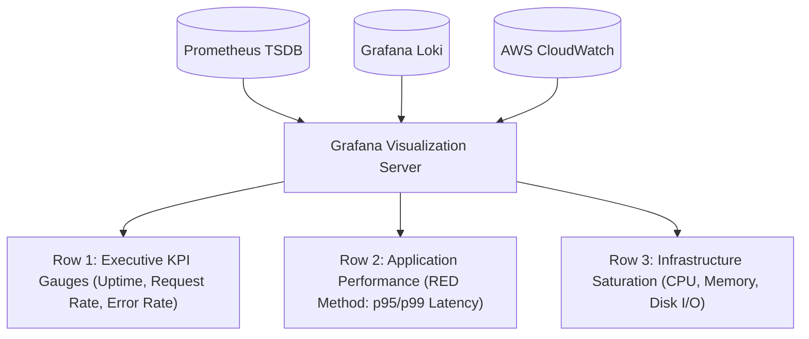
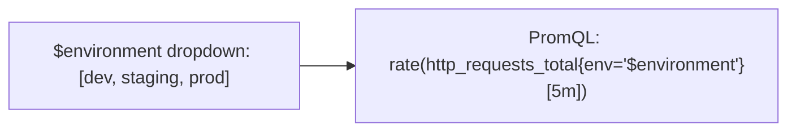

# Designing High-Impact Dashboards in Grafana

Grafana is the visual layer of modern cloud observability. It connects to multiple data sources (Prometheus, Loki, PostgreSQL, Elasticsearch) to render real-time interactive engineering dashboards.



---

## Principles of Production Dashboard Design

1. **Hierarchy Matters (Top-to-Bottom Flow)**:
   - **Top**: High-level status gauges and SLA/SLO compliance (is the business healthy?).
   - **Middle**: Service-level Golden Signals (Rate, Errors, Latency).
   - **Bottom**: Low-level infrastructure metrics (disk IOPS, network drops, individual pod memory).
2. **Standardize Visual Colors**:
   - Green: Normal / Healthy.
   - Yellow / Orange: Warning threshold (e.g. Memory > 75%).
   - Red: Critical SLA breach (e.g. 5xx Error Rate > 1%).
3. **Use Template Variables**: Never hardcode an instance IP or container name in a dashboard panel!

---

## Dynamic Dashboard Variables

Template variables allow a single dashboard to serve 1,000 servers or microservices via dropdown selectors:



### Creating a Dynamic Variable in Grafana:
1. Go to **Dashboard Settings -> Variables -> Add Variable**.
2. **Name**: `instance`
3. **Type**: `Query`
4. **Data Source**: `Prometheus`
5. **Query**:
   ```promql
   label_values(node_cpu_seconds_total, instance)
   ```

Now, every panel can reference `$instance` in its PromQL query!

---

## Provisioning Dashboards as Code

Never configure production dashboards manually by clicking in the Grafana UI. If the server is destroyed, you lose all dashboards!

Instead, use **Grafana Provisioning**:

### 1. Datasource Provisioning (`/etc/grafana/provisioning/datasources/datasources.yml`)
```yaml
apiVersion: 1

datasources:
  - name: Prometheus
    type: prometheus
    access: proxy
    url: http://prometheus:9090
    isDefault: true
    jsonData:
      timeInterval: 15s

  - name: Loki
    type: loki
    access: proxy
    url: http://loki:3100
```

### 2. Dashboard Provisioning (`/etc/grafana/provisioning/dashboards/dashboards.yml`)
```yaml
apiVersion: 1

providers:
  - name: "DevOps Production Dashboards"
    orgId: 1
    folder: "Production"
    type: file
    disableDeletion: false
    editable: true
    options:
      path: /var/lib/grafana/dashboards
```

Export your JSON dashboards into `/var/lib/grafana/dashboards/*.json` and commit them to Git. Grafana loads them automatically on container boot!
