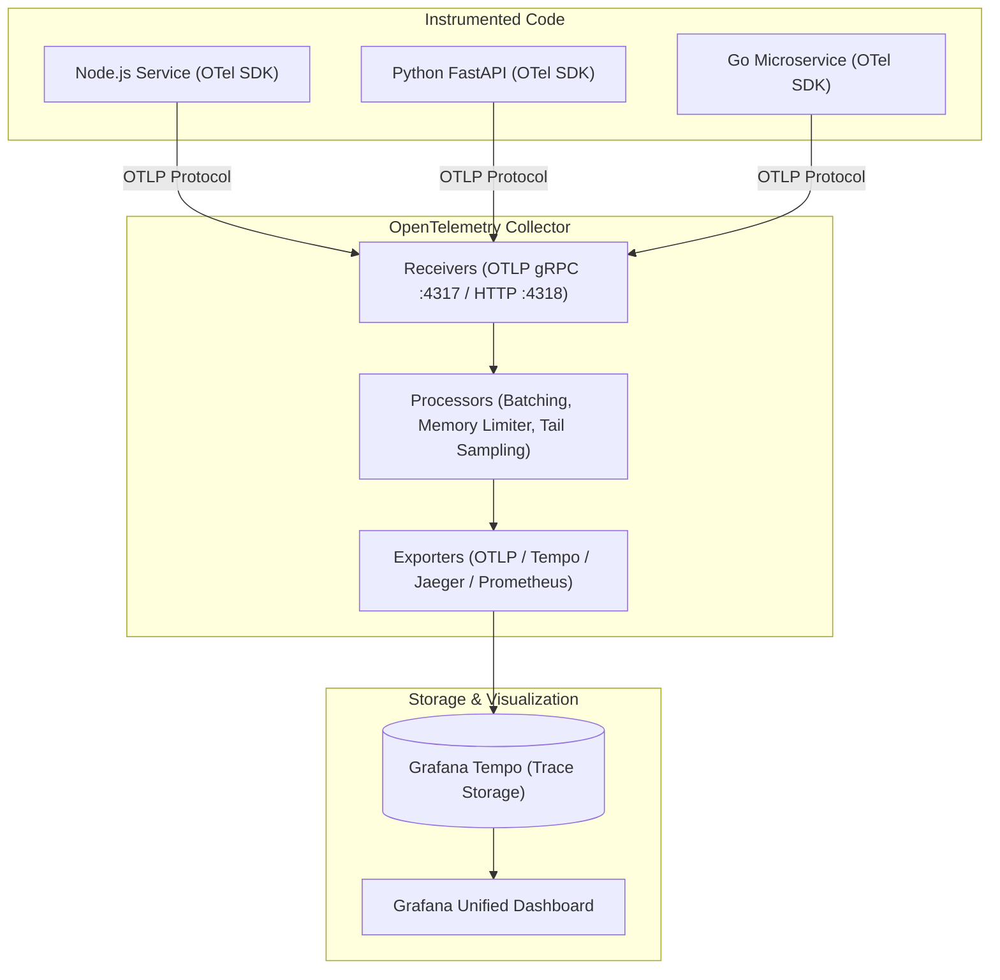

# Distributed Tracing Essentials with OpenTelemetry

When an application is split into 20 microservices communicating over HTTP and gRPC, a single user click might touch 8 different databases, caches, and APIs.

If the request takes 4.8 seconds, metrics and logs cannot easily pinpoint which specific call caused the delay. **Distributed Tracing** tracks the end-to-end journey of every request through the entire distributed system.

```mermaid
gantt
    title Distributed Trace Waterfall (#trace-id-9a1f2b) - Total: 215ms
    dateFormat X
    axisFormat %s ms

    section Frontend
    GET /api/checkout            :active, 0, 215
    section Auth Service
    JWT Token Validation         :crit, 5, 25
    section Cart API
    Fetch User Cart Items        : 30, 70
    section Payment Gateway
    Stripe API HTTP Call         :crit, 75, 195
    section Postgres DB
    INSERT order_record          : 195, 212
```



---

## Core Distributed Tracing Terminology

1. **Trace**: The complete end-to-end journey of a single transaction through the system (composed of multiple spans).
2. **Span**: A single unit of work with a start time, end time, name, status, tags, and events (e.g. an SQL query or HTTP call).
3. **Trace ID**: A globally unique 128-bit hex string identifying the overall trace (e.g. `4bf92f3577b34da6a3ce929d0e0e4736`).
4. **Span ID**: A unique 64-bit hex string identifying an individual operation within the trace.
5. **Context Propagation**: Injecting the `traceparent` HTTP header (`00-4bf92f...-00`) across service boundaries so downstream services continue the same trace!

---

## The OpenTelemetry (OTel) Architecture

OpenTelemetry (CNCF) is the vendor-neutral standard for telemetry collection:



---

## Hands-On: Auto-Instrumenting a Node.js App with OpenTelemetry

You do not need to rewrite your code to get distributed traces! OpenTelemetry provides automatic instrumentation for popular frameworks (Express, Next.js, HTTP, PostgreSQL, Redis).

### 1. Install OTel Packages
```bash
npm install @opentelemetry/sdk-node   @opentelemetry/auto-instrumentations-node   @opentelemetry/exporter-trace-otlp-grpc
```

### 2. Create `tracer.js`
```javascript
// tracer.js
const { NodeSDK } = require('@opentelemetry/sdk-node');
const { getNodeAutoInstrumentations } = require('@opentelemetry/auto-instrumentations-node');
const { OTLPTraceExporter } = require('@opentelemetry/exporter-trace-otlp-grpc');

const sdk = new NodeSDK({
  traceExporter: new OTLPTraceExporter({
    url: 'http://otel-collector:4317', // OpenTelemetry Collector endpoint
  }),
  instrumentations: [getNodeAutoInstrumentations()],
});

sdk.start();
console.log('OpenTelemetry Tracing initialized successfully!');
```

### 3. Run with Node Pre-Load
```bash
node --require ./tracer.js server.js
```

Now, every incoming HTTP request, outgoing database query, and third-party API call is automatically traced with zero application code changes!
