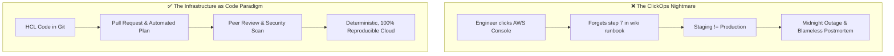
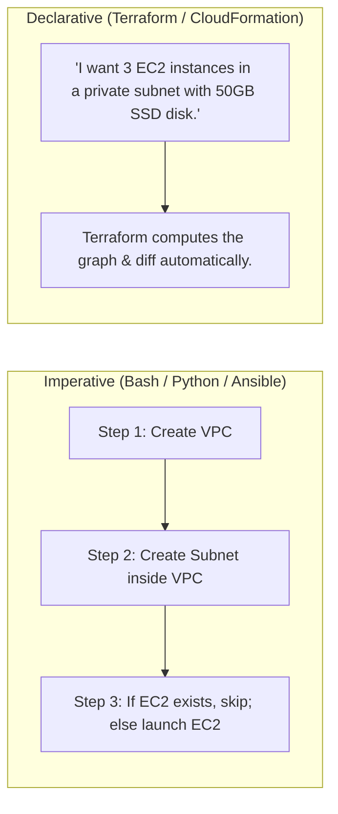
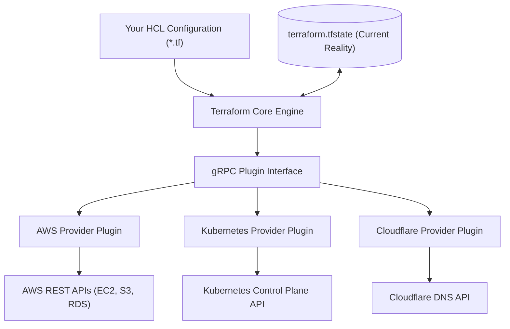
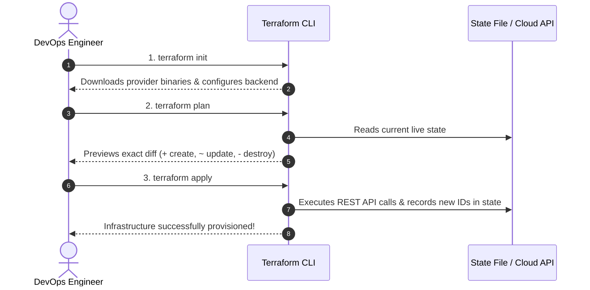

# Why Infrastructure as Code & Terraform Architecture

Before Infrastructure as Code (IaC), provisioning servers, VPC networks, databases, and load balancers was done manually through web consoles — a practice known in the industry as **ClickOps**.

While ClickOps is fine for launching a weekend side-project, it is completely unacceptable in production engineering.



---

## The 4 Disasters of ClickOps

1. **Configuration Drift**: Over 6 months, engineers tweak security groups, resize instances, and change environment variables manually in the AWS Console. When a disaster strikes, nobody knows how to rebuild the system from scratch.
2. **Zero Audit Trail**: If someone accidentally opens port `22` (SSH) to `0.0.0.0/0` in a firewall rule at 3 AM, there is no Git commit log, no pull request approval, and no recorded rationale.
3. **Environment Inconsistency**: "It worked in Dev, but failed in Prod." Why? Because Dev was configured by Alice in January, and Prod was configured by Bob in August with different subnet masks and disk IOPS.
4. **Slow Disaster Recovery**: Rebuilding an entire multi-region cloud infrastructure manually takes days. With IaC, rebuilding an entire region takes a single command: `terraform apply`.

---

## Imperative vs. Declarative: The Core Difference

When automating infrastructure, tools fall into two fundamentally different paradigms:



| Feature | Imperative (e.g. Bash, AWS CLI) | Declarative (Terraform) |
| :--- | :--- | :--- |
| **Focus** | How to do it (step-by-step commands) | What the end result should look like |
| **Idempotency** | Difficult; must write checks for every resource | Built-in; running 10 times produces same state |
| **State Awareness** | None (scripts blind to existing resources) | Full (maintains state file single source of truth) |
| **Deletions** | Must write explicit delete scripts | Simply delete the code block and run apply |

---

## The Internal Architecture of Terraform

Terraform is built by HashiCorp as a compiled Go binary. It consists of two primary components:



### 1. Terraform Core
The Core engine is cloud-agnostic. It reads your `.tf` configuration files, constructs a **Directed Acyclic Graph (DAG)** of all resources, compares your code against the **State File**, and computes the mathematical diff (Plan).

### 2. Providers (Plugins)
Providers are independent binary plugins that speak the specific API of cloud platforms (AWS, GCP, Azure, DigitalOcean, GitHub, Kubernetes, Docker). Terraform downloads providers automatically during `terraform init`.

---

## The Core Terraform Workflow

Every Terraform interaction follows a disciplined 4-stage lifecycle:



---

## Installing and Verifying Terraform

On macOS (via Homebrew):
```bash
brew tap hashicorp/tap
brew install hashicorp/tap/terraform
```

On Ubuntu / Debian Linux:
```bash
sudo apt-get update && sudo apt-get install -y gnupg software-properties-common curl
curl -fsSL https://apt.releases.hashicorp.com/gpg | sudo gpg --dearmor -o /usr/share/keyrings/hashicorp-archive-keyring.gpg
echo "deb [signed-by=/usr/share/keyrings/hashicorp-archive-keyring.gpg] https://apt.releases.hashicorp.com $(lsb_release -cs) main" | sudo tee /etc/apt/sources.list.d/hashicorp.list
sudo apt-get update && sudo apt-get install terraform
```

Verify your installation:
```bash
$ terraform version
Terraform v1.8.5
on linux_amd64
```

> [!TIP]
> Enable shell autocompletion for instant productivity:
> ```bash
> terraform -install-autocomplete
> ```
> Restart your terminal, and you will be able to press `Tab` to autocomplete commands, flags, and resource names!
