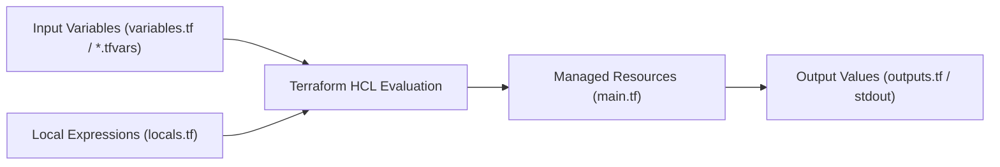

# Input Variables, Locals & Output Values

Hardcoding values (such as AMI IDs, IP ranges, instance sizes, or environment names) directly inside your resource blocks makes configurations rigid and unmaintainable.

To follow the **DRY (Don't Repeat Yourself)** principle, Terraform provides **Input Variables**, **Locals**, and **Output Values**.



---

## 1. Input Variables (`variables.tf`)

Variables allow consumers to customize infrastructure behavior without editing the underlying HCL resource declarations.

### Full Variable Declaration Syntax:
```hcl
# variables.tf

variable "environment" {
  type        = string
  description = "Target deployment environment (dev, staging, or prod)"
  default     = "dev"

  # Custom validation rules enforce guardrails before applying!
  validation {
    condition     = contains(["dev", "staging", "prod"], var.environment)
    error_message = "The environment variable must be one of: 'dev', 'staging', 'prod'."
  }
}

variable "instance_count" {
  type        = number
  description = "Number of worker instances to provision"
  default     = 2

  validation {
    condition     = var.instance_count >= 1 && var.instance_count <= 20
    error_message = "Worker instances must be between 1 and 20."
  }
}

variable "enable_monitoring" {
  type        = bool
  description = "Enable detailed CloudWatch metrics"
  default     = true
}

variable "allowed_ip_cidrs" {
  type        = list(string)
  description = "List of permitted ingress CIDR blocks"
  default     = ["10.0.0.0/16"]
}

variable "database_credentials" {
  type = object({
    username = string
    password = string
    port     = number
  })
  description = "Database master credentials"
  sensitive   = true # Prevents password from being printed to CLI output!
}
```

---

## 2. Setting Variable Values in Production

Terraform searches for variable values in a specific order of precedence (highest priority wins):

1. **CLI Flag**: `terraform apply -var="environment=prod"`
2. **Environment Variables**: `export TF_VAR_environment=prod`
3. **Variable Definitions File**: `terraform.tfvars` or `terraform.tfvars.json`
4. **Auto-Loaded Files**: `*.auto.tfvars`
5. **Default Value**: Defined in the `variable {}` block

### Production `terraform.tfvars` Example:
```hcl
environment       = "staging"
instance_count    = 4
enable_monitoring = true
allowed_ip_cidrs  = ["10.20.0.0/16", "192.168.1.0/24"]

database_credentials = {
  username = "admin_user"
  password = "SuperSecretPassword2026!"
  port     = 5432
}
```

---

## 3. Local Values (`locals.tf`)

Unlike variables (which are passed into the module from outside), **Locals** are internal variables computed within the module. They avoid repetitive complex expressions.

```hcl
# locals.tf

locals {
  # Common name prefix
  name_prefix = "devops-${var.environment}"

  # Standard tags applied to every resource for billing and compliance
  common_tags = {
    Project     = "ZeroToHero"
    Environment = var.environment
    ManagedBy   = "Terraform"
    CostCenter  = "Engineering-101"
  }

  # Conditional sizing based on environment
  instance_type = var.environment == "prod" ? "m5.large" : "t3.micro"
}
```

### Referencing Locals in Resources:
```hcl
resource "aws_instance" "web_server" {
  count         = var.instance_count
  ami           = "ami-0c55b159cbfafe1f0"
  instance_type = local.instance_type

  tags = merge(
    local.common_tags,
    {
      Name = "${local.name_prefix}-worker-${count.index + 1}"
    }
  )
}
```

---

## 4. Output Values (`outputs.tf`)

Outputs serve two vital purposes:
1. They print crucial connection strings and endpoints to the terminal after `terraform apply`.
2. They expose values to other modules or remote state readers.

```hcl
# outputs.tf

output "vpc_id" {
  value       = aws_vpc.main.id
  description = "The unique ID of the created VPC"
}

output "web_public_ips" {
  value       = aws_instance.web_server[*].public_ip
  description = "List of public IP addresses for all provisioned web servers"
}

output "database_endpoint" {
  value       = "postgres://${aws_db_instance.db.endpoint}/production"
  description = "Connection URI for database cluster"
  sensitive   = true # Hides connection string with password from plain terminal output!
}
```

Query outputs anytime from the terminal:
```bash
# View all outputs in JSON format
$ terraform output -json

# Query a specific output
$ terraform output web_public_ips
[
  "54.210.12.44",
  "54.210.12.45"
]
```

---

## 5. Loops and Collections: `for_each` vs `count`

When provisioning multiple similar resources, always prefer `for_each` over `count` for resources with unique identifiers:

```hcl
# Creating multiple IAM users using for_each with a set
variable "engineering_users" {
  type    = set(string)
  default = ["alice", "bob", "charlie"]
}

resource "aws_iam_user" "developers" {
  for_each = var.engineering_users
  name     = each.key

  tags = {
    Role = "Software Engineer"
  }
}
```

> [!WARNING]
> **Why `for_each` is safer than `count`**: If you use `count` and delete the first element of a list, Terraform will destroy and recreate every subsequent resource because their array indices shifted (`[0]`, `[1]`, `[2]`). `for_each` keys resources by distinct string name, making insertions and deletions completely safe!
