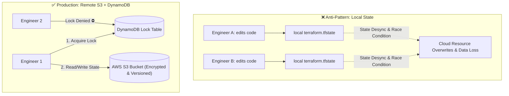

# Terraform State, Remote S3 Backend & State Locking

The **State File** (`terraform.tfstate`) is the most critical and sensitive component of Terraform. Without it, Terraform cannot know which real-world cloud resources correspond to your HCL code.



---

## What Information Lives Inside `terraform.tfstate`?

The state file is a JSON document containing:
1. **Resource ID Mappings**: Maps `aws_instance.web` to real AWS ID `i-08a1b2c3d4e5f6789`.
2. **Metadata & Dependencies**: Tracks which resources depend on which.
3. **Performance Cache**: Stores resource attributes locally so `terraform plan` does not have to make thousands of slow API calls on every keystroke.
4. **Sensitive Data**: Database passwords, private keys, and API tokens are stored in **plain text** inside the state file!

---

## Step-by-Step: Provisioning Production Remote Backend in AWS

To host your state securely in AWS, you need two resources:
1. **An AWS S3 Bucket**: With **Server-Side Encryption (SSE)** and **Bucket Versioning** enabled (so you can roll back if state gets corrupted).
2. **An AWS DynamoDB Table**: With a primary key named `LockID` for distributed state locking.

### Step 1: Bootstrap the S3 Bucket and DynamoDB Table
Create a bootstrap file `bootstrap-backend.tf`:

```hcl
provider "aws" {
  region = "us-east-1"
}

# 1. Encrypted, versioned S3 bucket for state storage
resource "aws_s3_bucket" "terraform_state" {
  bucket        = "my-company-devops-tfstate-2026"
  force_destroy = false # Prevent accidental deletion!

  lifecycle {
    prevent_destroy = true
  }
}

resource "aws_s3_bucket_versioning" "state_versioning" {
  bucket = aws_s3_bucket.terraform_state.id
  versioning_configuration {
    status = "Enabled"
  }
}

resource "aws_s3_bucket_server_side_encryption_configuration" "state_encryption" {
  bucket = aws_s3_bucket.terraform_state.id

  rule {
    apply_server_side_encryption_by_default {
      sse_algorithm = "AES256"
    }
  }
}

resource "aws_s3_bucket_public_access_block" "block_public" {
  bucket = aws_s3_bucket.terraform_state.id

  block_public_acls       = true
  block_public_policy     = true
  ignore_public_acls      = true
  restrict_public_buckets = true
}

# 2. DynamoDB Table for Distributed State Locking
resource "aws_dynamodb_table" "terraform_locks" {
  name         = "terraform-state-locks"
  billing_mode = "PAY_PER_REQUEST"
  hash_key     = "LockID"

  attribute {
    name = "LockID"
    type = "S"
  }
}
```

Apply this bootstrap configuration:
```bash
terraform init
terraform apply
```

---

## Step 2: Configuring the Remote Backend in Your Project

Now, in your main infrastructure project, configure the `backend "s3"` block in `backend.tf`:

```hcl
# backend.tf
terraform {
  backend "s3" {
    bucket         = "my-company-devops-tfstate-2026"
    key            = "production/infrastructure/terraform.tfstate"
    region         = "us-east-1"
    dynamodb_table = "terraform-state-locks"
    encrypt        = true
  }
}
```

Run migration:
```bash
$ terraform init -migrate-state

Do you want to copy existing state to the new backend?
  Enter a value: yes

Successfully configured the backend "s3"! Terraform will now
use this backend for all future state operations.
```

---

## Inspecting & Manipulating State Safely

Never edit `terraform.tfstate` by hand in a text editor! Always use built-in CLI inspection commands:

```bash
# 1. List all resources tracked by state
$ terraform state list
aws_vpc.production_vpc
aws_subnet.public_a
aws_instance.web_server[0]
aws_instance.web_server[1]

# 2. Inspect full attributes of a specific resource
$ terraform state show aws_vpc.production_vpc

# 3. Rename a resource without destroying and recreating it in AWS!
$ terraform state mv aws_instance.web_server[0] aws_instance.primary_web

# 4. Remove a resource from state without deleting it from AWS
$ terraform state rm aws_s3_bucket.legacy_logs
```

---

## Handling Stale State Locks

If an engineer's laptop crashes or a CI/CD job is killed abruptly during `terraform apply`, the DynamoDB lock might remain active:

```bash
Error: Error acquiring the state lock: ConditionalCheckFailedException
Lock Info:
  ID:        e29a9978-5e8a-4467-93be-123456789abc
  Path:      my-company-devops-tfstate-2026/production/infrastructure/terraform.tfstate
  Operation: OperationTypeApply
  Who:       alice@macbook-pro.local
  Created:   2026-08-19 01:30:15 UTC
```

To release the lock safely once you have confirmed no other apply is running:
```bash
terraform force-unlock e29a9978-5e8a-4467-93be-123456789abc
```
