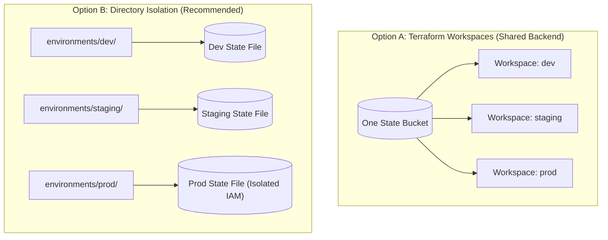

# Multi-Environment Stacks & Blast Radius Management

One of the most important architectural decisions in cloud engineering is **how to separate Development, Staging, and Production environments**.



---

## The Great Debate: Workspaces vs. Directory Separation

| Criteria | CLI Workspaces (`terraform workspace`) | Directory Separation (`environments/prod/`) |
| :--- | :--- | :--- |
| **Code Repetition** | Zero (same files, different workspace) | Minimal (small root caller files referencing modules) |
| **Blast Radius** | ⚠️ High (all environments share same backend) | ✅ Low (completely isolated state and credentials) |
| **Credential Separation** | Hard (same role used for dev & prod) | Easy (Dev uses Dev IAM role, Prod uses Prod IAM role) |
| **Industry Standard** | Good for short-lived ephemeral preview environments | **Gold standard for Dev / Staging / Production** |

---

## Production Standard: Directory-Based Environment Architecture

Here is the directory structure used by top enterprise engineering teams:

```
terraform-infrastructure/
├── modules/                         # Reusable company modules
│   ├── vpc/
│   ├── eks_cluster/
│   └── postgres_rds/
│
└── environments/                   # Isolated environment roots
    ├── dev/
    │   ├── backend.tf              # State key: dev/terraform.tfstate
    │   ├── main.tf                 # Calls modules with small dev sizes
    │   └── terraform.tfvars
    │
    ├── staging/
    │   ├── backend.tf              # State key: staging/terraform.tfstate
    │   ├── main.tf
    │   └── terraform.tfvars
    │
    └── prod/
        ├── backend.tf              # State key: prod/terraform.tfstate (Locked IAM)
        ├── main.tf                 # High availability, Multi-AZ, Read Replicas
        └── terraform.tfvars
```

### Dev Configuration (`environments/dev/main.tf`):
```hcl
provider "aws" {
  region = "us-east-1"
  # Dev AWS Account ID
}

module "app_cluster" {
  source = "../../modules/eks_cluster"

  environment   = "dev"
  node_count    = 2
  instance_type = "t3.medium" # Cheap instances for dev
}
```

### Prod Configuration (`environments/prod/main.tf`):
```hcl
provider "aws" {
  region = "us-east-1"
  # Prod AWS Account ID (Separate Cloud Account!)
}

module "app_cluster" {
  source = "../../modules/eks_cluster"

  environment        = "prod"
  node_count         = 6
  instance_type      = "m5.2xlarge" # High-performance instances
  enable_multi_az    = true
  enable_kms_encrypt = true
}
```

---

## Working with Terraform CLI Workspaces

If you are creating temporary feature-branch environments (e.g. `feat-auth-preview`), CLI workspaces are very useful:

```bash
# 1. List existing workspaces
$ terraform workspace list
* default

# 2. Create and switch to a new workspace
$ terraform workspace new feature-payment-v2
Created and switched to workspace "feature-payment-v2"!

# 3. Reference active workspace name in HCL:
```

```hcl
resource "aws_s3_bucket" "preview_bucket" {
  bucket = "app-preview-${terraform.workspace}-2026"
}
```

```bash
# 4. Switch back to default
terraform workspace select default

# 5. Delete temporary workspace after PR is merged
terraform workspace select default
terraform workspace delete feature-payment-v2
```
