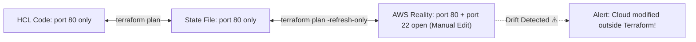

# Drift Detection, State Refresh, and Importing Resources

In a perfect world, nobody touches the cloud console. In the real world, an on-call engineer fixes an outage at 2 AM by manually editing a security group or upgrading an instance in the AWS Console.

This discrepancy between **desired code**, **recorded state**, and **actual cloud reality** is called **Configuration Drift**.



---

## 1. Detecting Drift with `terraform plan -refresh-only`

Terraform provides a safe, non-destructive way to scan real cloud infrastructure and update the local state file without modifying cloud resources:

```bash
# Query the live AWS API and report any drift
$ terraform plan -refresh-only

Terraform detected the following changes made outside of Terraform:

  # aws_security_group.web has been modified outside Terraform:
  ~ resource "aws_security_group" "web" {
        id   = "sg-0123456789abcdef0"
        name = "production-web-sg"
      ~ ingress = [
          + {
              + cidr_blocks = ["0.0.0.0/0"]
              + from_port   = 22
              + protocol    = "tcp"
              + to_port     = 22
            },
        ]
    }

Note: Objects have changed outside of Terraform. Use "-refresh-only" to update state without modifying real resources.
```

To accept the cloud changes into your state file:
```bash
terraform apply -refresh-only
```

---

## 2. Importing Existing Infrastructure into Terraform

What if your company has 50 existing AWS EC2 servers or S3 buckets that were created manually years ago before Terraform was introduced? You do **not** need to recreate them! You can **import** them.

### Modern Declarative Import (Terraform 1.5+)

The modern way to import resources is using the native `import {}` block in HCL:

```hcl
# import.tf
import {
  to = aws_s3_bucket.legacy_data
  id = "company-legacy-customer-data-bucket-2020"
}
```

Now, tell Terraform to generate the exact HCL resource block automatically:
```bash
terraform plan -generate-config-out=generated_resources.tf
```

Terraform writes the corresponding `resource "aws_s3_bucket" "legacy_data"` block for you into `generated_resources.tf`!

Run apply to seal the import:
```bash
$ terraform apply

aws_s3_bucket.legacy_data: Importing... [id=company-legacy-customer-data-bucket-2020]
aws_s3_bucket.legacy_data: Import complete [id=company-legacy-customer-data-bucket-2020]

Apply complete! Resources: 1 imported, 0 added, 0 changed, 0 destroyed.
```

---

## 3. Refactoring Code Without Destroying Resources (`moved {}` Blocks)

In older versions of Terraform, if you renamed a resource in your HCL code (e.g. from `aws_instance.server` to `aws_instance.primary_server`), Terraform would **destroy the running EC2 server and build a new one**!

In modern Terraform, you prevent this with a `moved {}` block:

```hcl
# Refactoring: renamed resource without causing downtime!
moved {
  from = aws_instance.server
  to   = aws_instance.primary_server
}

# Refactoring: moved resource into a module!
moved {
  from = aws_security_group.web_sg
  to   = module.security.aws_security_group.web_sg
}
```

When you run `terraform plan`, Terraform detects the `moved` block and simply updates the internal state pointer:

```bash
$ terraform plan
aws_instance.server has moved to aws_instance.primary_server

Plan: 0 to add, 0 to change, 0 to destroy.
```
