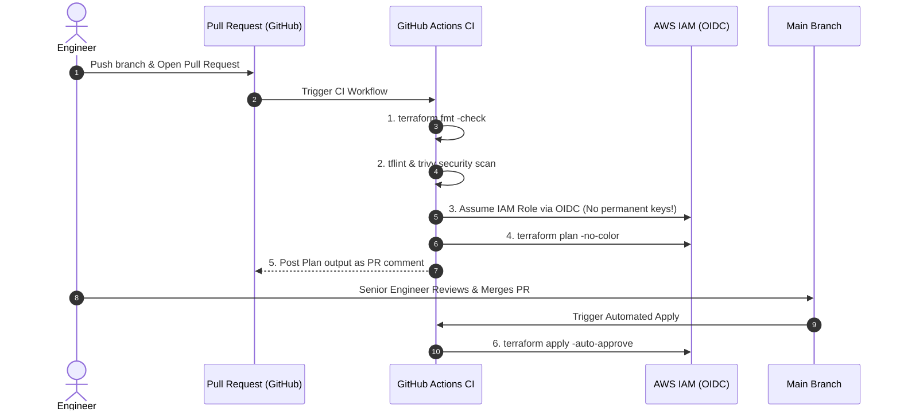

# Automated Terraform CI/CD in GitHub Actions

Running `terraform apply` from an engineer's personal laptop is dangerous. In a modern DevOps workflow, infrastructure changes are automated through a **GitOps CI/CD Pipeline**.



---

## 1. Secure AWS Authentication via OpenID Connect (OIDC)

Never store permanent `AWS_ACCESS_KEY_ID` and `AWS_SECRET_ACCESS_KEY` in GitHub Secrets! If leaked, attackers gain full access to your cloud.

Instead, use **GitHub OpenID Connect (OIDC)** to exchange a short-lived, cryptographically signed token for temporary AWS credentials:

```yaml
permissions:
  id-token: write # Required for requesting the JWT token
  contents: read
  pull-requests: write # Required to post plan output back to PR
```

---

## 2. Complete Production GitHub Actions Workflow

Create `.github/workflows/terraform.yml`:

```yaml
name: "Terraform Production IaC Pipeline"

on:
  push:
    branches: [ "main" ]
  pull_request:
    branches: [ "main" ]

permissions:
  id-token: write
  contents: read
  pull-requests: write

jobs:
  terraform:
    name: "Terraform Automation"
    runs-on: ubuntu-latest
    defaults:
      run:
        working-directory: ./environments/prod

    steps:
      - name: Checkout Code
        uses: actions/checkout@v4

      - name: Setup Terraform CLI
        uses: hashicorp/setup-terraform@v3
        with:
          terraform_version: 1.8.5

      # Step 1: Format verification
      - name: Terraform Format Check
        id: fmt
        run: terraform fmt -check

      # Step 2: Initialize Backend
      - name: Terraform Init
        id: init
        run: terraform init

      # Step 3: Syntax Validation
      - name: Terraform Validate
        id: validate
        run: terraform validate -no-color

      # Step 4: Speculative Plan on Pull Request
      - name: Terraform Plan
        id: plan
        if: github.event_name == 'pull_request'
        run: |
          terraform plan -no-color -out=tfplan
        continue-on-error: false

      # Step 5: Post formatted Plan summary as PR Comment
      - name: Comment Plan on PR
        uses: actions/github-script@v7
        if: github.event_name == 'pull_request'
        with:
          github-token: ${{ secrets.GITHUB_TOKEN }}
          script: |
            const output = `#### Terraform Format & Style 🖌 \`${{ steps.fmt.outcome }}\`
            #### Terraform Initialization ⚙️ \`${{ steps.init.outcome }}\`
            #### Terraform Validation 🤖 \`${{ steps.validate.outcome }}\`
            #### Terraform Plan 📖 \`${{ steps.plan.outcome }}\`

            *Pushed by: @${{ github.actor }}, Action: \`${{ github.event_name }}\`*`;

            github.rest.issues.createComment({
              issue_number: context.issue.number,
              owner: context.repo.owner,
              repo: context.repo.repo,
              body: output
            })

      # Step 6: Automated Apply on Merge to Main
      - name: Terraform Apply
        if: github.ref == 'refs/heads/main' && github.event_name == 'push'
        run: terraform apply -auto-approve
```

---

## 3. Production Best Practices & Guardrails

1. **Always use OIDC for Cloud Authentication**: Never hardcode credentials.
2. **Speculative Plans on Every PR**: Verify exact resource additions/deletions before code is merged.
3. **Automate Security Scanning in CI**: Use `trivy config .` or `tfsec` in your pipeline to catch unencrypted S3 buckets or open SSH security groups before deployment.
4. **Protect the Main Branch**: Require at least 1 Senior Engineer approval and passing CI status checks before merging.
