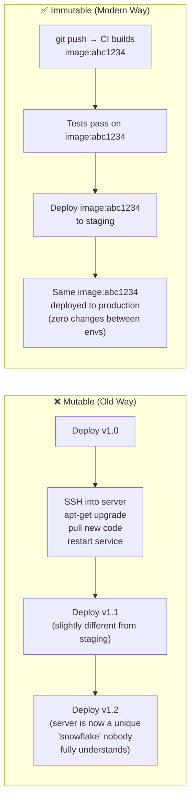
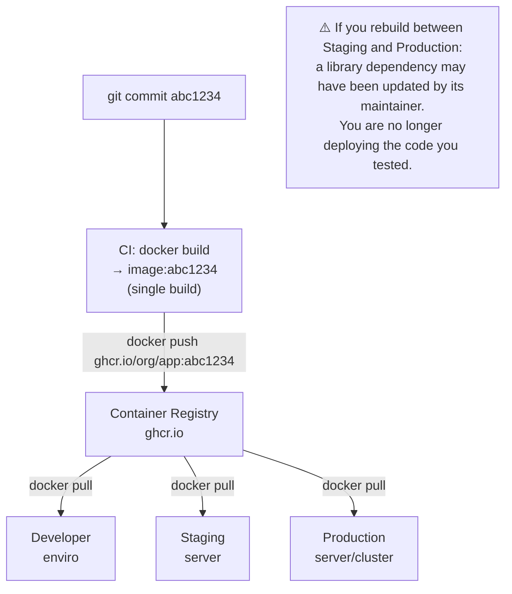

# Build Artifact ဆိုတာ What Is?

Artifact ဆိုတာ CI pipeline ကနေ ထွက်လာတဲ့ immutable ဖြစ်ပြီး test ပြီးသား output တစ်ခုဖြစ်ပါတယ် — ဒါကတော့ production ကို တကယ် deploy လုပ်မယ့် item ပါပဲ။ Artifact ရဲ့ ပုံစံက ဆယ်စုနှစ်တွေအတွင်း အများကြီး ဖွံ့ဖြိုးတိုးတက်လာခဲ့ပါတယ်:

| Era | Artifact Type | Example | Problem |
|-----|--------------|---------|---------|
| **1990s** | Raw binary / zip | `app.war`, `app.zip` | "It works on my machine" |
| **2000s** | VM image | AWS AMI, OVA | ကြီးမားတယ် (GB), transfer လုပ်ဖို့ နှေးကွေးတယ် |
| **2010s** | Container image | Docker image | ✅ Portable ဖြစ်တယ်, မြန်တယ်, layered ဖြစ်တယ် |
| **Today** | OCI image + SBOM + signature | Signed Docker image | ✅ + secure ဖြစ်တယ်, auditable ဖြစ်တယ် |

ခေတ်မီ standard ကတော့ **OCI container image** ဖြစ်ပါတယ် — ဒါက application နဲ့ သူ့ရဲ့ exact runtime environment ကို ပေါင်းစပ်ပေးထားတဲ့ portable ဖြစ်ပြီး၊ layered ဖြစ်ကာ content-addressed ဖြစ်တဲ့ package တစ်ခုပဲ ဖြစ်ပါတယ်။

---

## The Immutable Server Pattern

Artifact management မှာ အရေးကြီးဆုံး principle ကတော့: **artifact တစ်ခုကို build ပြီး test ပြီးသွားရင် ဘယ်တော့မှ ပြန်မပြင်တော့ပါဘူး** (once an artifact is built and tested, it is never modified)။



Mutable server တွေဟာ အချိန်ကြာလာတာနဲ့အမျှ ကွဲလွဲလာတာကို **Configuration Drift** လို့ ခေါ်ပါတယ်။ SSH session တိုင်း၊ manual hotfix တိုင်းနဲ့ တစ်ခါသုံး `apt-get` တိုင်းဟာ server တိုင်းကို ဘယ်သူမှ အပြည့်အဝ နားမလည်နိုင်တဲ့, debug လုပ်လို့ မရနိုင်တဲ့, reliable ဖြစ်အောင် scale လုပ်လို့ မရနိုင်တဲ့ unique "snowflake" တစ်ခုအဖြစ် တဖြည်းဖြည်း ပြောင်းလဲသွားစေပါတယ်။

Immutable artifact တွေနဲ့ဆိုရင်တော့:
- Staging နဲ့ Production တို့ဟာ **exact same image** ကို run ကြပါတယ် (same SHA256 digest)
- Rollback လုပ်တယ်ဆိုတာ "previous image tag ကို switch လုပ်တာ" ကို ဆိုလိုပါတယ် — code වෙනလဲစရာမလို၊ pipeline ထပ် run စရာမလိုပါဘူး
- Server တိုင်းကို replace လုပ်လို့ရပါတယ် — တစ်ခုကို destroy လို့, image တူတူနဲ့ အသစ်တစ်ခုကို spin up လိုက်လို့ရပါတယ်

---

## Build Once, Deploy Everywhere



Environment တွေကြားမှာ image ကို ဘယ်တော့မှ ထပ်မံ build မလုပ်ပါနဲ့။ Image ရဲ့ SHA256 digest ဟာ ကိုယ် test ပြီးသားဟာကိုပဲ run နေတယ်ဆိုတဲ့ အာမခံချက်ဖြစ်ပါတယ်။

---

## Tagging Strategy: Never Use `:latest` Alone

```
❌ Anti-pattern: tagging everything as :latest
   - Deployment: docker pull myapp:latest  → ဘယ် version ဖြစ်မှန်း မသိနိုင်ပါ
   - Rollback: docker pull myapp:latest    → ပျက်နေတဲ့ version ပဲ ဆက်ဖြစ်နေမှာပါ!
   - Debugging: ဘယ် code က run နေတာလဲ?      → လုံးဝ မသိနိုင်ပါ

✅ Production tagging strategy:
   myapp:abc1234        ← Git SHA (immutable ဖြစ်တယ်, exact commit နဲ့ ချိတ်ဆက်ပေးတယ်)
   myapp:v1.5.2         ← SemVer (လူတွေ ဖတ်လို့ရတဲ့ release version)
   myapp:main           ← main branch ပေါ်က Latest commit
   myapp:latest         ← အဆင်ပြေစေဖို့သုံးတဲ့ alias (mutable ဖြစ်တယ် — လူသုံးဖို့အတွက်သာ ဖြစ်ပါတယ်)
```

```bash
# In CI, generate all tags from git metadata
GIT_SHA=$(git rev-parse --short HEAD)
VERSION=$(git tag --points-at HEAD || echo "untagged")
BRANCH=$(git rev-parse --abbrev-ref HEAD | tr '/' '-')

# Build once
docker build -t myapp:local .

# Apply multiple tags
docker tag myapp:local ghcr.io/yourorg/myapp:${GIT_SHA}
docker tag myapp:local ghcr.io/yourorg/myapp:${BRANCH}
docker tag myapp:local ghcr.io/yourorg/myapp:latest

# On a release tag:
if [[ "$VERSION" != "untagged" ]]; then
  docker tag myapp:local ghcr.io/yourorg/myapp:${VERSION}
fi

# Push all tags
docker push ghcr.io/yourorg/myapp --all-tags
```

---

## Choosing the Right Container Registry

| Registry | Best For | Auth | Cost |
|---------|---------|------|------|
| **GitHub GHCR** (`ghcr.io`) | GitHub projects | GitHub token | Public အတွက် Free; GitHub plans တွေနဲ့ တွဲပါပြီးသား |
| **Docker Hub** (`docker.io`) | Open-source public images | Docker token | Free (rate limited ရှိ); private အတွက် paid ဖြစ်ပါတယ် |
| **AWS ECR** | AWS (ECS/EKS) deployments | IAM roles | $0.10/GB storage |
| **Google Artifact Registry** | GCP (GKE) deployments | Service accounts | $0.10/GB storage |
| **Azure Container Registry** | Azure (AKS) deployments | Service principals | Tiered pricing |
| **Harbor** (self-hosted) | Air-gapped / enterprise | Internal | Infrastructure cost only |

### Registry Best Practices

```bash
# Production မှာ tag (mutable) တစ်ခုတည်းကို မသုံးဘဲ image digest (immutable) ကို သုံးပါ
# Tag ကို overwrite လုပ်လို့ရပေမဲ့ — digest ကို မရပါဘူး
docker pull ghcr.io/yourorg/myapp:v1.5.2
# → sha256:a1b2c3d4e5f6...

# Kubernetes မှာ digest နဲ့ ညွှန်းဆိုပါ (truly immutable ဖြစ်စေပါတယ်)
image: ghcr.io/yourorg/myapp@sha256:a1b2c3d4e5f6...

# Enable content trust (pull မလုပ်ခင် signed image တွေကို verify လုပ်ပါ)
export DOCKER_CONTENT_TRUST=1
docker pull ghcr.io/yourorg/myapp:v1.5.2
# Image ကို လက်မခံခင် signature ကို validate လုပ်ပါတယ်

# ပုံဟောင်းများကို ရှင်းလင်းရန် registry garbage collection ကို သတ်မှတ်ပါ
# (Registry တွေက အချိန်ကြာလာတာနဲ့အမျှ ကြီးလာတတ်ပါတယ် — tag pruning က အလွန်အရေးကြီးပါတယ်)
```

---

## Software Bill of Materials (SBOM)

SBOM ဆိုတာ artifact တစ်ခုထဲမှာ ပါဝင်တဲ့ component တိုင်း — OS package တိုင်း၊ npm library တိုင်း၊ transitive dependency တိုင်းရဲ့ machine-readable inventory တစ်ခုပဲ ဖြစ်ပါတယ်။ ဒါက ကိုယ့် software အတွက် ပါဝင်ပစ္စည်းစာရင်း (ingredient list) ပဲ ဖြစ်ပါတယ်။

```bash
# Generate SBOM using Syft
syft ghcr.io/yourorg/myapp:v1.5.2 -o spdx-json > sbom.spdx.json

# Or with CycloneDX format
syft ghcr.io/yourorg/myapp:v1.5.2 -o cyclonedx-json > sbom.cyclonedx.json

# Inspect what's inside
cat sbom.spdx.json | python3 -c "
import json,sys
d=json.load(sys.stdin)
for pkg in d.get('packages',[]):
    print(f\"{pkg['name']}@{pkg['versionInfo']}\")"

# Attach the SBOM to the container image as an OCI attestation
cosign attest \
  --predicate sbom.spdx.json \
  --type spdxjson \
  ghcr.io/yourorg/myapp:v1.5.2
```

**SBOM တွေက ဘာကြောင့် အရေးကြီးတာလဲ**:
- **Log4Shell (CVE-2021-44228)**: ဒီလို Java vulnerability ကြီး ထွက်လာတဲ့အခါ SBOM မရှိတဲ့ team တွေဟာ ကိုယ့် application တွေ ထိခိုက်မှုရှိမရှိ ရက်ပေါင်းများစွာ manual လိုက်စစ်ခဲ့ရပါတယ်။ SBOM ရှိတဲ့ team တွေကတော့ inventory ထဲမှာ search လုပ်လိုက်ရုံနဲ့ မိနစ်ပိုင်းအတွင်း အဖြေအပြည့်အစုံ ရရှိခဲ့ပါတယ်။
- **Regulatory compliance**: NIST SP 800-218၊ FedRAMP နဲ့ PCI DSS တို့က software supply chain security အတွက် SBOM တွေကို ပိုမိုတောင်းဆိုလာကြပါပြီ။

---

## Image Signing with Cosign (Sigstore)

Image signing ဆိုတာက သတ်မှတ်ထားတဲ့ image တစ်ခုဟာ ကိုယ့်ရဲ့ trusted ဖြစ်တဲ့ CI pipeline ကနေ ထွက်လာတာဖြစ်ပြီး တမင် ဝင်ရောက်ပြင်ဆင်ထားတာ (tamper လုပ်ထားတာ) မရှိကြောင်း သက်သေပြတာဖြစ်ပါတယ်။ Public key ရှိတဲ့ ဘယ်သူမဆို ဒါကို verify လုပ်နိုင်ပါတယ်:

```bash
# Install cosign
brew install sigstore/tap/cosign

# Generate a key pair (keyless signing အတွက်ဆိုရင် OIDC ကို အစားထိုးသုံးပါ)
cosign generate-key-pair

# Sign an image (registry ကို push ပြီးမှ လုပ်ပါ)
cosign sign \
  --key cosign.key \
  ghcr.io/yourorg/myapp:v1.5.2
# Registry တူတူမှာ signature ကို OCI artifact တစ်ခုအနေနဲ့ ထည့်သွင်းပေးပါတယ်

# deployment မလုပ်ခင် signature ကို verify လုပ်ပါ
cosign verify \
  --key cosign.pub \
  ghcr.io/yourorg/myapp:v1.5.2
# Verified OK ✅

# Keyless signing in GitHub Actions (OIDC ကို သုံးပါတယ်၊ key management မလိုပါဘူး)
- name: Sign image
  uses: sigstore/cosign-installer@v3
  
- name: Sign with keyless OIDC
  run: |
    cosign sign \
      --yes \
      ghcr.io/${{ github.repository }}:${{ github.sha }}
  env:
    COSIGN_EXPERIMENTAL: 1
```

---

## Integrating SBOM + Signing into CI/CD

```yaml
# .github/workflows/publish.yml
jobs:
  build-and-secure:
    runs-on: ubuntu-latest
    permissions:
      contents: read
      packages: write
      id-token: write    # Keyless OIDC signing အတွက် လိုအပ်ပါတယ်

    steps:
      - uses: actions/checkout@v4

      - uses: docker/setup-buildx-action@v3
      
      - uses: docker/login-action@v3
        with:
          registry: ghcr.io
          username: ${{ github.actor }}
          password: ${{ secrets.GITHUB_TOKEN }}

      - name: Build and push
        id: build
        uses: docker/build-push-action@v5
        with:
          push: true
          tags: ghcr.io/${{ github.repository }}:${{ github.sha }}
          # SBOM နဲ့ provenance attestation ကို ထည့်သွင်းပါ
          sbom: true
          provenance: true

      - name: Install cosign
        uses: sigstore/cosign-installer@v3

      - name: Sign image (keyless via GitHub OIDC)
        run: |
          cosign sign --yes \
            ghcr.io/${{ github.repository }}@${{ steps.build.outputs.digest }}
        env:
          COSIGN_EXPERIMENTAL: 1

      - name: Verify signature
        run: |
          cosign verify \
            --certificate-oidc-issuer https://token.actions.githubusercontent.com \
            --certificate-identity-regexp ".*" \
            ghcr.io/${{ github.repository }}@${{ steps.build.outputs.digest }}
```

---

## Artifact Retention Policies

Registry တွေမှာ image တွေ အများကြီး စုပုံလာတတ်ပါတယ်။ Pruning (ရှင်းလင်းခြင်း) မလုပ်ရင် storage cost တွေ အဆုံးအမ မရှိ ကြီးထွားလာပါလိမ့်မယ်:

```bash
# GitHub GHCR: GitHub API မှတစ်ဆင့် ပုံဟောင်းများကို ဖျက်ပོါ
# နောက်ဆုံး version 5 ခုမှလွဲ၍ ရက် 90 ကျော်သွားသော image အားလုံးကို ဖျက်ပါ
gh api --method DELETE \
  /user/packages/container/myapp/versions \
  --jq '.[] | select(.metadata.container.tags | length == 0) | .id' \
  | xargs -I {} gh api --method DELETE /user/packages/container/myapp/versions/{}

# ECR lifecycle policy (ပုံဟောင်းများကို အလိုအလျောက် ရှင်းလင်းပေးသည်)
aws ecr put-lifecycle-policy \
  --repository-name myapp \
  --lifecycle-policy-text '{
    "rules": [{
      "rulePriority": 1,
      "description": "Keep last 10 tagged images",
      "selection": {
        "tagStatus": "tagged",
        "tagPatternList": ["v*"],
        "countType": "imageCountMoreThan",
        "countNumber": 10
      },
      "action": {"type": "expire"}
    }]
  }'
```

---

## Summary

Modern artifact management ကို မဏ္ဍိုင် (၄) ရပ်နဲ့ တည်ဆောက်ထားပါတယ်:
- **Immutability**: build ပြီး test ပြီးသွားရင် artifact ကို ဘယ်တော့မှ ပြန်မပြင်ပါဘူး — configuration drift တွေ ကင်းစင်သွားပါတယ်။
- **Traceability**: artifact တိုင်းကို ထုတ်လုပ်ပေးခဲ့တဲ့ git SHA နဲ့ tag လုပ်ထားပါတယ် — deploy လုပ်ထားတဲ့ ဘယ် version အတွက်မဆို code ကို ဘယ်တော့မဆို ရှာဖွေနိုင်ပါတယ်။
- **Provenance**: SBOM တွေက အတွင်းမှာ ဘာတွေပါလဲဆိုတာကို အသေးစိတ်ဖော်ပြပေးပြီး signature (Cosign/Sigstore) တွေက artifact ဟာ ကိုယ့်ရဲ့ trusted pipeline ကနေ လာတာဖြစ်ကြောင်း သက်သေပြပါတယ်။
- **Retention**: schedule လုပ်ပြီး ပုံဟောင်းတွေကို ရှင်းထုတ်ပါ — registry တွေက အကန့်အသတ်မရှိ ကြီးမားနေတာ မဟုတ်ပါဘူး။ team အများစုကတော့ နောက်ဆုံး tag လုပ်ထားတဲ့ version 10–30 လောက်ကိုသာ ဆက်လက်ထိန်းသိမ်းထားကြပါတယ်။

နောက်လာမယ့် lesson မှာတော့ automated testing gates အကြောင်းကို လေ့လာရမှာ ဖြစ်ပါတယ် — ဒါကတော့ bad code တွေ artifact registry ဆီ မရောက်သွားအောင် တားဆီးပေးမယ့် quality checkpoint တွေပဲ ဖြစ်ပါတယ်။