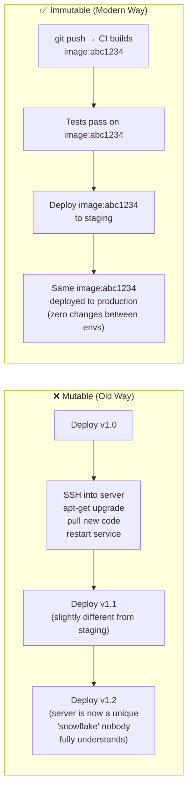
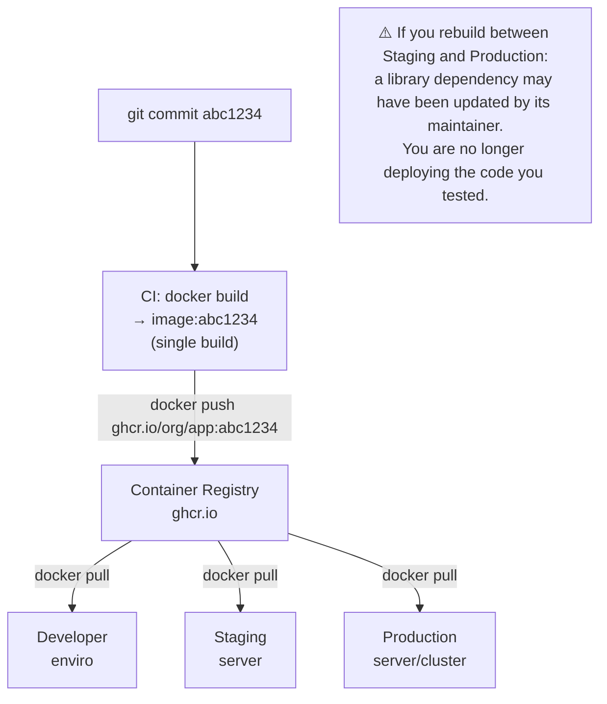

# Build Artifact ဆိုတာ ဘာလဲ?

Artifact ဆိုသည်မှာ CI pipeline တစ်ခုမှ ထွက်ရှိလာသော မပြောင်းလဲနိုင်သည့် (immutable)၊ စမ်းသပ်စစ်ဆေးပြီးသား output တစ်ခုဖြစ်ပြီး production သို့ တကယ်တမ်း deploy လုပ်မည့် အရာဖြစ်ပါသည်။ Artifact အမျိုးအစားများသည် ဆယ်စုနှစ်များတစ်လျှောက် သိသာစွာ ပြောင်းလဲတိုးတက်လာခဲ့သည်-

| Era | Artifact Type | Example | Problem |
|-----|--------------|---------|---------|
| **1990s** | Raw binary / zip | `app.war`, `app.zip` | "ငါ့စက်ထဲမှာတော့ အလုပ်လုပ်တယ်" ("It works on my machine") |
| **2000s** | VM image | AWS AMI, OVA | ဖိုင်အရွယ်အစားကြီးမားခြင်း (GB)၊ လွှဲပြောင်းရန် နှေးကွေးခြင်း |
| **2010s** | Container image | Docker image | ✅ နေရာတိုင်းသယ်ဆောင်ရလွယ်ကူခြင်း (Portable)၊ မြန်ဆန်ခြင်း၊ layered ဖြစ်ခြင်း |
| **Today** | OCI image + SBOM + signature | Signed Docker image | ✅ + လုံခြုံစိတ်ချရခြင်း၊ စစ်ဆေးစိစစ်နိုင်ခြင်း (Auditable) |

ခေတ်သစ် စံသတ်မှတ်ချက်မှာ **OCI container image** ဖြစ်ပြီး application နှင့် ၎င်း၏ တိကျသော runtime environment ကို တွဲဖက်ထုပ်ပိုးထားသည့် portable ဖြစ်သော၊ layered ဖြစ်သော၊ content-addressed package တစ်ခုဖြစ်ပါသည်။

---

## The Immutable Server Pattern

Artifact စီမံခန့်ခွဲမှုတွင် အရေးအကြီးဆုံးမူဝါဒမှာ - **artifact တစ်ခုကို build လုပ်ပြီး စမ်းသပ်ပြီးပါက ၎င်းကို မည်သည့်အခါမျှ ထပ်မံပြင်ဆင်ခြင်း မပြုလုပ်ရပါ**။



**Configuration Drift** ဆိုသည်မှာ ပြင်ဆင်ပြောင်းလဲနိုင်သော (mutable) ဆာဗာများသည် အချိန်ကြာလာသည်နှင့်အမျှ တစ်ခုနှင့်တစ်ခု မတူညီဘဲ ကွဲပြားသွားခြင်းကို ဆိုလိုပါသည်။ SSH ဝင်ရောက်မှုတိုင်း၊ ကိုယ်တိုင် manual ဝင်ပြင်ဆင်မှု (hotfix) တိုင်း၊ တစ်ကြိမ်သုံး `apt-get` တိုင်းသည် ဆာဗာတစ်ခုစီကို သီးခြားဆန်သော "snowflake" (တစ်မူထူးခြားနေသည့် အခြေအနေ) ဖြစ်သွားစေပြီး ပြန်လည်တည်ဆောက်ရန် မဖြစ်နိုင်တော့ခြင်း၊ ယုံကြည်စိတ်ချစွာ debug ပြုလုပ်ရန် မဖြစ်နိုင်တော့ခြင်းနှင့် စိတ်ချလက်ချ scale ချဲ့ရန် မဖြစ်နိုင်တော့ခြင်းတို့ကို ဖြစ်စေပါသည်။

Immutable artifacts များကို အသုံးပြုခြင်းဖြင့်-
- Staging နှင့် Production တို့သည် **လုံးဝတူညီသော image** (တူညီသော SHA256 digest) ကို အသုံးပြုလည်ပတ်နိုင်မည်
- Rollback ပြုလုပ်ခြင်းဆိုသည်မှာ "ယခင် image tag အဟောင်းသို့ ပြန်ပြောင်းခြင်း" ဖြစ်ပြီး code ပြင်ဆင်ရန် သို့မဟုတ် pipeline ပြန် run ရန် မလိုတော့ပါ
- ဆာဗာတိုင်းကို အစားထိုးနိုင်သည် — ဆာဗာတစ်ခု ပျက်စီးသွားပါက ဖျက်ပစ်ပြီး တူညီသော image ဖြင့် အသစ်တစ်ခု ချက်ချင်း run နိုင်သည်

---

## Build Once, Deploy Everywhere



Environment တစ်ခုနှင့်တစ်ခုကြားတွင် သင့် image ကို ဘယ်တော့မှ ထပ်မံ rebuild မလုပ်ပါနှင့်။ Image ၏ SHA256 digest သည် သင်စမ်းသပ်ထားသောအရာနှင့် သင်လက်တွေ့ run နေသောအရာ အမှန်တကယ်တူညီကြောင်း အာမခံချက်ဖြစ်ပါသည်။

---

## Tagging Strategy: `:latest` တစ်ခုတည်းကို ဘယ်တော့မှ မသုံးပါနှင့်

```
❌ Anti-pattern: tagging everything as :latest
   - Deployment: docker pull myapp:latest  → Could be any version
   - Rollback: docker pull myapp:latest    → Still the broken version!
   - Debugging: what code is running?      → No idea

✅ Production tagging strategy:
   myapp:abc1234        ← Git SHA (immutable, links to exact commit)
   myapp:v1.5.2         ← SemVer (human-readable release version)
   myapp:main           ← Latest commit on main branch
   myapp:latest         ← Convenience alias (mutable — for human use only)
```

```bash
# In CI, generate all tags from git metadata
GIT_SHA=$(git rev-parse --short HEAD)
VERSION=$(git tag --points-at HEAD || echo "untagged")
BRANCH=$(git rev-parse --abbrev-ref HEAD | tr '/' '-')

# Build once
docker build -t myapp:local .

# Apply multiple tags
docker tag myapp:local ghcr.io/yourorg/myapp:${GIT_SHA}
docker tag myapp:local ghcr.io/yourorg/myapp:${BRANCH}
docker tag myapp:local ghcr.io/yourorg/myapp:latest

# On a release tag:
if [[ "$VERSION" != "untagged" ]]; then
  docker tag myapp:local ghcr.io/yourorg/myapp:${VERSION}
fi

# Push all tags
docker push ghcr.io/yourorg/myapp --all-tags
```

---

## သင့်လျော်သော Container Registry ကို ရွေးချယ်ခြင်း

| Registry | အကောင်းဆုံး အသုံးဝင်ပုံ | Auth | ကုန်ကျစရိတ် |
|---------|---------|------|------|
| **GitHub GHCR** (`ghcr.io`) | GitHub projects များအတွက် | GitHub token | Public အတွက် အခမဲ့၊ GitHub plans များတွင် ပါဝင်ပြီး |
| **Docker Hub** (`docker.io`) | Open-source public images များအတွက် | Docker token | အခမဲ့ (rate limit ရှိ)၊ Private အတွက် အခပေး |
| **AWS ECR** | AWS (ECS/EKS) deployment များအတွက် | IAM roles | သိုလှောင်မှု $0.10/GB |
| **Google Artifact Registry** | GCP (GKE) deployment များအတွက် | Service accounts | သိုလှောင်မှု $0.10/GB |
| **Azure Container Registry** | Azure (AKS) deployment များအတွက် | Service principals | Tier အလိုက် ကုန်ကျစရိတ် |
| **Harbor** (self-hosted) | Air-gapped / Enterprise များအတွက် | Internal | Infrastructure ကုန်ကျစရိတ်သာ ရှိ |

### Registry ဆိုင်ရာ အကောင်းဆုံး လုပ်ထုံးလုပ်နည်းများ (Best Practices)

```bash
# Use image digest (immutable) not just tag (mutable) in production
# Tag can be overwritten — digest cannot
docker pull ghcr.io/yourorg/myapp:v1.5.2
# → sha256:a1b2c3d4e5f6...

# Reference by digest in Kubernetes (truly immutable)
image: ghcr.io/yourorg/myapp@sha256:a1b2c3d4e5f6...

# Enable content trust (verify signed images before pull)
export DOCKER_CONTENT_TRUST=1
docker pull ghcr.io/yourorg/myapp:v1.5.2
# Validates signature before accepting image

# Set up registry garbage collection to clean old images
# (Registries grow large over time — tag pruning is essential)
```

---

## Software Bill of Materials (SBOM)

SBOM ဆိုသည်မှာ သင့် artifact အတွင်းရှိ အစိတ်အပိုင်းတိုင်း (OS package တိုင်း၊ npm library တိုင်း၊ ဆက်စပ်နေသော transitive dependency တိုင်း) ၏ ကွန်ပျူတာဖတ်ရှုနိုင်သော စာရင်းအင်း (inventory) တစ်ခုဖြစ်ပါသည်။ ၎င်းသည် သင့် software အတွက် ပါဝင်ပစ္စည်းများစာရင်း (ingredient list) ပင် ဖြစ်သည်။

```bash
# Generate SBOM using Syft
syft ghcr.io/yourorg/myapp:v1.5.2 -o spdx-json > sbom.spdx.json

# Or with CycloneDX format
syft ghcr.io/yourorg/myapp:v1.5.2 -o cyclonedx-json > sbom.cyclonedx.json

# Inspect what's inside
cat sbom.spdx.json | python3 -c "
import json,sys
d=json.load(sys.stdin)
for pkg in d.get('packages',[]):
    print(f\"{pkg['name']}@{pkg['versionInfo']}\")"

# Attach the SBOM to the container image as an OCI attestation
cosign attest \
  --predicate sbom.spdx.json \
  --type spdxjson \
  ghcr.io/yourorg/myapp:v1.5.2
```

**SBOMs အဘယ်ကြောင့် အရေးကြီးသနည်း**-
- **Log4Shell (CVE-2021-44228)**- အဆိုပါ အလွန်စိုးရိမ်ရသော Java လုံခြုံရေးအားနည်းချက် ထွက်ပေါ်လာချိန်တွင် SBOM မရှိသော အဖွဲ့များသည် ၎င်းတို့၏ application များ ထိခိုက်မှုရှိမရှိကို ရက်ပေါင်းများစွာ အချိန်ယူ၍ manual စစ်ဆေးခဲ့ကြရသည်။ SBOM ရှိသော အဖွဲ့များမှာမူ ၎င်းတို့၏ inventory ထဲတွင် ရှာဖွေမှုတစ်ခု ပြုလုပ်ရုံဖြင့် မိနစ်ပိုင်းအတွင်း အဖြေတိကျစွာ ရရှိခဲ့ကြသည်။
- **ဥပဒေနှင့် စည်းမျဉ်းလိုက်နာမှု (Regulatory compliance)**- NIST SP 800-218၊ FedRAMP နှင့် PCI DSS ကဲ့သို့သော စံသတ်မှတ်ချက်များသည် software supply chain လုံခြုံရေးအတွက် SBOM များကို မဖြစ်မနေ လိုအပ်ချက်တစ်ခုအဖြစ် ပိုမိုသတ်မှတ်လာကြသည်။

---

## Cosign (Sigstore) ဖြင့် Image Signing ပြုလုပ်ခြင်း

Image signing သည် သတ်မှတ်ထားသော image တစ်ခုကို သင်ယုံကြည်ရသော CI pipeline မှ ထုတ်လုပ်ထားခြင်းဖြစ်ပြီး တစ်စုံတစ်ရာ ပြင်ဆင်ဖျက်ဆီးထားခြင်း (tampered) မရှိကြောင်း သက်သေပြပေးပါသည်။ Public key ရှိသူ မည်သူမဆို ၎င်းကို စစ်ဆေးအတည်ပြု (verify) နိုင်သည်-

```bash
# Install cosign
brew install sigstore/tap/cosign

# Generate a key pair (for keyless signing, use OIDC instead)
cosign generate-key-pair

# Sign an image (after pushing to registry)
cosign sign \
  --key cosign.key \
  ghcr.io/yourorg/myapp:v1.5.2
# Enters the signature as an OCI artifact in the same registry

# Verify a signature before deployment
cosign verify \
  --key cosign.pub \
  ghcr.io/yourorg/myapp:v1.5.2
# Verified OK ✅

# Keyless signing in GitHub Actions (uses OIDC, no key management)
- name: Sign image
  uses: sigstore/cosign-installer@v3
  
- name: Sign with keyless OIDC
  run: |
    cosign sign \
      --yes \
      ghcr.io/${{ github.repository }}:${{ github.sha }}
  env:
    COSIGN_EXPERIMENTAL: 1
```

---

## SBOM နှင့် Signing ကို CI/CD တွင် ပေါင်းစပ်ထည့်သွင်းခြင်း

```yaml
# .github/workflows/publish.yml
jobs:
  build-and-secure:
    runs-on: ubuntu-latest
    permissions:
      contents: read
      packages: write
      id-token: write    # Required for keyless OIDC signing

    steps:
      - uses: actions/checkout@v4

      - uses: docker/setup-buildx-action@v3
      
      - uses: docker/login-action@v3
        with:
          registry: ghcr.io
          username: ${{ github.actor }}
          password: ${{ secrets.GITHUB_TOKEN }}

      - name: Build and push
        id: build
        uses: docker/build-push-action@v5
        with:
          push: true
          tags: ghcr.io/${{ github.repository }}:${{ github.sha }}
          # Include SBOM and provenance attestation
          sbom: true
          provenance: true

      - name: Install cosign
        uses: sigstore/cosign-installer@v3

      - name: Sign image (keyless via GitHub OIDC)
        run: |
          cosign sign --yes \
            ghcr.io/${{ github.repository }}@${{ steps.build.outputs.digest }}
        env:
          COSIGN_EXPERIMENTAL: 1

      - name: Verify signature
        run: |
          cosign verify \
            --certificate-oidc-issuer https://token.actions.githubusercontent.com \
            --certificate-identity-regexp ".*" \
            ghcr.io/${{ github.repository }}@${{ steps.build.outputs.digest }}
```

---

## Artifact ထိန်းသိမ်းထားရှိမှုဆိုင်ရာ မူဝါဒများ (Retention Policies)

Registry များတွင် images များသည် အချိန်တိုအတွင်း လျင်မြန်စွာ စုပုံလာတတ်သည်။ မလိုအပ်သည်များကို ရှင်းလင်းဖယ်ရှားခြင်း (pruning) မပြုလုပ်ပါက သိုလှောင်မှုစရိတ်များ အတိုင်းအဆမရှိ မြင့်တက်လာနိုင်သည်-

```bash
# GitHub GHCR: delete old images via GitHub API
# Delete all images older than 90 days except the last 5 versions
gh api --method DELETE \
  /user/packages/container/myapp/versions \
  --jq '.[] | select(.metadata.container.tags | length == 0) | .id' \
  | xargs -I {} gh api --method DELETE /user/packages/container/myapp/versions/{}

# ECR lifecycle policy (auto-cleans old images)
aws ecr put-lifecycle-policy \
  --repository-name myapp \
  --lifecycle-policy-text '{
    "rules": [{
      "rulePriority": 1,
      "description": "Keep last 10 tagged images",
      "selection": {
        "tagStatus": "tagged",
        "tagPatternList": ["v*"],
        "countType": "imageCountMoreThan",
        "countNumber": 10
      },
      "action": {"type": "expire"}
    }]
  }'
```

---

## အကျဉ်းချုပ် (Summary)

ခေတ်မီ Artifact စီမံခန့်ခွဲမှုစနစ်ကို အဓိကမဏ္ဍိုင် (၄) ရပ်ပေါ်တွင် တည်ဆောက်ထားပါသည်-
- **Immutability (ပြင်ဆင်ပြောင်းလဲ၍မရနိုင်မှု)**- build လုပ်ပြီး စမ်းသပ်ပြီးပါက artifact ကို မည်သည့်အခါမျှ မပြင်ဆင်တော့ပါ — configuration drift ဖြစ်ပေါ်မှုကို လုံးဝဖယ်ရှားပေးနိုင်သည်
- **Traceability (ခြေရာခံစုံစမ်းနိုင်မှု)**- artifact တိုင်းကို ၎င်းအား ထုတ်လုပ်ခဲ့သော git SHA ဖြင့် tag လုပ်ထားသည် — deploy လုပ်ထားသော မည်သည့် version ၏ မူရင်း code ကိုမဆို အချိန်မရွေး ပြန်လည်ရှာဖွေနိုင်သည်
- **Provenance (မူရင်းဇစ်မြစ်ခိုင်လုံမှု)**- SBOMs များက အတွင်း၌ အတိအကျ မည်သည့်အရာများ ပါဝင်သည်ကို မှတ်တမ်းတင်ထားပြီး signatures များ (Cosign/Sigstore) က artifact သည် သင်ယုံကြည်ရသော pipeline မှ လာခြင်းဖြစ်ကြောင်း သက်သေပြသည်
- **Retention (ထိန်းသိမ်းရှင်းလင်းမှု)**- သတ်မှတ်ထားသော အချိန်ဇယားအတိုင်း image အဟောင်းများကို ရှင်းလင်းပါ — registry များ၏ နေရာလွတ်သည် အကန့်အသတ်မရှိ မဟုတ်ပါ၊ အဖွဲ့အများစုသည် နောက်ဆုံး tagged version ၁၀ ခုမှ ၃၀ ခုအထိသာ ထိန်းသိမ်းထားလေ့ရှိသည်

နောက်သင်ခန်းစာတွင် အရည်အသွေးမပြည့်မီသော code များကို သင့် artifact registry ထံ မရောက်ရှိစေရန် တားဆီးပေးသည့် အရည်အသွေးစစ်ဆေးရေးဂိတ်များဖြစ်သော Automated testing gates များအကြောင်းကို ကျွမ်းကျင်စွာ လေ့လာသွားမည်ဖြစ်ပါသည်။