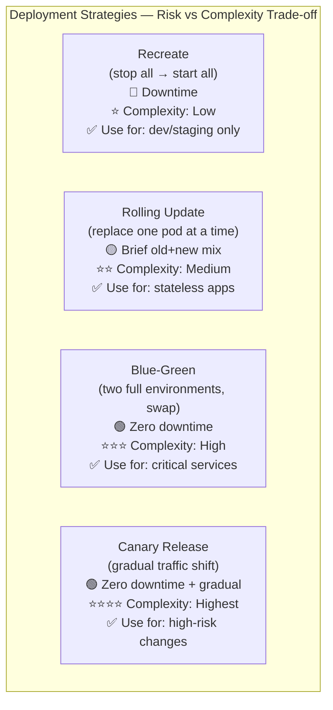
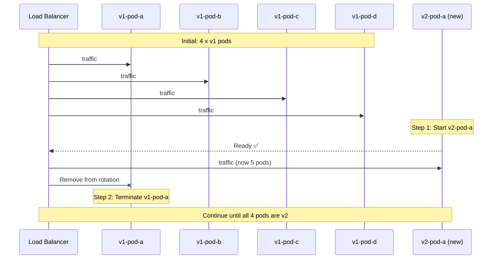
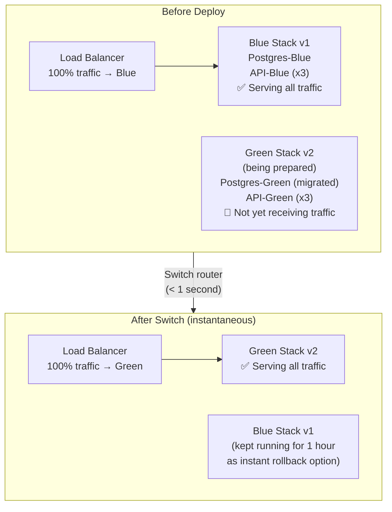
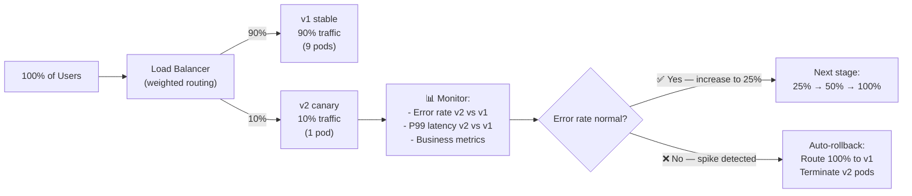

# Deployment Strategy က ဘไมို့ အရေးကြီးတာလဲ

Software ကို deploy လုပ်တဲ့ ပုံစံက သင့် users တွေ Downtime ကြုံရမလား၊ release တစ်ခု အမှားအယွင်း ဖြစ်သွားရင် ဘယ်လောက်မြန်မြန် ပြန်ပြင် (recover) လုပ်နိုင်မလဲ ဆိုတာကို တိုက်ရိုက် သတ်မှတ်ပေးပါတယ်။ "ဟောင်းတာရပ်၊ အသစ်စ" ဆိုတဲ့ ရိုးစင်းတဲ့ ပုံစံမျိုးက deploy လုပ်တိုင်း စက္ကန့်ပိုင်းကနေ မိနစ်ပိုင်းအထိ Downtime ဖြစ်စေပါတယ်။ Production systems တွေမှာဆိုရင် deployments တွေကို users တွေ မသိသာစေဘဲ လုပ်ဆောင်ပေးနိုင်တဲ့ ခေတ်မီတဲ့ routing strategies တွေ လိုအပ်ပါတယ်။



---

## Strategy 1: Recreate (Stop All, Start All)

အရှင်းဆုံး Strategy ပါ — old containers တွေကို အကုန်ရပ်လိုက်ပြီးမှ new containers တွေကို အကုန်စတင်တာပါ။ Production အတွက်တော့ မသင့်တော်ပါဘူး။

```yaml
# In Kubernetes
spec:
  strategy:
    type: Recreate   # Stop all old pods, then start all new pods
```

```
Timeline:
T=0:00  Deployment starts
T=0:05  All old pods (v1) terminated  ← ❌ SERVICE DOWN
T=0:30  New pods (v2) starting up
T=0:45  New pods pass health checks   ← Service back up
```

**ဒီလိုနေရာတွေမှာပဲ သုံးပါ**: development၊ non-production environments နဲ့ version နှစ်ခုကို တစ်ပြိုင်နက် မrun နိုင်တဲ့ jobs တွေ (ဥပမာ- exclusive locks နဲ့ database migrations တွေလိုမျိုး)။

---

## Strategy 2: Rolling Update (Kubernetes Default)

Kubernetes က pods တွေကို တစ်ခုချင်းစီ (သို့မဟုတ် အနည်းငယ်စီ) အစားထိုးသွားပါတယ်။ Rollout လုပ်နေစဉ်အတွင်း old နဲ့ new version နှစ်ခုစလုံးက traffic ကို တစ်ပြိုင်နက် လက်ခံ處理 နေကြပါတယ်။ ဒါက အဓိကကျတဲ့ သတ်မှတ်ချက်ပါပဲ။

```yaml
# Kubernetes Deployment with rolling update config
apiVersion: apps/v1
kind: Deployment
metadata:
  name: my-api
spec:
  replicas: 4
  strategy:
    type: RollingUpdate
    rollingUpdate:
      maxSurge: 1          # At most 1 extra pod above desired count during rollout
      maxUnavailable: 0    # No pods can be unavailable (zero-downtime guarantee)
      # With 4 replicas, maxSurge=1, maxUnavailable=0:
      # Start 1 new pod (now 5 running) → terminate 1 old (back to 4) → repeat
```



**Constraint (ကန့်သတ်ချက်)**: Rolling update လုပ်နေစဉ်အတွင်း app ရဲ့ old နဲ့ new versions တွေက traffic ကို တစ်ပြိုင်နက် Handle လုပ်နေပါတယ်။ သင့်ရဲ့ new version ဟာ ရှိပြီးသား database schema နဲ့ **backward-compatible ဖြစ်ရပါမယ်**။ Migration တစ်ခုထဲမှာ column နာမည်ကို ပြောင်းလဲပြီး တစ်ခါတည်း deploy လို့ မရပါဘူး။

### Rolling Update Best Practice: Backward-Compatible Migrations

```sql
-- Bad: rename column in one shot (v2 expects 'email' but v1 is still running with 'email_address')
ALTER TABLE users RENAME COLUMN email_address TO email;

-- Good: expand-contract migration over multiple deploys
-- Step 1 (deploy v1.1): Add new column, populate it, both columns exist
ALTER TABLE users ADD COLUMN email VARCHAR(255);
UPDATE users SET email = email_address;

-- Step 2 (deploy v1.2 — after v1.1 is fully rolled out): app uses 'email'
-- Both columns still exist during rolling update

-- Step 3 (deploy v1.3 — after v1.2 is stable): drop old column
ALTER TABLE users DROP COLUMN email_address;
```

---

## Strategy 3: Blue-Green Deployment

ပြည့်စုံပြီး တူညီတဲ့ environments နှစ်ခုကို ဘေးချင်းယှဉ် run ထားပါတယ် — "Blue" (လက်ရှိ production) နဲ့ "Green" (version အသစ်) တို့ဖြစ်ပါတယ်။ Load balancer ဒါမှမဟုတ် DNS switch တစ်ခုက traffic အားလုံးကို Blue ကနေ Green ဆီ တစ်ရှိန်ထိုး ပြောင်းပေးလိုက်ပါတယ်။



### Blue-Green with Docker Compose

```bash
# Current production: "blue" stack running on port 3000
COMPOSE_PROJECT_NAME=myapp-blue docker compose \
  -f docker-compose.yml -f docker-compose.prod.yml \
  up -d

# Step 1: Start the "green" stack (new version) on a different port
IMAGE_TAG=v2.0.0 COMPOSE_PROJECT_NAME=myapp-green docker compose \
  -f docker-compose.yml -f docker-compose.prod.yml \
  up -d

# Step 2: Run migrations (green's DB before switching traffic)
docker compose -p myapp-green exec api npx prisma migrate deploy

# Step 3: Verify green is healthy
curl http://localhost:3001/health
# {"status":"ok","version":"2.0.0"}

# Step 4: Switch nginx to point to green (atomic — < 1 second of disruption)
# Update nginx upstream to point to green, then reload
sed -i 's/myapp-blue-api-1:3000/myapp-green-api-1:3000/' /etc/nginx/conf.d/default.conf
nginx -s reload

# Step 5: Monitor for 30 minutes. If OK, tear down blue
COMPOSE_PROJECT_NAME=myapp-blue docker compose down

# Step 5 (ROLLBACK): If green is bad, switch back to blue instantly
sed -i 's/myapp-green-api-1:3000/myapp-blue-api-1:3000/' /etc/nginx/conf.d/default.conf
nginx -s reload
COMPOSE_PROJECT_NAME=myapp-green docker compose down
```

**Cost (ကုန်ကျစရိတ်)**: Blue-Green က switch လုပ်တဲ့အချိန်မှာ infrastructure (servers/pods) ကို နှစ်ဆသုံးရပါတယ်။ ဒါကြောင့် သေးငယ်တဲ့ apps တွေထက် အဓိကကျပြီး ကြီးမားတဲ့ services တွေမှာ အဓိက သုံးကြတာ ဖြစ်ပါတယ်။

---

## Strategy 4: Canary Release (Gradual Traffic Shift)

Canary release က တကယ့် traffic ရဲ့ ရာခိုင်နှုန်းအနည်းငယ်ကို version အသစ်ဆီ ပို့ပေးပါတယ်။ Metrics တွေ ကောင်းမွန်နေတယ်ဆိုရင် traffic ကို တစ်ဖြည်းဖြည်း တိုးမြှင့်ပေးပါတယ်။ အမှားအယွင်းတွေ (errors) တက်လာရင်တော့ release ကို အလိုအလျောက် ရပ်ပစ်လိုက်ပါတယ်။

မိုင်းတွင်းထဲ လွှတ်တဲ့ "canary ငှက်လေး" ကို အစွဲပြုပြီး မှည့်ခေါ်ထားတာပါ — အန္တရာယ်ကို အပြည့်အဝ မခံရခင် ကြိုတင်သိရှိနိုင်ဖို့အတွက် အကန့်အသတ်နဲ့ စမ်းသပ်တာ ဖြစ်ပါတယ်။



### Canary in Kubernetes with Argo Rollouts

```yaml
# Install: kubectl apply -f https://github.com/argoproj/argo-rollouts/releases/latest/download/install.yaml

apiVersion: argoproj.io/v1alpha1
kind: Rollout
metadata:
  name: my-api
spec:
  replicas: 10
  strategy:
    canary:
      # Gradual traffic steps
      steps:
        - setWeight: 5     # Send 5% to canary
        - pause: { duration: 5m }   # Wait and observe metrics
        - setWeight: 20
        - pause: { duration: 10m }
        - setWeight: 50
        - pause: { duration: 10m }
        - setWeight: 100   # Full rollout

      # Automatic analysis: abort if error rate spikes
      analysis:
        templates:
          - templateName: success-rate
        startingStep: 1
        args:
          - name: service-name
            value: my-api-canary

---
# AnalysisTemplate: define what "success" means
apiVersion: argoproj.io/v1alpha1
kind: AnalysisTemplate
metadata:
  name: success-rate
spec:
  args:
    - name: service-name
  metrics:
    - name: success-rate
      interval: 1m
      successCondition: result[0] >= 0.95   # 95%+ success rate required
      failureLimit: 3                         # Abort after 3 consecutive failures
      provider:
        prometheus:
          address: http://prometheus:9090
          query: |
            sum(rate(http_requests_total{
              service="{{args.service-name}}",
              status_code!~"5.*"
            }[5m])) 
            / 
            sum(rate(http_requests_total{
              service="{{args.service-name}}"
            }[5m]))
```

### Canary with Docker Compose (Simple Nginx Weighted Upstream)

```nginx
# nginx.conf
upstream api_backend {
    server myapp-blue-api:3000 weight=9;   # 90% to v1
    server myapp-green-api:3000 weight=1;  # 10% to v2
    keepalive 32;
}
```

```bash
# Gradually increase weight as confidence grows
# Edit nginx.conf: weight=7 / weight=3
nginx -s reload

# Monitor error rates
docker compose logs green-api | grep "status=5" | wc -l

# If OK: 50/50, then 100% green
# If errors: revert to 100% blue instantly
```

---

## Feature Flags: Deploy Without Releasing

Feature flags က deployment နဲ့ release ကို ခွဲထုတ်ပေးပါတယ် — code က production ကို ရောက်သွားပေမယ့် users အများစုအတွက်တော့ "ပိတ်ထား" ပါတယ်။

```typescript
// Feature flag check using environment variable
if (process.env.FEATURE_NEW_CHECKOUT === 'true') {
  return <NewCheckout />;
}
return <OldCheckout />;

// Or with a feature flag service (LaunchDarkly, Unleash, Flagsmith)
const showNewCheckout = await featureFlags.isEnabled('new-checkout', {
  userId: user.id,
  rolloutPercentage: 10,  // Show to 10% of users
});
```

**အကျိုးကျေးဇူးများ**:
- Users တွေ ချက်ချင်းမမြင်ရသေးတဲ့ code ကို deploy လုပ်နိုင်ခြင်း (gradual reveal)
- ထပ်ပြီး deploy လုပ်စရာမလိုဘဲ အမှားအယွင်းရှိတဲ့ feature တစ်ခုကို ချက်ချင်း ပိတ်ပစ်နိုင်ခြင်း (kill switch)
- A/B test လုပ်နိုင်ခြင်း: v1 ကို 50% ပြပြီး v2 ကို 50% ပြကာ conversion ကို တိုင်းတာနိုင်ခြင်း

---

## မှန်ကန်သော Strategy ကို ရွေးချယ်ခြင်း

| Strategy | Downtime | Rollback speed | Infrastructure cost | Right for |
|---------|---------|---------------|---------------------|-----------|
| **Recreate** | မိနစ်ပိုင်း | မိနစ်ပိုင်း | နည်းပါး | Dev/staging only |
| **Rolling Update** | မရှိပါ (maxUnavailable=0 လျှင်) | ~၅ မိနစ် | ထပ်ဆောင်း မလိုပါ | Most K8s workloads |
| **Blue-Green** | မရှိပါ | < ၁ စက္ကန့် | Transition အချိန်မှာ ၂ ဆ | High-traffic, critical services |
| **Canary** | မရှိပါ | အလိုအလျောက် | ထပ်ဆောင်း အနည်းငယ် | High-risk feature changes |
| **Feature Flags** | မရှိပါ | ချက်ချင်း | ထပ်ဆောင်း မလိုပါ | Any size team |

---

## Deployment Type တစ်ခုချင်းစီအလိုက် Database Migration Strategy

| Migration type | Rolling Update | Blue-Green | Canary |
|---------------|---------------|-----------|--------|
| **Add a new table** | ✅ Safe (backward-compatible) | ✅ | ✅ |
| **Add a nullable column** | ✅ Safe | ✅ | ✅ |
| **Add a non-null column (with default)** | ✅ Safe | ✅ | ✅ |
| **Remove a column** | ❌ Expand-contract required | ✅ (v1 is off) | ⚠️ 3-deploy process |
| **Rename a column** | ❌ Expand-contract required | ✅ (v1 is off) | ⚠️ 3-deploy process |
| **Rewrite data format** | ❌ Expand-contract required | ✅ (v1 is off) | ⚠️ Complex |

---

## အနှစ်ချုပ်

Deployment strategy ဆိုတာ CI/CD system တစ်ခုမှာ အရေးအကြီးဆုံး architectural decisions တွေထဲက တစ်ခုဖြစ်ပါတယ်-
- **Recreate**: ရိုးရှင်းပေမယ့် downtime ဖြစ်စေတယ် — development မှာပဲ သုံးသင့်
- **Rolling Update**: Kubernetes ရဲ့ default ဖြစ်ပြီး downtime မရှိပါဘူး၊ ဒါပေမဲ့ backward-compatible schema changes လိုအပ်ပါတယ် (`maxUnavailable=0`)
- **Blue-Green**: traffic ကို တစ်ခါတည်း ချက်ချင်းပြောင်းလဲနိုင်ပြီး instant rollback လုပ်နိုင်ပါတယ်၊ transition လုပ်နေစဉ် infrastructure နှစ်ဆ လိုအပ်ပါတယ်
- **Canary**: traffic ကို တစ်ဖြည်းဖြည်းချင်း ပြောင်းလဲပေးပြီး metrics ကိုအခြေခံကာ အလိုအလျောက် rollback လုပ်ပေးနိုင်ပါတယ် (Argo Rollouts) — အန္တရာယ်များတဲ့ အပြောင်းအလဲတွေအတွက် အလွန်လုံခြုံပါတယ်
- **Feature Flags**: deployment နဲ့ release ကို ခွဲထုတ်ပေးပါတယ် — အစကွယ်ရာမှာ တင်ပြီး တစ်ဖြည်းဖြည်းချင်း ထုတ်ပြတာ ဖြစ်ပါတယ်

နောက်လာမယ့် lesson မှာတော့ CI/CD ရဲ့ observability အကြောင်းကို သင်ယူရမှာ ဖြစ်ပါတယ် — pipeline health ကို ဘယ်လို တိုင်းတာရမလဲ၊ DORA metrics တွေနဲ့ continuous improvement ဖြစ်အောင် dashboards တွေ ဘယ်လို သုံးရမလဲဆိုတာကို လေ့လာရမှာ ဖြစ်ပါတယ်။