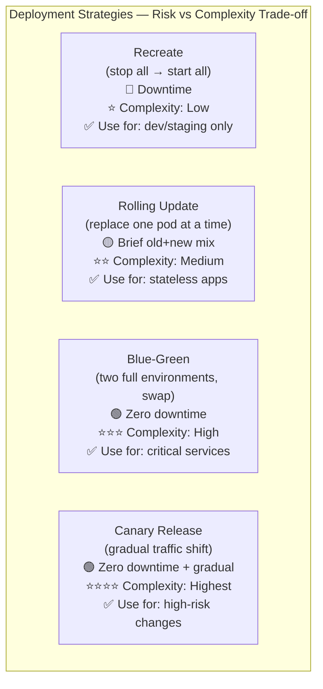
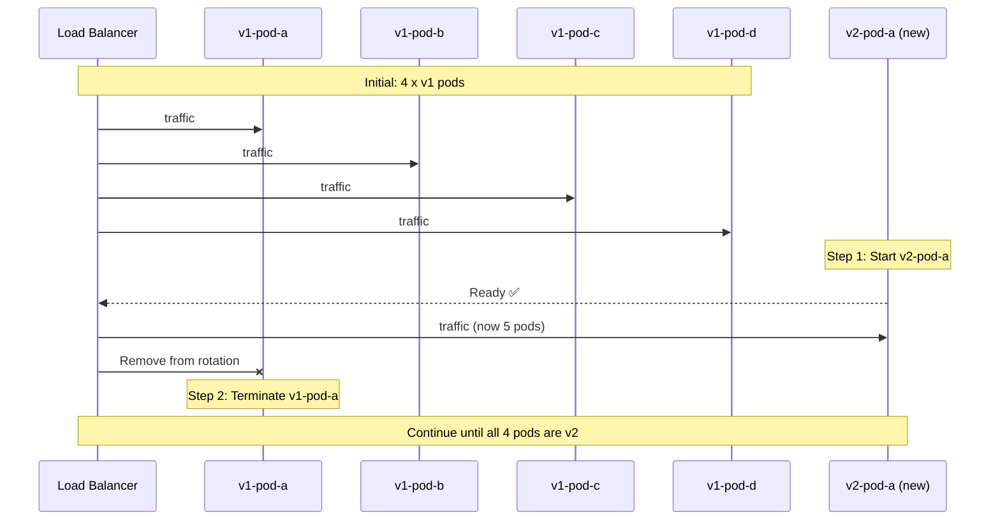
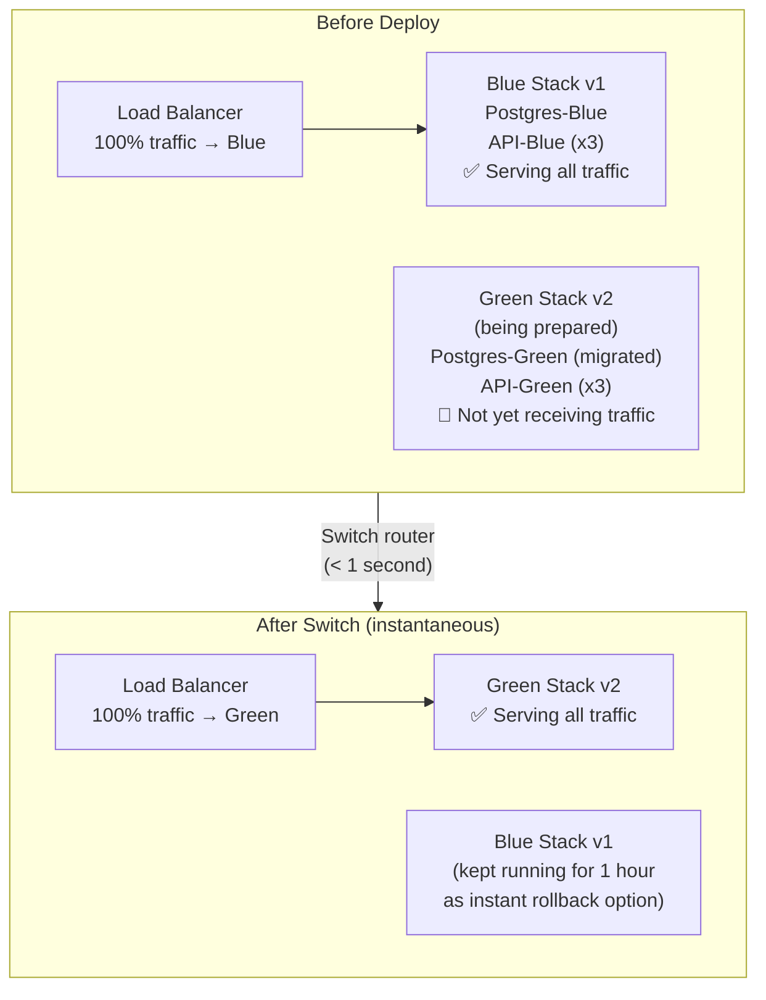
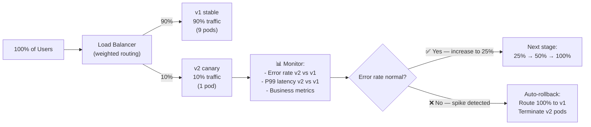

# Deployment Strategy က ဘaလို့ အရေးကြီးတာလဲ

Software တွေကို deploy လုပ်တဲ့ ပုံစံက သင့်ရဲ့ user တွေ downtime (ဝန်ဆောင်မှု ရပ်တန့်သွားချိန်) ကြုံရမလားဆိုတာနဲ့၊ အမှားအယွင်းပါလာတဲ့ release တစ်ခုကနေ ဘယ်လောက်မြန်မြန် ပြန်လည် ကုစားနိုင်မလဲဆိုတာကို တိုက်ရိုက် သတ်မှတ်ပေးပါတယ်။ "ဟောင်းတာရပ်၊ အသစ်တာစ" ဆိုတဲ့ ရိုးရှင်းတဲ့ (naive) နည်းလမ်းက deploy လုပ်တိုင်း ဒုတိယပိုင်းကနေ မိနစ်ပိုင်းအထိ downtime ဖြစ်စေပါတယ်။ Production စနစ်တွေမှာဆိုရင် deploy လုပ်တာကို user တွေ မသိသာစေမယ့် ဆန်းပြားတဲ့ routing နည်းလမ်းတွေ လိုအပ်ပါတယ်။



---

## Strategy 1: Recreate (အားလုံးရပ်၊ အားလုံးစ)

အရိုးရှင်းဆုံး နည်းလမ်းပါ — container ဟောင်း အားလုံးကို ရပ်လိုက်ပြီး၊ container အသစ် အားလုံးကို ပြန်စတာပါ။ Production အတွက် မသင့်တော်ပါဘူး။

```yaml
# In Kubernetes
spec:
  strategy:
    type: Recreate   # Stop all old pods, then start all new pods
```

```
Timeline:
T=0:00  Deployment starts
T=0:05  All old pods (v1) terminated  ← ❌ SERVICE DOWN
T=0:30  New pods (v2) starting up
T=0:45  New pods pass health checks   ← Service back up
```

**ဘယ်နေရာတွေမှာ သုံးမလဲ**: Development (ဆော့ဖ်ဝဲရေးဆွဲရာ နေရာများ)၊ Production မဟုတ်သော ပတ်ဝန်းကျင်များ၊ နဲ့ ဗားရှင်းနှစ်ခုကို တစ်ပြိုင်နက် မrun နိုင်တဲ့ job တွေ (ဥပမာ - exclusive locks နဲ့ database migrations တွေလိုမျိုး) မှာသာ သုံးပါ။

---

## Strategy 2: Rolling Update (Kubernetes ရဲ့ မူလသတ်မှတ်ချက်)

Kubernetes က pod တွေ တစ်ခုချင်းစီ (သို့မဟုတ် အနည်းငယ်စီ) ကို အစားထိုးသွားပါတယ်။ Rollout လုပ်နေစဉ်အတွင်း ဗားရှင်းဟောင်းနဲ့ အသစ် နှစ်ခုစလုံးက traffic ကို တစ်ပြိုင်နက် လက်ခံဆောင်ရွက်ပေးပါတယ် — ဒါက အဓိက ကျတဲ့ အချက်ပဲ ဖြစ်ပါတယ်။

```yaml
# Kubernetes Deployment with rolling update config
apiVersion: apps/v1
kind: Deployment
metadata:
  name: my-api
spec:
  replicas: 4
  strategy:
    type: RollingUpdate
    rollingUpdate:
      maxSurge: 1          # At most 1 extra pod above desired count during rollout
      maxUnavailable: 0    # No pods can be unavailable (zero-downtime guarantee)
      # With 4 replicas, maxSurge=1, maxUnavailable=0:
      # Start 1 new pod (now 5 running) → terminate 1 old (back to 4) → repeat
```



**ကန့်သတ်ချက်**: Rolling update လုပ်နေစဉ်အတွင်း သင့် app ရဲ့ ဗားရှင်းဟောင်းနဲ့ အသစ်ဟာ traffic ကို တစ်ပြိုင်နက် ကိုင်တွယ်နေမှာ ဖြစ်ပါတယ်။ ဒါကြောင့် သင့်ရဲ့ ဗားရှင်းအသစ်ဟာ လက်ရှိ database schema နဲ့ **နောက်ပြန် ကိုက်ညီမှု (backward-compatible) ရှိရပါမယ်**။ Migration တစ်ခုထဲမှာ column အမည်ကို ပြောင်းလဲပြီး တစ်ခါတည်း deploy လုပ်လို့ မရပါဘူး။

### Rolling Update Best Practice: နောက်ပြန် ကိုက်ညီသော Migrations (Backward-Compatible Migrations)

```sql
-- Bad: rename column in one shot (v2 expects 'email' but v1 is still running with 'email_address')
ALTER TABLE users RENAME COLUMN email_address TO email;

-- Good: expand-contract migration over multiple deploys
-- Step 1 (deploy v1.1): Add new column, populate it, both columns exist
ALTER TABLE users ADD COLUMN email VARCHAR(255);
UPDATE users SET email = email_address;

-- Step 2 (deploy v1.2 — after v1.1 is fully rolled out): app uses 'email'
-- Both columns still exist during rolling update

-- Step 3 (deploy v1.3 — after v1.2 is stable): drop old column
ALTER TABLE users DROP COLUMN email_address;
```

---

## Strategy 3: Blue-Green Deployment

ပြီးပြည့်စုံပြီး တူညီတဲ့ ပတ်ဝန်းကျင် နှစ်ခုကို ဘေးချင်းယှဉ် run ထားပါတယ် — "Blue" (လက်ရှိ production) နဲ့ "Green" (ဗားရှင်းအသစ်) တို့ ဖြစ်ပါတယ်။ Load balancer သို့မဟုတ် DNS switch ကနေ traffic အားလုံးကို Blue ကနေ Green ဆီ တစ်ခဏချင်း ပြောင်းပေးလိုက်ပါတယ်။



### Docker Compose ဖြင့် Blue-Green လုပ်ဆောင်ခြင်း

```bash
# Current production: "blue" stack running on port 3000
COMPOSE_PROJECT_NAME=myapp-blue docker compose \
  -f docker-compose.yml -f docker-compose.prod.yml \
  up -d

# Step 1: Start the "green" stack (new version) on a different port
IMAGE_TAG=v2.0.0 COMPOSE_PROJECT_NAME=myapp-green docker compose \
  -f docker-compose.yml -f docker-compose.prod.yml \
  up -d

# Step 2: Run migrations (green's DB before switching traffic)
docker compose -p myapp-green exec api npx prisma migrate deploy

# Step 3: Verify green is healthy
curl http://localhost:3001/health
# {"status":"ok","version":"2.0.0"}

# Step 4: Switch nginx to point to green (atomic — < 1 second of disruption)
# Update nginx upstream to point to green, then reload
sed -i 's/myapp-blue-api-1:3000/myapp-green-api-1:3000/' /etc/nginx/conf.d/default.conf
nginx -s reload

# Step 5: Monitor for 30 minutes. If OK, tear down blue
COMPOSE_PROJECT_NAME=myapp-blue docker compose down

# Step 5 (ROLLBACK): If green is bad, switch back to blue instantly
sed -i 's/myapp-green-api-1:3000/myapp-blue-api-1:3000/' /etc/nginx/conf.d/default.conf
nginx -s reload
COMPOSE_PROJECT_NAME=myapp-green docker compose down
```

**ကုန်ကျစရိတ်**: Blue-Green က switch လုပ်တဲ့ အချိန်အတွင်း infrastructure နှစ်ဆ (servers/pods 2 ဆ) လိုအပ်ပါတယ်။ ဒါကြောင့် သေးငယ်တဲ့ app တွေထက် အဓိကကျပြီး အသုံးပြုသူများတဲ့ critical services တွေမှာ ပိုပြီး အသုံးပြုကြပါတယ်။

---

## Strategy 4: Canary Release (အဆင့်ချင်းပြောင်း Traffic လွှဲခြင်း)

Canary release က တကယ့် user traffic ရဲ့ ရာခိုင်နှုန်း အနည်းငယ်ကို ဗားရှင်းအသစ်ဆီ ပို့ပေးပါတယ်။ Metrics တွေ အကောင်းဘက်က ရပ်တည်နေရင် traffic ကို တဖြည်းဖြည်း တိုးမြှင့်ပေးပါတယ်။ အမှားအယွင်း (errors) တွေ သိသိသာသာ တက်လာခဲ့ရင်တော့ release ကို အလိုအလျောက် ရပ်တန့်ပစ်လိုက်ပါတယ်။

မိုင်းတွင်းထဲ လွှတ်တဲ့ "canary ငှက်ငယ်" ကို အစွဲပြုပြီး မှည့်ခေါ်ထားတာပါ — အန္တရာယ်ကို အစောတလျင် သိရှိနိုင်ဖို့အတွက် အကန့်အသတ်နဲ့ စမ်းသပ်တာ ဖြစ်ပါတယ်။



### Argo Rollouts ဖြင့် Kubernetes တွင် Canary ပြုလုပ်ခြင်း

```yaml
# Install: kubectl apply -f https://github.com/argoproj/argo-rollouts/releases/latest/download/install.yaml

apiVersion: argoproj.io/v1alpha1
kind: Rollout
metadata:
  name: my-api
spec:
  replicas: 10
  strategy:
    canary:
      # Gradual traffic steps
      steps:
        - setWeight: 5     # Send 5% to canary
        - pause: { duration: 5m }   # Wait and observe metrics
        - setWeight: 20
        - pause: { duration: 10m }
        - setWeight: 50
        - pause: { duration: 10m }
        - setWeight: 100   # Full rollout

      # Automatic analysis: abort if error rate spikes
      analysis:
        templates:
          - templateName: success-rate
        startingStep: 1
        args:
          - name: service-name
            value: my-api-canary

---
# AnalysisTemplate: define what "success" means
apiVersion: argoproj.io/v1alpha1
kind: AnalysisTemplate
metadata:
  name: success-rate
spec:
  args:
    - name: service-name
  metrics:
    - name: success-rate
      interval: 1m
      successCondition: result[0] >= 0.95   # 95%+ success rate required
      failureLimit: 3                         # Abort after 3 consecutive failures
      provider:
        prometheus:
          address: http://prometheus:9090
          query: |
            sum(rate(http_requests_total{
              service="{{args.service-name}}",
              status_code!~"5.*"
            }[5m])) 
            / 
            sum(rate(http_requests_total{
              service="{{args.service-name}}"
            }[5m]))
```

### Docker Compose ဖြင့် Canary ပြုလုပ်ခြင်း (Simple Nginx Weighted Upstream)

```nginx
# nginx.conf
upstream api_backend {
    server myapp-blue-api:3000 weight=9;   # 90% to v1
    server myapp-green-api:3000 weight=1;  # 10% to v2
    keepalive 32;
}
```

```bash
# Gradually increase weight as confidence grows
# Edit nginx.conf: weight=7 / weight=3
nginx -s reload

# Monitor error rates
docker compose logs green-api | grep "status=5" | wc -l

# If OK: 50/50, then 100% green
# If errors: revert to 100% blue instantly
```

---

## Feature Flags: Release မလုပ်ဘဲ Deploy လုပ်ခြင်း

Feature flags က deployment နဲ့ release ကို ခွဲထုတ်ပေးပါတယ် — ကုဒ်တွေက production ထৈ ရောက်သွားပေမယ့် user အများစုအတွက်တော့ "ပိတ်ထား" ပါတယ်။

```typescript
// Feature flag check using environment variable
if (process.env.FEATURE_NEW_CHECKOUT === 'true') {
  return <NewCheckout />;
}
return <OldCheckout />;

// Or with a feature flag service (LaunchDarkly, Unleash, Flagsmith)
const showNewCheckout = await featureFlags.isEnabled('new-checkout', {
  userId: user.id,
  rolloutPercentage: 10,  // Show to 10% of users
});
```

**အကျိုးကျေးဇူးများ**:
- User တွေ ချက်ချင်း မမြင်ရသေးတဲ့ code တွေကို deploy လုပ်နိုင်ခြင်း (တဖြည်းဖြည်းချင်း ပြသခြင်း)
- ထပ်ပြီး deploy လုပ်စရာ မလိုဘဲ အလုပ်မဖြစ်တဲ့ feature တစ်ခုကို ချက်ချင်း ပိတ်ပစ်နိုင်ခြင်း (kill switch)
- A/B testing ပြုလုပ်နိုင်ခြင်း: user တွေရဲ့ 50% ကို v1 ပြပြီး ကျန် 50% ကို v2 ပြကာ conversion ကို တိုင်းတာနိုင်ခြင်း

---

## သင့်လျော်သော နည်းလမ်းကို ရွေးချယ်ခြင်း

| Strategy | Downtime | Rollback speed | Infrastructure cost | Right for |
|---------|---------|---------------|---------------------|-----------|
| **Recreate** | မိနစ်ပိုင်း | မိနစ်ပိုင်း | နည်းပါးသည် | Dev/staging သက်သက် |
| **Rolling Update** | မရှိပါ (maxUnavailable=0 ဖြစ်လျှင်) | ~၅ မိနစ် | အပို မလိုပါ | K8s workloads အများစု |
| **Blue-Green** | မရှိပါ | < ၁ စက္ကန့် | အကူးအပြောင်းတွင် ၂ ဆ | Traffic များပြီး အရေးကြီးသော services များ |
| **Canary** | မရှိပါ | အလိုအလျောက် | အနည်းငယ် ပိုကုန်ကျ | အန္တရာယ်များသော feature အပြောင်းအလဲများ |
| **Feature Flags** | မရှိပါ | ချက်ချင်း | အပို မလိုပါ | မည်သည့်အဖွဲ့ సైઝမဆို |

---

## Deployment အမျိုးအစားအလိုက် Database Migration ဗျူဟာများ

| Migration type | Rolling Update | Blue-Green | Canary |
|---------------|---------------|-----------|--------|
| **Add a new table** | ✅ လုံခြုံသည် (backward-compatible) | ✅ | ✅ |
| **Add a nullable column** | ✅ လုံခြုံသည် | ✅ | ✅ |
| **Add a non-null column (with default)** | ✅ လုံခြုံသည် | ✅ | ✅ |
| **Remove a column** | ❌ Expand-contract လိုအပ်သည် | ✅ (v1 ပိတ်ထားသည်) | ⚠️ Deploy ၃ ခါ လုပ်ရန်လိုသည် |
| **Rename a column** | ❌ Expand-contract လိုအပ်သည် | ✅ (v1 ပိတ်ထားသည်) | ⚠️ Deploy ၃ ခါ လုပ်ရန်လိုသည် |
| **Rewrite data format** | ❌ Expand-contract လိုအပ်သည် | ✅ (v1 ပိတ်ထားသည်) | ⚠️ ရှုပ်ထွေးသည် |

---

## အနှစ်ချုပ်

Deployment strategy ဆိုတာ CI/CD စနစ်တစ်ခုမှာ အရေးအကြီးဆုံး architectural ဆုံးဖြတ်ချက်တွေထဲက တစ်ခု ဖြစ်ပါတယ်-
- **Recreate**: ရိုးရှင်းပေမယ့် downtime ဖြစ်စေပါတယ် — development မှာပဲ သုံးပါ
- **Rolling Update**: Kubernetes ရဲ့ မူလစနစ်၊ downtime မရှိပါ၊ ဒါပေမယ့် backward-compatible ဖြစ်တဲ့ schema အပြောင်းအလဲတွေ လိုအပ်ပါတယ် (`maxUnavailable=0`)
- **Blue-Green**: traffic ကို တစ်ခဏချင်း ပြောင်းလဲနိုင်ပြီး ချက်ချင်း rollback လုပ်နိုင်ပါတယ်၊ အကူးအပြောင်းကာလမှာ infrastructure နှစ်ဆ လိုအပ်ပါတယ်
- **Canary**: traffic ကို အဆင့်ချင်းပြောင်းလဲပြီး metrics ပေါ်မူတည်၍ အလိုအလျောက် rollback လုပ်နိုင်ပါတယ် (Argo Rollouts) — အန္တရာယ်များတဲ့ အပြောင်းအလဲတွေအတွက် အလွန်လုံခြုံပါတယ်
- **Feature Flags**: deployment နဲ့ release ကို ခွဲထုတ်ပေးပါတယ် — အမှောင်ထဲမှာ ပို့ပြီး တဖြည်းဖြည်းချင်း ဖော်ပြပါ

နောက်သင်ခန်းစာမှာတော့ CI/CD ရဲ့ observability အကြောင်းကို သင်ယူရမှာ ဖြစ်ပါတယ် — pipeline ရဲ့ ကျန်းမာရေး၊ DORA metrics တွေကို ဘယ်လို တိုင်းတာရမလဲ ဆိုတာနဲ့ စဉ်ဆက်မပြတ် တိုးတက်ကောင်းမွန်လာစေရန် dashboards တွေကို ဘယ်လို အသုံးပြုရမလဲဆိုတာတွေကို လေ့လာရမှာ ဖြစ်ပါတယ်။