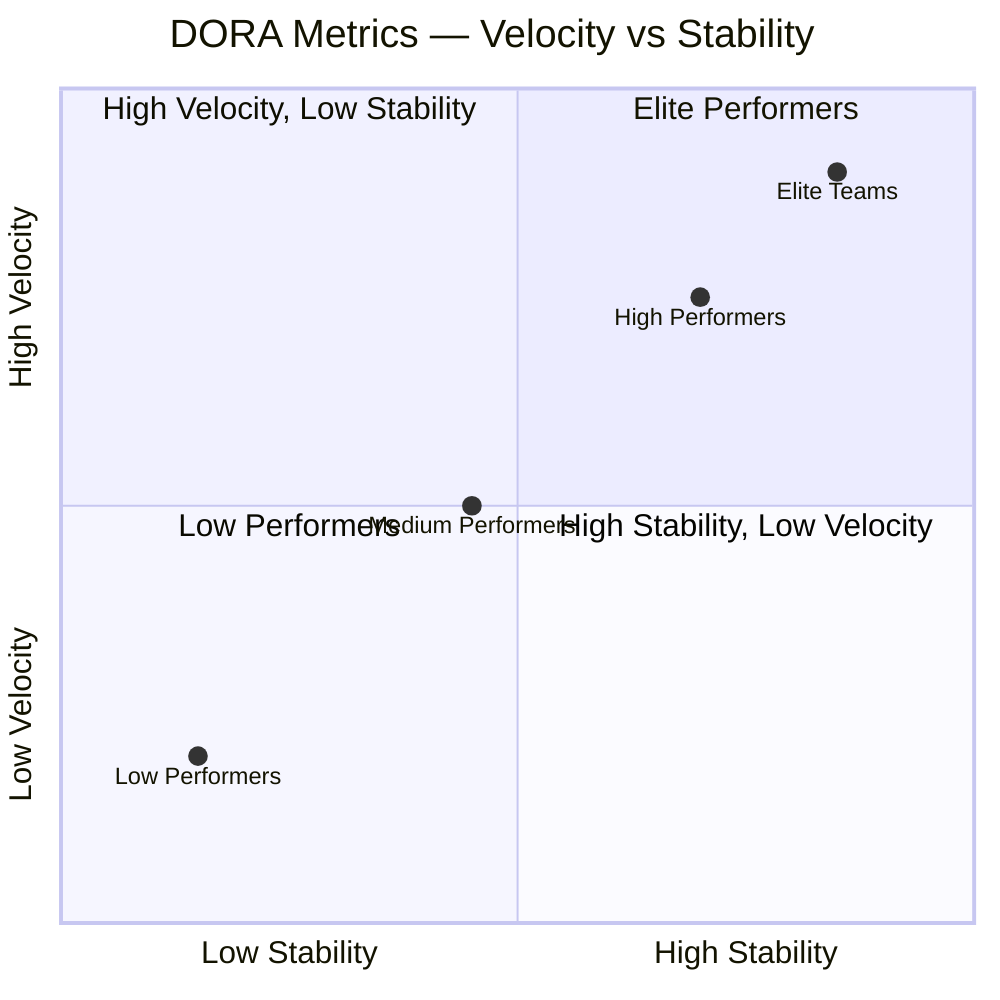
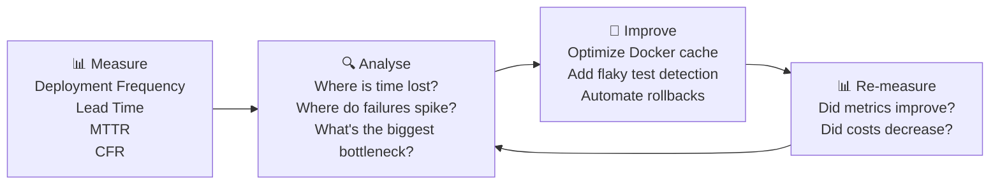

# သင့် Pipeline ကို Production System တစ်ခုကဲ့သို့ ဆက်ဆံခြင်း

သင့်ရဲ့ CI/CD pipeline သာ ကျသွားခဲ့မယ်ဆိုရင် developer ၁၀၀ က code တင်လို့မရတော့ဘဲ လမ်းမှာ ပိတ်ကုန်ပါလိမ့်မယ်။ ဒါပေမဲ့ အသင်းအများစုကတော့ သူတို့ရဲ့ Application ကိုတော့ သေချာ monitor လုပ်ကြပေမဲ့ pipeline ကိုတော့ လုံးဝဥဿုံ လျစ်လျູရှုထားတတ်ကြပါတယ် — critical release တစ်ခုမလုပ်ခင် မနက် ၂ နာရီမှာ pipeline ကျသွားမှသာ အလုအယက် ဖြစ်လာကြပါတော့တယ်။

Elite DevOps အသင်းတွေကတော့ pipeline ကို mission-critical production system တစ်ခုအနေနဲ့ သတ်မှတ်ဆက်ဆံကြပါတယ်: dashboards တွေ တပ်ဆင်တာ၊ alerts တွေ လုပ်ထားတာ၊ SLOs တွေ သတ်မှတ်တာနဲ့ စဉ်ဆက်မပြတ် optimize လုပ်နေတာတွေကို လုပ်ဆောင်ကြပါတယ်။

---

## DORA Metrics: လုပ်ငန်းခွင် Standard တစ်ခု

Google က **DevOps Research and Assessment** (DORA) အသင်းဟာ အင်ဂျင်နီယာအသင်းပေါင်း ထောင်ပေါင်းများစွာကို နှစ်ပေါင်းများစွာ လေ့လာခဲ့ပါတယ်။ သူတို့ဟာ elite (ထူးချွန်တဲ့) အသင်းတွေနဲ့ low performer (စွမ်းဆောင်ရည်နိမ့်တဲ့) အသင်းတွေကို ကွဲပြားစေတဲ့ metrics ၄ ခုကို ဖော်ထုတ်နိုင်ခဲ့ပြီး — ဒီ metrics တွေ တိုးတက်လာတာနဲ့အမျှ လုပ်ငန်းပိုင်းဆိုင်ရာ ရလဒ်တွေပါ တိုက်ရိုက် တိုးတက်လာတယ်ဆိုတာကို သက်သေပြခဲ့ပါတယ်။



### DORA Metrics ၄ ခု

| Metric | တိုင်းတာသည့်အရာ | Elite | Low |
|--------|---------|-------|-----|
| **Deployment Frequency** | Production ကို code ဘယ်လောက်ကြာကြာ ပို့လဲ | တစ်ရက်လျှင် အကြိမ်များစွာ | တစ်လတစ်ကြိမ် (သို့) အောက် |
| **Lead Time for Changes** | Commit လုပ်ချိန်မှ production ရောက်ချိန်အထိ | ၁ နာရီအောက် | ၁ လမှ ၆ လအထိ |
| **Mean Time to Recovery (MTTR)** | ပြဿနာစတွေ့ချိန်မှ service ပြန်ကောင်းသွားချိန်အထိ | ၁ နာရီအောက် | ၁ ပတ်မှ ၁ လအထိ |
| **Change Failure Rate** | ပြဿနာဖြစ်စေတဲ့ deploys နှုန်း (%) | 0 မှ 15% | 46 မှ 60% |

**အဓိက သိရှိရမည့်အချက်**: Velocity (အမြန်နှုန်း) နဲ့ Stability (တည်ငြိမ်မှု) တို့ဟာ ဆန့်ကျင်ဘက်တွေ **မဟုတ်ပါဘူး**။ Elite အသင်းတွေဟာ deployment တွေကို ပိုမိုလုပ်ဆောင်ကြသလို failures (ချို့ယွင်းချက်) လည်း ပိုနည်းပါတယ်။ စေ့စပ်သေချာတဲ့ testing၊ automation နဲ့ batch အရွယ်အစား သေးငယ်မှုတို့က ဒါတွေအားလုံးကို တစ်ပြိုင်နက်တည်း ဖြစ်လာစေပါတယ်။

---

## DORA Metrics များကို ကောက်ယူခြင်း

```bash
# Deployment Frequency — GitHub API မှ ရယူခြင်း
gh api \
  /repos/OWNER/REPO/deployments \
  --jq '[.[] | select(.environment == "production")] | length' \
  -H "Accept: application/vnd.github+json"

# Lead Time — PR merged ဖြစ်ချိန်မှ deployment အထိ
# (commit timestamp → production deployment timestamp)
gh api /repos/OWNER/REPO/pulls \
  --jq '.[] | {number: .number, merged_at: .merged_at, head_sha: .merge_commit_sha}' | \
  head -20

# Change Failure Rate — incidents နှင့် deployments နှိုင်းယှဉ်ခြင်း
INCIDENTS=$(gh api /repos/OWNER/REPO/issues \
  --jq '[.[] | select(.labels[].name == "incident" and (.created_at > "2026-01-01"))] | length')
DEPLOYS=$(gh api /repos/OWNER/REPO/deployments \
  --jq '[.[] | select(.created_at > "2026-01-01")] | length')
echo "CFR: $((INCIDENTS * 100 / DEPLOYS))%"
```

### Four Keys (Google) ဖြင့် Automated DORA ပြုလုပ်ခြင်း

```bash
# Google ၏ open-source DORA metrics tool
git clone https://github.com/GoogleCloudPlatform/fourkeys.git
cd fourkeys

# Cloud Run + BigQuery ဖြင့် deploy လုပ်ခြင်း (GitHub/GitLab/Tekton events များမှ တိုင်းတာသည်)
# Dashboard သည် DORA metrics ၄ ခုစလုံးကို အလိုအလျောက် ဖန်တီးပေးသည်
gcloud run deploy --source . --region us-central1
```

---

## စောင့်ကြည့်ရမည့် အဓိက Pipeline Metrics များ

DORA အပြင်၊ pipeline နဲ့သက်ဆိုင်တဲ့ ဒီ metrics တွေကိုလည်း track လုပ်သင့်ပါတယ်:

### ၁. Build Duration Trend

```yaml
# GitHub Actions: job summaries တွင် build times များကို track လုပ်ရန်
- name: Record build time
  if: always()
  run: |
    BUILD_DURATION=${{ steps.build.outputs.duration || '0' }}
    echo "## Build Metrics" >> $GITHUB_STEP_SUMMARY
    echo "| Metric | Value |" >> $GITHUB_STEP_SUMMARY
    echo "|--------|-------|" >> $GITHUB_STEP_SUMMARY
    echo "| Build Duration | ${BUILD_DURATION}s |" >> $GITHUB_STEP_SUMMARY
    echo "| Image Size | $(docker images myapp --format '{{.Size}}') |" >> $GITHUB_STEP_SUMMARY
    echo "| Cache Hit | ${{ steps.build.outputs.cache-hit }} |" >> $GITHUB_STEP_SUMMARY
```

### ၂. Test Suite Health Dashboard

```yaml
# JUnit test results များကို GitHub သို့ publish လုပ်ရန်
- name: Publish test results
  uses: EnricoMi/publish-unit-test-result-action@v2
  if: always()
  with:
    files: |
      test-results/**/*.xml
      coverage/cobertura-coverage.xml

# သီးသန့် label တစ်ခုသုံး၍ flaky tests များကို track လုပ်ရန်
- name: Report flaky tests
  if: failure()
  run: |
    FAILED_TESTS=$(cat test-results.json | python3 -c "
    import json,sys
    data = json.load(sys.stdin)
    return [t['name'] for t in data['testResults'] if t['status'] == 'failed']")
    
    gh issue create \
      --title "Flaky test detected: ${FAILED_TESTS}" \
      --label "flaky-test,needs-investigation" \
      --body "Pipeline run: $GITHUB_RUN_URL"
```

### ၃. Queue Time Monitoring

CI runners တွေ ပြည့်ကျပ်နေတဲ့အခါ developers တွေဟာ သူတို့ရဲ့ jobs တွေ စတင်မလုပ်ခင် queue ထဲမှာ စောင့်ဆိုင်းရပါတယ်။ ဒီလို မမြင်ရတဲ့ စောင့်ဆိုင်းချိန်တွေက lead time ကို အများကြီး သက်ရောက်နိုင်ပါတယ်:

```yaml
# ကြာမြင့်တဲ့ queue times များကို ရှာဖွေပြီး alert ပို့ရန်
- name: Check queue time
  run: |
    QUEUED_AT="${{ github.event.workflow_run.created_at }}"
    STARTED_AT=$(date -u +%Y-%m-%dT%H:%M:%SZ)
    
    QUEUE_SECONDS=$(( $(date -d "$STARTED_AT" +%s) - $(date -d "$QUEUED_AT" +%s) ))
    
    echo "Queue time: ${QUEUE_SECONDS}s"
    
    if [ $QUEUE_SECONDS -gt 300 ]; then
      # Slack တွင် alert ပို့ရန်: runners များ ပြည့်ကျပ်နေပါသည်
      curl -X POST "${{ secrets.SLACK_WEBHOOK }}" \
        -d "{\"text\":\"⚠️ CI Queue time ${QUEUE_SECONDS}s — consider adding more runners\"}"
    fi
```

---

## Pipeline Observability Dashboard: Grafana + GitHub Actions

ရီးရဲလ်တိုင်းမ် pipeline dashboard တစ်ခုအတွက် GitHub Actions metrics များကို Grafana သို့ export လုပ်ပါ:

```yaml
# .github/workflows/pipeline-metrics.yml
# workflow တိုင်းပြီးဆုံးတိုင်း run ပြီး metrics များကို time-series store သို့ ပို့ပေးသည်
on:
  workflow_run:
    workflows: ["*"]
    types: [completed]

jobs:
  publish-metrics:
    runs-on: ubuntu-latest
    steps:
      - name: Push to InfluxDB
        run: |
          curl -X POST "${{ secrets.INFLUXDB_URL }}/api/v2/write" \
            -H "Authorization: Token ${{ secrets.INFLUXDB_TOKEN }}" \
            -H "Content-Type: text/plain" \
            --data-raw "
          github_workflow,
            repo=${{ github.event.workflow_run.repository.name }},
            workflow=${{ github.event.workflow_run.name }},
            conclusion=${{ github.event.workflow_run.conclusion }}
            duration=$(( $(date -d "${{ github.event.workflow_run.updated_at }}" +%s) - 
                         $(date -d "${{ github.event.workflow_run.created_at }}" +%s) )),
            run_number=${{ github.event.workflow_run.run_number }}
            $(date -u +%s)000000000
          "
```

### Grafana Dashboard Panels

```
Pipeline Dashboard:
┌─────────────────────┬──────────────────────┬───────────────────────┐
│ Deployment Frequency│ Lead Time for Changes │ Change Failure Rate   │
│ 12 deploys/day      │ Avg: 42 minutes       │ 8.3%                 │
│ 📈 trend: +15%      │ 📉 trend: -8 min      │ 📉 trend: -2%        │
├─────────────────────┼──────────────────────┼───────────────────────┤
│ Build Duration (24h)│ Test Pass Rate (7d)  │ Queue Time (24h)      │
│ [line chart]        │ [area chart: 97.8%]  │ [bar chart: avg 45s]  │
└─────────────────────┴──────────────────────┴───────────────────────┘
```

---

## CI Cost Optimization

GitHub Actions က runner-minute ပေါ်မူတည်ပြီး ကုန်ကျစရိတ် ယူပါတယ်။ Optimize မလုပ်ထားတဲ့ pipeline တစ်ခုဟာ ငွေကြေးနဲ့ အချိန်တွေကို အလဟဿ ဖြစ်စေပါတယ်:

```yaml
# push အသစ်လုပ်လာပါက လက်ရှိ run နေသည်များကို cancel လုပ်ရန် (ဟောင်းများကို ဆက်မစောင့်ပါ)
concurrency:
  group: ${{ github.workflow }}-${{ github.ref }}
  cancel-in-progress: true

# PR တိုင်းတွင် မဟုတ်ဘဲ main သို့ push လုပ်မှသာ ကုန်ကျစရိတ်များသော jobs များကို run ရန်
scan-container:
  if: github.ref == 'refs/heads/main'
  ...

# Caching ကို ထိရောက်စွာ အသုံးပြုရန်
- uses: actions/cache@v4
  with:
    path: ~/.npm
    key: ${{ runner.os }}-node-${{ hashFiles('**/package-lock.json') }}
    restore-keys: |
      ${{ runner.os }}-node-

# တစ်ခုပြီးမှတစ်ခုမဟုတ်ဘဲ တူရာ jobs များကို parallel ဖြင့် run ရန်
jobs:
  unit-test:    { ... }
  lint:         { ... }     # unit-test နှင့်အတူ parallel ဖြင့် run သည်
  type-check:   { ... }     # unit-test နှင့် lint တို့နှင့်အတူ parallel ဖြင့် run သည်
  integration:
    needs: [unit-test, lint, type-check]   # သုံးခုစလုံး အောင်မြင်မှသာ run သည်
```

---

## Pipeline Health ကို Alert ပို့ခြင်း

```yaml
# pipeline ကျရှုံးပါက Slack တွင် notification ပို့ရန်
notify-failure:
  needs: [build, test, deploy]
  if: failure()
  runs-on: ubuntu-latest
  steps:
    - uses: slackapi/slack-github-action@v1
      with:
        channel-id: "#ci-alerts"
        payload: |
          {
            "text": "❌ Pipeline failed on `${{ github.ref_name }}`",
            "attachments": [{
              "color": "danger",
              "fields": [
                {"title": "Repository", "value": "${{ github.repository }}", "short": true},
                {"title": "Triggered by", "value": "${{ github.actor }}", "short": true},
                {"title": "Commit", "value": "${{ github.sha }}", "short": true},
                {"title": "Run URL", "value": "${{ github.server_url }}/${{ github.repository }}/actions/runs/${{ github.run_id }}", "short": false}
              ]
            }]
          }
      env:
        SLACK_BOT_TOKEN: ${{ secrets.SLACK_BOT_TOKEN }}
```

---

## စဉ်ဆက်မပြတ် တိုးတက်ကောင်းမွန်လာစေမည့် ယဉ်ကျေးမှုကို တည်ဆောက်ခြင်း

DORA metrics တွေဟာ အင်ဂျင်နီယာပိုင်းဆိုင်ရာ တိုးတက်မှုအတွက် feedback loop တစ်ခုကို ဖန်တီးပေးပါတယ်:



**လက်တွေ့ကျင့်သုံးရမည့် အချိန်ဇယား**:
- **အပတ်စဉ်**: build duration trend နဲ့ flaky test အရေအတွက်တို့ကို ပြန်လည်သုံးသပ်ရန်
- **လစဉ်**: DORA metrics များကို အသင်း၏ ပန်းတိုင်များနှင့် နှိုင်းယှဉ်သုံးသပ်ရန်
- **သုံးလတစ်ကြိမ်**: တိုးတက်မှု ပန်းတိုင်များ သတ်မှတ်ရန် (ဥပမာ - "Lead Time ကို ၄၅ မိနစ်မှ မိနစ် ၂၀ သို့ လျှော့ချရန်")

ရုံးခန်းအတွင်း dashboards တွေမှာ (သို့မဟုတ် weekly standup မှာ) pipeline metrics တွေကို ပြသထားတဲ့အသင်းတွေဟာ တိုးတက်မှုစက်ဝိုင်းကို ပိုမိုထိရောက်စေပါတယ် — Dockerfile cache optimization ကြောင့် Lead Time ၄၅ မိနစ်ကနေ မိနစ် ၂၀ ကို ကျဆင်းသွားတာကို အသင်းက မြင်လိုက်ရတဲ့အခါ နောက်ထပ် တိုးတက်မှုတွေ ဆက်လုပ်ဖို့အတွက် တွန်းအားကောင်း တစ်ခု ဖြစ်လာစေပါတယ်။

---

## အကျဉ်းချုပ်

Observable ဖြစ်တဲ့ CI/CD pipelines တွေကို တိုင်းတာနိုင်တယ်၊ alert ပို့နိုင်တယ်၊ စဉ်ဆက်မပြတ် တိုးတက်အောင် လုပ်ဆောင်နိုင်ပါတယ်:
- **DORA metrics** (Deployment Frequency, Lead Time, MTTR, Change Failure Rate) တွေဟာ DevOps ကျန်းမာရေးအတွက် industry-standard KPIs တွေဖြစ်ပါတယ် — elite အသင်းတွေဟာ deployment တွေကို မကြာခဏ လုပ်ဆောင်ကြသလို failure နှုန်းလည်း နည်းပါးကြပါတယ်
- **build duration trend** (cache ကျဆင်းခြင်း), **queue time** (runner ပြည့်ကျပ်ခြင်း) နဲ့ **flaky test rate** (pipeline ယုံကြည်စိတ်ချရမှု) တို့ကို စောင့်ကြည့်ပါ
- Metrics များကို **InfluxDB + Grafana** သို့ export လုပ်ပါ (သို့မဟုတ်) အလိုအလျောက် DORA dashboards အတွက် **Google Four Keys** ကို အသုံးပြုပါ
- push အသစ်လုပ်လာပါက run နေဆဲများကို **cancel-in-progress** လုပ်ပါ၊ သီးသန့် jobs များကို **parallel** ဖြင့် run ပါ၊ PR များတွင် ကုန်ကျစရိတ်များသော scan များကို ကျော်သွားရန် **conditional job execution** ကို အသုံးပြုပါ
- အပြည့်အစုံ context (repo, commit, actor, run URL) တွေပါတဲ့ **Slack** မှတဆင့် failures များကို alert ပို့ပါ
- သုံးလတစ်ကြိမ် တိုးတက်မှုစက်ဝိုင်းကို မောင်းနှင်ရန် DORA metrics များကို အသုံးပြုပါ — measure → analyse → improve → re-measure
- နောက်သင်ခန်းစာမှာတော့ rollback strategies နဲ့ incident automation အကြောင်းကို လေ့လာရမှာဖြစ်ပါတယ် — production failures တွေဖြစ်လာတဲ့အခါ နာရီပေါင်းများစွာ စောင့်စရာမလိုဘဲ စက္ကန့်ပိုင်းအတွင်း ဘwie ပြန်လည်ကုစားရမလဲဆိုတာကို လေ့လာရပါမယ်။