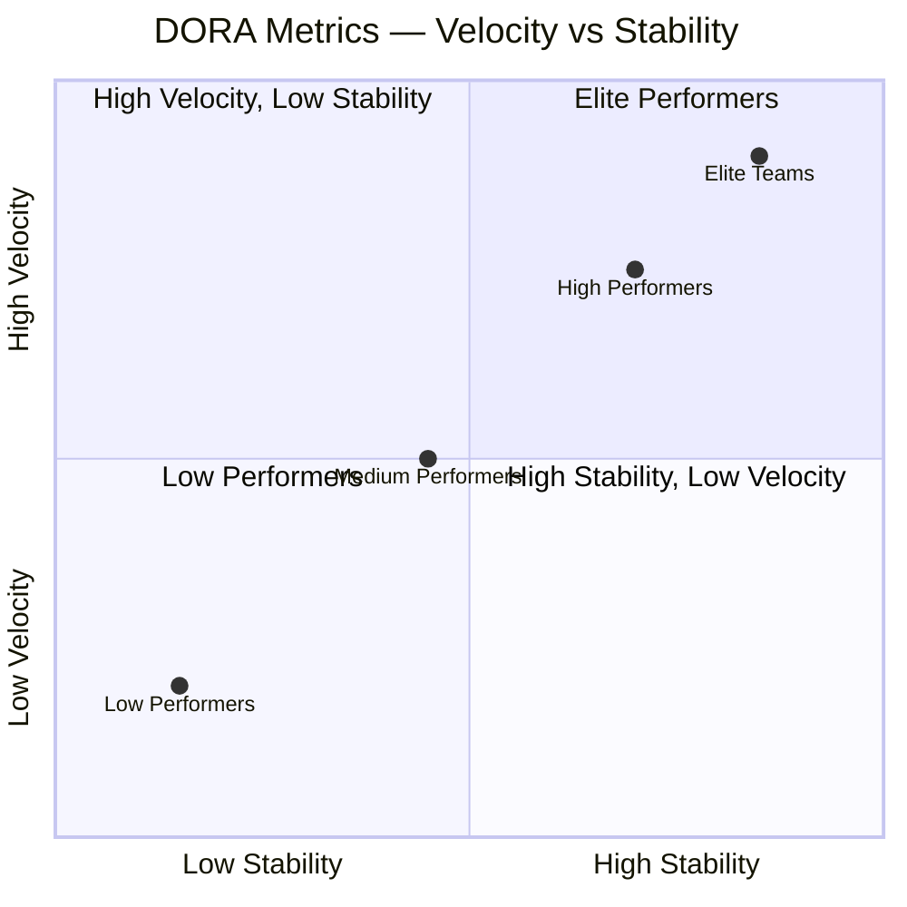
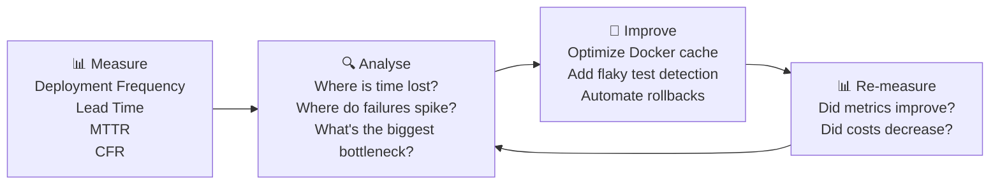

# သင့်ရဲ့ Pipeline ကို Production System တစ်ခုလို သဘောထားခြင်း

အကယ်၍ သင့်ရဲ့ CI/CD pipeline ပျက်သွားခဲ့မယ်ဆိုရင် developer ၁၀၀ ဟာ ကုဒ်တွေကို production တင်ဖို့အတွက် တားဆီးခံထားရပါလိမ့်မယ်။ ဒါပေမဲ့ အသင်းအများစုကတော့ သူတို့ရဲ့ application ကို သေချာစောင့်ကြည့် (monitor) ကြပေမဲ့ pipeline ကိုတော့ လုံးဝဥဿုံ လျစ်လျူရှုထားကြပါတယ် — အရေးကြီးတဲ့ release တစ်ခုမလုပ်ခင် မနက် ၂ နာရီမှာ pipeline ပြိုကျမှသာ သတိရတတ်ကြပါတယ်။

ထူးချွန်တဲ့ DevOps အသင်းတွေကတော့ pipeline ကို အရေးအကြီးဆုံး production system တစ်ခုအနေနဲ့ သဘောထားကြပါတယ်: dashboard တွေ၊ alert တွေ၊ SLO တွေနဲ့ စဉ်ဆက်မပြတ် တိုးတက်အောင် လုပ်ဆောင်မှု (continuous optimization) တွေ ထည့်သွင်းထားကြပါတယ်။

---

## DORA Metrics: လုပ်ငန်းသုံး စံနှုန်း

Google မှ **DevOps Research and Assessment** (DORA) အသင်းဟာ အင်ဂျင်နီယာအသင်းပေါင်း ထောင်ပေါင်းများစွာကို နှစ်ပေါင်းများစွာ လေ့လာခဲ့ပါတယ်။ သူတို့ဟာ ထူးချွန်တဲ့အသင်းတွေနဲ့ စွမ်းဆောင်ရည်ညံ့တဲ့အသင်းတွေကို ကိန်းဂဏန်းအချက်အလက်အရ ခွဲခြားပေးနိုင်တဲ့ metric ၄ ခုကို ဖော်ထုတ်ခဲ့ပြီး — ဒီ metric တွေကို တိုးမြှင့်ခြင်းဟာ လုပ်ငန်းရဲ့ ရလဒ်တွေကိုပါ တိုက်ရိုက် တိုးတက်စေတယ်ဆိုတာကို သက်သေပြခဲ့ပါတယ်။



### DORA Metrics ၄ ခု

| Metric | တိုင်းတာသည်မှာ | ထူးချွန် (Elite) | ညံ့ဖျင်း (Low) |
|--------|---------|-------|-----|
| **Deployment Frequency (ဖြန့်ချိမှု အကြိမ်ရေ)** | ကုဒ်တွေကို production ကို ဘလောက်မကြာခဏ တင်သလဲ | တစ်ရက်လျှင် အကြိမ်များစွာ | တစ်လလျှင် တစ်ကြိမ် (သို့) အောက် |
| **Lead Time for Changes (ပြောင်းလဲမှုအတွက် ကြာချိန်)** | Commit လုပ်ချိန် → production ရောက်ချိန် | ၁ နာရီအောက် | ၁ လ မှ ၆ လ |
| **Mean Time to Recovery / MTTR (ပြန်လည်ကောင်းမွန်ရန် ကြာချိန်)** | ပြဿနာစတင်တွေ့ရှိချိန် → ဝန်ဆောင်မှု ပြန်လည်စတင်နိုင်ချိန် | ၁ နာရီအောက် | ၁ ပတ် မှ ၁ လ |
| **Change Failure Rate (အပြောင်းအလဲကြောင့် ပျက်စီးမှုနှုန်း)** | ပြဿနာဖြစ်စေသော deploy များ၏ ရာခိုင်နှုန်း | ၀ မှ ၁၅% | ၄၆ မှ ၆၀% |

**အဓိက တွေ့ရှိချက်**: အရှိန်အဟုန် (Velocity) နဲ့ တည်ငြိမ်မှု (Stability) တို့ဟာ ဆန့်ကျင်ဘက်တွေ **မဟုတ်ပါဘူး**။ ထူးချွန်တဲ့အသင်းတွေဟာ ပိုပြီး မကြာခဏ deploy လုပ်ကြသလို ချို့ယွင်းချက်လည်း ပိုနည်းပါတယ်။ စေ့စပ်သေချာတဲ့ စမ်းသပ်မှုတွေ၊ အလိုအလျောက်လုပ်ဆောင်မှုတွေ (automation) နဲ့ အသုတ်လိုက်ငယ်တွေ (small batch sizes) က အဲဒီနှစ်ခုစလုံးကို တစ်ပြိုင်နက်တည်း လုပ်ဆောင်နိုင်စေပါတယ်။

---

## DORA Metrics များကို စုဆောင်းခြင်း

```bash
# Deployment Frequency — from GitHub API
gh api \
  /repos/OWNER/REPO/deployments \
  --jq '[.[] | select(.environment == "production")] | length' \
  -H "Accept: application/vnd.github+json"

# Lead Time — from PR merged to deployment
# (commit timestamp → production deployment timestamp)
gh api /repos/OWNER/REPO/pulls \
  --jq '.[] | {number: .number, merged_at: .merged_at, head_sha: .merge_commit_sha}' | \
  head -20

# Change Failure Rate — incidents vs deployments
INCIDENTS=$(gh api /repos/OWNER/REPO/issues \
  --jq '[.[] | select(.labels[].name == "incident" and (.created_at > "2026-01-01"))] | length')
DEPLOYS=$(gh api /repos/OWNER/REPO/deployments \
  --jq '[.[] | select(.created_at > "2026-01-01")] | length')
echo "CFR: $((INCIDENTS * 100 / DEPLOYS))%"
```

### Four Keys (Google) ဖြင့် အလိုအလျောက် DORA တိုင်းတာခြင်း

```bash
# Google's open-source DORA metrics tool
git clone https://github.com/GoogleCloudPlatform/fourkeys.git
cd fourkeys

# Deploy with Cloud Run + BigQuery (measures from GitHub/GitLab/Tekton events)
# Dashboard auto-generate all four DORA metrics
gcloud run deploy --source . --region us-central1
```

---

## စောင့်ကြည့်ရမည့် အဓိက Pipeline Metrics များ

DORA အပြင်၊ ဤ pipeline နှင့် သက်ဆိုင်သော metric များကိုလည်း ခြေရာခံပါ:

### ၁။ Build Duration Trend (တည်ဆောက်ချိန် ကြာမြင့်မှု လမ်းကြောင်း)

```yaml
# GitHub Actions: track build times in job summaries
- name: Record build time
  if: always()
  run: |
    BUILD_DURATION=${{ steps.build.outputs.duration || '0' }}
    echo "## Build Metrics" >> $GITHUB_STEP_SUMMARY
    echo "| Metric | Value |" >> $GITHUB_STEP_SUMMARY
    echo "|--------|-------|" >> $GITHUB_STEP_SUMMARY
    echo "| Build Duration | ${BUILD_DURATION}s |" >> $GITHUB_STEP_SUMMARY
    echo "| Image Size | $(docker images myapp --format '{{.Size}}') |" >> $GITHUB_STEP_SUMMARY
    echo "| Cache Hit | ${{ steps.build.outputs.cache-hit }} |" >> $GITHUB_STEP_SUMMARY
```

### ၂။ Test Suite Health Dashboard

```yaml
# Publish JUnit test results to GitHub
- name: Publish test results
  uses: EnricoMi/publish-unit-test-result-action@v2
  if: always()
  with:
    files: |
      test-results/**/*.xml
      coverage/cobertura-coverage.xml

# Track flaky tests with a dedicated label
- name: Report flaky tests
  if: failure()
  run: |
    FAILED_TESTS=$(cat test-results.json | python3 -c "
    import json,sys
    data = json.load(sys.stdin)
    return [t['name'] for t in data['testResults'] if t['status'] == 'failed']")
    
    gh issue create \
      --title "Flaky test detected: ${FAILED_TESTS}" \
      --label "flaky-test,needs-investigation" \
      --body "Pipeline run: $GITHUB_RUN_URL"
```

### ၃။ Queue Time Monitoring (တန်းစီစောင့်ဆိုင်းချိန် စောင့်ကြည့်ခြင်း)

CI runner တွေ ပြည့်နေတဲ့အခါ၊ developer တွေရဲ့ job တွေ မစတင်ခင်မှာတင် တန်းစီပြီး စောင့်ဆိုင်းနေရပါတယ်။ ဒီမမြင်ရတဲ့ စောင့်ဆိုင်းချိန်ဟာ lead time ကို ကြီးမားစွာ လွှမ်းမိုးသွားနိုင်ပါတယ်:

```yaml
# Detect long queue times and alert
- name: Check queue time
  run: |
    QUEUED_AT="${{ github.event.workflow_run.created_at }}"
    STARTED_AT=$(date -u +%Y-%m-%dT%H:%M:%SZ)
    
    QUEUE_SECONDS=$(( $(date -d "$STARTED_AT" +%s) - $(date -d "$QUEUED_AT" +%s) ))
    
    echo "Queue time: ${QUEUE_SECONDS}s"
    
    if [ $QUEUE_SECONDS -gt 300 ]; then
      # Alert on Slack: runners are saturated
      curl -X POST "${{ secrets.SLACK_WEBHOOK }}" \
        -d "{\"text\":\"⚠️ CI Queue time ${QUEUE_SECONDS}s — consider adding more runners\"}"
    fi
```

---

## Pipeline Observability Dashboard: Grafana + GitHub Actions

အချိန်နှင့်တပြေးညီ pipeline dashboard တစ်ခုရရှိရန် GitHub Actions metrics များကို Grafana သို့ ပို့ဆောင်ပါ:

```yaml
# .github/workflows/pipeline-metrics.yml
# Runs after every workflow and pushes metrics to a time-series store
on:
  workflow_run:
    workflows: ["*"]
    types: [completed]

jobs:
  publish-metrics:
    runs-on: ubuntu-latest
    steps:
      - name: Push to InfluxDB
        run: |
          curl -X POST "${{ secrets.INFLUXDB_URL }}/api/v2/write" \
            -H "Authorization: Token ${{ secrets.INFLUXDB_TOKEN }}" \
            -H "Content-Type: text/plain" \
            --data-raw "
          github_workflow,
            repo=${{ github.event.workflow_run.repository.name }},
            workflow=${{ github.event.workflow_run.name }},
            conclusion=${{ github.event.workflow_run.conclusion }}
            duration=$(( $(date -d "${{ github.event.workflow_run.updated_at }}" +%s) - 
                         $(date -d "${{ github.event.workflow_run.created_at }}" +%s) )),
            run_number=${{ github.event.workflow_run.run_number }}
            $(date -u +%s)000000000
          "
```

### Grafana Dashboard Panels

```
Pipeline Dashboard:
┌─────────────────────┬──────────────────────┬───────────────────────┐
│ Deployment Frequency│ Lead Time for Changes │ Change Failure Rate   │
│ 12 deploys/day      │ Avg: 42 minutes       │ 8.3%                 │
│ 📈 trend: +15%      │ 📉 trend: -8 min      │ 📉 trend: -2%        │
├─────────────────────┼──────────────────────┼───────────────────────┤
│ Build Duration (24h)│ Test Pass Rate (7d)  │ Queue Time (24h)      │
│ [line chart]        │ [area chart: 97.8%]  │ [bar chart: avg 45s]  │
└─────────────────────┴──────────────────────┴───────────────────────┘
```

---

## CI ကုန်ကျစရိတ်များကို ပိုမိုကောင်းမွန်အောင် လုပ်ဆောင်ခြင်း (CI Cost Optimization)

GitHub Actions က runner-minute အပေါ်မူတည်ပြီး ကောက်ခံပါတယ်။ အကောင်းဆုံး မလုပ်ဆောင်ထားတဲ့ pipeline တစ်ခုဟာ ငွေကြေးနဲ့ အချိန်တွေကို လေလွင့်စေပါတယ်:

```yaml
# Cancel in-progress runs on new push (don't wait for old jobs)
concurrency:
  group: ${{ github.workflow }}-${{ github.ref }}
  cancel-in-progress: true

# Only run expensive jobs on push to main, not on every PR
scan-container:
  if: github.ref == 'refs/heads/main'
  ...

# Use caching aggressively
- uses: actions/cache@v4
  with:
    path: ~/.npm
    key: ${{ runner.os }}-node-${{ hashFiles('**/package-lock.json') }}
    restore-keys: |
      ${{ runner.os }}-node-

# Run independent jobs in parallel (not sequential)
jobs:
  unit-test:    { ... }
  lint:         { ... }     # Runs in parallel with unit-test
  type-check:   { ... }     # Runs in parallel with unit-test and lint
  integration:
    needs: [unit-test, lint, type-check]   # Only after all three pass
```

---

## Pipeline ကျန်းမာရေးအတွက် သတိပေးချက်များ ထည့်သွင်းခြင်း (Alerting)

```yaml
# Slack notification on pipeline failure
notify-failure:
  needs: [build, test, deploy]
  if: failure()
  runs-on: ubuntu-latest
  steps:
    - uses: slackapi/slack-github-action@v1
      with:
        channel-id: "#ci-alerts"
        payload: |
          {
            "text": "❌ Pipeline failed on `${{ github.ref_name }}`",
            "attachments": [{
              "color": "danger",
              "fields": [
                {"title": "Repository", "value": "${{ github.repository }}", "short": true},
                {"title": "Triggered by", "value": "${{ github.actor }}", "short": true},
                {"title": "Commit", "value": "${{ github.sha }}", "short": true},
                {"title": "Run URL", "value": "${{ github.server_url }}/${{ github.repository }}/actions/runs/${{ github.run_id }}", "short": false}
              ]
            }]
          }
      env:
        SLACK_BOT_TOKEN: ${{ secrets.SLACK_BOT_TOKEN }}
```

---

## စဉ်ဆက်မပြတ် တိုးတက်လိုသည့် ယဉ်ကျေးမှုကို တည်ဆောက်ခြင်း

DORA metrics တွေဟာ အင်ဂျင်နီယာပိုင်းဆိုင်ရာ တိုးတက်မှုအတွက် တုံ့ပြန်မှုစက်ဝန်း (feedback loop) တစ်ခုကို ဖန်တီးပေးပါတယ်:



**လက်တွေ့ကျသော အချိန်ဇယား**:
- **အပတ်စဉ် (Weekly)**: build duration လမ်းကြောင်းနဲ့ flaky test အရေအတွက်တို့ကို ပြန်လည်သုံးသပ်ပါ
- **လစဉ် (Monthly)**: အသင်းရဲ့ ပစ်မှတ်တွေနဲ့ DORA metrics များကို နှိုင်းယှဉ်သုံးသပ်ပါ
- **သုံးလတစ်ကြိမ် (Quarterly)**: တိုးတက်ရမည့် ရည်မှန်းချက်များ ချမှတ်ပါ (ဥပမာ - "Lead Time ကို ၄၅ မိနစ်မှ မိနစ် ၂၀ သို့ လျှော့ချရန်")

ရုံးခန်းရှိ dashboard တွေမှာ (သို့မဟုတ် အပတ်စဉ် standup မှာ) pipeline metrics တွေကို ပြသတဲ့ အသင်းတွေဟာ တိုးတက်မှုစက်ဝန်းကို ဂိမ်းတစ်ခုလို ပျော်စရာဖြစ်စေပါတယ် — Dockerfile cache ကို အကောင်းဆုံးလုပ်ဆောင်လိုက်လို့ အသင်းက Lead Time ၄၅ မိနစ်ကနေ မိနစ် ၂၀ ကို ကျဆင်းသွားတာကို တွေ့လိုက်ရတဲ့အခါ၊ အခြားတိုးတက်မှုတွေ ထပ်လုပ်ဖို့အတွက် တွန်းအားသစ်တွေ ဖြစ်လာစေပါတယ်။

---

## အနှစ်ချုပ်

စောင့်ကြည့်စစ်ဆေးနိုင်သော (Observable) CI/CD pipelines များကို တိုင်းတာနိုင်သည်၊ သတိပေးချက်ထုတ်ပေးနိုင်သည်၊ စဉ်ဆက်မပြတ် တိုးတက်အောင် လုပ်ဆောင်နိုင်သည်:
- **DORA metrics** (Deployment Frequency, Lead Time, MTTR, Change Failure Rate) တွေဟာ DevOps ကျန်းမာရေးအတွက် လုပ်ငန်းသုံး စံနှုန်း KPI တွေ ဖြစ်ကြပါတယ် — ထူးချွန်တဲ့အသင်းတွေဟာ မကြာခဏ deploy လုပ်ကြသလို ချို့ယွင်းမှုနှုန်းလည်း နည်းပါးကြပါတယ်
- **build duration trend** (cache ယိုယွင်းလာမှု)၊ **queue time** (runner ပြည့်ကျပ်မှု) နဲ့ **flaky test rate** (pipeline ယုံကြည်စိတ်ချရမှု) တို့ကို စောင့်ကြည့်ပါ
- **InfluxDB + Grafana** သို့ metrics များကို ပို့ပါ (သို့မဟုတ်) အလိုအလျောက် DORA dashboards တွေအတွက် **Google Four Keys** ကို အသုံးပြုပါ
- push အသစ်လုပ်တဲ့အခါ **in-progress run တွေကို ပယ်ဖျက်ပါ (cancel)**၊ သီးခြား job တွေကို **အပြိုင် (parallel)** လုပ်ဆောင်ပါ၊ PR တိုင်းမှာ ကုန်ကျစရိတ်များတဲ့ scan တွေကို ကျော်သွားဖို့ **conditional job execution** ကို အသုံးပြုပါ
- အပြည့်အစုံသော အချက်အလက်များ (repo, commit, actor, run URL) နဲ့တကွ **Slack** မှတစ်ဆင့် ချို့ယွင်းချက်များကို သတိပေးချက် ပို့ပါ
- သုံးလတစ်ကြိမ် တိုးတက်မှုစက်ဝန်းကို မောင်းနှင်ဖို့ DORA metrics များကို အသုံးပြုပါ — တိုင်းတာပါ → ခွဲခြွဲစိတ်ဖြာပါ → တိုးတက်အောင်လုပ်ပါ → ပြန်လည်တိုင်းတာပါ

နောက်သင်ခန်းစာမှာတော့၊ rollback ပြုလုပ်နည်းဗျူဟာတွေနဲ့ incident automation အကြောင်းကို လေ့လာရမှာဖြစ်ပါတယ် — production ချို့ယွင်းချက်တွေကို နာရီပေါင်းများစွာ စောင့်စရာမလိုဘဲ စက္ကန့်ပိုင်းအတွင်း ဘယ်လိုပြန်လည်ကုစားရမလဲဆိုတာကို သင်ယူရမှာ ဖြစ်ပါတယ်။