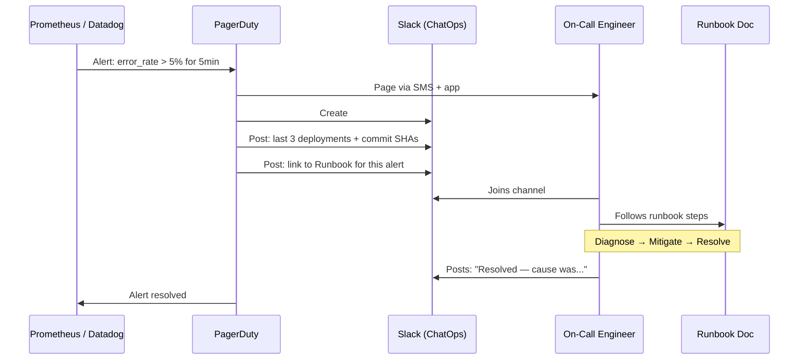
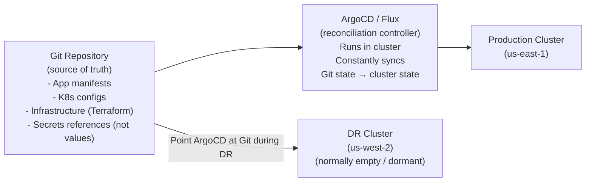

```mermaid
flowchart TD
    subgraph OLD["Traditional IT (prevent failure)"]
        CAB["Change Advisory Board\nmeeting (days)"]
        FREEZE["Code freeze 2 weeks\nbefore release"]
        BIGBANG["Big-bang release\n(months of changes)"]
        MTTR_OLD["MTTR: 1 week–1 month\nwhen it fails anyway"]
        CAB --> FREEZE --> BIGBANG --> MTTR_OLD
    end

    subgraph NEW["Modern DevOps (design for recovery)"]
        SMALL["Small, frequent\nbatch sizes"]
        AUTOTEST["Automated quality\ngates (10 min)"]
        DEPLOY["Deploy to production\n(multiple times/day)"]
        MONITOR["Monitor error rate\n& P99 latency"]
        ROLLBACK["Automated rollback\n(< 60 seconds)"]
        MTTR_NEW["MTTR: < 1 hour"]
        SMALL --> AUTOTEST --> DEPLOY --> MONITOR
        MONITOR -->|"anomaly detected"| ROLLBACK --> MTTR_NEW
    end
```

# ဖောက်ဆွဲပျက်စီးမှုကို ကြိုတင်တွက်ဆ၍ ဒီဇိုင်းထုတ်ခြင်း (Designing for Failure)

ခေတ်မီ ဖြန့်ကြက်စနစ်များ (Distributed Systems) သည် တစ်ချိန်ချိန်တွင် ပျက်စီးမည်သာ ဖြစ်သည်။ ဟာ့ဒ်ဝဲများ ယိုယွင်းခြင်း၊ နက်ဝက်ခွဲထွက်ခြင်းနှင့် စေ့စပ်သေချာစွာ စမ်းသပ်ထားသော်လည်း အမှားအယွင်းများသည် တစ်ခါတစ်ရံ ပရိုဒက်ရှင် (Production) ထံသို့ ရောက်ရှိလာတတ်သည်။ မေးခွန်းမှာ သင့်စနစ် ပျက်စီးမည် *ဟုတ်မဟုတ်* မဟုတ်ပါ — ပျက်စီးသွားသောအခါ *သင်မည်မျှမြန်မြန် ပြန်လည်ကောင်းမွန်လာနိုင်သနည်း* နှင့် ထိုသို့ပြုလုပ်နေစဉ်အတွင်း *ထိခိုက်ပျက်စီးမှု မည်မျှအနည်းဆုံးဖြစ်သနည်း* ဆိုသည်ပင် ဖြစ်သည်။

ရိုးရာ IT မှ ခေတ်မီ DevOps သို့ ကူးပြောင်းခြင်းဆိုသည်မှာ **ချို့ယွင်းမှုကို တားဆီးခြင်း** မှသည် **လျင်မြန်စွာ ပြန်လည်ကောင်းမွန်လာစေရန် ဒီဇိုင်းထုတ်ခြင်း** သို့ ပြောင်းလဲခြင်းပင်တည်း။



---

## ပရိုဒက်ရှင် ချို့ယွင်းမှု အမျိုးအစား သုံးမျိုး

ချို့ယွင်းမှုအမျိုးအစားကို နားလည်ခြင်းက သင့်လျော်သော ပြန်လည်ကုစားရေးနည်းလမ်းကို ဆုံးဖြတ်ပေးသည် -

| ချို့ယွင်းမှု အမျိုးအစား | အကြောင်းရင်း | အကောင်းဆုံး ပြန်လည်ကုစားပုံ |
|-------------|-------|--------------|
| **မအောင်မြင်သော ဖြန့်ကျက်မှု (Bad deployment)** | ကုဒ်အသစ်တွင် ဘက်ဂ် (Bug) ပါလာခြင်း | ယခင် ပုံရိပ် (Image) သို့ ပြန်သွားခြင်း (Roll back) |
| **အခြေခံအဆောက်အအုံ ပျက်စီးခြင်း (Infrastructure failure)** | ဆာဗာ ရပ်တန့်သွားခြင်း၊ ဒစ်ခ်ပြည့်ခြင်း၊ OOM ဖြစ်ခြင်း | ကွန်တိန်နာကို ပြန်လည်စတင်ခြင်း / အစားထိုးခြင်း |
| **ပြင်ပမှ မှီခိုအားထားရမှု (External dependency)** | ပြင်ပသုံး တတိယပါတီ API ချို့ယွင်းခြင်း | ဆားကစ်ဘရိတ်ကာ (Circuit breaker) + အရန်ဖြေရှင်းချက် |

---

## ရောလ်ဘက် မဟာဗျူဟာ ၁: ရုပ်ပုံတဂ် ရောလ်ဘက်လုပ်ခြင်း (Docker Compose)

ဖြန့်ကျက်မှုတိုင်းသည် သီးသန့်ဖြစ်ပြီး ပြောင်းလဲ၍မရသော ပုံရိပ်တဂ် (Immutable image tag) တစ်ခုကို အသုံးပြုသောကြောင့် ရောလ်ဘက်လုပ်ခြင်းဆိုသည်မှာ ယခင်တဂ်ကို ပြန်လည်ဖြန့်ကျက်ရုံသာ ဖြစ်သည်-

```bash
# You always know the previous tag because you log it in CI
# Store it as a GitHub Actions artifact or environment variable

# Current: v1.5.2  ← the bad deploy
# Previous: v1.5.1 ← known good

# Rollback in 30 seconds:
IMAGE_TAG=v1.5.1 docker compose \
  --env-file /home/deploy/.env.production \
  -f docker-compose.yml -f docker-compose.prod.yml \
  up -d --no-deps api

# Verify rollback succeeded
sleep 10
curl -f https://api.yourapp.com/health || echo "❌ Rollback also failed — escalate!"
echo "✅ Rolled back to v1.5.1"

# Now investigate what went wrong with v1.5.2
docker logs $(docker ps --filter "name=myapp-api" -q) --since 1h | grep ERROR
```

### CI/CD တွင် ရောလ်ဘက်ကို အလိုအလျောက်လုပ်ဆောင်ခြင်း

```yaml
# .github/workflows/deploy.yml
deploy:
  steps:
    - name: Store previous image tag for rollback
      run: |
        PREV_TAG=$(docker compose \
          --env-file /home/deploy/.env.production \
          config | grep "image:" | head -1 | awk '{print $2}')
        echo "PREV_TAG=$PREV_TAG" >> $GITHUB_ENV

    - name: Deploy new version
      id: deploy
      run: |
        IMAGE_TAG=${{ github.sha }} docker compose \
          --env-file /home/deploy/.env.production \
          -f docker-compose.yml -f docker-compose.prod.yml \
          up -d --no-deps api

    - name: Health check with automatic rollback
      run: |
        sleep 15
        
        if ! curl -f -s https://api.yourapp.com/health; then
          echo "❌ Health check failed — rolling back to ${{ env.PREV_TAG }}"
          
          IMAGE_TAG=${{ env.PREV_TAG }} docker compose \
            --env-file /home/deploy/.env.production \
            -f docker-compose.yml -f docker-compose.prod.yml \
            up -d --no-deps api
          
          # Alert the team
          curl -X POST "${{ secrets.SLACK_WEBHOOK }}" \
            -d '{"text":"🔄 Auto-rolled back to ${{ env.PREV_TAG }} — health check failed after deploy of ${{ github.sha }}"}'
          
          exit 1
        fi
        
        echo "✅ Deployment healthy"
```

---

## ရောလ်ဘက် မဟာဗျူဟာ ၂: ထွက်ပေါက်အဆင့် ရောလ်ဘက်လုပ်ခြင်း (Blue-Green)

Blue-Green ဖြန့်ကျက်မှုများအတွက် ရောလ်ဘက်လုပ်ခြင်းကို ရောက်တာ (Router) အဆင့်တွင် လုပ်ဆောင်ပါသည် — ကွန်တိန်နာ ပြန်စစရာမလိုပါ၊ ပိုစ့်လိုင်း (Pipeline) လည်ပတ်စရာလည်း မလိုပါ။ တစ်စက္ကန့်အောက် ပြန်လည်ကောင်းမွန်လာခြင်း:

```bash
# Current state: 100% traffic → Green (v2, broken)
# Blue (v1, stable) is still running — just not receiving traffic

# Instant rollback: reconfigure nginx
sed -i 's/myapp-green/myapp-blue/' /etc/nginx/conf.d/default.conf
nginx -s reload

# DONE. All traffic back to v1. Recovery time: < 1 second
echo "✅ Rolled back in $(date +%s) seconds"
```

---

## ရောလ်ဘက် မဟာဗျူဟာ ၃: ကနေရီ ရပ်ဆိုင်းခြင်းကို အလိုအလျောက်လုပ်ဆောင်ခြင်း (Argo Rollouts)

ကနေရီ ခွဲခြမ်းစိတ်ဖြာမှုကို လုပ်ဆောင်နေသော Argo Rollouts ဖြင့်၊ ကနေရီ၏ အမှားနှုန်းသည် သတ်မှတ်ထားသော ကန့်သတ်ချက် (Threshold) ထက် ကျော်လွန်သွားပါက ရောလ်ဘက်လုပ်ခြင်းကို အလိုအလျောက် ရပ်ဆိုင်းလိုက်မည် ဖြစ်သည်-

```bash
# Manual abort (if you see something concerning before auto-abort triggers)
kubectl argo rollouts abort my-api

# Check rollout status
kubectl argo rollouts status my-api
# ✖ my-api was aborted at step 2 of 5
# Error count: 4 (threshold: 3)
# The stable version (v1) continues to serve 100% of traffic

# Resume a paused rollout (after fix)
kubectl argo rollouts promote my-api

# Rollback to stable explicitly
kubectl argo rollouts undo my-api
```

---

## ဖြစ်ရပ် တုံ့ပြန်ဆောင်ရွက်မှု: အလိုအလျောက်လုပ်ဆောင်သော လုပ်ငန်းစဉ် (The Automated Workflow)

ဖြန့်ကျက်မှု ကျန်းမာရေး စစ်ဆေးမှုများဖြင့် မမိနိုင်သော ဖြစ်ရပ်တစ်ခု ဖြစ်ပွားလာသည့်အခါ (ဥပမာ- ဒစ်ခ်ပြည့်ခြင်း၊ မန်မိုရီယိုယွင်းခြင်း၊ ပြင်ပ API ကျဆင်းခြင်း):



### အလိုအလျောက် ဖြစ်ရပ် ချန်နယ်များ သတ်မှတ်ခြင်း

```yaml
# PagerDuty → Slack automation using PagerDuty Slack App
# Or implement yourself with PagerDuty webhooks:

# pagerduty-webhook-handler.js (Node.js)
app.post('/webhook/pagerduty', async (req, res) => {
  const { event, payload } = req.body;
  
  if (event === 'incident.trigger') {
    const incidentId = payload.data.id;
    const alertTitle = payload.data.title;
    
    // Create dedicated Slack channel
    const channel = await slack.conversations.create({
      name: `incident-${new Date().toISOString().slice(0,10)}-${incidentId}`,
    });
    
    // Invite on-call engineers
    await slack.conversations.invite({
      channel: channel.id,
      users: ON_CALL_USERS.join(','),
    });
    
    // Post context: recent deploys
    const recentDeploys = await getRecentDeploys(3);
    await slack.chat.postMessage({
      channel: channel.id,
      text: `🚨 *${alertTitle}*\n\nRecent deployments:\n${recentDeploys}`,
    });
    
    // Post runbook link
    await slack.chat.postMessage({
      channel: channel.id,
      text: `📖 Runbook: ${RUNBOOK_BASE_URL}/${alertTitle.toLowerCase().replace(/ /g, '-')}`,
    });
  }
  
  res.sendStatus(200);
});
```

---

## ထိရောက်သော ရန်းဘွတ်များ (Runbooks) ရေးသားခြင်း

Runbook ဆိုသည်မှာ အဖွဲ့ထဲမှ မည်သူမဆို (နံနက် ၃ နာရီတွင် အိပ်ပျော်မတတ်ဖြစ်နေစဉ် ဤသတိပေးချက်ကို တစ်ခါမှ မမြင်ဖူးသူပင်လျှင်) လိုက်နာလုပ်ဆောင်နိုင်သော အဆင့်ဆင့်သော ဖြစ်ရပ်တုံ့ပြန်မှု လမ်းညွှန်ချက် ဖြစ်ပါသည်။

```markdown
# Runbook: High API Error Rate (5xx Errors)

## Alert Trigger
- Metric: `http_requests_total{status_code=~"5.*"} / http_requests_total > 0.05`
- For: 5 minutes
- Severity: P1

## Immediate Actions (< 5 minutes)
1. Check if a deployment happened in the last 30 minutes:
   ```bash
   docker ps --format "{{.Names}} {{.Status}}" | grep api
   # Check image tag vs known-good tag
   ```
2. If yes → Roll back immediately (don't investigate yet):
   ```bash
   IMAGE_TAG=<previous_tag> docker compose -f docker-compose.yml \
     -f docker-compose.prod.yml up -d --no-deps api
   ```
3. If no deployment → Check error logs:
   ```bash
   docker compose logs api --since 30m | grep "ERROR\|FATAL" | tail -50
   ```

## Diagnose (after service is stable)
- Database connection pool exhausted? → `docker compose exec db pg_stat_activity`
- OOM killed? → `docker inspect <container> | grep OOMKilled`
- Disk full? → `df -h` on production server

## Escalation
- P1: Page backend lead if not resolved in 30 minutes
- P0: Page CTO if revenue impact > $10k/hour

## Post-Incident
- Write post-mortem within 48 hours
- Create ticket for root cause fix
- Update this runbook with new learnings
```

---

## GitOps: Git မှတဆင့် ဘေးအန္တရာယ် ပြန်လည်ထူထောင်ခြင်း (Disaster Recovery via Git)

GitOps သည် သင့်စနစ်၏ အခြေအနေတစ်ခုလုံးအတွက် Git ကို တစ်ခုတည်းသော မှန်ကန်သော အရင်းအမြစ် (Single source of truth) အဖြစ် သတ်မှတ်သည်။ ဘေးအန္တရာယ် ကျရောက်သည့် အခြေအနေတွင် မည်သည့် ပတ်ဝန်းကျင်ကိုမဆို Git မှတဆင့် အပြည့်အစုံ ပြန်လည်တည်ဆောက်နိုင်သည်-



### GitOps ဖြင့် ဘေးအန္တရာယ် ပြန်လည်ထူထောင်ရေး ရန်းဘွတ်

```bash
# === Scenario: us-east-1 has catastrophic failure ===

# Step 1: Provision a new cluster (Terraform/eksctl — 10-15 minutes)
eksctl create cluster \
  --name myapp-dr \
  --region us-west-2 \
  --nodes 3 \
  --node-type m5.large

# Step 2: Install ArgoCD on new cluster
kubectl apply -n argocd -f \
  https://raw.githubusercontent.com/argoproj/argo-cd/stable/manifests/install.yaml

# Step 3: Point ArgoCD at your Git repository
kubectl apply -f - <<EOF
apiVersion: argoproj.io/v1alpha1
kind: Application
metadata:
  name: myapp-production
  namespace: argocd
spec:
  source:
    repoURL: https://github.com/yourorg/myapp
    targetRevision: main
    path: k8s/overlays/production
  destination:
    server: https://kubernetes.default.svc
    namespace: production
  syncPolicy:
    automated:
      prune: true
      selfHeal: true
EOF

# Step 4: ArgoCD reads Git and recreates ALL resources automatically
# - Namespaces, ConfigMaps, Secrets (from external secrets operator)
# - Deployments, Services, Ingresses
# - HPA, PodDisruptionBudgets, NetworkPolicies

# Total recovery time: 15–30 minutes
# Without GitOps: days of manual reconstruction
```

---

## ဖြစ်ရပ်လွန် ဆန်းစစ်ခြင်း ယဉ်ကျေးမှု: ချို့ယွင်းချက်မှ သင်ယူခြင်း (Post-Mortem Culture)

အရေးပါသော ဖြစ်ရပ်တိုင်းသည် **အပြစ်တင်စရာမလိုသော ဖြစ်ရပ်လွန်ဆန်းစစ်ချက် (Blameless post-mortem)** တစ်ခုကို ထွက်ပေါ်စေသင့်သည် — ၎င်းသည် ချို့ယွင်းချက်များကို လူတစ်ဦးချင်းစီကို အပြစ်တင်မည့်အစား ဖြေရှင်းရမည့် စနစ်ပိုင်းဆိုင်ရာ ပြဿနာများအဖြစ် ရှုမြင်သော စာတမ်းတစ်စောင် ဖြစ်သည်-

```markdown
# Post-Mortem: API Outage 2026-08-18 14:30–15:45 UTC

## Impact
- 75 minutes of degraded service (50% error rate)
- ~2,400 affected API calls
- Estimated revenue impact: ~$1,200

## Timeline
| Time | Event |
|------|-------|
| 14:28 | Deploy of v1.5.2 triggered |
| 14:31 | Error rate exceeds 5% threshold |
| 14:33 | PagerDuty alerts on-call engineer |
| 14:38 | Engineer joins incident channel |
| 14:45 | Root cause identified (database migration) |
| 15:00 | Rollback to v1.5.1 initiated |
| 15:12 | Service fully recovered |
| 15:45 | Post-incident monitoring complete |

## Root Cause
Migration in v1.5.2 added a non-null column without a default value.
Rolling update meant v1.5.1 pods were still inserting rows, causing
`NOT NULL constraint violation` errors during the rollout window.

## Why Wasn't This Caught?
- Integration test environment uses a fresh database (no existing rows)
- No test for backward compatibility of migrations during rolling update

## Action Items
| Action | Owner | Due |
|--------|-------|-----|
| Add migration compatibility check to CI | @alice | 2026-08-25 |
| Add integration tests with pre-existing data | @bob | 2026-08-25 |
| Document expand-contract migration pattern | @alice | 2026-08-22 |
| Set up automated rollback on health check failure | @carol | 2026-08-30 |
```

**အပြစ်တင်စရာမလိုခြင်း (Blameless) ဆိုသည်မှာ**: ဖြစ်ရပ်လွန်ဆန်းစစ်ချက်သည် လူတစ်ဦးချင်းစီကိုမဟုတ်ဘဲ စနစ်ပိုင်းဆိုင်ရာ ချို့ယွင်းချက်များ (စမ်းသပ်မှုများ မလုံလောက်ခြင်း၊ စောင့်ကြည့်မှု အားနည်းခြင်း၊ ရှင်းလင်းမှုမရှိသော ရန်းဘွတ်များ) ကို ဖော်ထုတ်ခြင်း ဖြစ်သည်။ အင်ဂျင်နီယာများ ဖြစ်ရပ်များကို ရိုးသားစွာ သတင်းပို့နိုင်ရန် စိတ်ပိုင်းဆိုင်ရာ လုံခြုံမှုကို ဖန်တီးပေးခြင်းကသာ စဉ်ဆက်မပြတ် တိုးတက်မှုကို ဖြစ်ပေါ်စေပါသည်။

---

## အကျဉ်းချုပ်

ချို့ယွင်းမှုကို ကြိုတင်တွက်ဆ၍ ဒီဇိုင်းထုတ်ခြင်းဆိုသည်မှာ ဖြစ်ရပ်များ ဖြစ်လာမည်ကို လက်ခံပြီး အလိုအလျောက် ပြန်လည်ကောင်းမွန်လာသော စနစ်များကို တည်ဆောက်ခြင်း ဖြစ်သည်-
- **ရုပ်ပုံတဂ် ရောလ်ဘက်လုပ်ခြင်း** (Docker Compose): ယခင်တဂ်ကို ပြန်လည်ဖြန့်ကျက်ခြင်း — စက္ကန့် ၃၀၊ အခြေခံအဆောက်အအုံ ပြောင်းလဲမှု မရှိပါ။
- **ထွက်ပေါက်အဆင့် ရောလ်ဘက်လုပ်ခြင်း** (Blue-Green): nginx/ဝန်ထမ်းခွဲဝေစနစ်ကို ပြန်လည်ပြင်ဆင်ခြင်း — တစ်စက္ကန့်အောက် ပြန်လည်ကောင်းမွန်လာခြင်း။
- **ကနေရီ ရပ်ဆိုင်းခြင်းကို အလိုအလျောက်လုပ်ဆောင်ခြင်း** (Argo Rollouts): မက်ထရစ်ကို အခြေခံသည်၊ လူ၏ ပါဝင်ပတ်သက်မှု မလိုအပ်ပါ။
- **ဖြစ်ရပ် အလိုအလျောက်လုပ်ဆောင်ခြင်း** (PagerDuty + Slack ChatOps): ချက်ချင်းလက်ငင်း အခြေအနေများကို ပေးပို့ခြင်း — အင်ဂျင်နီယာများသည် အခြေအနေများကို စုစည်းနေစရာမလိုဘဲ ချက်ချင်း ရောဂါရှာဖွေမှု စတင်နိုင်ပါသည်။
- **ရန်းဘွတ်များ (Runbooks)**: နံနက် ၃ နာရီတွင် ဖိအားများကြားမှ မည်သူမဆို လိုက်နာနိုင်သော အဆင့်ဆင့် လမ်းညွှန်ချက်များ။
- **GitOps** (ArgoCD/Flux): စနစ်အခြေအနေ တစ်ခုလုံး Git တွင်ရှိခြင်း — ဘေးအန္တရာယ် ပြန်လည်ထူထောင်ခြင်းသည် `git clone` + ArgoCD ထည့်သွင်းခြင်း ဖြစ်သည်။
- **အပြစ်တင်စရာမလိုသော ဖြစ်ရပ်လွန်ဆန်းစစ်ချက်များ**: ချို့ယွင်းချက်များကို လူတစ်ဦးချင်းစီကို အပြစ်တင်မည့်အစား စနစ်ပိုင်းဆိုင်ရာ သင်ယူစရာ အခွင့်အလမ်းများအဖြစ် ရှုမြင်ခြင်း။

ဤတွင် CI/CD သဘောတရားများ သင်တန်း ပြီးဆုံးပါပြီ။ ယခုအခါတွင် သင်သည် ပရိုဒက်ရှင်အဆင့်ရှိ CI/CD စနစ်တစ်ခုကို ဒီဇိုင်းဆွဲရန်၊ တိုင်းတာရန်နှင့် စဉ်ဆက်မပြတ် တိုးတက်အောင် လုပ်ဆောင်ရန် စိတ်ကူးပုံစံများ (Mental models) ကို ပိုင်ဆိုင်ပြီ ဖြစ်ပါသည်။