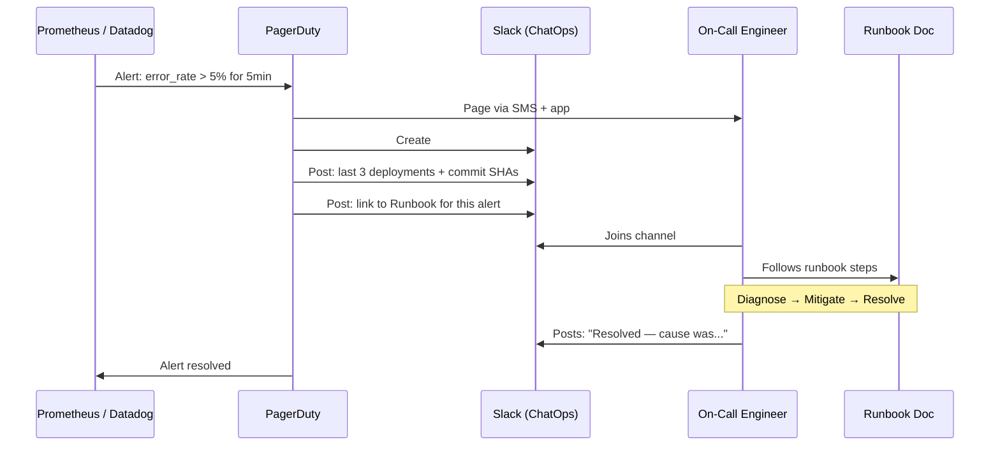
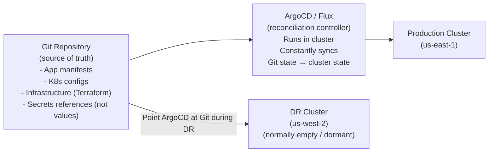

# Designing for Failure

Modern distributed systems will fail. Hardware degrades, networks partition, and despite exhaustive testing, bugs occasionally reach production. The question isn't *if* your system will fail — it's *how fast you recover* and *how little damage occurs* while you do.

Traditional IT ကနေ modern DevOps ကို ကူးပြောင်းတယ်ဆိုတာ **preventing failure** ကနေ **designing for rapid recovery** ဆီ ပြောင်းလဲလိုက်တာပါပဲ။

```mermaid
flowchart TD
    subgraph OLD["Traditional IT (prevent failure)"]
        CAB["Change Advisory Board\nmeeting (days)"]
        FREEZE["Code freeze 2 weeks\nbefore release"]
        BIGBANG["Big-bang release\n(months of changes)"]
        MTTR_OLD["MTTR: 1 week–1 month\nwhen it fails anyway"]
        CAB --> FREEZE --> BIGBANG --> MTTR_OLD
    end

    subgraph NEW["Modern DevOps (design for recovery)"]
        SMALL["Small, frequent\nbatch sizes"]
        AUTOTEST["Automated quality\ngates (10 min)"]
        DEPLOY["Deploy to production\n(multiple times/day)"]
        MONITOR["Monitor error rate\n& P99 latency"]
        ROLLBACK["Automated rollback\n(< 60 seconds)"]
        MTTR_NEW["MTTR: < 1 hour"]
        SMALL --> AUTOTEST --> DEPLOY --> MONITOR
        MONITOR -->|"anomaly detected"| ROLLBACK --> MTTR_NEW
    end
```



---

## Production Failure အမျိုးအစား (၃) မျိုး

Failure type ကို နားလည်ထားမှသာ မှန်ကန်တဲ့ recovery mechanism ကို ရွေးချယ်နိုင်မှာ ဖြစ်ပါတယ်-

| Failure Type | ဖြစ်ရသည့်အကြောင်းရင်း | အကောင်းဆုံး Recovery နည်းလမ်း |
|-------------|-------|--------------|
| **Bad deployment** | New code မှာ bug ပါလာခြင်း | Previous image သို့ roll back လုပ်ခြင်း |
| **Infrastructure failure** | Server crash ဖြစ်ခြင်း၊ disk full ဖြစ်ခြင်း၊ OOM ဖြစ်ခြင်း | Container ကို restart / replace လုပ်ခြင်း |
| **External dependency** | Third-party API down ဖြစ်ခြင်း | Circuit breaker + fallback သုံးခြင်း |

---

## Rollback Strategy 1: Image Tag Rollback (Docker Compose)

Deployment တိုင်းမှာ သီးသန့် immutable image tag တစ်ခုစီကို အသုံးပြုတဲ့အတွက်, rolling back လုပ်ဖို့ဆိုတာက previous tag ကို ပြန် deploy လိုက်ရုံပါပဲ:

```bash
# You always know the previous tag because you log it in CI
# Store it as a GitHub Actions artifact or environment variable

# Current: v1.5.2  ← the bad deploy
# Previous: v1.5.1 ← known good

# Rollback in 30 seconds:
IMAGE_TAG=v1.5.1 docker compose \
  --env-file /home/deploy/.env.production \
  -f docker-compose.yml -f docker-compose.prod.yml \
  up -d --no-deps api

# Verify rollback succeeded
sleep 10
curl -f https://api.yourapp.com/health || echo "❌ Rollback also failed — escalate!"
echo "✅ Rolled back to v1.5.1"

# Now investigate what went wrong with v1.5.2
docker logs $(docker ps --filter "name=myapp-api" -q) --since 1h | grep ERROR
```

### CI/CD တွင် Rollback ကို Automate လုပ်ခြင်း

```yaml
# .github/workflows/deploy.yml
deploy:
  steps:
    - name: Store previous image tag for rollback
      run: |
        PREV_TAG=$(docker compose \
          --env-file /home/deploy/.env.production \
          config | grep "image:" | head -1 | awk '{print $2}')
        echo "PREV_TAG=$PREV_TAG" >> $GITHUB_ENV

    - name: Deploy new version
      id: deploy
      run: |
        IMAGE_TAG=${{ github.sha }} docker compose \
          --env-file /home/deploy/.env.production \
          -f docker-compose.yml -f docker-compose.prod.yml \
          up -d --no-deps api

    - name: Health check with automatic rollback
      run: |
        sleep 15
        
        if ! curl -f -s https://api.yourapp.com/health; then
          echo "❌ Health check failed — rolling back to ${{ env.PREV_TAG }}"
          
          IMAGE_TAG=${{ env.PREV_TAG }} docker compose \
            --env-file /home/deploy/.env.production \
            -f docker-compose.yml -f docker-compose.prod.yml \
            up -d --no-deps api
          
          # Alert the team
          curl -X POST "${{ secrets.SLACK_WEBHOOK }}" \
            -d '{"text":"🔄 Auto-rolled back to ${{ env.PREV_TAG }} — health check failed after deploy of ${{ github.sha }}"}'
          
          exit 1
        fi
        
        echo "✅ Deployment healthy"
```

---

## Rollback Strategy 2: Traffic-Level Rollback (Blue-Green)

Blue-Green deployments တွေအတွက်ကတော့ rollback လုပ်တာဟာ router level မှာ ဖြစ်သွားတာပါ — container restart လုပ်စရာလည်းမလို၊ pipeline run စရာလည်း မလိုပါဘူး။ တစ်စက္ကန့်တောင် မပြည့်တဲ့အချိန်အတွင်း recover ဖြစ်စေပါတယ်:

```bash
# Current state: 100% traffic → Green (v2, broken)
# Blue (v1, stable) is still running — just not receiving traffic

# Instant rollback: reconfigure nginx
sed -i 's/myapp-green/myapp-blue/' /etc/nginx/conf.d/default.conf
nginx -s reload

# DONE. All traffic back to v1. Recovery time: < 1 second
echo "✅ Rolled back in $(date +%s) seconds"
```

---

## Rollback Strategy 3: Automated Canary Abort (Argo Rollouts)

Argo Rollouts က canary analysis ကို run နေချိန်မှာ error rate က threshold ထက် ကျော်လွန်သွားခဲ့မယ်ဆိုရင် rollout ကို automatically abort လုပ်ပစ်ပါတယ်:

```bash
# Manual abort (if you see something concerning before auto-abort triggers)
kubectl argo rollouts abort my-api

# Check rollout status
kubectl argo rollouts status my-api
# ✖ my-api was aborted at step 2 of 5
# Error count: 4 (threshold: 3)
# The stable version (v1) continues to serve 100% of traffic

# Resume a paused rollout (after fix)
kubectl argo rollouts promote my-api

# Rollback to stable explicitly
kubectl argo rollouts undo my-api
```

---

## Incident Response: Automated Workflow

Deployment health checks တွေက မမိလိုက်တဲ့ incident တွေ ဖြစ်လာတဲ့အခါ (ဥပမာ- disk full ဖြစ်တာ၊ memory leak ဖြစ်တာ၊ တတိယပါတီ API down ဖြစ်တာမျိုးတွေပေါ့):



### Automated Incident Channels တည်ဆောက်ခြင်း

```yaml
# PagerDuty → Slack automation using PagerDuty Slack App
# Or implement yourself with PagerDuty webhooks:

# pagerduty-webhook-handler.js (Node.js)
app.post('/webhook/pagerduty', async (req, res) => {
  const { event, payload } = req.body;
  
  if (event === 'incident.trigger') {
    const incidentId = payload.data.id;
    const alertTitle = payload.data.title;
    
    // Create dedicated Slack channel
    const channel = await slack.conversations.create({
      name: `incident-${new Date().toISOString().slice(0,10)}-${incidentId}`,
    });
    
    // Invite on-call engineers
    await slack.conversations.invite({
      channel: channel.id,
      users: ON_CALL_USERS.join(','),
    });
    
    // Post context: recent deploys
    const recentDeploys = await getRecentDeploys(3);
    await slack.chat.postMessage({
      channel: channel.id,
      text: `🚨 *${alertTitle}*\n\nRecent deployments:\n${recentDeploys}`,
    });
    
    // Post runbook link
    await slack.chat.postMessage({
      channel: channel.id,
      text: `📖 Runbook: ${RUNBOOK_BASE_URL}/${alertTitle.toLowerCase().replace(/ /g, '-')}`,
    });
  }
  
  res.sendStatus(200);
});
```

---

## ထိရောက်သော Runbooks များ ရေးသားခြင်း

Runbook ဆိုတာက အဖွဲ့ထဲက ဘယ်သူမဆို လိုက်လုပ်လို့ရမယ့် step-by-step incident response လမ်းညွှန်တစ်ခု ဖြစ်ပါတယ် — ည ၃ နာရီလောက်မှာ၊ အိပ်မဝသေးတဲ့အချိန်မှာ ဒီ alert မျိုးကို ဘယ်တုန်းကမှ မကြုံဖူးသေးတဲ့သူတောင် လိုက်လုပ်လို့ရအောင် ရေးထားရပါမယ်။

```markdown
# Runbook: High API Error Rate (5xx Errors)

## Alert Trigger
- Metric: `http_requests_total{status_code=~"5.*"} / http_requests_total > 0.05`
- For: 5 minutes
- Severity: P1

## Immediate Actions (< 5 minutes)
1. Check if a deployment happened in the last 30 minutes:
   ```bash
   docker ps --format "{{.Names}} {{.Status}}" | grep api
   # Check image tag vs known-good tag
   ```
2. If yes → Roll back immediately (don't investigate yet):
   ```bash
   IMAGE_TAG=<previous_tag> docker compose -f docker-compose.yml \
     -f docker-compose.prod.yml up -d --no-deps api
   ```
3. If no deployment → Check error logs:
   ```bash
   docker compose logs api --since 30m | grep "ERROR\|FATAL" | tail -50
   ```

## Diagnose (after service is stable)
- Database connection pool exhausted? → `docker compose exec db pg_stat_activity`
- OOM killed? → `docker inspect <container> | grep OOMKilled`
- Disk full? → `df -h` on production server

## Escalation
- P1: Page backend lead if not resolved in 30 minutes
- P0: Page CTO if revenue impact > $10k/hour

## Post-Incident
- Write post-mortem within 48 hours
- Create ticket for root cause fix
- Update this runbook with new learnings
```

---

## GitOps: Git မှတဆင့် Disaster Recovery လုပ်ဆောင်ခြင်း

GitOps က သင့်စနစ်တစ်ခုလုံးရဲ့ state အတွက် Git ကို single source of truth အဖြစ် သတ်မှတ်ပါတယ်။ Disaster ဖြစ်တဲ့ အခြေအနေမျိုးမှာဆိုရင် environment ဘယ်ဟာမဆို Git ကနေ တစ်ဆင့် အပြည့်အဝ ပြန်လည်တည်ဆောက်နိုင်ပါတယ်:



### GitOps ဖြင့် Disaster Recovery Runbook

```bash
# === Scenario: us-east-1 has catastrophic failure ===

# Step 1: Provision a new cluster (Terraform/eksctl — 10-15 minutes)
eksctl create cluster \
  --name myapp-dr \
  --region us-west-2 \
  --nodes 3 \
  --node-type m5.large

# Step 2: Install ArgoCD on new cluster
kubectl apply -n argocd -f \
  https://raw.githubusercontent.com/argoproj/argo-cd/stable/manifests/install.yaml

# Step 3: Point ArgoCD at your Git repository
kubectl apply -f - <<EOF
apiVersion: argoproj.io/v1alpha1
kind: Application
metadata:
  name: myapp-production
  namespace: argocd
spec:
  source:
    repoURL: https://github.com/yourorg/myapp
    targetRevision: main
    path: k8s/overlays/production
  destination:
    server: https://kubernetes.default.svc
    namespace: production
  syncPolicy:
    automated:
      prune: true
      selfHeal: true
EOF

# Step 4: ArgoCD reads Git and recreates ALL resources automatically
# - Namespaces, ConfigMaps, Secrets (from external secrets operator)
# - Deployments, Services, Ingresses
# - HPA, PodDisruptionBudgets, NetworkPolicies

# Total recovery time: 15–30 minutes
# Without GitOps: days of manual reconstruction
```

---

## Post-Mortem Culture: အမှားများမှ သင်ခန်းစာယူခြင်း

အရေးပါတဲ့ incident တိုင်းအတွက် **blameless post-mortem** တစ်ခု ထွက်လာသင့်ပါတယ် — ဒါက အမှားတွေကို တာဝန်ရှိသူကို လက်ညှိုးထိုးပြစ်တင်တာမျိုး မဟုတ်ဘဲ ပြုပြင်ရမယ့် စနစ်ပိုင်းဆိုင်ရာ အားနည်းချက်တွေအဖြစ် ရှုမြင်တဲ့ စာရွက်စာတမ်းတစ်ခု ဖြစ်ပါတယ်:

```markdown
# Post-Mortem: API Outage 2026-08-18 14:30–15:45 UTC

## Impact
- 75 minutes of degraded service (50% error rate)
- ~2,400 affected API calls
- Estimated revenue impact: ~$1,200

## Timeline
| Time | Event |
|------|-------|
| 14:28 | Deploy of v1.5.2 triggered |
| 14:31 | Error rate exceeds 5% threshold |
| 14:33 | PagerDuty alerts on-call engineer |
| 14:38 | Engineer joins incident channel |
| 14:45 | Root cause identified (database migration) |
| 15:00 | Rollback to v1.5.1 initiated |
| 15:12 | Service fully recovered |
| 15:45 | Post-incident monitoring complete |

## Root Cause
Migration in v1.5.2 added a non-null column without a default value.
Rolling update meant v1.5.1 pods were still inserting rows, causing
`NOT NULL constraint violation` errors during the rollout window.

## Why Wasn't This Caught?
- Integration test environment uses a fresh database (no existing rows)
- No test for backward compatibility of migrations during rolling update

## Action Items
| Action | Owner | Due |
|--------|-------|-----|
| Add migration compatibility check to CI | @alice | 2026-08-25 |
| Add integration tests with pre-existing data | @bob | 2026-08-25 |
| Document expand-contract migration pattern | @alice | 2026-08-22 |
| Set up automated rollback on health check failure | @carol | 2026-08-30 |
```

**Blameless ဆိုတာကတော့** post-mortem မှာ စနစ်ပိုင်းဆိုင်ရာ အားနည်းချက်တွေ (စမ်းသပ်မှု မလုံလောက်တာ၊ monitoring အားနည်းတာ၊ runbook ရှင်းလင်းမှု မရှိတာ) ကိုပဲ ဖော်ပြတာဖြစ်ပြီး လူပုဂ္ဂိုလ်တစ်ဦးချင်းစီကို လက်ညှိုးထိုးတာမျိုး မလုပ်ပါဘူး။ Engineer တွေအနေနဲ့ incident တွေကို ရိုးသားစွာ တင်ပြနိုင်ဖို့ psychological safety ဖန်တီးပေးနိုင်မှသာ continuous improvement ကို လုပ်ဆောင်နိုင်မှာ ဖြစ်ပါတယ်။

---

## အနှစ်ချုပ်

Designing for failure ဆိုတာက incident တွေ ဖြစ်လာမှာပဲဆိုတာကို လက်ခံပြီး အလိုအလျောက် recover ဖြစ်မယ့် စနစ်တွေကို တည်ဆောက်တာကို ဆိုလိုပါတယ်-
- **Image tag rollback** (Docker Compose): previous tag ကို ပြန် deploy လုပ်ခြင်း — စက္ကန့် ၃၀ အတွင်း၊ infrastructure ပြောင်းလဲစရာမလိုဘဲ ပြီးစီးခြင်း
- **Traffic-level rollback** (Blue-Green): nginx/load balancer ကို reconfigure လုပ်ခြင်း — တစ်စက္ကန့်မပြည့်ခင် recover ဖြစ်ခြင်း
- **Automated canary abort** (Argo Rollouts): metrics ပေါ်မူတည်ခြင်း၊ လူကိုယ်တိုင် ဝင်ရောက်လုပ်ဆောင်စရာ မလိုခြင်း
- **Incident automation** (PagerDuty + Slack ChatOps): instant context injection လုပ်ပေးခြင်း — context တွေကို လိုက်စုနေစရာမလိုဘဲ engineer တွေချက်ချင်း diagnose လုပ်နိုင်ခြင်း
- **Runbooks**: ည ၃ နာရီလို ဖိအားများတဲ့အချိန်မှာ ဘယ်သူမဆို လိုက်လုပ်လို့ရမယ့် step-by-step playbooks များ
- **GitOps** (ArgoCD/Flux): စနစ်တစ်ခုလုံးရဲ့ state ကို Git မှာ ထားရှိခြင်း — disaster recovery အတွက် `git clone` + ArgoCD install လုပ်ရုံသာ
- **Blameless post-mortems**: အမှားတွေကို လူပုဂ္ဂိုလ်ကို အပြစ်တင်တာမျိုးမဟုတ်ဘဲ စနစ်ပိုင်းဆိုင်ရာ သင်ခန်းစာယူစရာအဖြစ် သတ်မှတ်ခြင်း

ဒါဆိုရင်တော့ CI/CD Concepts သင်ခန်းစာ ပြီးဆုံးသွားပါပြီ။ သင့်အနေနဲ့ production-grade CI/CD system တစ်ခုကို ဒီဇိုင်းဆွဲဖို့၊ တိုင်းတာဖို့နဲ့ continuous improve လုပ်ဖို့အတွက် လိုအပ်တဲ့ mental models တွေကို ပိုင်ဆိုင်သွားပြီ ဖြစ်ပါတယ်။