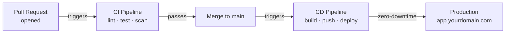
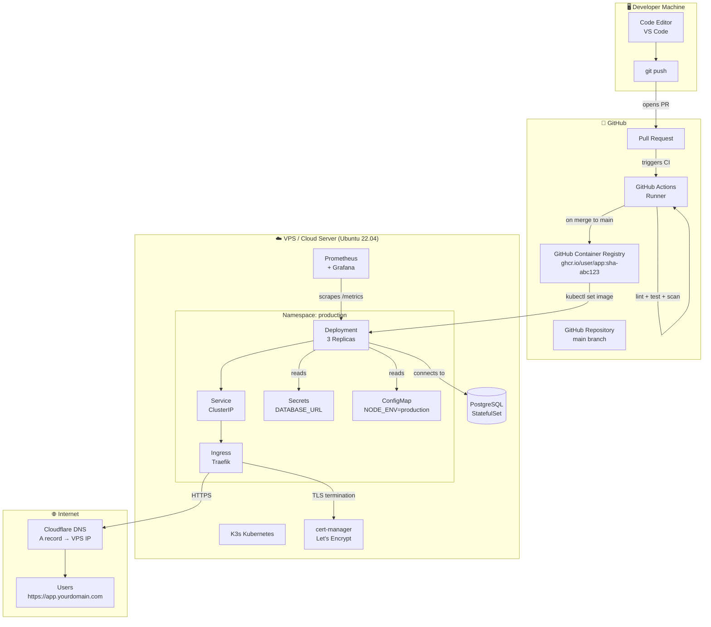
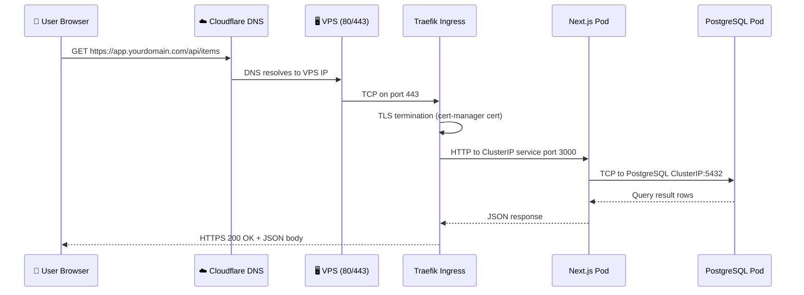
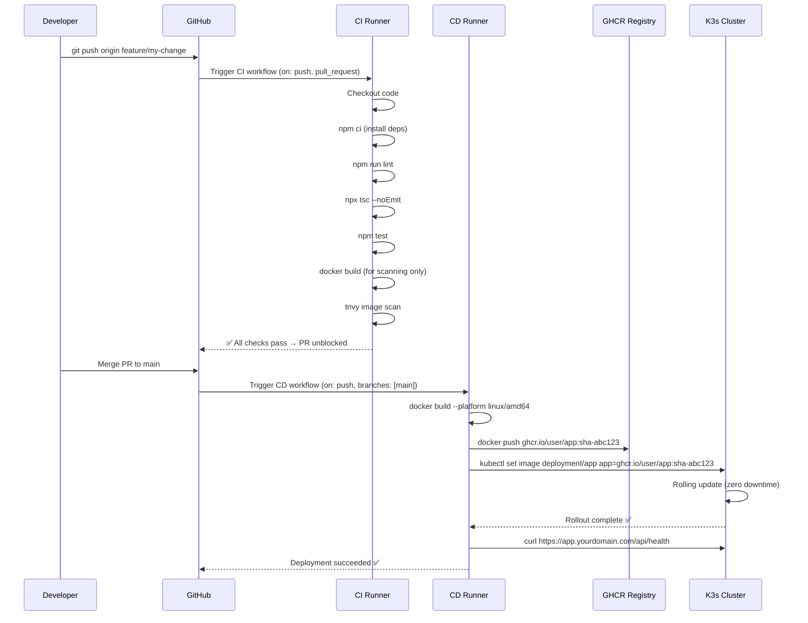
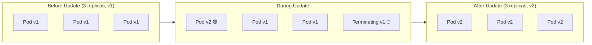

# Welcome to the Capstone CI/CD Project

ဒီ course က အရာအားလုံးကို လက်တွေ့ဖြစ်လာစေမယ့် အပိုင်းပါ။ ပြီးခဲ့တဲ့ course ရှစ်ခုက တစ်ခုချင်းစီရဲ့ tools တွေကို သီးသန့်သုံးတတ်အောင် သင်ပေးခဲ့တယ် — Linux commands၊ Git workflows၊ GitHub Actions syntax၊ Docker images၊ Kubernetes objects ပေါ့။ ဒီ course မှာတော့ အဲ့ဒီ tools တွေအားလုံး ချိတ်ဆက်ပြီး **living, automated production system** တစ်ခု ဖြစ်လာအောင် လုပ်ဆောင်ရမှာ ဖြစ်ပါတယ်။

ဒီ capstone ပြီးဆုံးသွားတဲ့အခါ အောက်ပါတို့ကို တည်ဆောက်ပြီး Deploy လုပ်ပြီးသား ဖြစ်နေပါလိမ့်မယ် -

- PostgreSQL နဲ့ ချိတ်ဆက်ထားတဲ့ **real Next.js web application** တစ်ခု
- multi-stage builds နဲ့ တည်ဆောက်ထားတဲ့ **hardened Docker image** တစ်ခု
- pull request တိုင်းမှာ linting, type checking, unit tests နဲ့ container security scanning တွေကို automatic လုပ်ဆောင်ပေးမယ့် **CI pipeline** တစ်ခု
- `main` branch ကို merge လုပ်လိုက်တိုင်း container image အသစ်ကိုထုတ်ပေးပြီး live ဖြစ်နေတဲ့ Kubernetes cluster ထดကို deploy လုပ်ပေးမယ့် **CD pipeline** တစ်ခု
- domain အမှန်နဲ့ free Let's Encrypt certificate ပါဝင်တဲ့ **Automatic HTTPS**
- Prometheus metrics နဲ့ Grafana dashboards ပါဝင်တဲ့ **Production observability**

`main` ကို push လိုက်တာနဲ့ production deployment တစ်ခုဖြစ်သွားပါမယ် — လက်နဲ့ ထပ်လုပ်စရာမလိုတော့ပါဘူး။

---

## What "CI/CD" Actually Means in Practice

Architecture ထဲမဝင်ခင်မှာ CI/CD ဆိုတာ လက်တွေ့မှာ ဘာကိုဆိုလိုလဲဆိုတာကို အရင်နားလည်ထားရအောင်ပါ -

**Continuous Integration (CI)** ဆိုတာက ကုဒ်အသစ် push လိုက်တာနဲ့ တပြိုင်နက် automatic စစ်ဆေးပေးတာကို ဆိုလိုပါတယ်။ Bot တစ်ကောင်က သင့်ရဲ့အလုပ်ကို စစ်ပေးပါတယ် -
- Code style rules တွေနဲ့ ညီရဲ့လား? (`eslint`)
- TypeScript errors တွေ ရှိနေလား? (`tsc --noEmit`)
- Unit tests အားလုံး pass ဖြစ်ရဲ့လား? (`vitest`)
- Docker image မှာ လူသိများတဲ့ CVEs တွေ ပါနေလား? (`trivy`)

ဘာ error မှ မရှိဘူးဆိုမှသာ GitHub က pull request ကို merge လုပ်ခွင့်ပြုပါတယ်။ ဒါက `main` branch ကို အမြဲတမ်း deploy လုပ်လို့ရတဲ့အနေအထားမှာ ရှိနေစေပါတယ်။

**Continuous Delivery / Deployment (CD)** ဆိုတာကတော့ pull request ကို `main` မှာ merge လိုက်တာနဲ့ အပလီကေးရှင်းရဲ့ version အသစ်ဟာ production ဆီကို automatic ရောက်သွားတာကို ဆိုလိုတာပါ။ ဘယ်သူ့မှ `docker build` လက်နဲ့ run စရာမလိုဘူး၊ server ထဲ SSH ဝင်စရာမလိုဘူး၊ app ကို လက်နဲ့ restart ချစရာမလိုပါဘူး။ Pipeline က အားလုံးကို လုပ်ဆောင်ပေးပါတယ်။



---

## The Full System Architecture

ဒီမှာတော့ တစ်ဆင့်ချင်းစီ တည်ဆောက်သွားမယ့် complete end-to-end architecture ကို ဖော်ပြထားပါတယ် -



---

## Technology Stack — Every Tool Explained

tool တစ်ခုချင်းစီကို *ဘာကြောင့်* ရွေးချယ်ခဲ့လဲဆိုတာကို သိထားဖို့က ဘလိုသုံးရမလဲသိတာနဲ့ တန်းတူအရေးကြီးပါတယ်။

| Layer | Tool | Version | Why This Tool |
|-------|------|---------|--------------|
| **Application** | Next.js | 14 (App Router) | Server-side rendering, API routes, နှင့် TypeScript ကို built-in ပါဝင်ခြင်း။ Production site ထောင်ပေါင်းများစွာကို အသုံးပြုပေးနေပါတယ်။ |
| **Database** | PostgreSQL | 16 | Industry-standard relational database။ ACID-compliant ဖြစ်ပြီး ဘယ်လို scale မျိုးမှာမဆို စမ်းသပ်ပြီးသား ဖြစ်ပါတယ်။ |
| **Container runtime** | Docker | 24+ | Universal container format။ တစ်ခါတည်ဆောက်ပြီး ဘယ်နေရာမှာမဆို run နိုင်ပါတယ်။ |
| **Container image build** | Docker multi-stage | — | Minimal images များကို ထုတ်လုပ်ပေးသည် (200 MB သာရှိပြီး 1.2 GB မဟုတ်ပါ)။ Final image ထဲမှာ build tools တွေ မပါဝင်ပါ။ |
| **Container registry** | GitHub GHCR | — | Public repos အတွက် အခမဲ့ဖြစ်ပြီး GitHub Actions secrets နဲ့ ချိတ်ဆက်ထားကာ extra credentials ထပ်လို지ပါဘူး။ |
| **CI/CD automation** | GitHub Actions | — | GitHub နဲ့ တွဲဖက်ပါရှိပြီး free tier များပြားခြင်း (တစ်လကို မိနစ် ၂,၀၀၀)၊ marketplace ကြီးမားခြင်း။ |
| **Security scanning** | Trivy | latest | CNCF-sponsored CVE scanner။ OS packages နဲ့ language dependencies များကို စက္ကန့်ပိုင်းအတွင်း scan ဖတ်ပေးပါတယ်။ |
| **Kubernetes distribution** | K3s | v1.29+ | Full Kubernetes API ဖြစ်ပြီး binary size 40% ပိုသေးပါတယ်။ Traefik၊ local-path storage နဲ့ CoreDNS တို့နဲ့အတူ ပါလာပါတယ်။ |
| **Ingress controller** | Traefik | 2.x | K3s မှာ အရင်တည်းက ပါလာပါတယ်။ HTTP→HTTPS redirect နဲ့ TLS termination ကို automatic လုပ်ဆောင်ပေးပါတယ်။ |
| **Certificate management** | cert-manager | v1.14+ | Let's Encrypt certificate ထုတ်ပေးခြင်းနဲ့ သက်တမ်းတိုးခြင်းတို့ကို automatic လုပ်ဆောင်ပေးပါတယ်။ SSL ကို လက်နဲ့ ထပ်စီမံစရာမလိုတော့ပါ။ |
| **Monitoring** | Prometheus | 2.x | Pull-based metrics collection။ Kubernetes ecosystem ရဲ့ de facto standard ဖြစ်ပါတယ်။ |
| **Dashboards** | Grafana | 10.x | Prometheus ကို အခြေခံထားတဲ့ လှပတဲ့ dashboards များ။ Alerting ပါ ပါဝင်ပါတယ်။ |

---

## Infrastructure Requirements

Lesson 2 မစတင်ခင် ဒီ resources တွေကို ပြင်ဆင်ထားပါ။ ဒီအပိုင်းမှာ ဘာတွေလိုအပ်ပြီး ဘာကြောင့်လိုအပ်လဲဆိုတာကို အတိအကျ ဖော်ပြထားပါတယ်။

### 1. GitHub Account (Free)
Repository ကို host လုပ်ဖို့၊ GitHub Actions run ဖို့နဲ့ images တွေကို GHCR ဆီ push လုပ်ဖို့ GitHub account လိုအပ်ပါတယ်။ မရှိသေးရင် [github.com](https://github.com) မှာ အခမဲ့ ဖွင့်နိုင်ပါတယ်။

### 2. A VPS / Cloud Server

သင်ရဲ့ Kubernetes cluster ဟာ Virtual Private Server (VPS) ပေါ်မှာ run မှာ ဖြစ်ပါတယ်။ Dedicated server ကြီး မလိုပါဘူး — small cloud VM တစ်ခုဆိုရင် လုံလောက်ပါပြီ။

**Minimum Specifications:**
| Resource | Minimum | Recommended |
|----------|---------|-------------|
| CPU | 2 vCPUs | 4 vCPUs |
| RAM | 4 GB | 8 GB |
| Disk | 40 GB SSD | 80 GB SSD |
| OS | Ubuntu 22.04 LTS | Ubuntu 22.04 LTS |
| Location | Any | သင့်အသုံးပြုသူတွေနဲ့ နီးစပ်ရာ |

**Recommended VPS Providers:**

| Provider | 4 GB Plan Cost | Notes |
|----------|---------------|-------|
| Hetzner Cloud | ~$6/month | စျေးနှုန်းနဲ့ performance အကောင်းဆုံး။ European data center ဖြစ်ပါတယ်။ |
| DigitalOcean | $24/month | Documentation ကောင်းမွန်ပြီး beginner-friendly ဖြစ်ပါတယ်။ |
| Linode (Akamai) | $24/month | Performance ကောင်းမွန်ပြီး SLA ကောင်းပါတယ်။ |
| AWS EC2 (t3.medium) | ~$30/month | Enterprise-grade ဖြစ်ပေမယ့် setup လုပ်ရတာ ပိုရှုပ်ပါတယ်။ |

<Callout type="tip" title="Use Hetzner for This Course">
Hetzner ရဲ့ CX22 (4 vCPU, 4 GB RAM) က တစ်လကို ~$6 လောက်ပဲကျပြီး ဒီ capstone အတွက် လုံလောက်ာထက် ပိုပါတယ်။ Free trial credit လည်း ရနိုင်ပါတယ်။ course ပြီးသွားရင် charges တွေ မတက်အောင် server ကို ဖျက်ပစ်လို့ရပါတယ်။
</Callout>

### 3. A Domain Name (Optional for Local, Required for HTTPS)

Let's Encrypt က TLS certificate ထုတ်ပေးနိုင်ဖို့ domain အမှန်တစ်ခု လိုအပ်ပါတယ်။ Namecheap၊ Google Domains ဒါမှမဟုတ် Cloudflare မှာ `.dev` သို့မဟုတ် `.xyz` domain တွေကို တစ်နှစ်ကို $5 အောက်နဲ့ ဝယ်ယူနိုင်ပါတယ်။

Domain မရှိသေးဘူးဆိုရင် testing အတွက် `nip.io` ဒါမှမဟုတ် `sslip.io` လိုမျိုး free subdomain services တွေကို သုံးနိုင်ပါတယ် -
```
# nip.io maps an IP to a hostname automatically
# 1.2.3.4.nip.io → 1.2.3.4
```

---

## Networking Architecture Deep Dive

production issues တွေကို debug လုပ်တဲ့အခါ request တစ်ခုဟာ user ရဲ့ browser ကနေ database ဆီ ဘယ်လိုသွားလဲဆိုတာ နားလည်ဖို့ အလွန်အရေးကြီးပါတယ်။



အဓိက networking concepts များ -
- **Traefik** ဟာ တစ်ခုတည်းသော entry point ဖြစ်ပါတယ်။ Host node ပေါ်ရှိ ports 80 နဲ့ 443 ကို bind လုပ်ပြီး TLS termination ကို ကိုင်တွယ်ပါတယ်။
- **ClusterIP Services** က workload တစ်ခုချင်းစီကို stable ဖြစ်တဲ့ internal IP address တစ်ခု ပေးပါတယ်။ Pod တွေ ပြောင်းလဲသွားနိုင်ပေမယ့် Service IP ကတော့ ဘယ်တော့မှ မပြောင်းပါဘူး။
- **DNS inside the cluster** ကို CoreDNS က ကိုင်တွယ်ပါတယ်။ သင့်ရဲ့ app က PostgreSQL ကို `postgres-service.production.svc.cluster.local` ကိုသုံးပြီး ချိတ်ဆက်ပါတယ်။

---

## GitOps Flow: What Happens on Every `git push`

automation sequence အပြည့်အစုံကို တစ်ဆင့်ချင်းစီ ကြည့်ရအောင် -



---

## Deployment Strategy: Rolling Updates Explained

Kubernetes ဟာ downtime လုံးဝမရှိဘဲ application version အသစ်တွေကို deploy လုပ်ဖို့ **rolling updates** ကို အသုံးပြုပါတယ် -



Deployment manifest ထဲက Configuration -
```yaml
strategy:
  type: RollingUpdate
  rollingUpdate:
    maxSurge: 1        # update လုပ်နေစဉ်အတွင်း extra pod 1 ခု အရင်ဖန်တီးသည်
    maxUnavailable: 0  # replacement အဆင်သင့်မဖြစ်မချင်း pod တစ်ခုမှ offline မဖြစ်စေရ
```

`maxUnavailable: 0` ဖြစ်တဲ့အတွက် update လုပ်နေစဉ်မှာ သင့် app ရဲ့ traffic ကိုလက်ခံပေးနေမယ့် healthy replicas အနည်းဆုံး 3 ခု အမြဲရှိနေပါတယ်။

---

## Cost Estimate for This Project

| Resource | Provider | Monthly Cost |
|----------|----------|-------------|
| VPS (4 GB RAM) | Hetzner CX22 | ~$6 |
| Domain name | Namecheap | ~$0.50/month ($5/year) |
| TLS certificate | Let's Encrypt (via cert-manager) | Free |
| Container registry | GitHub GHCR | Free (public) |
| CI/CD runners | GitHub Actions (2,000 min/month) | Free |
| DNS management | Cloudflare | Free |
| **Total** | | **~$6.50/month** |

---

## The Ten Lessons at a Glance

| Lesson | Title | What You Build | Duration |
|--------|-------|---------------|----------|
| **1** | Project Blueprint | Architecture overview, infrastructure setup | 30 min |
| **2** | Sample App Setup | Next.js 14 + PostgreSQL + health check API | 35 min |
| **3** | Optimized Dockerfile | 3-stage build, non-root user, standalone output | 35 min |
| **4** | GitHub Actions CI | Parallel lint/test jobs + Trivy security scan | 40 min |
| **5** | Registry Publish | GHCR push, immutable SHA tags, metadata-action | 30 min |
| **6** | Provisioning K3s | VPS hardening, K3s install, kubeconfig remote setup | 40 min |
| **7** | Kubernetes Manifests | Deployment, Service, Ingress, ConfigMap, Secret | 45 min |
| **8** | CD Automation | SSH deploy job, smoke test, auto-rollback | 45 min |
| **9** | Domain & SSL | DNS A record, Cloudflare, cert-manager ClusterIssuer | 30 min |
| **10** | Monitoring | Prometheus, Grafana dashboards, Slack alerts | 30 min |

---

## Prerequisites Checklist

Lesson 2 မစခင် ဒါတွေကို အရင်ပြီးမြောက်အောင် လုပ်ထားပါ -

**Accounts:**
- [ ] GitHub account ဖွင့်ပြီးသားဖြစ်ရမည်
- [ ] Ubuntu 22.04 LTS ပါတဲ့ VPS ကို provision လုပ်ပြီးသားဖြစ်ရမည် (SSH access အလုပ်လုပ်ရမည်)
- [ ] Domain name ဝယ်ထားပြီး registrar ဆီ pointing လုပ်ထားရမည်

**Local Tools:**
- [ ] `git` — version 2.40+
- [ ] `docker` — version 24+ (Docker Desktop လည်းရပါတယ်)
- [ ] `node` — version 20 LTS
- [ ] `kubectl` — install လုပ်ထားပြီး `$PATH` ထဲမှာရှိရမည်
- [ ] SSH key pair (`~/.ssh/id_ed25519`) generate လုပ်ထားရမည်

**Knowledge Prerequisites:**
- [ ] Linux CLI ကို ကျွမ်းကျင်စွာ သုံးနိုင်ရမည် (Linux course ရဲ့ Lesson 1–10)
- [ ] Git branching နဲ့ pull requests တွေကို နားလည်ရမည်
- [ ] GitHub Actions workflow တစ်ခု အနည်းဆုံး ရေးဖူးရမည်
- [ ] Dockerfile ဆိုတာ ဘာလဲနဲ့ images တွေကို ဘလို build ရလဲ သိရမည်
- [ ] K3s cluster ထဲကို workload တစ်ခု အနည်းဆုံး deploy လုပ်ဖူးရမည်

---

## Summary

အခုဆိုရင် သင်ဟာ အရာအားလုံးကို ခြုံငုံပြီး နားလည်သွားပါပြီ - developer က code push တယ်၊ GitHub Actions က automatic checks တွေ run တယ်၊ Docker image ကို build လုပ်ပြီး GHCR ဆီ push တယ်၊ Kubernetes က downtime လုံးဝမရှိဘဲ rolling update လုပ်ပေးတယ် — ဒါတွေအားလုံးကို လက်နဲ့တစ်ဆင့်ချင်း လုပ်စရာမလိုဘဲ အလိုအလျောက် ဖြစ်သွားတာပါ။

နောက်လာမယ့် lesson မှာတော့ ဒီ pipeline ထဲကနေ deploy လုပ်မယ့် Next.js + PostgreSQL application ကို စတင်ဖန်တီးကြပါမယ်။