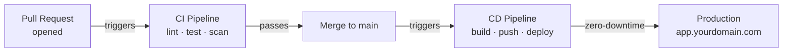
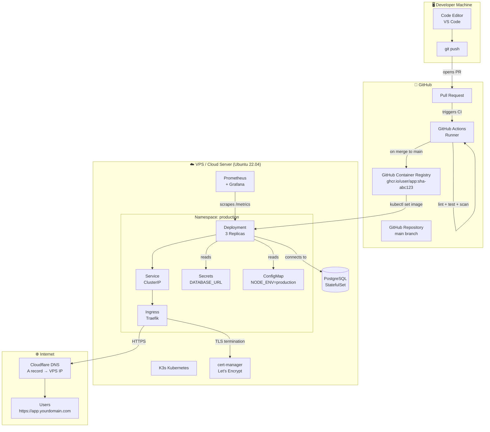
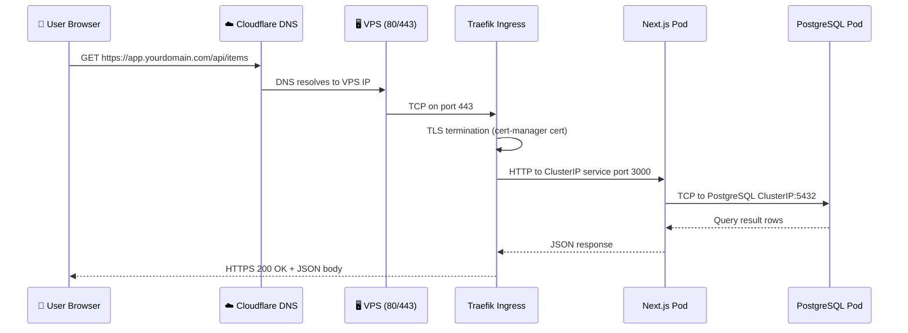
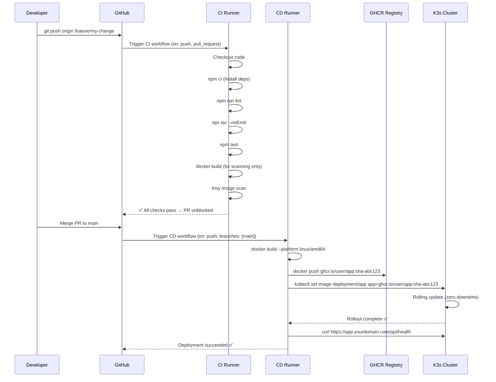
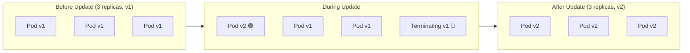

# Capstone CI/CD Project သို့ ကြိုဆိုပါတယ်

ဒါက အရာရာကို လက်တွေ့ဖြစ်လာစေမယ့် သင်ခန်းစာပဲ ဖြစ်ပါတယ်။ ယခင်သင်ခန်းစာ ရှစ်ခုက သင့်ကို တစ်ခုချင်းစီရဲ့ တူးလ်တွေကို သီးသန့်စီ သင်ကြားပေးခဲ့ပါတယ် — Linux အမိန့်ခေါ်ဆိုမှုများ (commands)၊ Git workflows၊ GitHub Actions syntax၊ Docker images၊ Kubernetes objects တို့ ဖြစ်ပါတယ်။ ဒီသင်ခန်းစာမှာတော့ အဲ့ဒီတူးလ်တွေ အားလုံးပေါင်းစပ်ပြီး **ရှင်သန်နေတဲ့ အလိုအလျောက် ထုတ်လုပ်ရေးစနစ် (living, automated production system)** တစ်ခု ဖြစ်လာမှာ ဖြစ်ပါတယ်။

ဒီပရောဂျက် ပြီးဆုံးသွားတဲ့အခါမှာ အောက်ပါတို့ တည်ဆောက်ပြီး Deploy လုပ်ပြီးသား ဖြစ်နေပါလိမ့်မယ်:

- PostgreSQL ကို အသုံးပြုထားတဲ့ **စစ်မှန်တဲ့ Next.js ဝဘ်အပလီကေးရှင်း** တစ်ခု
- Multi-stage builds တွေကို အသုံးပြုပြီး တည်ဆောက်ထားတဲ့ **လုံခြုံရေးမြှင့်တင်ထားသော Docker image** တစ်ခု
- Pull request တိုင်းမှာ linting၊ type checking၊ unit tests နဲ့ container security scanning များကို အလိုအလျောက် လုပ်ဆောင်ပေးမယ့် **CI pipeline** တစ်ခု
- `main` branch သို့ merge လုပ်တိုင်း container image အသစ်ကို ထုတ်ဝေပြီး တိုက်ရိုက်ရှိနေတဲ့ Kubernetes cluster ထဲသို့ deploy လုပ်ပေးမယ့် **CD pipeline** တစ်ခု
- စစ်မှန်တဲ့ ဒိုမိန်းအမည်နဲ့ အခမဲ့ Let's Encrypt လက်မှတ်ပါရှိတဲ့ **အလိုအလျောက် HTTPS**
- Prometheus metrics နဲ့ Grafana dashboards တို့ပါဝင်တဲ့ **Production observability**

`main` ထဲသို့ push လုပ်လိုက်တာနဲ့ လူကိုယ်တိုင်လုပ်စရာမလိုဘဲ production deployment ဖြစ်သွားပါမယ် — အားလုံး အလိုအလျောက်ပါ။

---

## လက်တွေ့မှာ "CI/CD" ဆိုတာ ဘာကိုဆိုလိုတာလဲ

Architecture ထဲ မဝင်ခင်မှာ၊ သင် အမှန်တကယ် ကြုံတွေ့ရမယ့် အသုံးအနှုန်းတွေကို အရင် နားလည်ထားရအောင်ပါ:

**Continuous Integration (CI)** ဆိုတာက သင့်ကုဒ်ကို push လုပ်လိုက်တာနဲ့ တစ်ပြိုင်နက် အလိုအလျောက် စစ်ဆေးပေးခြင်းကို ဆိုလိုပါတယ်။ Bot တစ်ကောင်က သင့်ရဲ့အလုပ်ကို စစ်ဆေးပေးပါတယ်:
- ကုဒ်စတိုင် စည်းမျဉ်းတွေကို လိုက်နာရဲ့လား။ (`eslint`)
- TypeScript အမှားများ ရှိနေလား။ (`tsc --noEmit`)
- Unit test အားလုံး အောင်မြင်ရဲ့လား။ (`vitest`)
- Docker image မှာ လူသိများတဲ့ CVE တွေ ရှိနေလား။ (`trivy`)

စစ်ဆေးမှု တစ်ခုခု မအောင်မြင်ရင် GitHub က pull request ကို merge လုပ်လို့မရအောင် တားဆီးပေးပါတယ်။ ဒါက `main` branch ကို အမြဲတမ်း deploy လုပ်လို့ရတဲ့ အနေအထားမှာ ရှိနေစေပါတယ်။

**Continuous Delivery / Deployment (CD)** ဆိုတာကတော့ pull request တစ်ခုကို `main` သို့ merge လိုက်တာနဲ့ သင့်အပလီကေးရှင်းရဲ့ ဗားရှင်းအသစ်ဟာ production ဆီကို အလိုအလျောက် ရောက်ရှိသွားတာကို ဆိုလိုပါတယ်။ ဘယ်သူမှ `docker build` ကို လက်နဲ့ လုပ်စရာမလိုဘူး၊ ဆာဗာထဲကို SSH နဲ့ manual ဝင်စရာမလိုဘူး၊ အက်ပ်ကို လက်နဲ့ restart ချစရာမလိုပါဘူး။ Pipeline က အားလုံးကို လုပ်ဆောင်ပေးပါတယ်။



---

## ပြီးပြည့်စုံသော စနစ်တည်ဆောက်ပုံ (System Architecture)

အောက်ပါပုံကတော့ အစမှအဆုံး သင်တည်ဆောက်ရမယ့် architecture အပြည့်အစုံ ဖြစ်ပါတယ်:



---

## နည်းပညာအစုအဝေး (Technology Stack) — တူးလ်တစ်ခုချင်းစီ၏ ရှင်းလင်းချက်

တူးလ်တစ်ခုချင်းစီကို *ဘာကြောင့်* ရွေးချယ်ခဲ့လဲဆိုတာကို နားလည်ခြင်းဟာ *ဘယ်လို* အသုံးပြုရမလဲဆိုတာကို သိရှိတာနဲ့ အတူတူပဲ အရေးကြီးပါတယ်။

| အလွှာ (Layer) | တူးလ် (Tool) | ဗားရှင်း (Version) | ဒီတူးလ်ကို ဘာကြောင့် ရွေးတာလဲ |
|-------|------|---------|--------------|
| **Application** | Next.js | 14 (App Router) | Server-side rendering၊ API routes နဲ့ TypeScript တို့ကို တပါတည်း ပါရှိစေပါတယ်။ Production ဆိုက်ထောင်ပေါင်းများစွာကို စွမ်းဆောင်ပေးနေပါတယ်။ |
| **Database** | PostgreSQL | 16 | လုပ်ငန်းသုံး စံနှုန်းမီ relational database ဖြစ်ပါတယ်။ ACID-compliant ဖြစ်ပြီး မည်သည့်စကေးမဆိုမှာ စမ်းသပ်ပြီးသား ဖြစ်ပါတယ်။ |
| **Container runtime** | Docker | 24+ | လူသုံးအများဆုံး container ပုံစံ ဖြစ်ပါတယ်။ တစ်ကြိမ်တည်ဆောက်၊ ဘယ်နေရာမှာမဆို Run နိုင်ပါတယ်။ |
| **Container image build** | Docker multi-stage | — | အရွယ်အစားသေးငယ်သော image များကို ထုတ်လုပ်ပေးပါတယ် (1.2 GB အစား 200 MB သာ)။ Final image ထဲမှာ build တူးလ်တွေ မပါဝင်တော့ပါ။ |
| **Container registry** | GitHub GHCR | — | ပုံမှန် repository တွေအတွက် အခမဲ့ဖြစ်ပြီး၊ GitHub Actions secrets တွေနဲ့ ချိတ်ဆက်ထားကာ အခြား credential တွေ ထပ်ထည့်စရာ မလိုပါ။ |
| **CI/CD automation** | GitHub Actions | — | GitHub နဲ့ တိုက်ရိုက်ချိတ်ဆက်ထားပြီး၊ အခမဲ့ခွဲတမ်း များပြားကာ (တစ်လကို မိနစ် 2,000)၊ ဈေးကွက်မှာ အသုံးအများဆုံး ဖြစ်ပါတယ်။ |
| **Security scanning** | Trivy | latest | CNCF မှ ထောက်ပံ့ပေးထားသော CVE scanner ဖြစ်ပါတယ်။ OS packages နဲ့ language dependencies များကို စက္ကန့်ပိုင်းအတွင်း စစ်ဆေးပေးပါတယ်။ |
| **Kubernetes distribution** | K3s | v1.29+ | ပုံမှန် Kubernetes API အပြည့်အစုံ ပါရှိပြီး 40% ပိုမိုသေးငယ်ပါတယ်။ Traefik၊ local-path storage နဲ့ CoreDNS တို့ တပါတည်း ပါဝင်လာပါတယ်။ |
| **Ingress controller** | Traefik | 2.x | K3s ထဲမှာ ကြိုတင်ထည့်သွင်းပေးထားပါတယ်။ HTTP မှ HTTPS သို့ လမ်းကြောင်းပြောင်းလဲပေးခြင်း (redirect) နဲ့ TLS termination များကို အလိုအလျောက် လုပ်ဆောင်ပေးပါတယ်။ |
| **Certificate management** | cert-manager | v1.14+ | Let's Encrypt certificate ထုတ်ပေးခြင်းနဲ့ သက်တမ်းတိုးခြင်းများကို အလိုအလျောက် လုပ်ဆောင်ပေးပါတယ်။ SSL ကို လက်နဲ့ ထပ်မံစီမံစရာ မလိုတော့ပါ။ |
| **Monitoring** | Prometheus | 2.x | Pull-based metrics စုဆောင်းမှုစနစ် ဖြစ်ပါတယ်။ Kubernetes အသိုက်အဝန်းမှာ မရှိမဖြစ် စံနှုန်းတစ်ခု ဖြစ်ပါတယ်။ |
| **Dashboards** | Grafana | 10.x | Prometheus ကို အခြေခံထားသော လှပတဲ့ dashboards များဖြစ်ပြီး သတိပေးချက်များ (alerting) လည်း ပါဝင်ပါတယ်။ |

---

## အခြေခံအဆောက်အအုံ လိုအပ်ချက်များ (Infrastructure Requirements)

သင်ခန်းစာ ၂ (Lesson 2) မစတင်မီ၊ အောက်ပါအရင်းအမြစ်များကို ပြင်ဆင်ထားပါ။ ဤကဏ္ဍတွင် သင့်အား မည်သည့်အရာများ လိုအပ်ပြီး ဘာကြောင့် လိုအပ်သည်ကို အတိအကျ ဖော်ပြထားပါသည်။

### ၁. GitHub အကောင့် (အခမဲ့)
Repository ကို လက်ခံထားရန်၊ GitHub Actions ကို run ရانနှင့် GHCR သို့ image များ push လုပ်ရန် GitHub အကောင့်တစ်ခု လိုအပ်ပါသည်။ မရှိသေးပါက [github.com](https://github.com) တွင် အကောင့်အသစ် ဖွင့်ပါ။

### ၂. VPS / Cloud ဆာဗာ တစ်ခု

သင့်ရဲ့ Kubernetes cluster ကို Virtual Private Server (VPS) ပေါ်မှာ run မှာ ဖြစ်ပါတယ်။ သီးသန့်ဆာဗာ ကြီးကြီးမားမား မလိုအပ်ပါဘူး — cloud VM သေးသေးလေးဆိုရင် လုံလောက်ပါပြီ။

**အနိမ့်ဆုံး သတ်မှတ်ချက်များ (Minimum Specifications):**
| အရင်းအမြစ် (Resource) | အနိမ့်ဆုံး (Minimum) | အကြံပြုချက် (Recommended) |
|----------|---------|-------------|
| CPU | 2 vCPUs | 4 vCPUs |
| RAM | 4 GB | 8 GB |
| Disk | 40 GB SSD | 80 GB SSD |
| OS | Ubuntu 22.04 LTS | Ubuntu 22.04 LTS |
| တည်နေရာ (Location) | မည်သည့်နေရာမဆို | သင့်အသုံးပြုသူများနှင့် နီးစပ်ရာ |

**အကြံပြုလိုသော VPS ဝန်ဆောင်မှုပေးသူများ:**

| ဝန်ဆောင်မှုပေးသူ | 4 GB ပလန် ကုန်ကျစရိတ် | မှတ်ချက်များ |
|----------|---------------|-------|
| Hetzner Cloud | တစ်လလျှင် ~$6 | ဈေးနှုန်းနှင့် စွမ်းဆောင်ရည် အကောင်းဆုံး။ ဥရောပ ဒေတာစင်တာ။ |
| DigitalOcean | တစ်လလျှင် $24 | မှတ်တမ်းအချက်အလက် (Documentation) ကောင်းမွန်ပြီး စတင်သူများအတွက် သင့်တော်သည်။ |
| Linode (Akamai) | တစ်လလျှင် $24 | တည်ငြိမ်သော စွမ်းဆောင်ရည်နှင့် SLA ကောင်းမွန်ခြင်း။ |
| AWS EC2 (t3.medium) | တစ်လလျှင် ~$30 | လုပ်ငန်းသုံးအဆင့်ရှိသော်လည်း ချိတ်ဆက်ရသည်မှာ ပို၍ရှုပ်ထွေးသည်။ |

<Callout type="tip" title="ဒီသင်ခန်းစာအတွက် Hetzner ကို အသုံးပြုပါ">
Hetzner ရဲ့ CX22 (4 vCPU၊ 4 GB RAM) က တစ်လကို ~$6 ဝန်းကျင်သာ ကျသင့်ပြီး ဒီပရောဂျက်အတွက် လွန်စွာ လုံလောက်ပါတယ်။ အခမဲ့ စမ်းသပ်ခရက်ဒစ် (Free trial credit) ကိုလည်း ရယူနိုင်ပါတယ်။ သင်ခန်းစာ ပြီးသွားတဲ့အခါ ကုန်ကျစရိတ်တွေ မရှိအောင် ဆာဗာကို ဖျက်ပစ်နိုင်ပါတယ်။
</Callout>

### 3. ဒိုမိန်းအမည် (ဒေသတွင်း စမ်းသပ်မှုအတွက် မလိုပါ၊ HTTPS အတွက် လိုအပ်သည်)

Let's Encrypt မှ TLS certificate ထုတ်ပေးနိုင်ရန် စစ်မှန်သော ဒိုမိန်းတစ်ခု လိုအပ်ပါသည်။ Namecheap၊ Google Domains သို့မဟုတ် Cloudflare တို့တွင် `.dev` သို့မဟုတ် `.xyz` ဒိုမိန်းများကို တစ်နှစ်လျှင် $5 အောက်ဖြင့် ဝယ်ယူနိုင်ပါသည်။

ဒိုမိန်းမရှိပါက စမ်းသပ်ရန်အတွက် `nip.io` သို့မဟုတ် `sslip.io` ကဲ့သို့သော အခမဲ့ subdomain ဝန်ဆောင်မှုများကို အသုံးပြုနိုင်သည်:
```
# nip.io သည် IP တစ်ခုကို hostname သို့ အလိုအလျောက် ချိတ်ဆက်ပေးသည်
# 1.2.3.4.nip.io → 1.2.3.4
```

---

## ကွန်ယက်တည်ဆောက်ပုံ (Networking Architecture) အသေးစိတ်

အသုံးပြုသူ၏ browser မှ သင့်ဒေတာဘေ့စ်ဆီသို့ တောင်းဆိုမှု (request) တစ်ခု ဘယ်လိုစီးဆင်းသွားလဲဆိုတာကို နားလည်ခြင်းဟာ production ပြဿနာများကို ဖြေရှင်းရာမှာ အလွန်အရေးကြီးပါတယ်။



ပါဝင်ပတ်သက်နေသော အဓိက ကွန်ယက် သဘောတရားများ:
- **Traefik** သည် တစ်ခုတည်းသော ဝင်ပေါက် (single entry point) ဖြစ်သည်။ ၎င်းသည် host node ပေါ်ရှိ port 80 နှင့် 443 တို့ကို ချိတ်ဆက်ထားပြီး TLS termination ကို လုပ်ဆောင်ပေးသည်။
- **ClusterIP Services** သည် လုပ်ငန်းခွင် (workload) တိုင်းကို တည်ငြိမ်သော အတွင်းပိုင်း IP လိပ်စာတစ်ခု ပေးအပ်သည်။ Pod များ ပြောင်းလဲသွားနိုင်သော်လည်း Service IP က ဘယ်တော့မှ မပြောင်းလဲပါ။
- ကလပ်စတာအတွင်းရှိ **DNS** ကို CoreDNS မှ စီမံခန့်ခွဲသည်။ သင့်အက်ပ်က PostgreSQL သို့ ချိတ်ဆက်ရာတွင် `postgres-service.production.svc.cluster.local` ကို အသုံးပြုသည်။

---

## GitOps စီးဆင်းမှု: `git push` ပြုလုပ်တိုင်း ဘာတွေဖြစ်ပျက်သလဲ

အလိုအလျောက် လုပ်ဆောင်ချက် အစဉ်လိုက် (automation sequence) ကို အဆင့်ချင်းစီ ကြည့်ရအောင်:



---

## Deployment ဗျူဟာ: Rolling Updates အကြောင်း ရှင်းလင်းချက်

Kubernetes သည် ဝန်ဆောင်မှုရပ်တန့်ခြင်း (downtime) လုံးဝမရှိဘဲ အပလီကေးရှင်း ဗားရှင်းအသစ်များကို deploy လုပ်နိုင်ရန် **rolling updates** ကို အသုံးပြုသည်:



သင့် Deployment manifest ထဲရှိ ဖွဲ့စည်းပုံ (Configuration):
```yaml
strategy:
  type: RollingUpdate
  rollingUpdate:
    maxSurge: 1        # Update လုပ်နေစဉ် Pod အသစ် ၁ ခုကို ပိုမိုဖန်တီးပါ
    maxUnavailable: 0  # အစားထိုးရန် အဆင်သင့်မဖြစ်မချင်း Pod တစ်ခုကိုမျှ ပိတ်မထားပါနှင့်
```

`maxUnavailable: 0` ဖြစ်နေခြင်းကြောင့် update လုပ်နေစဉ်အတွင်း သင့်အက်ပ်တွင် လမ်းကြောင်းများကို ဝန်ဆောင်မှုပေးနေသော ကျန်းမာရေးနှင့်ပြည့်စုံသော replica အနည်းဆုံး 3 ခု အမြဲတမ်း ရှိနေမည်ဖြစ်ပါသည်။

---

## ဤပရောဂျက်အတွက် ခန့်မှန်းကုန်ကျစရိတ်

| အရင်းအမြစ် (Resource) | ဝန်ဆောင်မှုပေးသူ | လစဉ် ကုန်ကျစရိတ် |
|----------|----------|-------------|
| VPS (4 GB RAM) | Hetzner CX22 | ~$6 |
| ဒိုမိန်းအမည် | Namecheap | ~$0.50/month ($5/year) |
| TLS လက်မှတ် | Let's Encrypt (cert-manager မှတဆင့်) | အခမဲ့ |
| Container registry | GitHub GHCR | အခမဲ့ (public အတွက်) |
| CI/CD runners | GitHub Actions (တစ်လလျှင် မိနစ် 2,000) | အခမဲ့ |
| DNS စီမံခန့်ခွဲမှု | Cloudflare | အခမဲ့ |
| **စုစုပေါင်း** | | **~$6.50/month** |

---

## သင်ခန်းစာ ဆယ်ခု အကျဉ်းချုပ်

| သင်ခန်းစာ | ခေါင်းစဉ် | သင် ဘာတွေ တည်ဆောက်ရမလဲ | ကြာချိန် |
|--------|-------|---------------|----------|
| **1** | Project Blueprint | Architecture သုံးသပ်ချက်၊ infrastructure ပြင်ဆင်ခြင်း | 30 မိနစ် |
| **2** | Sample App Setup | Next.js 14 + PostgreSQL + health check API | 35 မိနစ် |
| **3** | Optimized Dockerfile | 3-stage build၊ non-root user၊ standalone output | 35 မိနစ် |
| **4** | GitHub Actions CI | Parallel lint/test jobs + Trivy security scan | 40 မိနစ် |
| **5** | Registry Publish | GHCR push၊ immutable SHA tags၊ metadata-action | 30 မိနစ် |
| **6** | Provisioning K3s | VPS လုံခြုံရေးမြှင့်တင်ခြင်း၊ K3s ထည့်သွင်းခြင်း၊ kubeconfig remote ချိတ်ဆက်ခြင်း | 40 မိနစ် |
| **7** | Kubernetes Manifests | Deployment၊ Service၊ Ingress၊ ConfigMap၊ Secret | 45 မိနစ် |
| **8** | CD Automation | SSH deploy job၊ smoke test၊ auto-rollback | 45 မိနစ် |
| **9** | Domain & SSL | DNS A record၊ Cloudflare၊ cert-manager ClusterIssuer | 30 မိနစ် |
| **10** | Monitoring | Prometheus၊ Grafana dashboards၊ Slack alerts | 30 မိနစ် |

---

## မစတင်မီ လိုအပ်ချက်များ စာရင်း (Prerequisites Checklist)

သင်ခန်းစာ ၂ မစတင်မီ ဤအချက်များကို ပြီးမြောက်အောင် လုပ်ဆောင်ပါ:

**အကောင့်များ:**
- [ ] GitHub အကောင့် ဖွင့်ပြီးပြီ
- [ ] Ubuntu 22.04 LTS ဖြင့် VPS ကို ပြင်ဆင်ပြီးပြီ (SSH ဖြင့် ချိတ်ဆက်လို့ရနေပြီ)
- [ ] ဒိုမိန်းအမည် ဝယ်ယူပြီး registrar သို့ ညွှန်ပြပြီးပြီ

**ဒေသတွင်း တူးလ်များ (Local Tools):**
- [ ] `git` — ဗားရှင်း 2.40+
- [ ] `docker` — ဗားရှင်း 24+ (Docker Desktop လည်း ရပါတယ်)
- [ ] `node` — ဗားရှင်း 20 LTS
- [ ] `kubectl` — ထည့်သွင်းပြီးဖြစ်ကာ `$PATH` ထဲတွင် ရှိနေသည်
- [ ] SSH key pair တစ်စုံ (`~/.ssh/id_ed25519`) ဖန်တီးပြီးပြီ

**ကြိုတင်သိရှိထားရမည့် ဗဟုသုတများ:**
- [ ] Linux CLI ကို သက်တောင့်သက်သာ အသုံးပြုနိုင်ခြင်း (Linux သင်ခန်းစာ ၁ မှ ၁၀ အထိ)
- [ ] Git branching နှင့် pull requests များကို နားလည်ခြင်း
- [ ] GitHub Actions workflow တစ်ခုခုကို ရေးဖူးခြင်း
- [ ] Dockerfile ဆိုတာ ဘာလဲ၊ image တွေကို ဘလို build ရလဲ သိရှိခြင်း
- [ ] K3s cluster ထဲသို့ workload တစ်ခုခု deploy လုပ်ဖူးခြင်း

---

## အကျဉ်းချုပ်

ယခုဆိုရင် သင်သည် ရုပ်ပုံကားချပ် တစ်ခုလုံးကို နားလည်သွားပါပြီ: developer တစ်ဦးက ကုဒ်ကို push လုပ်သည်၊ GitHub Actions က အလိုအလျောက် စစ်ဆေးမှုများကို လုပ်ဆောင်သည်၊ Docker image ကို တည်ဆောက်ပြီး GHCR သို့ push လုပ်သည်၊ ထို့နောက် Kubernetes က ဝန်ဆောင်မှုမရပ်တန့်ဘဲ rolling update ကို လုပ်ဆောင်ပေးသည် — ဤအရာအားလုံးကို လူကိုယ်တိုင်လုပ်စရာမလိုဘဲ အလိုအလျောက် ဖြစ်ပေါ်သွားခြင်း ဖြစ်ပါသည်။

နောက်လာမည့် သင်ခန်းစာတွင် ဤ pipeline မှတဆင့် deploy လုပ်မည့် Next.js + PostgreSQL အပလီကေးရှင်းကို သင် တည်ဆောက်ရမည် ဖြစ်ပါသည်။