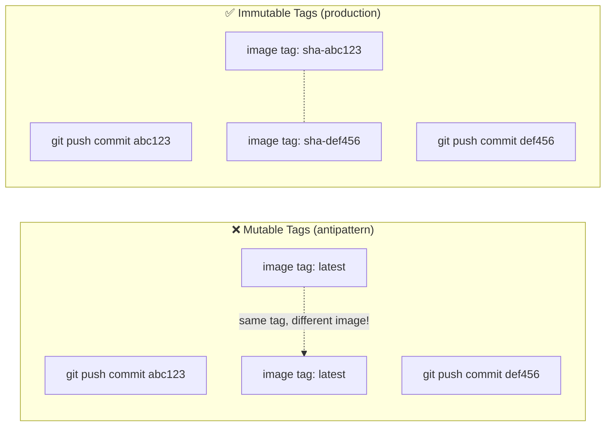
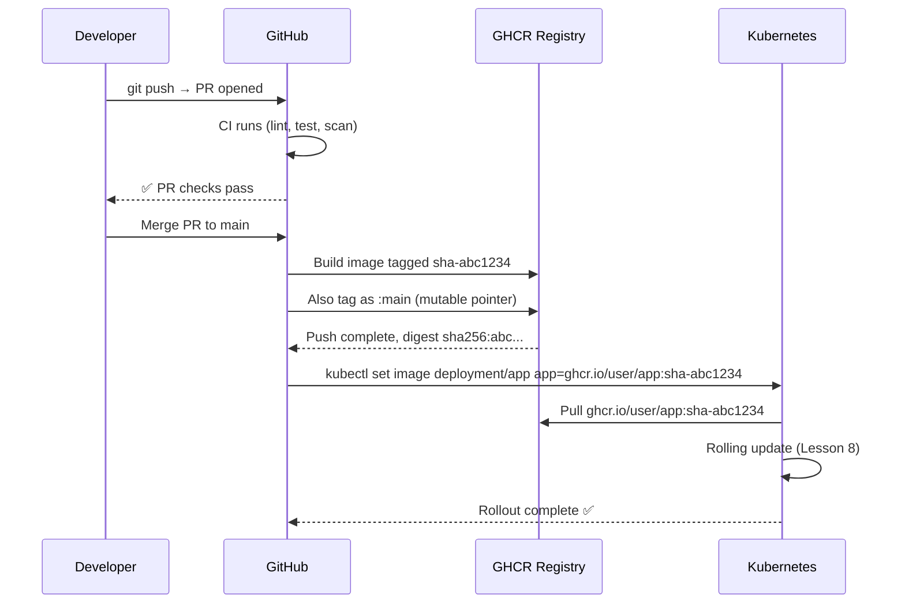

# GitHub Container Registry (GHCR)

GHCR ဆိုတာ GitHub ရဲ့ built-in container registry ဖြစ်ပြီး `ghcr.io` မှာ ရရှိနိုင်ပါတယ်။ Public repository တွေအတွက် အခမဲ့ဖြစ်ပြီး GitHub Actions နဲ့ တိုက်ရိုက် ချိတ်ဆက်အလုပ်လုပ်ပါတယ်။ သီးသန့် Docker Hub account တစ်ခု ထပ်လုပ်စရာမလိုဘဲ အတည်ပြုချက် (authentication) ပေးခြင်းကိုတော့ GitHub က workflow run တိုင်း အလိုအလျောက်ထည့်ပေးတဲ့ `GITHUB_TOKEN` နဲ့ပဲ ဆောင်ရွက်ပေးပါတယ်။

ဒီသင်ခန်းစာမှာတော့ CD image-publishing step ကို တည်ဆောက်သွားမှာ ဖြစ်ပါတယ် - immutable ဖြစ်တဲ့ Git SHA tag ပါတဲ့ Docker image ကို build လုပ်ပြီး GHCR ဆီ push တင်မှာ ဖြစ်ပါတယ်။

---

## Immutable Tags များက ဘာကြောင့် အရေးကြီးသလဲ

`latest` သို့မဟုတ် `v1` လိုမျိုး tag တွေကို သومတုံးခြင်းဟာ production မှာ antipattern တစ်ခု ဖြစ်ပါတယ်။ အဲ့ဒီ tag တွေဟာ ပြောင်းလဲနိုင်စွမ်း (mutable) ရှိပါတယ် - ဒီနေ့ `docker pull app:latest` လုပ်တာနဲ့ မနက်ဖြန် `docker pull` လုပ်တာဟာ ဘာပြောင်းလဲသွားမှန်း မသိရဘဲ လုံးဝကွဲပြားခြားနားတဲ့ image တွေ ဖြစ်သွားနိုင်ပါတယ်။

မှန်ကန်တဲ့ နည်းလမ်းကတော့: **Git commit SHA ကို image tag အဖြစ် အသုံးပြုဖို့** ဖြစ်ပါတယ်။ SHA ရဲ့ အားသာချက်တွေကတော့:
- **Immutable** — လုံးဝ မပြောင်းလဲပါဘူး
- **Traceable** — repository ထဲက တိကျတဲ့ commit ကို ရှာဖွေနိုင်ပါတယ်
- **Unique** — build တိုင်းဟာ တူညီတဲ့ SHA တစ်ခုတည်းကို မထုတ်ပေးပါဘူး (တစ်ခုချင်းစီ ထူးခြားပါတယ်)



GHCR image အမည်ပေးပုံ စည်းမျဉ်း (naming convention):
```
ghcr.io/GITHUB_USERNAME/REPO_NAME:TAG
ghcr.io/johndoe/capstone-app:sha-abc1234
```

---

## Step 1: သင်၏ Repository တွင် GHCR ကို Enable လုပ်ခြင်း

GHCR ကို GitHub account အားလုံးအတွက် default အနေနဲ့ enable လုပ်ထားပြီးသား ဖြစ်ပါတယ်။ ဒါပေမဲ့ image တွေ push တင်ဖို့ workflow ကို ခွင့်ပြုချက် (permission) ပေးရပါမယ်:

1. **GitHub → Settings → Developer Settings → Personal Access Tokens** ကို သွားပါ (optional ဖြစ်ပါတယ် — `GITHUB_TOKEN` က များသောအားဖြင့် လုံလောက်ပါတယ်)
2. သင့်ရဲ့ repository ထဲမှာ: **Settings → Actions → General → Workflow permissions** ကို သွားပါ
3. ဒါကို ရွေးပါ: **Read and write permissions**

<Callout type="tip" title="GITHUB_TOKEN ကို အသုံးပြုပါ — PAT မလိုအပ်ပါ">
GitHub Actions က အလိုအလျောက် ထည့်ပေးတဲ့ `GITHUB_TOKEN` မှာ အဆိုပါ workflow ပိုင်ဆိုင်တဲ့ repository အတွက် GHCR ဆီ image push တင်နိုင်တဲ့ permission ရှိပြီးသား ဖြစ်ပါတယ်။ အခြား organization တစ်ခုခုရဲ့ registry ဆီ push တင်နေတာ မဟုတ်ရင် Personal Access Token အသစ် ဖန်တီးစရာ မလိုပါဘူး။
</Callout>

---

## Step 2: Image ကို Public ပြုလုပ်ခြင်း (Optional)

Default အနေနဲ့ GHCR image တွေဟာ private ဖြစ်ပါတယ်။ သင့်ရဲ့ K3s cluster က registry credentials မပါဘဲ image တွေကို pull လုပ်နိုင်ဖို့ဆိုရင်:

1. Image ကို အနည်းဆုံး တစ်ကြိမ် push တင်ပါ (private အနေနဲ့ ဖန်တီးသွားပါလိမ့်မယ်)
2. **GitHub → Packages → capstone-app → Package settings** ဆီ သွားပါ
3. **Danger Zone → Change visibility** ဆီ ဆင်းပြီး → **Public** ကို ရွေးပါ

တနည်းအားဖြင့် private image တွေကို pull လုပ်ဖို့ Kubernetes ထဲက `imagePullSecrets` ကို သုံးလို့ရပါတယ် (သင်ခန်းစာ 7 မှာ ရှင်းပြထားပါတယ်)။ ဒီ course အတွက်တော့ public လုပ်လိုက်တာက ပိုပြီး ရိုးရှင်းပါတယ်။

---

## Step 3: CD Build & Push Workflow

`.github/workflows/cd.yml` ကို ဖန်တီးပါ:

```yaml
# .github/workflows/cd.yml
# Triggered only on pushes to main (after CI passes and PR is merged).
# Builds the Docker image, tags it with the Git SHA, and pushes to GHCR.

name: CD — Build & Push to GHCR

on:
  push:
    branches: [main]
    # Only trigger when application code changes, not infra-only changes
    paths-ignore:
      - "k8s/**"         # Kubernetes manifests don't need a new image
      - "docs/**"
      - "**.md"

# Only one deployment runs at a time (serialize deployments)
concurrency:
  group: production-deploy
  cancel-in-progress: false  # Don't cancel in-progress deploys

jobs:
  build-and-push:
    name: 🐳 Build & Push Image
    runs-on: ubuntu-22.04
    timeout-minutes: 30

    # Required permissions for GHCR push and attestation
    permissions:
      contents: read
      packages: write
      attestations: write
      id-token: write

    outputs:
      # Pass the full image reference (with digest) to subsequent jobs
      image: ${{ steps.meta.outputs.tags }}
      digest: ${{ steps.push.outputs.digest }}
      version: ${{ steps.meta.outputs.version }}

    steps:
      - name: Checkout repository
        uses: actions/checkout@v4

      # ── Set up Docker Buildx (multi-platform + advanced cache features) ──
      - name: Set up Docker Buildx
        uses: docker/setup-buildx-action@v3

      # ── Log in to GitHub Container Registry ──
      - name: Log in to GHCR
        uses: docker/login-action@v3
        with:
          registry: ghcr.io
          username: ${{ github.actor }}          # GitHub username that triggered the run
          password: ${{ secrets.GITHUB_TOKEN }}   # Automatically available in all workflows

      # ── Generate image tags and labels ──
      # docker/metadata-action generates sensible tags based on Git context
      - name: Extract Docker metadata
        id: meta
        uses: docker/metadata-action@v5
        with:
          images: ghcr.io/${{ github.repository }}
          tags: |
            # SHA tag: sha-abc1234 (immutable, 7 chars of Git SHA)
            type=sha,prefix=sha-,format=short
            # Branch tag: main (mutable, shows latest on branch)
            type=ref,event=branch
            # PR tag: pr-42 (for per-PR preview images)
            type=ref,event=pr
          labels: |
            org.opencontainers.image.title=Capstone App
            org.opencontainers.image.description=Production Next.js app with PostgreSQL
            org.opencontainers.image.vendor=${{ github.repository_owner }}

      # ── Build and push the Docker image ──
      - name: Build and push Docker image
        id: push
        uses: docker/build-push-action@v5
        with:
          context: .
          push: true
          platforms: linux/amd64  # Match your VPS architecture (most VPS = amd64)
          tags: ${{ steps.meta.outputs.tags }}
          labels: ${{ steps.meta.outputs.labels }}
          # Layer cache from GitHub Actions cache
          cache-from: type=gha
          cache-to: type=gha,mode=max
          # Pass Git SHA as build arg for /api/health version field
          build-args: |
            APP_VERSION=${{ github.sha }}

      # ── Generate SBOM and provenance attestation ──
      # This adds a cryptographic signature to the image — proves it was built
      # by this exact GitHub Actions workflow (supply chain security)
      - name: Attest build provenance
        uses: actions/attest-build-provenance@v1
        with:
          subject-name: ghcr.io/${{ github.repository }}
          subject-digest: ${{ steps.push.outputs.digest }}
          push-to-registry: true

      # ── Print a summary for easy debugging ──
      - name: Print pushed image reference
        run: |
          echo "### 🐳 Image pushed to GHCR" >> $GITHUB_STEP_SUMMARY
          echo "" >> $GITHUB_STEP_SUMMARY
          echo "**Image:** \`ghcr.io/${{ github.repository }}:sha-$(echo ${{ github.sha }} | cut -c1-7)\`" >> $GITHUB_STEP_SUMMARY
          echo "**Digest:** \`${{ steps.push.outputs.digest }}\`" >> $GITHUB_STEP_SUMMARY
          echo "**Commit:** \`${{ github.sha }}\`" >> $GITHUB_STEP_SUMMARY
```

---

## `docker/metadata-action` Tags အကြောင်း နားလည်ခြင်း

Metadata action က image တစ်ခုတည်းအတွက် tags பலခုကို ထုတ်ပေးပါတယ်:

| Tag | Example | Purpose |
|-----|---------|---------|
| `sha-abc1234` | `ghcr.io/user/app:sha-abc1234` | Immutable ဖြစ်ပါတယ်။ K8s deployments တွေမှာ သုံးပါတယ်။ |
| `main` | `ghcr.io/user/app:main` | Mutable ဖြစ်ပါတယ်။ `main` branch ပေါ်က latest ကို အမြဲညွှန်ပြနေပါတယ်။ |
| `pr-42` | `ghcr.io/user/app:pr-42` | Pull request preview environments တွေအတွက် ဖြစ်ပါတယ်။ |

သင့်ရဲ့ Kubernetes Deployment (သင်ခန်းစာ 7) မှာ SHA tag ကို သုံးသွားမှာ ဖြစ်ပါတယ်။ ဆိုလိုတာကတော့:
- ပိုသစ်တဲ့ image တွေ push တင်ပြီးသွားရင်တောင် **Kubernetes က ဘယ် image ကို run ရမလဲဆိုတာ တိတိကျကျ သိပါတယ်**
- **Rolling back** လုပ်တာဟာလည်း ရှေးဟောင်း SHA တစ်ခုနဲ့ `kubectl set image` လုပ်ရုံနဲ့ လွယ်ကူပါတယ်။

---

## Build Provenance (Supply Chain Security) အကြောင်း နားလည်ခြင်း

`attest-build-provenance` step ဟа သင့်ရဲ့ image ကို တိကျတဲ့ commit ကနေ GitHub Actions က တည်ဆောက်ခဲ့ကြောင်း cryptographic proof (စာဝှက်စနစ် သက်သေခံချက်) တစ်ခုကို ဖန်တီးပေးပါတယ်:

```bash
# Verify an image's provenance locally
gh attestation verify oci://ghcr.io/yourusername/capstone-app:sha-abc1234 \
  --owner yourusername

# Output:
# Loaded digest sha256:abc...
# Loaded 1 attestation from GitHub API
# ✓ Verification succeeded!
```

ဒါဟာ [SLSA](https://slsa.dev/) (Supply-chain Levels for Software Artifacts) ရဲ့ အစိတ်အပိုင်း တစ်ခု ဖြစ်ပါတယ် - supply chain တိုက်ခိုက်မှုတွေကို ကာကွယ်ပေးတဲ့ framework တစ်ခုပါ။ အကယ်၍ တစ်စုံတစ်ယောက်က သင့်ရဲ့ CI runner ကို ထိုးဖောက်ပြီး malicious image တစ်ခု push တင်ခဲ့မယ်ဆိုရင် attestation စစ်ဆေးချက်က အောင်မြင်မှာ မဟုတ်ပါဘူး။

---

## Push တင်ထားသော Image ကို စစ်ဆေးခြင်း (Inspecting)

Workflow run ပြီးသွားတဲ့အခါ:

```bash
# List available tags for your image
docker manifest inspect ghcr.io/YOUR_USERNAME/capstone-app:main

# Pull and run the exact image that's in production
docker pull ghcr.io/YOUR_USERNAME/capstone-app:sha-abc1234
docker run -p 3000:3000 \
  -e DATABASE_URL="postgres://..." \
  ghcr.io/YOUR_USERNAME/capstone-app:sha-abc1234

# Inspect image labels (OCI metadata)
docker inspect ghcr.io/YOUR_USERNAME/capstone-app:sha-abc1234 | \
  jq '.[0].Config.Labels'
# {
#   "org.opencontainers.image.revision": "abc1234...",
#   "org.opencontainers.image.source": "https://github.com/user/capstone-app",
#   "org.opencontainers.image.created": "2024-01-15T10:30:00.000Z"
# }
```

---

## Multi-Platform Builds (ARM Support)

သင့်ရဲ့ VPS က ARM ပေါ်မှာ run နေတယ်ဆိုရင် (ဥပမာ - AWS Graviton, Ampere, Apple Silicon VM) platforms ထဲကို `linux/arm64` ကို ထည့်ပေးပါ:

```yaml
# In build-and-push step:
platforms: linux/amd64,linux/arm64

# QEMU is needed for cross-compilation
- name: Set up QEMU (for ARM builds)
  uses: docker/setup-qemu-action@v3
  before: docker/setup-buildx-action@v3
```

<Callout type="warning" title="ARM Builds များသည် နှေးကွေးပါသည်">
amd64 runner တစ်ခုပေါ်မှာ (QEMU emulation မှတစ်ဆင့်) ARM အတွက် cross-compile လုပ်တာဟာ amd64 သက်သက်အတွက် ၂ မိနစ်ကနေ ၄ မိနစ်လောက်ပဲ ကြာတာနဲ့ယှဉ်ရင် ၁၀ မိနစ်ကနေ မိနစ် ၂၀ လောက်အထိ ကြာနိုင်ပါတယ်။ ARM ဆီ deploy လုပ်ဖို့ မရှိဘူးဆိုရင် `linux/amd64` မှာပဲ ဆက်ထားပါ။
</Callout>

---

## Full GitOps Tag Lifecycle



---

## GHCR Storage နှင့် Billing

| Repository Type | Storage | Bandwidth |
|----------------|---------|-----------|
| Public | အကန့်အသတ်မရှိ (Unlimited) | အကန့်အသတ်မရှိ (Unlimited) |
| Private (free plan) | 500 MB | 1 GB/month |
| Private (paid plans) | ပြောင်းလဲနိုင်သည် | ပြောင်းလဲနိုင်သည် |

ဒီ capstone (public repository) အတွက်တော့ storage နဲ့ bandwidth က အကန့်အသတ်မရှိပါဘူး။ private repository တွေအတွက်တောင်မှ 180 MB image တစ်ခုဟာ free tier ထဲမှာ အေးအေးလူလူ ဆံ့ပါတယ်။

**Image Retention Policy** — ဟောင်းနေတဲ့ image ရာပေါင်းများစွာ စုပုံမနေစေရန်:

```yaml
# Add this step to your CD workflow to delete images older than 7 days
- name: Delete old container versions
  uses: actions/delete-package-versions@v5
  with:
    package-name: "capstone-app"
    package-type: "container"
    min-versions-to-keep: 5        # Always keep the 5 most recent
    delete-only-untagged-versions: false
    ignore-versions: "^sha-"       # Keep all SHA-tagged versions
```

---

## Push အောင်မြင်ကြောင်း စစ်ဆေးခြင်း

သင့်ရဲ့ CD workflow run ပြီးသွားတဲ့အခါ image ကို ဝင်ရောက်အသုံးပြုလို့ရကြောင်း စစ်ဆေးပါ:

```bash
# From your local machine (must be logged in to GHCR)
docker login ghcr.io -u YOUR_GITHUB_USERNAME -p YOUR_GITHUB_PAT

# Pull the image
docker pull ghcr.io/YOUR_USERNAME/capstone-app:main

# Verify it runs
docker run --rm ghcr.io/YOUR_USERNAME/capstone-app:main node --version
# v20.x.x
```

တနည်းအားဖြင့် GitHub UI ကို စစ်ဆေးပါ: **Repository →Packages → capstone-app** — tags အားလုံး၊ အရွယ်အစားနဲ့ push history တွေနဲ့အတူ image ကို တွေ့ရပါလိမ့်မယ်။

---

## အကျဉ်းချုပ်

ယခုအခါမှာ သင်ဟာ အောက်ပါအချက်တွေ လုပ်ဆောင်ပေးနိုင်တဲ့ CD workflow တစ်ခုကို ပိုင်ဆိုင်သွားပါပြီ:
- **`main` ဆီ merge လုပ်တဲ့အခါမှသာ** trigger ဖြစ်ပါတယ် (CI က PR ပေါ်မှာ run ပြီးသားဖြစ်လို့ ထပ်လုပ်စရာ မလိုပါဘူး)
- ခြေရာခံနိုင်စွမ်းနဲ့ လုံခြုံစွာ roll back လုပ်နိုင်ဖို့အတွက် image တွေကို **immutable ဖြစ်တဲ့ Git SHA** (`sha-abc1234`) နဲ့ tag လုပ်ပါတယ်
- ထပ်ခါထပ်ခါ Docker layer build လုပ်ရတာ မြန်ဆန်စေဖို့ **GitHub Actions cache** ကို သုံးပါတယ်
- supply chain security (SLSA compliance) အတွက် **build provenance attestations** တွေကို ဖန်တီးပေးပါတယ်
- debugging လုပ်ရလွယ်ကူစေရန် တိကျတဲ့ image reference ပါတဲ့ **GitHub Actions summary** တစ်ခုကို ထုတ်ပေးပါတယ်
- တသမတ်တည်းရှိပြီး ဖွဲ့စည်းတည်ဆောက်ထားတဲ့ image labels တွေကို ဖန်တီးပေးဖို့ `docker/metadata-action` ကို အသုံးပြုပါတယ်

နောက်လာမယ့် သင်ခန်းစာမှာတော့ VPS ပေါ်မှာ production K3s server ကို provision လုပ်ပြီး deployments တွေကို လက်ခံဖို့ ပြင်ဆင်သွားမှာ ဖြစ်ပါတယ်။