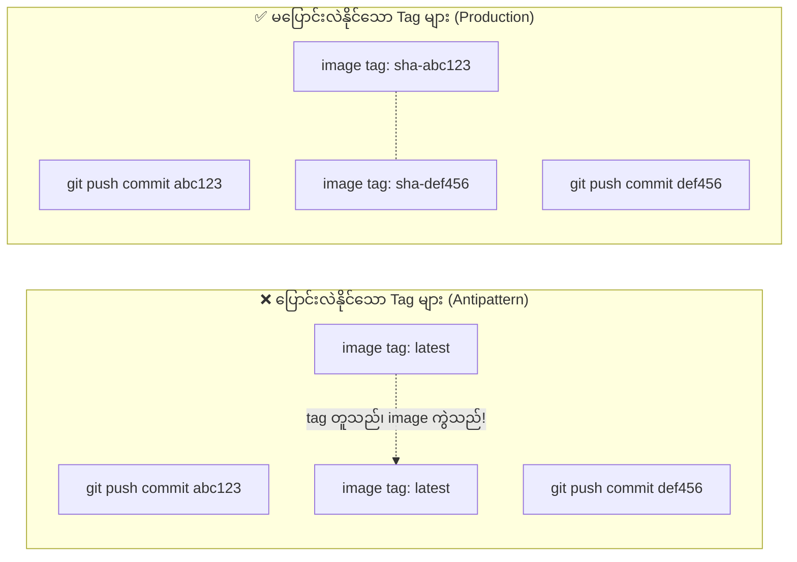
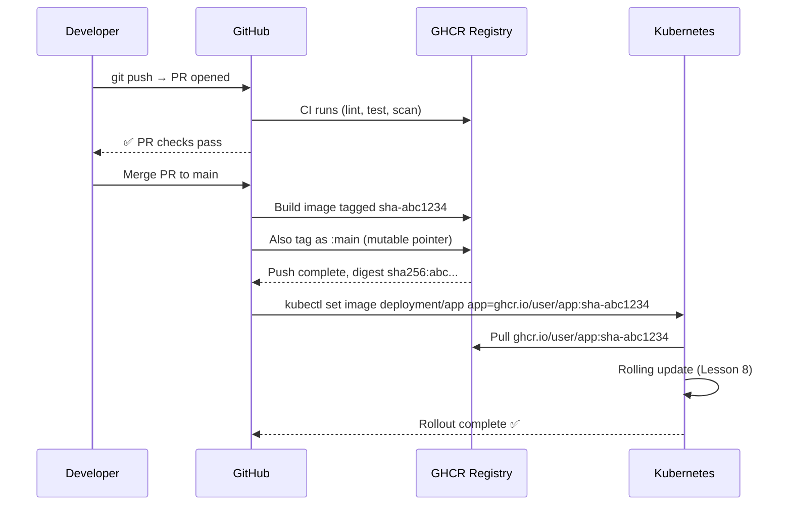

# GitHub Container Registry (GHCR)

GHCR သည် GitHub ၏ ပါဝင်ပြီးသား container registry တစ်ခုဖြစ်ပြီး `ghcr.io` တွင် ရရှိနိုင်ပါသည်။ ၎င်းသည် public repository များအတွက် အခမဲ့ဖြစ်ပြီး GitHub Actions နှင့် တိုက်ရိုက်ချိတ်ဆက်လုပ်ဆောင်နိုင်ပါသည်။ သီးသန့် Docker Hub အကောင့်တစ်ခု ထပ်ဖွင့်ရန် မလိုအပ်ဘဲ, authentication ကိုလည်း workflow တစ်ခုချင်းစီတိုင်းတွင် GitHub မှ အလိုအလျောက်ထည့်သွင်းပေးသည့် `GITHUB_TOKEN` ဖြင့် ဖြေရှင်းပေးပါသည်။

ဤသင်ခန်းစာတွင် သင်သည် CD image-publishing အဆင့်ကို ပြုလုပ်မည်ဖြစ်သည်: Docker image ကို မပြောင်းလဲနိုင်သော (immutable) Git SHA tag ဖြင့် တည်ဆောက်ပြီး GHCR သို့ တင်မည်ဖြစ်ပါသည်။

---

## Immutable Tags များက 왜 အရေးကြီးသနည်း

`latest` သို့မဟုတ် `v1` ကဲ့သို့သော tag များကို အသုံးပြုခြင်းသည် production အတွက် မသင့်လျော်သော (antipattern) ဖြစ်သည်။ ၎င်းတို့သည် ပြောင်းလဲနိုင်သောကြောင့်ဖြစ်သည် — ယနေ့ `docker pull app:latest` ဟု ခေါ်ယူထားခြင်းသည် မနက်ဖြန်တွင် လုံးဝကွဲပြားခြားနားသော image များကို ရရှိစေနိုင်ပြီး ဘာတွေပြောင်းလဲသွားမှန်း သိရှိရန် နည်းလမ်းမရှိပါ။

မှန်ကန်သောနည်းလမ်းမှာ: **Git commit SHA ကို image tag အဖြစ် အသုံးပြုရန်** ဖြစ်သည်။ SHA ၏ အကျိုးကျေးဇူးများမှာ:
- **မပြောင်းလဲနိုင်ခြင်း (Immutable)** — ဘယ်တော့မှ မပြောင်းလဲပါ
- **ခြေရာခံနိုင်ခြင်း (Traceable)** — သင့် repository ထဲရှိ တိကျသော commit ကို ရှာဖွေနိုင်သည်
- **ထူးခြားခြင်း (Unique)** — မည်သည့် build နှစ်ခုကမှ SHA တူညီစွာ မထွက်လာပါ



GHCR image အမည်ပေးပုံစံ (Convention):
```
ghcr.io/GITHUB_USERNAME/REPO_NAME:TAG
ghcr.io/johndoe/capstone-app:sha-abc1234
```

---

## အဆင့် ၁: သင့် Repository တွင် GHCR ကို ဖွင့်ပါ

GitHub အကောင့်အားလုံးအတွက် GHCR ကို မူလအားဖြင့် ဖွင့်ထားပြီးသား ဖြစ်ပါသည်။ သို့သော်လည်း workflow အား image တင်ခွင့် (permission) ပေးရပါမည်:

1. **GitHub → Settings → Developer Settings → Personal Access Tokens** သို့ သွားပါ (optional — များသောအားဖြင့် `GITHUB_TOKEN` က လုံလောက်ပါတယ်)
2. သင့် repository ထဲတွင်: **Settings → Actions → General → Workflow permissions** သို့ သွားပါ
3. ဤအချက်ကို ရွေးချယ်ပါ: **Read and write permissions**

<Callout type="tip" title="GITHUB_TOKEN ကို အသုံးပြုပါ — PAT မလိုအပ်ပါ">
GitHub Actions မှ အလိုအလျောက်ထည့်သွင်းပေးသော `GITHUB_TOKEN` တွင် workflow ပိုင်ဆိုင်သည့် repository အတွက် GHCR သို့ image တင်ရန် ခွင့်ပြုချက် ပါရှိပြီးသားဖြစ်သည်။ အခြားအဖွဲ့အစည်း (organization) တစ်ခုခု၏ registry သို့ တင်နေခြင်းမဟုတ်ပါက Personal Access Tokens အသစ်ဖန်တီးရန် မလိုအပ်ပါ။
</Callout>

---

## အဆင့် ၂: သင့် Image ကို Public ဖြစ်အောင် ပြုလုပ်ပါ (Optional)

မူလအားဖြင့် GHCR image များသည် private ဖြစ်ကြသည်။ သင့် K3s cluster မှ registry credentials မပါဘဲ image များကို pull လုပ်နိုင်ရန်:

1. Image ကို အနည်းဆုံး တစ်ကြိမ် တင်ပါ (private အဖြစ် ဖန်တီးပေးလိမ့်မည်)
2. **GitHub → Packages → capstone-app → Package settings** သို့ သွားပါ
3. **Danger Zone → Change visibility** သို့ ဆင်းပြီး → **Public** ကို ရွေးချယ်ပါ

တနည်းအားဖြင့် Kubernetes တွင် `imagePullSecrets` ကို အသုံးပြုနိုင်သည် (သင်ခန်းစာ ၇ တွင် ရှင်းပြထားသည်)။ ဤသင်တန်းအတွက်မူ public ဖြစ်အောင် ပြုလုပ်ခြင်းက ပို၍ ရိုးရှင်းပါသည်။

---

## အဆင့် ၃: CD Build & Push Workflow

`.github/workflows/cd.yml` ကို ဖန်တီးပါ:

```yaml
# .github/workflows/cd.yml
# Triggered only on pushes to main (after CI passes and PR is merged).
# Builds the Docker image, tags it with the Git SHA, and pushes to GHCR.

name: CD — Build & Push to GHCR

on:
  push:
    branches: [main]
    # Only trigger when application code changes, not infra-only changes
    paths-ignore:
      - "k8s/**"         # Kubernetes manifests don't need a new image
      - "docs/**"
      - "**.md"

# Only one deployment runs at a time (serialize deployments)
concurrency:
  group: production-deploy
  cancel-in-progress: false  # Don't cancel in-progress deploys

jobs:
  build-and-push:
    name: 🐳 Build & Push Image
    runs-on: ubuntu-22.04
    timeout-minutes: 30

    # Required permissions for GHCR push and attestation
    permissions:
      contents: read
      packages: write
      attestations: write
      id-token: write

    outputs:
      # Pass the full image reference (with digest) to subsequent jobs
      image: ${{ steps.meta.outputs.tags }}
      digest: ${{ steps.push.outputs.digest }}
      version: ${{ steps.meta.outputs.version }}

    steps:
      - name: Checkout repository
        uses: actions/checkout@v4

      # ── Set up Docker Buildx (multi-platform + advanced cache features) ──
      - name: Set up Docker Buildx
        uses: docker/setup-buildx-action@v3

      # ── Log in to GitHub Container Registry ──
      - name: Log in to GHCR
        uses: docker/login-action@v3
        with:
          registry: ghcr.io
          username: ${{ github.actor }}          # GitHub username that triggered the run
          password: ${{ secrets.GITHUB_TOKEN }}   # Automatically available in all workflows

      # ── Generate image tags and labels ──
      # docker/metadata-action generates sensible tags based on Git context
      - name: Extract Docker metadata
        id: meta
        uses: docker/metadata-action@v5
        with:
          images: ghcr.io/${{ github.repository }}
          tags: |
            # SHA tag: sha-abc1234 (immutable, 7 chars of Git SHA)
            type=sha,prefix=sha-,format=short
            # Branch tag: main (mutable, shows latest on branch)
            type=ref,event=branch
            # PR tag: pr-42 (for per-PR preview images)
            type=ref,event=pr
          labels: |
            org.opencontainers.image.title=Capstone App
            org.opencontainers.image.description=Production Next.js app with PostgreSQL
            org.opencontainers.image.vendor=${{ github.repository_owner }}

      # ── Build and push the Docker image ──
      - name: Build and push Docker image
        id: push
        uses: docker/build-push-action@v5
        with:
          context: .
          push: true
          platforms: linux/amd64  # Match your VPS architecture (most VPS = amd64)
          tags: ${{ steps.meta.outputs.tags }}
          labels: ${{ steps.meta.outputs.labels }}
          # Layer cache from GitHub Actions cache
          cache-from: type=gha
          cache-to: type=gha,mode=max
          # Pass Git SHA as build arg for /api/health version field
          build-args: |
            APP_VERSION=${{ github.sha }}

      # ── Generate SBOM and provenance attestation ──
      # This adds a cryptographic signature to the image — proves it was built
      # by this exact GitHub Actions workflow (supply chain security)
      - name: Attest build provenance
        uses: actions/attest-build-provenance@v1
        with:
          subject-name: ghcr.io/${{ github.repository }}
          subject-digest: ${{ steps.push.outputs.digest }}
          push-to-registry: true

      # ── Print a summary for easy debugging ──
      - name: Print pushed image reference
        run: |
          echo "### 🐳 Image pushed to GHCR" >> $GITHUB_STEP_SUMMARY
          echo "" >> $GITHUB_STEP_SUMMARY
          echo "**Image:** \`ghcr.io/${{ github.repository }}:sha-$(echo ${{ github.sha }} | cut -c1-7)\`" >> $GITHUB_STEP_SUMMARY
          echo "**Digest:** \`${{ steps.push.outputs.digest }}\`" >> $GITHUB_STEP_SUMMARY
          echo "**Commit:** \`${{ github.sha }}\`" >> $GITHUB_STEP_SUMMARY
```

---

## `docker/metadata-action` Tag များကို နားလည်ခြင်း

Metadata action သည် image တစ်ခုတည်းအတွက် tag များစွာကို ဖန်တီးပေးသည်:

| Tag | ဥပမာ | ရည်ရွယ်ချက် |
|-----|---------|---------|
| `sha-abc1234` | `ghcr.io/user/app:sha-abc1234` | မပြောင်းလဲနိုင်ပါ။ K8s deployments များတွင် အသုံးပြုသည်။ |
| `main` | `ghcr.io/user/app:main` | ပြောင်းလဲနိုင်ပါသည်။ `main` ပေါ်ရှိ နောက်ဆုံးဗားရှင်းကို အမြဲညွှန်ပြနေသည်။ |
| `pr-42` | `ghcr.io/user/app:pr-42` | Pull request preview ပတ်ဝန်းကျင်များအတွက် ဖြစ်သည်။ |

သင့်၏ Kubernetes Deployment (သင်ခန်းစာ ၇) တွင် SHA tag ကို အသုံးပြုမည်ဖြစ်သည်။ ဆိုလိုသည်မှာ:
- ပိုမိုသစ်လွင်သော image များကို တင်ပြီးနောက်ပိုင်းတွင်ပင် **Kubernetes သည် မည်သည့် image ကို run ရမည်ကို တိကျစွာသိရှိသည်**
- **Roll back ပြုလုပ်ခြင်း** သည် ရှေးဟောင်း SHA တစ်ခုဖြင့် `kubectl set image` လုပ်ရုံမျှဖြင့် လွယ်ကူသည်

---

## Build Provenance (Supply Chain Security) ကို နားလည်ခြင်း

`attest-build-provenance` အဆင့်သည် သင့် image ကို သင်၏ သီးသန့် commit မှ GitHub Actions ဖြင့် တည်ဆောက်ခဲ့ကြောင်း cryptographic သက်သေအထောက်အထားကို ဖန်တီးပေးသည်:

```bash
# Verify an image's provenance locally
gh attestation verify oci://ghcr.io/yourusername/capstone-app:sha-abc1234 \
  --owner yourusername

# Output:
# Loaded digest sha256:abc...
# Loaded 1 attestation from GitHub API
# ✓ Verification succeeded!
```

၎င်းသည် [SLSA](https://slsa.dev/) (Supply-chain Levels for Software Artifacts) ၏ အစိတ်အပိုင်းတစ်ခုဖြစ်သည် — supply chain တိုက်ခိုက်မှုများကို ကာကွယ်ရန် ဖရိန်ဝေါ့ခ်တစ်ခု ဖြစ်သည်။ အကယ်၍ တစ်စုံတစ်ဦးသည် သင့် CI runner ကို ထိုးဖောက်ဝင်ရောက်ပြီး မကောင်းသော image တစ်ခုကို တင်လိုက်လျှင် attestation စစ်ဆေးမှု မအောင်မြင်ပါ။

---

## တင်ထားသော Image ကို စစ်ဆေးခြင်း

Workflow အလုပ်လုပ်ပြီးနောက်:

```bash
# List available tags for your image
docker manifest inspect ghcr.io/YOUR_USERNAME/capstone-app:main

# Pull and run the exact image that's in production
docker pull ghcr.io/YOUR_USERNAME/capstone-app:sha-abc1234
docker run -p 3000:3000 \
  -e DATABASE_URL="postgres://..." \
  ghcr.io/YOUR_USERNAME/capstone-app:sha-abc1234

# Inspect image labels (OCI metadata)
docker inspect ghcr.io/YOUR_USERNAME/capstone-app:sha-abc1234 | \
  jq '.[0].Config.Labels'
# {
#   "org.opencontainers.image.revision": "abc1234...",
#   "org.opencontainers.image.source": "https://github.com/user/capstone-app",
#   "org.opencontainers.image.created": "2024-01-15T10:30:00.000Z"
# }
```

---

## ပလက်ဖောင်းစုံ Build ပြုလုပ်ခြင်း (ARM Support)

သင့် VPS သည် ARM ပေါ်တွင် အလုပ်လုပ်နေပါက (ဥပမာ- AWS Graviton, Ampere, Apple Silicon VM) `linux/arm64` ကို platforms များတွင် ထည့်ပါ:

```yaml
# In build-and-push step:
platforms: linux/amd64,linux/arm64

# QEMU is needed for cross-compilation
- name: Set up QEMU (for ARM builds)
  uses: docker/setup-qemu-action@v3
  before: docker/setup-buildx-action@v3
```

<Callout type="warning" title="ARM Build များသည် နှေးကွေးသည်">
amd64 runner တစ်ခုပေါ်တွင် (QEMU emulation မှတဆင့်) ARM အတွက် cross-compile လုပ်ခြင်းသည် amd64 သက်သက်အတွက် ၂-၄ မိနစ် ကြာတတ်သည်နှင့် နှိုင်းယှဉ်ပါက ၁၀-၂၀ မိနစ်အထိ ကြာနိုင်ပါသည်။ ARM သို့ deployment မလုပ်နေပါက `linux/amd64` ကိုသာ ဆက်လက်အသုံးပြုပါ။
</Callout>

---

## GitOps Tag သက်တမ်းစက်ဝန်း အပြည့်အစုံ



---

## GHCR သိုလှောင်မှုနှင့် ငွေပေးချေမှု (Storage and Billing)

| Repository အမျိုးအစား | သိုလှောင်မှု (Storage) | Bandwidth |
|----------------|---------|-----------|
| Public | အကန့်အသတ်မရှိ | အကန့်အသတ်မရှိ |
| Private (အခမဲ့ အစီအစဉ်) | 500 MB | 1 GB/လ |
| Private (ငွေပေးချေရသော အစီအစဉ်များ) | ကွဲပြားသည် | ကွဲပြားသည် |

ဤ capstone (public repository) အတွက် သိုလှောင်မှုနှင့် bandwidth သည် အကန့်အသတ်မရှိပါ။ Private repository များအတွက်ပင်လျှင် 180 MB image တစ်ခုသည် အခမဲ့အဆင့်တွင် အဆင်ပြေစွာ ဆံ့ဝင်ပါသည်။

**Image သိမ်းဆည်းထားမှု မူဝါဒ (Retention Policy)** — ဟောင်းနွမ်းနေသော image ရာပေါင်းများစွာ စုပုံလာခြင်းကို ရှောင်ရှားရန်:

```yaml
# Add this step to your CD workflow to delete images older than 7 days
- name: Delete old container versions
  uses: actions/delete-package-versions@v5
  with:
    package-name: "capstone-app"
    package-type: "container"
    min-versions-to-keep: 5        # Always keep the 5 most recent
    delete-only-untagged-versions: false
    ignore-versions: "^sha-"       # Keep all SHA-tagged versions
```

---

## Push လုပ်ခြင်း အောင်မြင်ကြောင်း စစ်ဆေးပါ

သင့် CD workflow အလုပ်လုပ်ပြီးနောက် image ကို ဝင်ရောက်အသုံးပြုနိုင်ကြောင်း စစ်ဆေးပါ:

```bash
# From your local machine (must be logged in to GHCR)
docker login ghcr.io -u YOUR_GITHUB_USERNAME -p YOUR_GITHUB_PAT

# Pull the image
docker pull ghcr.io/YOUR_USERNAME/capstone-app:main

# Verify it runs
docker run --rm ghcr.io/YOUR_USERNAME/capstone-app:main node --version
# v20.x.x
```

သို့မဟုတ် GitHub UI ကို စစ်ဆေးပါ: **Repository → Packages → capstone-app** — ၎င်းတွင် tag အားလုံး၊ အရွယ်အစားနှင့် push လုပ်ခဲ့သည့် မှတ်တမ်းများနှင့်တကွ image ကို သင်တွေ့မြင်ရပါမည်။

---

## အနှစ်ချုပ်

ယခုတွင် သင့်တွင် အောက်ပါအချက်များပါဝင်သော CD workflow တစ်ခု ရှိနေပါပြီ:
- **`main` သို့ merge လုပ်သည့်အခါမှသာ** အလုပ်လုပ်သည် (CI သည် PR ပေါ်တွင် ပြီးသွားပြီဖြစ်၍ ထပ်လုပ်ရန်မလိုပါ)
- ခြေရာခံနိုင်ရန်နှင့် လုံခြုံစွာ roll back ပြုလုပ်နိုင်ရန် image များကို **မပြောင်းလဲနိုင်သော Git SHA** (`sha-abc1234`) ဖြင့် tag လုပ်ပေးသည်
- ထပ်တလဲလဲ Docker layer build ပြုလုပ်ခြင်းကို အမြန်ဆုံးလုပ်ဆောင်နိုင်ရန် **GitHub Actions cache** ကို အသုံးပြုသည်
- supply chain လုံခြုံရေးအတွက် **build provenance attestations** (SLSA လိုက်နာမှု) များကို ထုတ်ပေးသည်
- ချက်ချင်း debugging ပြုလုပ်နိုင်ရန် တိကျသော image reference ပါရှိသည့် **GitHub Actions summary** ကို ထုတ်ပေးသည်
- တသမတ်တည်းဖြစ်ပြီး ဖွဲ့စည်းပုံပါရှိသော image label များကို ဖန်တီးရန် `docker/metadata-action` ကို အသုံးပြုသည်

နောက်သင်ခန်းစာတွင်၊ VPS ပေါ်တွင် production K3s server ကို တပ်ဆင်မည်ဖြစ်ပြီး deployment များကို လက်ခံရယူရန် ပြင်ဆင်မည်ဖြစ်ပါသည်။