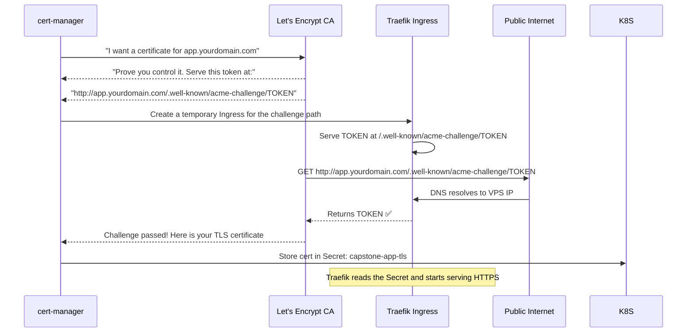

# IP လိပ်စာမှ သည် အစစ်အမှန် HTTPS Domain သို့

ဤအဆင့်တွင် သင်၏ အပလီကေးရှင်းသည် Kubernetes တွင် လည်ပတ်နေပြီး VPS IP လိပ်စာမှတစ်ဆင့် ဝင်ရောက်အသုံးပြုနိုင်ပြီ ဖြစ်သည် — သို့သော် HTTP ဖြင့်သာ ဖြစ်သည်။ Production ပတ်ဝန်းကျင်တွင် သင့်အနေဖြင့် အောက်ပါတို့ လိုအပ်ပါသည် -
- လူဖတ်၍ရသော **Domain အမည်** (`1.2.3.4` အစား `app.yourdomain.com`)
- တရားဝင် TLS လက်မှတ် (Certificate) ပါရှိသည့် **HTTPS** (ဘရောက်ဆာများတွင် သော့ခလောက်ပုံ 🔒 ပြသခြင်း)
- **HTTP မှ HTTPS သို့ အလိုအလျောက် လမ်းကြောင်းပြောင်းပေးခြင်း** (လုံခြုံမှုမရှိသော လင့်ခ်များ မတော်တဆ ဝင်ရောက်မိခြင်းမှ ကာကွယ်ရန်)
- **လက်မှတ် အလိုအလျောက် သက်တမ်းတိုးခြင်း** (Let's Encrypt လက်မှတ်များသည် ရက် ၉၀ လျှင် သက်တမ်းကုန်ဆုံးသည်)

ဤအချက်များအားလုံးကို သင်သည် သင်ခန်းစာ ၆ နှင့် ၇ တို့တွင် ပြင်ဆင်ခဲ့ပြီးဖြစ်သော Cloudflare DNS + cert-manager + Traefik တို့ ပူးပေါင်း လုပ်ဆောင်မှုဖြင့် ဖြေရှင်းပေးထားပါသည်။

---

## Let's Encrypt + cert-manager အလုပ်လုပ်ပုံ

Let's Encrypt သည် အခမဲ့နှင့် အလိုအလျောက် လုပ်ဆောင်ပေးသော Certificate Authority (CA) တစ်ခု ဖြစ်သည်။ ၎င်းသည် Domain ကို ထိန်းချုပ်နိုင်ကြောင်း သက်သေပြနိုင်သူတိုင်းအတွက် TLS လက်မှတ်များကို ထုတ်ပေးသည်။

သက်သေပြသည့် လုပ်ငန်းစဉ်ကို **ACME challenge** ဟု ခေါ်သည်။ cert-manager သည် **HTTP-01 challenge အမျိုးအစား** ကို အသုံးပြုသည် -



**cert-manager သည် ဤအရာအားလုံးကို အလိုအလျောက် လုပ်ဆောင်ပေးသည်** — ရက် ၉၀ ပြည့်ပြီး သက်တမ်းမကုန်မီ သက်တမ်းတိုးခြင်း အပါအဝင် ဖြစ်သည်။ သင်သည် ၎င်းကို တစ်ကြိမ်သာ သတ်မှတ်ပေးရန် လိုအပ်ပြီး နောက်တစ်ကြိမ် ထပ်မံစဉ်းစားနေရန် မလိုတော့ပါ။

---

## အဆင့် ၁ - Domain ဝယ်ယူခြင်း

မည်သည့် Domain ရောင်းချသူ (Registrar) ထံမှမဆို Domain ကို ဝယ်ယူပါ။ အကြံပြုလိုသည်များ -
- **Cloudflare Registrar** — ကုန်ကျစရိတ်သက်သာခြင်း (`.com` အတွက် တစ်နှစ်လျှင် ~$9 ခန့်)၊ အမြတ်တင်ထားခြင်း မရှိပါ
- **Namecheap** — ဈေးနှုန်းသင့်တົလျခြင်း၊ DNS စီမံခန့်ခွဲရ လွယ်ကူခြင်း
- **Google Domains** (ယခုအခါ Squarespace Domains ဖြစ်လာသည်)

ဤလမ်းညွှန်ချက်အတွက် သင်၏ Domain သည် `yourdomain.com` ဖြစ်ပြီး သင်၏ အပလီကေးရှင်းကို `app.yourdomain.com` တွင် ထားရှိလိုသည်ဟု ယူဆပါမည်။

<Callout type="tip" title="အပလီကေးရှင်းအတွက် Subdomain ကို အသုံးပြုပါ">
`yourdomain.com` (Root domain) တွင် တိုက်ရိုက်မတင်ဘဲ `app.yourdomain.com` တွင် တတင်ခြင်းဖြင့် နောင်တွင် အခြားအရာများကိုပါ (ဘလော့ဂ်၊ စာရွက်စာတမ်းများ၊ API) Domain တစ်ခုတည်းတွင်ပင် လက်ခံကျင်းပနိုင်မည် ဖြစ်သည်။ ထို့အပြင် နည်းပညာပိုင်းဆိုင်ရာ DNS အကြောင်းပြချက်များကြောင့် Root domain ထက် Subdomain အတွက် TLS ကို ပြင်ဆင်ရ ပိုမိုလွယ်ကူပါသည်။
</Callout>

---

## အဆင့် ၂ - DNS ကို Cloudflare သို့ ပြောင်းရွှေ့ခြင်း

Domain ကို အခြားနေရာတွင် ဝယ်ယူခဲ့လျှင်တောင် DNS အတွက် Cloudflare ကို အသုံးပြုခြင်းဖြင့် အောက်ပါ အကျိုးကျေးဇူးများကို ရရှိမည် ဖြစ်သည် -
- အမြန်ဆန်ဆုံး ကမ္ဘာလုံးဆိုင်ရာ DNS ကွန်ရက် (တစ်စက္ကန့်၏ အပုံတစ်ထောင်ပုံတစ်ပုံအတွင်း ပျံ့နှံ့ရောက်ရှိမှု)
- DDoS ကာကွယ်မှု
- အခမဲ့ SSL edge လက်မှတ်များ
- သင်၏ Traffic ဆိုင်ရာ အချက်အလက်များ

1. [cloudflare.com](https://cloudflare.com) တွင် အခမဲ့ အကောင့်တစ်ခု ဖွင့်ပါ
2. သင့် Domain ကို ထည့်ပါ → Cloudflare သည် သင်၏ ရှိပြီးသား DNS မှတ်တမ်းများကို စစ်ဆေးပေးပါမည်
3. Domain ဝယ်ယူထားသည့်နေရာ (Registrar) တွင် nameserver များကို Cloudflare ၏ nameserver များသို့ ပြောင်းလဲပါ -
   ```
   ava.ns.cloudflare.com
   brad.ns.cloudflare.com
   ```
4. nameserver များ ပျံ့နှံ့ရန်အတွက် မိနစ် ၅ မှ ၃၀ ခန့် စောင့်ပါ

---

## အဆင့် ၃ - DNS A Record ဖန်တီးခြင်း

Cloudflare Dashboard → DNS → Add record သို့ သွားပါ -

| Type | Name | Content | Proxy status | TTL |
|------|------|---------|-------------|-----|
| A | `app` | `YOUR_VPS_IP` | DNS only (မီးခိုးရောင်တိမ်တိုက်) | Auto |

<Callout type="warning" title="တပ်ဆင်နေစဉ်အတွင်း Proxy ကို မသုံးဘဲ DNS Only ကိုသာ သုံးပါ">
Cloudflare ၏ လိမ္မော်ရောင်တိမ်တိုက် (Proxied) မုဒ်သည် သင်၏ အစစ်အမှန် IP ကို ဖုံးကွယ်ပေးပြီး Cloudflare ၏ CDN ကို ထည့်သွင်းပေးပါသည်။ သို့သော် ၎င်းသည် လက်မှတ်ထုတ်ပေးသည့် လုပ်ငန်းစဉ်အတွင်း Let's Encrypt HTTP-01 challenge ကို အလုပ်မလုပ်အောင် ဟန့်တားတတ်ပါသည် (အကြောင်းမှာ Cloudflare က ACME challenge တောင်းဆိုမှုကို ကြားဖြတ်ယူလိုက်သောကြောင့် ဖြစ်သည်)။

ដ ပထမဆုံး စတင်တပ်ဆင်ချိန်တွင် **DNS only** (မီးခိုးရောင်တိမ်တိုက်) သို့ သတ်မှတ်ပါ။ လက်မှတ်ထုတ်ပေးပြီး အောင်မြင်စွာ အလုပ်လုပ်နေပြီဆိုမှသာ လိုအပ်ပါက Proxied သို့ ပြောင်းလဲနိုင်ပါသည်။
</Callout>

```bash
# DNS ပျံ့နှံ့မှုကို စစ်ဆေးခြင်း (သင်၏ local စက်မှနေ၍)
dig app.yourdomain.com +short
# သင်၏ VPS IP (ဥပမာ - 1.2.3.4) ကို ပြန်ပြရပါမည်

# သို့မဟုတ် အွန်လိုင်း စစ်ဆေးသည့် ဝက်ဘ်ဆိုက်ကို အသုံးပြုပါ
# https://dnschecker.org/#A/app.yourdomain.com
```

---

## အဆင့် ၄ - Traefik သည် Traffic ကို လက်ခံနေခြင်း ရှိမရှိ စစ်ဆေးခြင်း

TLS Ingress ကို မapply ခန်းမီ Traefik သည် HTTP traffic ကို မှန်ကန်စွာ လမ်းကြောင်းပြောင်းပေးနေခြင်း ရှိမရှိ စစ်ဆေးပါ -

```bash
# သင်၏ VPS သို့မဟုတ် curl ပါသည့် မည်သည့်စက်မှမဆို:
curl -v http://app.yourdomain.com/api/health
# HTTP 200 (သို့မဟုတ် redirect middleware အလုပ်လုပ်နေပါက HTTPS သို့ 301 redirect) ကို ပြန်ပြရပါမည်

# ဝင်လာသော တောင်းဆိုမှုများအတွက် Traefik လော့ဂ်များကို စစ်ဆေးရန်
kubectl -n traefik logs -l app.kubernetes.io/name=traefik --tail=20
```

---

## အဆင့် ၅ - TLS Ingress ကို Apply လုပ်ခြင်း

သင်၏ တရားဝင် Domain ဖြင့် `k8s/ingress.yaml` ကို ပြင်ဆင်ပါ (`app.yourdomain.com` ကို အစားထိုးပါ) -

```yaml
# k8s/ingress.yaml (တရားဝင် domain ဖြင့်)
apiVersion: networking.k8s.io/v1
kind: Ingress
metadata:
  name: capstone-app-ingress
  namespace: production
  annotations:
    kubernetes.io/ingress.class: "traefik"
    # Rate limit ကန့်သတ်ချက်အတွင်း မရောက်စေရန် STAGING ဖြင့် စတင်ပါ
    cert-manager.io/cluster-issuer: "letsencrypt-staging"
spec:
  tls:
    - hosts:
        - app.yourdomain.com     # ← သင်၏ တရားဝင် domain
      secretName: capstone-app-tls
  rules:
    - host: app.yourdomain.com   # ← သင်၏ တရားဝင် domain
      http:
        paths:
          - path: /
            pathType: Prefix
            backend:
              service:
                name: capstone-app-service
                port:
                  number: 80
```

```bash
kubectl apply -f k8s/ingress.yaml
```

---

## အဆင့် ၆ - လက်မှတ် ထုတ်ပေးနေမှုကို စောင့်ကြည့်ခြင်း

cert-manager သည် Ingress annotation အသစ်ကို အလိုအလျောက် သိရှိပြီး ACME challenge ကို စတင်ပါသည် -

```bash
# Certificate resource ကို စောင့်ကြည့်ရန် (cert-manager မှ အလိုအလျောက် ဖန်တီးပေးသည်)
kubectl -n production get certificate -w
# NAME               READY   SECRET              AGE
# capstone-app-tls   False   capstone-app-tls    5s
# capstone-app-tls   True    capstone-app-tls    45s   ← လက်မှတ် ထုတ်ပေးပြီးပါပြီ!

# အသေးစိတ်သိရှိရန် CertificateRequest ကို စစ်ဆေးပါ
kubectl -n production describe certificaterequest

# Order (ACME challenge အခြေအနေ) ကို စစ်ဆေးရန်
kubectl -n production get order
kubectl -n production describe order

# Challenge (လက်ရှိ ဖြေရှင်းနေသည့် ACME challenge) ကို စစ်ဆေးရန်
kubectl -n production get challenge
kubectl -n production describe challenge
```

**မျှော်လင့်ရမည့် အချိန်ဇယား -**
- ၀-၅ စက္ကန့် - cert-manager မှ `Order` resource ကို ဖန်တီးသည်
- ၅-၁၅ စက္ကန့် - cert-manager မှ challenge လမ်းကြောင်းအတွက် ယာယီ Ingress တစ်ခုကို ဖန်တီးသည်
- ၁၅-၃၀ စက္ကန့် - Let's Encrypt မှ challenge URL ကို HTTP GET ဖြင့် တောင်းဆိုသည်
- ၃၀-၆၀ စက္ကန့် - Let's Encrypt မှ အတည်ပြုပြီး လက်မှတ်ထုတ်ပေးကာ cert-manager က Secret တွင် သိမ်းဆည်းသည်

အကယ်၍ မိနစ် ၃ မိနစ်ထက် ပိုကြာနေပါက အောက်ပါ ပြဿနာဖြေရှင်းခြင်း (Troubleshooting) အပိုင်းကို ကြည့်ပါ။

---

## အဆင့် ၇ - Staging Certificate ကို စမ်းသပ်ခြင်း

Staging လက်မှတ်ကို "Let's Encrypt (STAGING)" မှ ထုတ်ပေးခြင်းဖြစ်ပြီး ၎င်းသည် ဘရောက်ဆာများ မယုံကြည်သော အတုအယောင် CA တစ်ခု ဖြစ်သည်။ ၎င်းမှာ သဘာဝကျပါသည်။ လက်မှတ် ထုတ်ပေးပြီးကြောင်း စစ်ဆေးပါ -

```bash
# လက်မှတ် ထုတ်ပေးပြီးပြီလား စစ်ဆေးရန် (ယခုအခါ True ဟု ဖြစ်နေရပါမည်)
kubectl -n production get certificate capstone-app-tls
# NAME               READY   SECRET              AGE
# capstone-app-tls   True    capstone-app-tls    2m

# HTTPS ကို စမ်းသပ်ရန် (-k ဖြင့် ယုံကြည်စိတ်ချရမှုမရှိသော staging လက်မှတ်ကို လျစ်လျူရှုရန်)
curl -k https://app.yourdomain.com/api/health
# {"status":"ok","db":{"status":"connected"}}

# လက်မှတ် အသေးစိတ်ကို စစ်ဆေးရန်
echo | openssl s_client -connect app.yourdomain.com:443 -servername app.yourdomain.com 2>/dev/null | \
  openssl x509 -noout -subject -issuer -dates
# subject=CN=app.yourdomain.com
# issuer=CN=(STAGING) Let's Encrypt ECDSA R11  ← Staging အတွက် ဤကဲ့သို့ ပြရပါမည်
# notBefore=...
# notAfter=... (ယခုမှစ၍ ရက် ၉၀)
```

---

## အဆင့် ၈ - Production Certificate သို့ ပြောင်းလဲခြင်း

Staging လက်မှတ် အလုပ်လုပ်သည်နှင့် Production ClusterIssuer သို့ ပြောင်းလဲပါ -

```bash
# Staging လက်မှတ်ကို ဖျက်ပါ (cert-manager မှ prod ဖြင့် ပြန်လည် ထုတ်ပေးလိမ့်မည်)
kubectl -n production delete certificate capstone-app-tls

# Ingress annotation ကို အပ်ဒိတ်လုပ်ပါ
kubectl -n production annotate ingress capstone-app-ingress \
  cert-manager.io/cluster-issuer=letsencrypt-prod \
  --overwrite

# ထုတ်ပေးနေဆဲဖြစ်သော Production လက်မှတ်အသစ်ကို စောင့်ကြည့်ပါ
kubectl -n production get certificate -w
```

စက္ကန့် ၃၀ မှ ၆၀ အတွင်း Production လက်မှတ်ကို ထုတ်ပေးပါလိမ့်မည်။ ယခုအခါ အောက်ပါအတိုင်း စစ်ဆေးပါ -

```bash
# -k မပါဘဲ စမ်းသပ်ပါ (ဘရောက်ဆာများ ယုံကြည်သော အစစ်အမှန် လက်မှတ်)
curl https://app.yourdomain.com/api/health
# {"status":"ok","db":{"status":"connected"}}

# လက်မှတ် အသေးစိတ်ကို စစ်ဆေးပါ (STAGING မဟုတ်ဘဲ Let's Encrypt ဟု ပြရပါမည်)
echo | openssl s_client -connect app.yourdomain.com:443 -servername app.yourdomain.com 2>/dev/null | \
  openssl x509 -noout -subject -issuer -dates
# subject=CN=app.yourdomain.com
# issuer=CN=E5, O=Let's Encrypt, C=US   ← အစစ်အမှန် Let's Encrypt ဖြစ်ပါပြီ!
# notAfter=[ယခုမှစ၍ ရက် 90]

# SSL Labs တွင် အဆင့်သတ်မှတ်ချက်ကို စစ်ဆေးပါ (A+ ရရန် မျှော်လင့်သည်)
# https://www.ssllabs.com/ssltest/analyze.html?d=app.yourdomain.com
```

---

## အဆင့် ၉ - HTTP → HTTPS လမ်းကြောင်းပြောင်းခြင်း (Redirect) ကို ပြင်ဆင်ခြင်း

HTTP traffic အားလုံးသည် HTTPS သို့ အလိုအလျောက် လမ်းကြောင်းပြောင်းသွားသင့်သည်။ ဤအရာကို Traefik တွင် middleware တစ်ခုအနေဖြင့် ပြင်ဆင်ရသည် -

```yaml
# k8s/https-redirect.yaml
apiVersion: traefik.io/v1alpha1
kind: Middleware
metadata:
  name: redirect-https
  namespace: production
spec:
  redirectScheme:
    scheme: https
    permanent: true   # 301 Moved Permanently
```

```yaml
# HTTP နှင့် HTTPS စည်းမျဉ်း နှစ်ခုစလုံးကို ထည့်သွင်းရန် k8s/ingress.yaml ကို အပ်ဒိတ်လုပ်ပါ
apiVersion: networking.k8s.io/v1
kind: Ingress
metadata:
  name: capstone-app-ingress
  namespace: production
  annotations:
    kubernetes.io/ingress.class: "traefik"
    cert-manager.io/cluster-issuer: "letsencrypt-prod"
    # HTTP လမ်းကြောင်းများတွင် redirect middleware ကို အသုံးပြုရန်
    traefik.ingress.kubernetes.io/router.middlewares: "production-redirect-https@kubernetescrd"
```

```bash
kubectl apply -f k8s/https-redirect.yaml
kubectl apply -f k8s/ingress.yaml

# လမ်းကြောင်းပြောင်းခြင်း (Redirect) ကို စမ်းသပ်ရန်
curl -I http://app.yourdomain.com/api/health
# HTTP/1.1 301 Moved Permanently
# Location: https://app.yourdomain.com/api/health
```

---

## အဆင့် ၁၀ - Cloudflare Proxy ကို ဖွင့်ခြင်း (ချန်လှပ်နိုင်သည်)

ယခုအခါ HTTPS သည် ကောင်းမွန်စွာ အလုပ်လုပ်နေပြီဖြစ်므로 အပိုဆောင်း အကျိုးကျေးဇူးများ ရရှိရန် Cloudflare ၏ proxy မုဒ်ကို ဖွင့်နိုင်ပါပြီ -

**Cloudflare Proxy (လိမ္မော်ရောင်တိမ်တိုက်) ၏ အကျိုးကျေးဇူးများ -**
- အများပြည်သူမြင်နိုင်သော နေရာမှ သင်၏ VPS ၏ အစစ်အမှန် IP လိပ်စာကို ဖုံးကွယ်ပေးသည်
- Static ပစ္စည်းများ (CSS, JS, ပုံများ) အတွက် ကမ္ဘာလုံးဆိုင်ရာ CDN
- DDoS ကာကွယ်မှု
- အချက်အလက်များပြသပေးမည့် ဒက်ရှ်ဘอร์ด
- အခမဲ့ edge SSL (သင့် Origin လက်မှတ် သက်တမ်းကုန်သွားခဲ့လျှင်တောင်)

Cloudflare DNS ဆက်တင်များတွင် သင်၏ A record ဘေးရှိ မီးခိုးရောင်တိမ်တိုက်သင်္ကေတကို နှိပ်၍ လိမ္မော်ရောင် (Proxied) သို့ ပြောင်းပါ။

<Callout type="warning" title="Cloudflare + cert-manager လိုက်ဖက်ညီမှု">
Cloudflare Proxy ကို ဖွင့်ထားသည့်အခါ health endpoint သို့ သင်ပြုလုပ်သော `curl` သည် သင်၏ VPS သို့ တိုက်ရိုက်မသွားဘဲ Cloudflare's edge မှတစ်ဆင့် သွားမည်ဖြစ်သည်။ ACME HTTP-01 challenge သည် ဆက်လက်အလုပ်လုပ်နေဆဲဖြစ်သည်၊ အကြောင်းမှာ cert-manager သည် ကလပ်စတာအတွင်းမှနေ၍ လက်မှတ်များကို သက်တမ်းတိုးပြီး Cloudflare က `.well-known/acme-challenge/` တောင်းဆိုမှုများကို သင့် Origin သို့ ဖြတ်သန်းခွင့်ပေးသောကြောင့် ဖြစ်သည်။

လက်မှတ်သက်တမ်းတိုးခြင်းနှင့် ပတ်သက်၍ ပြဿနာများရှိလာပါက ဤ Cloudflare စည်းမျဉ်းကို ထည့်ပါ - **SSL/TLS → Edge Certificates → Always Use HTTPS: ON** နှင့် **SSL mode: Full (strict)**။
</Callout>

---

## လက်မှတ် အလိုအလျောက် သက်တမ်းတိုးခြင်း (Auto-Renewal)

cert-manager သည် လက်မှတ်သက်တမ်းကုန်ဆုံးရန် **ရက် ၃၀ အလိုတွင်** အလိုအလျောက် သက်တမ်းတိုးပေးသည်။ သင် ဘာမှ လုပ်စရာမလိုပါ။ သက်တမ်းတိုးသည့် စနစ်ကို စစ်ဆေးပါ -

```bash
# လက်ရှိလက်မှတ် ဘယ်တော့ သက်တမ်းကုန်မလဲ စစ်ဆေးရန်
kubectl -n production get certificate capstone-app-tls -o jsonpath='{.status.notAfter}'
# 2024-04-15T10:30:00Z  (ထုတ်ပေးသည့်အချိန်မှ ရက် 90)

# cert-manager သည် ထုတ်ပေးပြီး ရက် ၆၀ အကြာတွင် (သက်တမ်းကုန်ရန် ရက် ၃၀ အလို) အလိုအလျောက် သက်တမ်းတိုးခြင်းကို စတင်မည် ဖြစ်သည်
# လက်မှတ်၏ "renewal window" ကို စစ်ဆေးရန်
kubectl -n production describe certificate capstone-app-tls | grep --family=5 "Renewal"
```

လုံခြုံရေး အနေဖြင့် လက်မှတ်သက်တမ်းကုန်ဆုံးမှုအတွက် စောင့်ကြည့်ရေး သတိပေးချက် (Monitoring alert) တစ်ခုကို ပြင်ဆင်ပါ (သင်ခန်းစာ ၁၀ တွင် ဖော်ပြထားသည်) -
```bash
# သို့မဟုတ် ကိုယ်တိုင် စစ်ဆေးရန်
echo | openssl s_client -connect app.yourdomain.com:443 2>/dev/null | \
  openssl x509 -noout -dates
```

---

## TLS ပြဿနာများ ဖြေရှင်းခြင်း (Troubleshooting)

### လက်မှတ်သည် "False" အခြေအနေတွင် တန့်နေခြင်း

```bash
# Order အခြေအနေကို စစ်ဆေးရန်
kubectl -n production describe order

# ဖြစ်နိုင်ခြေ အများဆုံး အကြောင်းရင်းများ -
# ၁။ DNS မပျံ့နှံ့သေးခြင်း (မိနစ် ၅ မှ ၃၀ ခန့် စောင့်ပါ)
# ၂။ ပေါ့တ် ၈၀ (Port 80) ကို ဖိုင်းဝေါလ်က ပိတ်ထားခြင်း (cert-manager က HTTP-01 ဝင်ရောက်ခွင့် လိုအပ်သည်)
# ၃။ Traefik ကို ingress class အဖြစ် မသတ်မှတ်ထားခြင်း

# ပေါ့တ် ၈၀ ကို အင်တာနက်မှတဆင့် ဝင်ရောက်နိုင်ခြင်း ရှိမရှိ စစ်ဆေးရန်
curl -I http://app.yourdomain.com
# ဤအရာ မအောင်မြင်ပါက VPS ဖိုင်းဝေါလ် စည်းမျဉ်းများကို စစ်ဆေးပါ (ပေါ့တ် ၈၀ သည် 0.0.0.0/0 သို့ ဖွင့်ထားရပါမည်)
```

### Let's Encrypt မှ "Rate limit exceeded" ပြခြင်း

```bash
# Rate limit အခြေအနေကို စစ်ဆေးရန်
kubectl -n production describe certificate capstone-app-tls | grep -i "rate"

# ၁ နာရီ စောင့်ပါ (လက်မှတ် တစ်ခုချင်းစီအတွက် ကန့်သတ်ချက်) သို့မဟုတ် ၁ ပတ် စောင့်ပါ (Domain ကန့်သတ်ချက်အတွက်)
# ထိုအချိန်အတွင်း သင်၏ တပ်ဆင်မှုကို စမ်းသပ်ရန် staging issuer ကို အသုံးပြုပါ
```

### လက်မှတ် ထုတ်ပေးပြီးသော်လည်း HTTPS က "Not Secure" ဟု ပြနေဆဲ ဖြစ်ခြင်း

```bash
# မှန်ကန်သော သော့များဖြင့် TLS Secret ရှိနေကြောင်း စစ်ဆေးရန်
kubectl -n production get secret capstone-app-tls -o jsonpath='{.data}' | jq 'keys'
# ပြသရမည့် အရာများ: ["tls.crt", "tls.key"]

# လက်မှတ်ကို ပြန်လည်ဖတ်ရှုရန် Traefik ကို ပြန်လည်စတင်ပါ
kubectl -n traefik rollout restart deployment/traefik

# TLS အမှားအယွင်းများအတွက် Traefik လော့ဂ်များကို စစ်ဆေးရန်
kubectl -n traefik logs -l app.kubernetes.io/name=traefik | grep -i "tls\|cert\|error"
```

---

## လုံခြုံရေး ခေါင်းစဉ်များ (လေ့ကျင့်ခန်းအပို - Bonus)

ဘရောက်ဆာ လုံခြုံရေး ပိုမိုကောင်းမွန်စေရန် Traefik middleware မှတဆင့် လုံခြုံရေး ခေါင်းစဉ်များ (Security headers) ကို ထည့်သွင်းပါ -

```yaml
# k8s/security-headers.yaml
apiVersion: traefik.io/v1alpha1
kind: Middleware
metadata:
  name: security-headers
  namespace: production
spec:
  headers:
    # Clickjacking တားဆီးရန်
    frameDeny: true
    # MIME-type sniffing တားဆီးရန်
    contentTypeNosniff: true
    # HSTS ကို ဖွင့်ရန် (၁ နှစ်အတွင်း HTTPS ကို မဖြစ်မနေ သုံးရန်)
    stsSeconds: 31536000
    stsIncludeSubdomains: true
    stsPreload: true
    # Referer ခေါင်းစဉ်ကို ထိန်းချုပ်ရန်
    referrerPolicy: "strict-origin-when-cross-origin"
    # Content Security Policy (သင့်အပလီကေးရှင်းအတွက် ပြင်ဆင်ပါ)
    customResponseHeaders:
      X-Frame-Options: "SAMEORIGIN"
      Permissions-Policy: "camera=(), microphone=(), geolocation=()"
```

```bash
kubectl apply -f k8s/security-headers.yaml

# Middleware နှစ်ခုစလုံးကို သုံးရန် Ingress ကို အပ်ဒိတ်လုပ်ပါ
kubectl -n production annotate ingress capstone-app-ingress \
  traefik.ingress.kubernetes.io/router.middlewares="production-redirect-https@kubernetescrd,production-security-headers@kubernetescrd" \
  --overwrite

# ခေါင်းစဉ်များကို စမ်းသပ်ရန်
curl -I https://app.yourdomain.com/api/health | grep -i "strict\|x-frame\|x-content"
# strict-transport-security: max-age=31536000; includeSubDomains; preload
# x-frame-options: SAMEORIGIN
# x-content-type-options: nosniff
```

---

## အကျဉ်းချုပ်

ယခုအခါ သင်၏ အပလီကေးရှင်းကို `https://app.yourdomain.com` တွင် အောက်ပါတို့နှင့်အတူ ဝင်ရောက်အသုံးပြုနိုင်ပြီ ဖြစ်သည် -
- cert-manager မှ အလိုအလျောက် ထုတ်ပေးထားသော **တရားဝင် Let's Encrypt TLS လက်မှတ်**
- Traefik middleware မှတဆင့် **HTTP → HTTPS လမ်းကြောင်းပြောင်းခြင်း**
- **ရက် ၉၀ လျှင် အလိုအလျောက် သက်တမ်းတိုးခြင်း** — လူကိုယ်တိုင် လုပ်ဆောင်ရန် လုံးဝမလိုပါ
- DDoS ကာကွယ်မှုအတွက် ချန်လှပ်နိုင်သော proxy မုဒ်ပါရှိသည့် **Cloudflare DNS**

နောက်လာမည့် သင်ခန်းစာတွင် သင့်အပလီကေးရှင်း၏ ကျန်းမာရေးကို စောင့်ကြည့်ရန်၊ အဓိက တိုင်းတာချက်များကို ကြည့်ရှုရန်နှင့် ပြဿနာများရှိလာသည့်အခါ သတိပေးချက်များ ပေးပို့ရန် Prometheus နှင့် Grafana တို့ကို ပြင်ဆင်သွားမည် ဖြစ်ပါသည်။