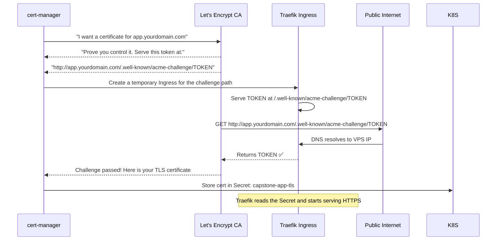

# IP Address တစ်ခုမှသည် Real HTTPS Domain တစ်ခုသို့

ဒီအဆင့်မှာ သင့် Application က Kubernetes ထဲမှာ Run နေပြီး VPS IP address ကနေတစ်ဆင့် ဝင်လို့ရနေပါပြီ — ဒါပေမဲ့ HTTP နဲ့ပဲ ရပါသေးတယ်။ Production အဆင့်မှာဆိုရင် ဒါတွေ လိုအပ်ပါတယ် -
- **လူဖတ်လို့ရတဲ့ Domain တစ်ခု** (`1.2.3.4` ရဲ့အစား `app.yourdomain.com`)
- တရားဝင် TLS certificate ပါတဲ့ **HTTPS** (Browser တွေမှာ သော့ခလောက်သင်္ကေတ 🔒 ပြမယ်)
- **Automatic HTTP → HTTPS redirect** (လုံခြုံမှုမရှိတဲ့ HTTP နဲ့ မတော်တဆ ဝင်မိတာမျိုး မရှိအောင်)
- **Automatic certificate renewal** (Let's Encrypt cert တွေက ရက် ၉၀ တိုင်း သက်တမ်းကုန်ပါတယ်)

ဒါတွေအားလုံးကို Lesson 6 နဲ့ Lesson 7 မှာ သင် Config လုပ်ခဲ့တဲ့ Cloudflare DNS + cert-manager + Traefik တို့ ပူးပေါင်းပြီး လုပ်ဆောင်ပေးမှာ ဖြစ်ပါတယ်။

---

## Let's Encrypt + cert-manager ဘယ်လို အလုပ်လုပ်သလဲ

Let's Encrypt ဆိုတာ Free ရတဲ့၊ Automated လုပ်ပေးတဲ့ Certificate Authority တစ်ခု ဖြစ်ပါတယ်။ Domain တစ်ခုကို ကိုယ်ပိုင်ဆိုင်ကြောင်း သက်သေပြနိုင်သူတိုင်းကို TLS certificates ထုတ်ပေးပါတယ်။

အဲဒီသက်သေပြတဲ့ လုပ်ငန်းစဉ်ကို **ACME challenge** လို့ ခေါ်ပါတယ်။ cert-manager က **HTTP-01 challenge type** ကို သုံးပါတယ်:



**cert-manager က ဒါတွေအားလုံးကို Automatic လုပ်ဆောင်ပေးပါတယ်** — ရက် ၉၀ သက်တမ်းမကုန်ခင် Auto Renew လုပ်ပေးတာအဆုံးပေါ့။ တစ်ခါ Set လုပ်ထားလိုက်ရုံပါပဲ၊ နောက်ထပ် ထပ်လုပ်စရာ မလိုတော့ပါဘူး။

---

## Step 1: Domain တစ်ခု ဝယ်ယူခြင်း

Registrar တစ်ခုခုကနေ Domain ဝယ်ပါ။ အကြံပြုလိုသည်များ -
- **Cloudflare Registrar** — ကုန်ကျစရိတ်သက်သာခြင်း (`.com` အတွက် တစ်နှစ်ကို ~$9 လောက်ပဲ ကျပြီး Markup မတင်ပါ)
- **Namecheap** — ဈေးနှုန်းသင့်တော်ပြီး DNS Management လုပ်ရ လွယ်ကူခြင်း
- **Google Domains** (ယခုအခါ Squarespace Domains ဖြစ်သွားပါပြီ)

ဒီ Guide အတွက် သင့် Domain က `yourdomain.com` ဖြစ်ပြီး သင့် App ကို `app.yourdomain.com` မှာ တင်မယ်လို့ ယူဆကြရအောင်။

<Callout type="tip" title="App အတွက် Subdomain တစ်ခုကို သုံးပါ">
Root Domain (`yourdomain.com`) ရဲ့ အစား `app.yourdomain.com` မှာ Deploy လုပ်ခြင်းအားဖြင့် နောက်ပိုင်းမှာ တခြားဟာတွေ (Blog, Docs, API စသည်ဖြင့်) ကိုပါ အဲဒီ Domain တစ်ခုတည်းမှာပဲ တင်လို့ရသွားပါမယ်။ တခြား Technical DNS အကြောင်းပြချက်တွေကြောင့် Apex Domain ထက် Subdomain အတွက် TLS Config လုပ်ရတာ ပိုလွယ်ကူပါတယ်။
</Callout>

---

## Step 2: DNS ကို Cloudflare သို့ ပြောင်းရွှေ့ခြင်း

Domain ကို တခြားနေရာမှာ ဝယ်ထားခဲ့ရင်တောင် DNS အတွက် Cloudflare ကို သုံးခြင်းအားဖြင့် ဒါတွေ ရရှိနိုင်ပါတယ် -
- အမြန်ဆုံး Global DNS Network (တစ်စက္ကန့်ရဲ့ အပုံတစ်ထောင်ပုံတစ်ပုံအတွင်း ဖြန့်ဝေပေးနိုင်ခြင်း)
- DDoS Protection
- Free SSL Edge Certificates
- Traffic Analytics တွေ ကြည့်ရှုနိုင်ခြင်း

1. [cloudflare.com](https://cloudflare.com) မှာ Free Account တစ်ခု ဖွင့်ပါ။
2. သင့် Domain ကို Add လုပ်ပါ → Cloudflare က သင့်ရဲ့ လက်ရှိ DNS Records တွေကို Scan ဖတ်ပေးပါလိမ့်မယ်။
3. Domain ဝယ်ခဲ့တဲ့ Registrar ဆီမှာ Nameservers တွေကို Cloudflare ရဲ့ Nameservers တွေနဲ့ ပြောင်းလဲပေးပါ:
   ```
   ava.ns.cloudflare.com
   brad.ns.cloudflare.com
   ```
4. Nameserver Propagation ဖြစ်ဖို့ မိနစ် ၅၀ မှ မိနစ် ၃၀ လောက် စောင့်ပါ။

---

## Step 3: DNS A Record ဖန်တီးခြင်း

Cloudflare Dashboard → DNS → Add record သို့ သွားပါ:

| Type | Name | Content | Proxy status | TTL |
|------|------|---------|-------------|-----|
| A | `app` | `YOUR_VPS_IP` | DNS only (grey cloud) | Auto |

<Callout type="warning" title="Setup လုပ်နေစဉ်အတွင်း Proxy ကို မသုံးဘဲ DNS Only ကိုသာ သုံးပါ">
Cloudflare ရဲ့ Orange Cloud (Proxied) Mode က သင့်ရဲ့ Real IP ကို ဖုံးကွယ်ပေးပြီး Cloudflare ရဲ့ CDN ကို သုံးပေးပါတယ်။ ဒါပေမဲ့ Certificate ထုတ်တဲ့အခါ Let's Encrypt ရဲ့ HTTP-01 challenge ကို Cloudflare က ကြားဖြတ်ခံလိုက်ရတာကြောင့် Certificate ထုတ်လို့ မအောင်မြင်ဘဲ ဖြစ်တတ်ပါတယ်။

အစောပိုင်း Setup လုပ်တဲ့အချိန်မှာ **DNS only** (မီးခိုးရောင် Cloud) ကိုပဲ သုံးပါ။ Certificate အောင်မြင်စွာ ထွက်လာပြီး အလုပ်လုပ်ပြီဆိုမှ လိုချင်ရင် Proxied ကို ပြောင်းလို့ရပါတယ်။
</Callout>

```bash
# DNS Propagation ဖြစ်မဖြစ် စစ်ဆေးရန် (သင့် Local Machine မှနေ၍)
dig app.yourdomain.com +short
# သင့် VPS IP (ဥပမာ - 1.2.3.4) ကို ပြန်ပြရပါမယ်

# သို့မဟုတ် Online Checker ကို သုံးပါ
# https://dnschecker.org/#A/app.yourdomain.com
```

---

## Step 4: Traefik Traffic လက်ခံနေခြင်း ရှိမရှိ စစ်ဆေးခြင်း

TLS Ingress ကို မapply ခင် Traefik က HTTP Traffic တွေကို မှန်ကန်စွာ Routing လုပ်ပေးနေလားဆိုတာ အရင်စစ်ဆေးပါ:

```bash
# သင့် VPS သို့မဟုတ် curl ပါတဲ့ Machine တစ်ခုခုမှနေ၍:
curl -v http://app.yourdomain.com/api/health
# HTTP 200 (သို့မဟုတ် Redirect Middleware Active ဖြစ်နေရင် HTTPS ဆီသို့ 301 redirect) ပြန်လာရပါမယ်

# ဝင်လာတဲ့ Request များကို Traefik Logs ထဲတွင် ကြည့်ရန်
kubectl -n traefik logs -l app.kubernetes.io/name=traefik --tail=20
```

---

## Step 5: TLS Ingress ကို Apply လုပ်ခြင်း

သင့်ရဲ့ `k8s/ingress.yaml` ကို Real Domain နဲ့ Update လုပ်ပါ (`app.yourdomain.com` နေရာမှာ သင့် Domain ထည့်ပါ):

```yaml
# k8s/ingress.yaml (Real Domain ဖြင့်)
apiVersion: networking.k8s.io/v1
kind: Ingress
metadata:
  name: capstone-app-ingress
  namespace: production
  annotations:
    kubernetes.io/ingress.class: "traefik"
    # Rate Limits မမိစေရန် STAGING ဖြင့် စတင်ပါ
    cert-manager.io/cluster-issuer: "letsencrypt-staging"
spec:
  tls:
    - hosts:
        - app.yourdomain.com     # ← သင့်ရဲ့ Real Domain
      secretName: capstone-app-tls
  rules:
    - host: app.yourdomain.com   # ← သင့်ရဲ့ Real Domain
      http:
        paths:
          - path: /
            pathType: Prefix
            backend:
              service:
                name: capstone-app-service
                port:
                  number: 80
```

```bash
kubectl apply -f k8s/ingress.yaml
```

---

## Step 6: Certificate ထုတ်ပေးနေမှုကို စောင့်ကြည့်ခြင်း

cert-manager က Ingress Annotation အသစ်ကို Detect လုပ်ပြီး ACME challenge ကို စတင်လုပ်ဆောင်ပါမယ်:

```bash
# Certificate Resource ကို စောင့်ကြည့်ရန် (cert-manager မှ Auto ဖန်တီးပေးသည်)
kubectl -n production get certificate -w
# NAME               READY   SECRET              AGE
# capstone-app-tls   False   capstone-app-tls    5s
# capstone-app-tls   True    capstone-app-tls    45s   ← Certificate ထုတ်ပေးပြီးပါပြီ!

# အသေးစိတ်သိရန် CertificateRequest ကို Check ရန်
kubectl -n production describe certificaterequest

# Order (ACME challenge status) ကို စစ်ဆေးရန်
kubectl -n production get order
kubectl -n production describe order

# Challenge (အမှန်တကယ် ဖြေရှင်းနေသည့် ACME challenge) ကို စစ်ဆေးရန်
kubectl -n production get challenge
kubectl -n production describe challenge
```

**မျှော်မှန်းထားရမည့် အချိန်ဇယား:**
- 0-5 စက္ကန့်: cert-manager က `Order` Resource တစ်ခုကို ဖန်တီးသည်။
- 5-15 စက္ကန့်: cert-manager က Challenge Path အတွက် Temporary Ingress တစ်ခုကို ဖန်တီးသည်။
- 15-30 စက္ကန့်: Let's Encrypt က Challenge URL ကို HTTP GET ဖြင့် လှမ်းခေါ်သည်။
- 30-60 စက္ကန့်: Let's Encrypt မှ Validate လုပ်ပြီး Certificate ထုတ်ပေးကာ cert-manager က Secret ထဲ သိမ်းဆည်းသည်။

၃ မိနစ်ထက် ပိုကြာနေရင် အောက်ပါ Troubleshooting အပိုင်းကို ကြည့်ပါ။

---

## Step 7: Staging Certificate ကို စမ်းသပ်ခြင်း

Staging Certificate ကို "Let's Encrypt (STAGING)" က ထုတ်ပေးတာဖြစ်ပြီး Browser တွေက ယုံကြည်မှုမရှိတဲ့ Fake CA တစ်ခု ဖြစ်ပါတယ်။ ဒါက သဘာဝကျပါတယ်။ Certificate ထုတ်ပေးပြီးပြီလား စစ်ဆေးပါ:

```bash
# Cert ထုတ်ပေးပြီးပြီလား စစ်ဆေးရန် (ယခုအခါ True ဖြစ်နေရပါမယ်)
kubectl -n production get certificate capstone-app-tls
# NAME               READY   SECRET              AGE
# capstone-app-tls   True    capstone-app-tls    2m

# HTTPS ကို စမ်းသပ်ရန် (Untrusted Staging Cert ကို ကျော်သွားရန် -k flag ကို သုံးပါ)
curl -k https://app.yourdomain.com/api/health
# {"status":"ok","db":{"status":"connected"}}

# Cert အသေးစိတ်ကို စစ်ဆေးရန်
echo | openssl s_client -connect app.yourdomain.com:443 -servername app.yourdomain.com 2>/dev/null | \
  openssl x509 -noout -subject -issuer -dates
# subject=CN=app.yourdomain.com
# issuer=CN=(STAGING) Let's Encrypt ECDSA R11  ← Staging အတွက် ဒါက ပုံမှန်ပါပဲ
# notBefore=...
# notAfter=... (ယခုမှစ၍ ရက် ၉၀)
```

---

## Step 8: Production Certificate သို့ ပြောင်းလဲခြင်း

Staging Certificate အလုပ်လုပ်ပြီဆိုတာနဲ့ Production ClusterIssuer ဆီသို့ ပြောင်းလိုက်ပါ:

```bash
# Staging Certificate ကို ဖျက်ပါ (cert-manager က Prod နဲ့ ပြန်ထုတ်ပေးပါလိမ့်မယ်)
kubectl -n production delete certificate capstone-app-tls

# Ingress Annotation ကို Update လုပ်ပါ
kubectl -n production annotate ingress capstone-app-ingress \
  cert-manager.io/cluster-issuer=letsencrypt-prod \
  --overwrite

# Production Certificate အသစ် ထုတ်ပေးနေမှုကို စောင့်ကြည့်ရန်
kubectl -n production get certificate -w
```

၃၀ မှ ၆၀ စက္ကန့်အတွင်း Production Certificate ထွက်လာပါလိမ့်မယ်။ ယခု စစ်ဆေးကြည့်ပါ:

```bash
# -k မပါဘဲ စမ်းသပ်ရန် (Browser တွေ ယုံကြည်တဲ့ Real Certificate ဖြစ်သည်)
curl https://app.yourdomain.com/api/health
# {"status":"ok","db":{"status":"connected"}}

# Certificate အသေးစိတ်ကို စစ်ဆေးရန် (STAGING မဟုတ်ဘဲ Let's Encrypt ဖြစ်နေရပါမယ်)
echo | openssl s_client -connect app.yourdomain.com:443 -servername app.yourdomain.com 2>/dev/null | \
  openssl x509 -noout -subject -issuer -dates
# subject=CN=app.yourdomain.com
# issuer=CN=E5, O=Let's Encrypt, C=US   ← Real Let's Encrypt ဖြစ်ပါပြီ!
# notAfter=[ယခုမှစ၍ ရက် ၉၀]

# SSL Labs မှာ Grade စစ်ဆေးရန် (A+ ရဖို့ မျှော်မှန်းနိုင်ပါတယ်)
# https://www.ssllabs.com/ssltest/analyze.html?d=app.yourdomain.com
```

---

## Step 9: HTTP → HTTPS Redirect ကို Configure လုပ်ခြင်း

HTTP Traffic အားလုံးဟာ HTTPS ဆီသို့ Automatic Redirect ဖြစ်သွားသင့်ပါတယ်။ ဒါကို Traefik မှာ Middleware တစ်ခုအနေနဲ့ Configure လုပ်ရပါတယ်:

```yaml
# k8s/https-redirect.yaml
apiVersion: traefik.io/v1alpha1
kind: Middleware
metadata:
  name: redirect-https
  namespace: production
spec:
  redirectScheme:
    scheme: https
    permanent: true   # 301 Moved Permanently
```

```yaml
# HTTP နဲ့ HTTPS Rules နှစ်ခုစလုံး ပါဝင်လာစေရန် k8s/ingress.yaml ကို Update လုပ်ပါ
apiVersion: networking.k8s.io/v1
kind: Ingress
metadata:
  name: capstone-app-ingress
  namespace: production
  annotations:
    kubernetes.io/ingress.class: "traefik"
    cert-manager.io/cluster-issuer: "letsencrypt-prod"
    # HTTP Routes တွေမှာ Redirect Middleware ကို Apply လုပ်ပါ
    traefik.ingress.kubernetes.io/router.middlewares: "production-redirect-https@kubernetescrd"
```

```bash
kubectl apply -f k8s/https-redirect.yaml
kubectl apply -f k8s/ingress.yaml

# Redirect အလုပ်လုပ်မလုပ် စမ်းသပ်ရန်
curl -I http://app.yourdomain.com/api/health
# HTTP/1.1 301 Moved Permanently
# Location: https://app.yourdomain.com/api/health
```

---

## Step 10: Cloudflare Proxy ကို Enable လုပ်ခြင်း (Optional)

ယခုအခါ HTTPS အလုပ်လုပ်နေပြီဖြစ်므로 ပိုမိုကောင်းမွန်တဲ့ အကျိုးကျေးဇူးတွေ ရရှိဖို့ Cloudflare ရဲ့ Proxy Mode ကို Enable လုပ်နိုင်ပါပြီ:

**Cloudflare Proxy (Orange Cloud) ရဲ့ အကျိုးကျေးဇူးများ:**
- Public Internet မှ သင့် VPS ရဲ့ Real IP Address ကို ဖုံးကွယ်ပေးခြင်း
- Static Assets တွေ (CSS, JS, Images) အတွက် Global CDN သုံးနိုင်ခြင်း
- DDoS Protection ရရှိခြင်း
- Analytics Dashboard ကြည့်ရှုနိုင်ခြင်း
- Free Edge SSL (Origin Cert သက်တမ်းကုန်သွားရင်တောင် အလုပ်လုပ်ခြင်း)

Cloudflare DNS Settings ထဲက A Record ရဲ့ ဘေးမှာရှိတဲ့ မီးခိုးရောင် Cloud Icon လေးကို နှိပ်ပြီး လိမ္မော်ရောင် (Proxied) ဖြစ်အောင် ပြောင်းလိုက်ပါ။

<Callout type="warning" title="Cloudflare နဲ့ cert-manager လိုက်ဖက်ညီမှု">
Cloudflare Proxy ကို Enable လုပ်လိုက်တဲ့အခါ Health Endpoint ကို လှမ်းခေါ်တဲ့ သင့်ရဲ့ `curl` ဟာ VPS ဆီ တိုက်ရိုက်မသွားတော့ဘဲ Cloudflare Edge ကနေ ဖြတ်သွားပါမယ်။ ACME HTTP-01 challenge ကတော့ ဆက်လက် အလုပ်လုပ်နေဦးမှာပါ၊ ဘာကြောင့်လဲဆိုတော့ cert-manager က Cluster ထဲကနေ Certificate တွေကို Renew လုပ်တာဖြစ်ပြီး Cloudflare က `.well-known/acme-challenge/` Request တွေကို သင့် Origin ဆီကို ဖြတ်သန်းခွင့်ပေးထားလို့ ဖြစ်ပါတယ်။

Certificate Renewal နဲ့ ပတ်သက်ပြီး ပြဿနာတစ်စုံတစ်ရာ ရှိလာရင် ဒီ Cloudflare Rule ကို ထည့်ပေးပါ: **SSL/TLS → Edge Certificates → Always Use HTTPS: ON** နှင့် **SSL mode: Full (strict)**။
</Callout>

---

## Certificate Auto-Renewal

cert-manager က Certificate သက်တမ်းကုန်ဆုံးရန် **ရက် ၃၀ အလို** မှာ Automatic Renew လုပ်ပေးပါတယ်။ သင် ဘာမှ ထပ်လုပ်စရာ မလိုပါဘူး။ Renewal Mechanism ကို စစ်ဆေးကြည့်ပါ:

```bash
# လက်ရှိ Certificate ဘယ်တော့ သက်တမ်းကုန်မလဲ စစ်ဆေးရန်
kubectl -n production get certificate capstone-app-tls -o jsonpath='{.status.notAfter}'
# 2024-04-15T10:30:00Z  (ထုတ်ပေးသည့်နေ့မှ ရက် ၉၀)

# cert-manager က ထုတ်ပေးပြီး ရက် ၆၀ အကြာ (သက်တမ်းကုန်ရန် ရက် ၃၀ အလို) မှာ Auto Renew စတင်ပါမယ်
# Certificate ရဲ့ "renewal window" Config ကို စစ်ဆေးရန်
kubectl -n production describe certificate capstone-app-tls | grep -A5 "Renewal"
```

လုံခြုံရေးအတွက် Certificate သက်တမ်းကုန်မည့် အခြေအနေကို Monitoring Alert ထူထောင်ထားပါ (Lesson 10 မှာ ထပ်ပြပါမယ်):
```bash
# သို့မဟုတ် Manual စစ်ဆေးရန်
echo | openssl s_client -connect app.yourdomain.com:443 2>/dev/null | \
  openssl x509 -noout -dates
```

---

## TLS ပြဿနာများကို ဖြေရှင်းခြင်း (Troubleshooting)

### Certificate က "False" State မှာ တင်နေခြင်း

```bash
# Order Status ကို စစ်ဆေးရန်
kubectl -n production describe order

# အဖြစ်များသော အကြောင်းရင်းများ:
# 1. DNS Propagation မပြီးသေးခြင်း (မိနစ် ၅၀ မှ ၃၀ လောက် စောင့်ပါ)
# 2. Firewall ကြောင့် Port 80 ပိတ်နေခြင်း (cert-manager က HTTP-01 Access လိုအပ်ပါတယ်)
# 3. Traefik ကို Ingress Class အဖြစ် မှန်ကန်စွာ Config မလုပ်ရသေးခြင်း

# Internet မှနေ၍ Port 80 သို့ ချိတ်ဆက်၍ရမရ စစ်ဆေးရန်
curl -I http://app.yourdomain.com
# ဒီဟာ Fail သွားရင် သင့် VPS Firewall Rules တွေ စစ်ပါ (Port 80 ကို 0.0.0.0/0 ဆီ ဖွင့်ထားပေးရပါမယ်)
```

### Let's Encrypt ဆီမှ "Rate limit exceeded" ပြဿနာ တက်လာခြင်း

```bash
# Rate Limit Status ကို စစ်ဆေးရန်
kubectl -n production describe certificate capstone-app-tls | grep -i "rate"

# ၁ နာရီ စောင့်ပါ (Certificate တစ်ခုချင်းစီအတွက် Limit) သို့မဟုတ် ၁ ပတ် စောင့်ပါ (Domain Limit အတွက်)
# Setup ကို စမ်းသပ်နေစဉ်အတွင်း Staging Issuer ကို ဆက်သုံးပါ
```

### Certificate ထုတ်ပေးပြီးပြီ ဒါပေမဲ့ HTTPS က "Not Secure" လို့ ဆက်ပြနေခြင်း

```bash
# TLS Secret မှန်ကန်သော Keys တွေနဲ့ ရှိမရှိ စစ်ဆေးရန်
kubectl -n production get secret capstone-app-tls -o jsonpath='{.data}' | jq 'keys'
# ပြရမည့်အရာ: ["tls.crt", "tls.key"]

# Certificate ကို Reload လုပ်ရန် Traefik ကို Restart ချပါ
kubectl -n traefik rollout restart deployment/traefik

# TLS Errors ရှိမရှိ Traefik Logs များကို စစ်ဆေးရန်
kubectl -n traefik logs -l app.kubernetes.io/name=traefik | grep -i "tls\|cert\|error"
```

---

## Security Headers (အပိုဆောင်း)

Browser လုံခြုံရေး ပိုမိုကောင်းမွန်စေရန် Traefik Middleware ကနေတစ်ဆင့် Security Headers တွေကို ထည့်သွင်းပါ:

```yaml
# k8s/security-headers.yaml
apiVersion: traefik.io/v1alpha1
kind: Middleware
metadata:
  name: security-headers
  namespace: production
spec:
  headers:
    # Clickjacking တားဆီးရန်
    frameDeny: true
    # MIME-type sniffing တားဆီးရန်
    contentTypeNosniff: true
    # HSTS Enable လုပ်ရန် (၁ နှစ်တိတိ HTTPS ကို မဖြစ်မနေ သုံးခိုင်းမည်)
    stsSeconds: 31536000
    stsIncludeSubdomains: true
    stsPreload: true
    # Referer Header ကို ထိန်းချုပ်ရန်
    referrerPolicy: "strict-origin-when-cross-origin"
    # Content Security Policy (သင့် App နဲ့ ကိုက်ညီအောင် ပြင်ဆင်ပါ)
    customResponseHeaders:
      X-Frame-Options: "SAMEORIGIN"
      Permissions-Policy: "camera=(), microphone=(), geolocation=()"
```

```bash
kubectl apply -f k8s/security-headers.yaml

# Middleware နှစ်ခုစလုံးကို သုံးရန် Ingress ကို Update လုပ်ပါ
kubectl -n production annotate ingress capstone-app-ingress \
  traefik.ingress.kubernetes.io/router.middlewares="production-redirect-https@kubernetescrd,production-security-headers@kubernetescrd" \
  --overwrite

# Headers တွေကို စမ်းသပ်ရန်
curl -I https://app.yourdomain.com/api/health | grep -i "strict\|x-frame\|x-content"
# strict-transport-security: max-age=31536000; includeSubDomains; preload
# x-frame-options: SAMEORIGIN
# x-content-type-options: nosniff
```

---

## အနှစ်ချုပ်

ယခုအခါ သင့် Application ကို `https://app.yourdomain.com` ဖြင့် အောက်ပါတို့ပါဝင်လျက် ဝင်ရောက်အသုံးပြုနိုင်ပြီ ဖြစ်ပါသည် -
- cert-manager မှ Automatic ထုတ်ပေးထားသော **တရားဝင် Let's Encrypt TLS Certificate**
- Traefik Middleware မှတစ်ဆင့် လုပ်ဆောင်ပေးသော **HTTP → HTTPS Redirect**
- Manual လုပ်စရာမလိုဘဲ ရက် ၉၀ တိုင်း **Automatic သက်တမ်းတိုးပေးခြင်း**
- DDoS Protection အတွက် Optional Proxy Mode ပါဝင်သော **Cloudflare DNS**

နောက်လာမည့် Lesson မှာတော့ သင့် Application ရဲ့ ကျန်းမာရေးကို စောင့်ကြည့်ဖို့ (Monitoring)၊ Key Metrics တွေကို Visualize လုပ်ဖို့နဲ့ ပြဿနာတက်လာရင် Alert ပို့ပေးဖို့ Prometheus နဲ့ Grafana တို့ကို Setup လုပ်သွားမှာ ဖြစ်ပါတယ်။