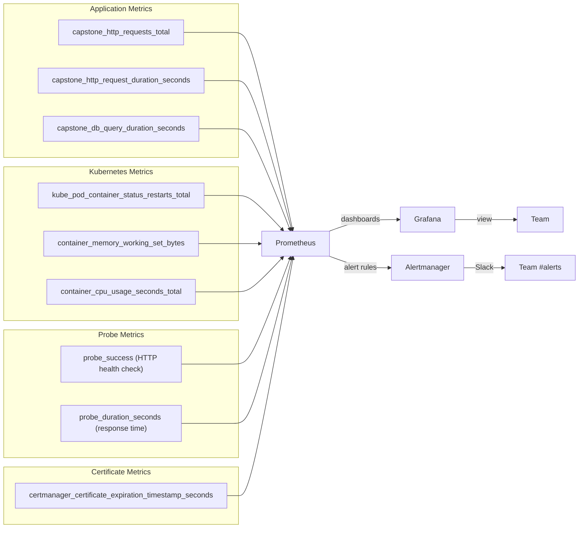

# Production Observability: You Can't Fix What You Can't See

Deploying သည် အလုပ်၏ တစ်ဝက်သာ ရှိပါသေးသည်။ Production စနစ်များသည် မျှော်လင့်မထားသော နည်းလမ်းများဖြင့် ချို့ယွင်းတတ်သည် — နှေးကွေးသော ဇယားဒေတာမေးမြန်းမှု (database query)၊ မှတ်ဉာဏ်ယိုစိမ့်မှု (memory leak) သို့မဟုတ် မနက် ၃ နာရီတွင် ဖြစ်ပေါ်သော pod OOMKilled ကဲ့သို့ ပြဿနာများ ဖြစ်တတ်သည်။ Observability (စောင့်ကြည့်လေ့လာနိုင်စွမ်း) မပါရှိပါက သင်သည် မျက်စိကန်းလျက်နှင့် ပျံသန်းနေရသကဲ့သို့ ဖြစ်နေပါလိမ့်မည်။

ဤသင်ခန်းစာသည် လုပ်ငန်းခွင်အဆင့်မီ (industry-standard) observability stack ကို သတ်မှတ်ပေးပါမည်-
- **Prometheus** — သင့်အပလီကေးရှင်းနှင့် cluster မှ time-series မက်ထရစ်များကို စုဆောင်းပြီး သိမ်းဆည်းပေးသည်
- **Grafana** — Prometheus မက်ထရစ်များကို အပြန်အလှန်တုံ့ပြန်နိုင်သော ဒက်ရှ်ဘုတ်များတွင် မြင်သာအောင် ပြသပေးသည်
- **Alertmanager** — မက်ထရစ်များသည် သတ်မှတ်ထားသော အကန့်အသတ်များကို ကျော်လွန်သွားသည့်အခါ Slack/email သို့ အကြောင်းကြားချက်များ ပို့ပေးသည်

ပြီးမြောက်သွားသောအခါ၊ သင့်တွင် အောက်ပါတို့ ရှိလာမည်ဖြစ်သည်-
- Real-time CPU၊ memory နှင့် request rate ဒက်ရှ်ဘုတ်များ
- health endpoint သည် ၂ မိနစ်ကျော်ကြာ ကျရှုံးပါက အလိုအလျောက် သတိပေးချက်များ
- လက်မှတ်သက်တမ်းမကုန်ဆုံးမီ ၁၄ ရက်အလိုတွင် သက်တမ်းကုန်မည့်အကြောင်း သတိပေးချက်များ
- Pod ပျက်စီးမှုကို সন்தိဖော်ထုတ်ခြင်းနှင့် အကြောင်းကြားခြင်း

---

## The Observability Stack Architecture

```mermaid
flowchart TD
    subgraph cluster["K3s Cluster"]
        subgraph app["Namespace: production"]
            APP[capstone-app pods\n/metrics endpoint]
            HEALTH[/api/health]
        end

        subgraph monitoring["Namespace: monitoring"]
            PROM[Prometheus\nScrapes metrics every 15s]
            AM[Alertmanager\nRoutes alerts to Slack]
            GRAFANA[Grafana\nDashboards & panels]
            BM[Blackbox Exporter\nProbes /api/health HTTP endpoint]
            CM_EX[cert-manager Exporter\nTLS cert expiry metrics]
        end
    end

    APP -->|/metrics| PROM
    BM -->|HTTP probe| HEALTH
    CM_EX -->|cert expiry| PROM
    PROM -->|scrapes| BM
    PROM -->|scrapes| CM_EX
    PROM -->|alert rules| AM
    AM -->|webhook| SLACK[Slack Channel\n#alerts]
    GRAFANA -->|PromQL queries| PROM

    USER[Team Member] -->|Grafana dashboard| GRAFANA
    USER -->|Slack| SLACK
```

---

## Step 1: Install kube-prometheus-stack via Helm

`kube-prometheus-stack` chart သည် Prometheus, Alertmanager, Grafana နှင့် Kubernetes သီးသန့် recording rules များနှင့် ဒက်ရှ်ဘုတ်များကို စုစည်းပေးထားပြီး — အားလုံးကို အသင့်အနေအထားဖြင့် အတူတကွအလုပ်လုပ်ရန် ပြင်ဆင်ထားပြီးဖြစ်သည်။

```bash
# Add the Helm repo
helm repo add prometheus-community https://prometheus-community.github.io/helm-charts
helm repo update

# Create the monitoring namespace
kubectl create namespace monitoring

# Install the stack (this takes 3-5 minutes)
helm install kube-prometheus-stack prometheus-community/kube-prometheus-stack \
  -n monitoring \
  --set grafana.adminPassword="changeme-in-production" \
  --set prometheus.prometheusSpec.retention="30d" \
  --set prometheus.prometheusSpec.retentionSize="10GB" \
  --set alertmanager.enabled=true \
  --version 56.21.4  # Pin version for reproducibility

# Watch the pods come up (Grafana, Prometheus, Alertmanager)
kubectl -n monitoring get pods -w
```

အသင့်ဖြစ်သည့်အခါ မျှော်လင့်ရမည့် pods များ-
```
NAME                                                   READY   STATUS
alertmanager-kube-prometheus-stack-alertmanager-0      2/2     Running
kube-prometheus-stack-grafana-xxx                      3/3     Running
kube-prometheus-stack-kube-state-metrics-xxx           1/1     Running
kube-prometheus-stack-operator-xxx                     1/1     Running
kube-prometheus-stack-prometheus-node-exporter-xxx     1/1     Running
prometheus-kube-prometheus-stack-prometheus-0          2/2     Running
```

---

## Step 2: Add a `/metrics` Endpoint to Your Application

Prometheus သည် pull မော်ဒယ်ကို အသုံးပြုသည် — ၎င်းသည် `/metrics` HTTP endpoint မှ မက်ထရစ်များကို အခါအားလျော်စွာ ရယူသည်။ သင့် Next.js app တွင် `prom-client` လိုက်ဘရီကို ထည့်ပါ-

```bash
npm install prom-client
```

```typescript
// app/api/metrics/route.ts
import { NextResponse } from "next/server";
import { collectDefaultMetrics, Registry, Counter, Histogram, Gauge } from "prom-client";

// Create a custom registry (separate from the global one for isolation)
const register = new Registry();

// Collect default Node.js metrics (event loop lag, GC stats, memory usage)
collectDefaultMetrics({ register, prefix: "capstone_" });

// Custom application metrics
export const httpRequestsTotal = new Counter({
  name: "capstone_http_requests_total",
  help: "Total number of HTTP requests",
  labelNames: ["method", "route", "status_code"],
  registers: [register],
});

export const httpRequestDuration = new Histogram({
  name: "capstone_http_request_duration_seconds",
  help: "HTTP request duration in seconds",
  labelNames: ["method", "route"],
  buckets: [0.005, 0.01, 0.025, 0.05, 0.1, 0.25, 0.5, 1, 2.5, 5],
  registers: [register],
});

export const dbConnectionsActive = new Gauge({
  name: "capstone_db_connections_active",
  help: "Number of active database connections",
  registers: [register],
});

export const dbQueryDuration = new Histogram({
  name: "capstone_db_query_duration_seconds",
  help: "Database query duration in seconds",
  labelNames: ["operation"],
  buckets: [0.001, 0.005, 0.01, 0.025, 0.05, 0.1, 0.5, 1],
  registers: [register],
});

// GET /api/metrics — Prometheus scrape endpoint
export async function GET() {
  try {
    const metrics = await register.metrics();
    return new Response(metrics, {
      status: 200,
      headers: {
        "Content-Type": register.contentType,
        // Don't cache metrics
        "Cache-Control": "no-store",
      },
    });
  } catch (error) {
    console.error("[metrics] Failed to collect metrics:", error);
    return NextResponse.json({ error: "metrics collection failed" }, { status: 500 });
  }
}
```

<Callout type="warning" title="Secure the /api/metrics Endpoint">
`/api/metrics` endpoint သည် အတွင်းပိုင်းစနစ် အချက်အလက်များကို ပေါ်လွင်စေသည်။ Production တွင်၊ Prometheus သာလျှင် ၎င်းကို scrape လုပ်နိုင်ရန် ဝင်ရောက်ခွင့်ကို ကန့်သတ်ပါ။ NetworkPolicy ကို အသုံးပြု၍ သို့မဟုတ် shared secret header တစ်ခုကို စစ်ဆေးခြင်းဖြင့် ဤသို့လုပ်ဆောင်နိုင်သည်-

```typescript
// Check for a scrape token header
const token = req.headers.get("x-prometheus-token");
if (token !== process.env.METRICS_TOKEN) {
  return new Response("Unauthorized", { status: 401 });
}
```
</Callout>

---

## Step 3: Create a ServiceMonitor

`ServiceMonitor` က Prometheus အား မည်သည့် service များကို scrape လုပ်ရမည်နှင့် မည်ကဲ့သို့ လုပ်ရမည်ကို ပြောပြသည်-

```yaml
# k8s/servicemonitor.yaml
apiVersion: monitoring.coreos.com/v1
kind: ServiceMonitor
metadata:
  name: capstone-app-monitor
  namespace: production
  labels:
    # This label is required by the kube-prometheus-stack Prometheus instance
    release: kube-prometheus-stack
spec:
  selector:
    matchLabels:
      app: capstone-app   # Match the Service with this label
  endpoints:
    - port: http           # The port name in the Service (must match)
      path: /api/metrics   # The metrics endpoint path
      interval: 15s        # Scrape every 15 seconds
      scrapeTimeout: 10s
      scheme: http
```

```bash
kubectl apply -f k8s/servicemonitor.yaml

# Verify Prometheus picked it up (takes 30-60 seconds)
# Access the Prometheus UI via port-forward:
kubectl -n monitoring port-forward svc/kube-prometheus-stack-prometheus 9090:9090

# In browser: http://localhost:9090/targets
# Look for: production/capstone-app-monitor (State: UP)
```

---

## Step 4: Install and Configure Blackbox Exporter

Blackbox Exporter သည် HTTP/HTTPS endpoint များကို စစ်ဆေးပြီး ရလဒ်များကို Prometheus မက်ထရစ်များအဖြစ် ဖော်ပြပေးသည်။ ဤအရာက အတွင်းပိုင်း မက်ထရစ်များသာမက ပြင်ပရရှိနိုင်မှု (external availability) ကိုပါ စောင့်ကြည့်နိုင်စေပါသည်။

```bash
# Install Blackbox Exporter
helm install blackbox-exporter prometheus-community/prometheus-blackbox-exporter \
  -n monitoring \
  --set config.modules.http_2xx.prober=http \
  --set config.modules.http_2xx.http.valid_http_versions='["HTTP/1.1", "HTTP/2.0"]' \
  --set config.modules.http_2xx.http.valid_status_codes='[]'
```

```yaml
# k8s/blackbox-probe.yaml — Probe the health endpoint from outside the cluster
apiVersion: monitoring.coreos.com/v1
kind: Probe
metadata:
  name: capstone-app-health-probe
  namespace: production
  labels:
    release: kube-prometheus-stack
spec:
  jobName: "capstone-app-health"
  prober:
    url: blackbox-exporter-prometheus-blackbox-exporter.monitoring.svc.cluster.local:9115
  module: http_2xx
  targets:
    staticConfig:
      static:
        - https://app.yourdomain.com/api/health
      labels:
        app: capstone-app
        environment: production
```

```bash
kubectl apply -f k8s/blackbox-probe.yaml
```

---

## Step 5: Create Prometheus Alert Rules

```yaml
# k8s/alertrules.yaml
apiVersion: monitoring.coreos.com/v1
kind: PrometheusRule
metadata:
  name: capstone-app-alerts
  namespace: production
  labels:
    release: kube-prometheus-stack
spec:
  groups:
    - name: capstone-app.rules
      rules:

        # Alert if the /api/health probe fails for more than 2 minutes
        - alert: CapstoneAppDown
          expr: |
            probe_success{job="capstone-app-health"} == 0
          for: 2m
          labels:
            severity: critical
            team: backend
          annotations:
            summary: "Capstone App is down"
            description: |
              The health check at https://app.yourdomain.com/api/health
              has been failing for more than 2 minutes.
              Pod status: {{ $labels.pod }}

        # Alert if HTTP request error rate exceeds 5% over 5 minutes
        - alert: HighErrorRate
          expr: |
            (
              rate(capstone_http_requests_total{status_code=~"5.."}[5m])
              /
              rate(capstone_http_requests_total[5m])
            ) > 0.05
          for: 5m
          labels:
            severity: warning
          annotations:
            summary: "High HTTP error rate"
            description: "More than 5% of requests are returning 5xx errors."

        # Alert if p99 request latency exceeds 2 seconds
        - alert: HighLatency
          expr: |
            histogram_quantile(0.99,
              rate(capstone_http_request_duration_seconds_bucket[5m])
            ) > 2
          for: 5m
          labels:
            severity: warning
          annotations:
            summary: "High request latency"
            description: "99th percentile latency is above 2 seconds."

        # Alert if any pod is crash-looping
        - alert: PodCrashLooping
          expr: |
            rate(kube_pod_container_status_restarts_total{
              namespace="production",
              container="app"
            }[5m]) * 60 > 1
          for: 5m
          labels:
            severity: critical
          annotations:
            summary: "Pod is crash-looping"
            description: "Pod {{ $labels.pod }} is restarting more than 1 time per minute."

        # Alert if memory usage exceeds 80% of the limit
        - alert: HighMemoryUsage
          expr: |
            (
              container_memory_working_set_bytes{
                namespace="production",
                container="app"
              }
              /
              kube_pod_container_resource_limits{
                namespace="production",
                container="app",
                resource="memory"
              }
            ) > 0.80
          for: 5m
          labels:
            severity: warning
          annotations:
            summary: "High memory usage"
            description: "Memory usage is above 80% of the limit. Risk of OOMKill."

        # Alert if TLS certificate expires in less than 14 days
        - alert: CertificateExpiringSoon
          expr: |
            certmanager_certificate_expiration_timestamp_seconds{
              namespace="production",
              name="capstone-app-tls"
            } - time() < 14 * 24 * 3600
          labels:
            severity: warning
          annotations:
            summary: "TLS certificate expiring soon"
            description: "The TLS certificate expires in less than 14 days. Check cert-manager."
```

```bash
kubectl apply -f k8s/alertrules.yaml

# Verify the rules are loaded by Prometheus
# In the Prometheus UI (localhost:9090): Status → Rules
# Look for the "capstone-app.rules" group with state: "active"
```

---

## Step 6: Configure Alertmanager → Slack

```yaml
# alertmanager-config-secret.yaml
# Store as a Kubernetes Secret (contains Slack webhook URL)
apiVersion: v1
kind: Secret
metadata:
  name: alertmanager-slack-config
  namespace: monitoring
type: Opaque
stringData:
  alertmanager.yaml: |
    global:
      resolve_timeout: 5m
      slack_api_url: "https://hooks.slack.com/services/YOUR/SLACK/WEBHOOK"

    templates:
      - "/etc/alertmanager/config/*.tmpl"

    route:
      group_by: ["alertname", "namespace"]
      group_wait: 30s
      group_interval: 5m
      repeat_interval: 4h
      receiver: slack-notifications

      routes:
        # Critical alerts: notify immediately
        - matchers:
            - severity = critical
          receiver: slack-critical
          continue: false

        # Warning alerts: group and notify less frequently
        - matchers:
            - severity = warning
          receiver: slack-warnings

    receivers:
      - name: slack-notifications
        slack_configs:
          - channel: "#alerts"
            title: "{{ .GroupLabels.alertname }}"
            text: "{{ range .Alerts }}{{ .Annotations.description }}\n{{ end }}"

      - name: slack-critical
        slack_configs:
          - channel: "#alerts-critical"
            send_resolved: true
            title: "🚨 CRITICAL: {{ .GroupLabels.alertname }}"
            text: |
              *Description:* {{ .CommonAnnotations.description }}
              *Severity:* {{ .CommonLabels.severity }}

      - name: slack-warnings
        slack_configs:
          - channel: "#alerts"
            send_resolved: true
            title: "⚠️ Warning: {{ .GroupLabels.alertname }}"
            text: "{{ .CommonAnnotations.description }}"
```

```bash
kubectl apply -f alertmanager-config-secret.yaml

# Update Alertmanager to use the config secret
helm upgrade kube-prometheus-stack prometheus-community/kube-prometheus-stack \
  -n monitoring \
  --set alertmanager.alertmanagerSpec.configSecret=alertmanager-slack-config
```

---

## Step 7: Access Grafana and Import Dashboards

```bash
# Port-forward Grafana (run in background)
kubectl -n monitoring port-forward svc/kube-prometheus-stack-grafana 3001:80 &

# Open http://localhost:3001
# Username: admin
# Password: changeme-in-production (what you set during helm install)
```

### Import Pre-Built Dashboards

Grafana တွင်: **Dashboards → Import**

| Dashboard ID | Name | What it shows |
|-------------|------|--------------|
| 15760 | Kubernetes / Views / Global | Cluster-wide overview |
| 14584 | Kubernetes Cluster | Node CPU, memory, network |
| 6417 | Kubernetes Pods | Per-pod CPU and memory |
| 7587 | Blackbox Exporter (HTTP) | Endpoint uptime, response time |
| 14430 | cert-manager | Certificate expiry tracking |

### Create a Custom App Dashboard

Grafana တွင်: **Dashboards → New Dashboard → Add Panel**

**Panel 1: Request Rate**
```promql
# Requests per second (by status code)
sum(rate(capstone_http_requests_total[5m])) by (status_code)
```

**Panel 2: Error Rate %**
```promql
# Percentage of 5xx responses
(
  sum(rate(capstone_http_requests_total{status_code=~"5.."}[5m]))
  /
  sum(rate(capstone_http_requests_total[5m]))
) * 100
```

**Panel 3: P50/P95/P99 Latency**
```promql
# 50th percentile
histogram_quantile(0.50, rate(capstone_http_request_duration_seconds_bucket[5m]))

# 95th percentile
histogram_quantile(0.95, rate(capstone_http_request_duration_seconds_bucket[5m]))

# 99th percentile
histogram_quantile(0.99, rate(capstone_http_request_duration_seconds_bucket[5m]))
```

**Panel 4: Pod Memory Usage**
```promql
# Memory working set per pod
container_memory_working_set_bytes{
  namespace="production",
  container="app"
}
```

**Panel 5: Health Check Success Rate**
```promql
# Blackbox Exporter probe success (1 = up, 0 = down)
probe_success{job="capstone-app-health"}
```

---

## Step 8: Test Your Alerting

```bash
# Manually trigger the CapstoneAppDown alert by temporarily breaking the app
# (scale down all replicas)
kubectl -n production scale deployment/capstone-app --replicas=0

# Wait 2-3 minutes and check:
# 1. Prometheus Alerts page (localhost:9090/alerts) → CapstoneAppDown firing
# 2. Grafana alert list → CapstoneAppDown
# 3. Slack #alerts channel → Alert notification

# Restore the deployment
kubectl -n production scale deployment/capstone-app --replicas=3
# Wait for pods to be Ready, then check that the alert resolves
```

---

## The Complete Observability Picture



---

## You've Built a Production-Grade CI/CD System 🎉

ဂုဏ်ယူပါတယ်။ အစအဆုံး သင်တည်ဆောက်ခဲ့သည်များကို ပြန်လည်သုံးသပ်ကြည့်ကြပါစို့-

### What You Deployed

| Component | Technology | Purpose |
|-----------|-----------|---------|
| Web app | Next.js 14 + PostgreSQL | The actual product |
| Container image | Docker (3-stage) + GHCR | Portable, secure packaging |
| CI pipeline | GitHub Actions | Quality gate: lint, test, scan |
| CD pipeline | GitHub Actions | Automatic zero-downtime deployment |
| Orchestration | K3s Kubernetes | Self-healing, scalable runtime |
| Ingress | Traefik | HTTP/HTTPS routing |
| TLS | cert-manager + Let's Encrypt | Automatic certificate management |
| Monitoring | Prometheus + Grafana | Metrics and dashboards |
| Alerting | Alertmanager + Slack | Incident notification |

### What Happens Automatically Now

သင် feature branch တစ်ခုသို့ `git push` လုပ်တိုင်း-
1. **ESLint** သည် ကုဒ်စတိုင်လ်ကို စစ်ဆေးသည်
2. **TypeScript** သည် type safety ကို အတည်ပြုသည်
3. **Vitest** သည် unit tests များကို လုပ်ဆောင်သည်
4. **Trivy** သည် Docker image တွင် CVE များ ရှိမရှိ စကန်ဖတ်သည်

PR တစ်ခုကို `main` သို့ merge လုပ်တိုင်း-
1. **Docker image** ကို Git SHA tag ဖြင့် တည်ဆောက်သည်
2. Image ကို **GHCR သို့ ပို့ဆောင်သည်**
3. **Kubernetes Secret** ကို GitHub Secrets မှ တစ်ဆင့် ဆင့်ပွားကိုက်ညီစေသည်
4. **Rolling update** သည် image အသစ်ကို ဖြန့်ချိသည် (zero downtime)
5. **Smoke test** သည် ဖြန့်ချိမှု အောင်မြင်ကြောင်း အတည်ပြုသည်
6. Smoke test ကျရှုံးပါက **Automatic rollback** လုပ်ဆောင်သည်

၁၅ စက္ကန့်တိုင်း-
- **Prometheus** သည် သင့် app, cluster နှင့် health probes တို့မှ မက်ထရစ်များကို scrape လုပ်သည်

တစ်ခုခု မှားယွင်းသွားသည့်အခါ-
- **Alertmanager** သည် ၂ မိနစ်အတွင်း Slack သို့ အကြောင်းကြားချက် ပို့ပေးသည်

---

## What to Do Next

ယခုအခါ သင့်တွင် အပြည့်အစုံပါဝင်သော ပိုက်လိုင်းတစ်ခု ရှိနေပြီဖြစ်ရာ၊ စူးစမ်းလေ့လာရန် လက်တွေ့ကျသော တိုးတက်မှုအချို့မှာ အောက်ပါအတိုင်း ဖြစ်ပါသည်-

### Short-term (1-2 weeks)
- **Add a staging environment** — production သို့ မရောက်မီ PR များကို staging namespace သို့ ဖြန့်ချိပါ
- **Add integration tests** — CI တွင် တကယ့် PostgreSQL နှင့် ချိန်ထိုးစမ်းသပ်ပါ
- **Configure log aggregation** — လော့ဂ်များကို သိမ်းဆည်းရန်နှင့် ရှာဖွေရန် Loki (Grafana stack မှ) ကို အသုံးပြုပါ
- **Add database backups** — pg_dump ပြုလုပ်ရန်နှင့် S3 သို့ တင်ရန် cron job ကို ထည့်သွင်းပါ

### Medium-term (1-3 months)
- **Horizontal Pod Autoscaler** — CPU/memory ပေါ်မူတည်၍ replicas များကို အလိုအလျောက် တိုးမြှင့်ပါ
- **PodDisruptionBudget** — နုဒ်ထိန်းသိမ်းမှုပြုလုပ်နေစဉ်အတွင်း အနည်းဆုံးရရှိနိုင်မှုကို အာမခံပါ
- **Network Policies** — လိုအပ်သည်များသာ pod အချင်းချင်း ဆက်သွယ်နိုင်ရန် ကန့်သတ်ပါ
- **External Secrets Operator** — AWS Secrets Manager / Vault မှ secrets များကို ဆင့်ပွားကိုက်ညီစေပါ

### Long-term (3+ months)
- **GitOps with ArgoCD** — `kubectl set image` ကို declarative GitOps ဖြင့် အစားထိုးပါ
- **Multi-cluster** — dev, staging နှင့် production cluster များကို သီးခြားစီ ဖြန့်ချိပါ
- **Service mesh (Istio/Linkerd)** — mutual TLS, traffic management, canary deployments
- **Multi-region deployment** — အနီးဆုံး ပထဝီဝင်ဒေသမှ အသုံးပြုသူများကို ဝန်ဆောင်မှုပေးပါ

---

## Summary

သင်သည် capstone သင်တန်းကို ပြီးမြောက်သွားပါပြီ။ Production အဆင့်မီ observability စနစ်တစ်ခုကို သင်တည်ဆောက်ခဲ့သည်-
- အပလီကေးရှင်း မက်ထရစ်များ၊ Kubernetes မက်ထရစ်များ၊ HTTP probes နှင့် cert-manager တို့ကို scraping လုပ်နေသော **Prometheus**
- အသင့်ပါရှိပြီးသား ဒက်ရှ်ဘုတ်များ + သီးသန့် app ဒက်ရှ်ဘုတ် ပါဝင်သော **Grafana**
- ပြဿနာတွေ့ရှိပြီး ၂ မိနစ်အတွင်း အရေးကြီးသော သတိပေးချက်များကို Slack သို့ ပို့ဆောင်ပေးနေသော **Alertmanager**
- app အလုပ်မလုပ်တော့ခြင်း၊ အမှားနှုန်းမြင့်မားခြင်း၊ နှေးကွေးခြင်း၊ pod ပျက်စီးခြင်း၊ memory ဖိအားများခြင်းနှင့် လက်မှတ်သက်တမ်းကုန်ဆုံးခြင်းတို့အတွက် **Alert rules** များ

ပို၍အရေးကြီးသည်မှာ၊ ယခုအခါ သင့်တွင် ကုဒ်ကို `git push` လုပ်လိုက်သည်မှ production တွင် အလုပ်လုပ်သည်အထိ လုံခြုံစွာ၊ ထပ်တလဲလဲ ပြုလုပ်နိုင်စွာနှင့် အပြည့်အစုံ စောင့်ကြည့်လေ့လာနိုင်စွမ်းဖြင့် အလိုအလျောက် လုပ်ဆောင်ပေးသော ပိုက်လိုင်းတစ်ခု ရှိနေပြီ ဖြစ်သည်။ ၎င်းသည် လက်တွေ့ကျင့်သုံးမှုတွင် DevOps ဆိုသည်မှာ အဘယ်နည်းဆိုသည်ကို ဖော်ပြနေခြင်းပင် ဖြစ်သည်။

**သင်သည် မည်သည့်အရာမှမရှိရာမှ ကျွမ်းကျင်သူတစ်ဦးအဖြစ် ရောက်ရှိလာပါပြီ။ ယုံကြည်မှုအပြည့်ဖြင့် အသုံးချလိုက်ပါ။ 🚀**