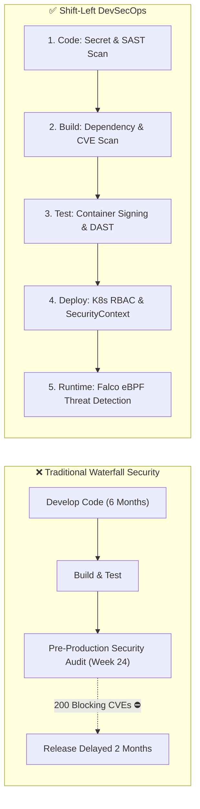
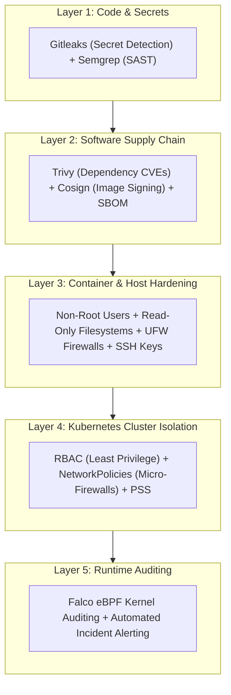

# Shift-Left Security & The DevSecOps Mindset

Software delivery လုပ်တဲ့ and traditional ပုံစံမှာဆိုရင် Security ဆိုတာ release cycle ရဲ့ အစွန်ဆုံး နောက်ဆုံးအဆင့်မှ သီးသန့်စစ်ထုတ်တဲ့ နေရာတစ်ခုလို ဖြစ်နေခဲ့ပါတယ်။ Major release လုပ်ဖို့ ပတ်သီးအနည်းငယ်အလိုမှာမှ သီးသန့် Security team တစ်ခုက penetration test တွေလုပ်ပြီး blocking ticket တွေ ၂၀၀ လောက် ထုတ်ပေးတတ်ကြပါတယ်။ ဒါကြောင့် engineers တွေအနေနဲ့ release တွေကို နောက်ဆုတ်ရတာ၊ architecture တွေ အစကနေ ပြန်ရေးရတာတွေ ဖြစ်လာစေပါတယ်။

**DevSecOps (Development + Security + Operations)** ကတော့ automated security testing တွေကို CI/CD software delivery pipeline ရဲ့ အဆင့်တိုင်းမှာ ပေါင်းစပ်ထည့်သွင်းပေးလိုက်ပါတယ်။

---

## ဘာကြောင့် "Shift-Left" လုပ်ဖို့ လိုတာလဲ? ပြန်လည်ပြင်ဆင်ရတဲ့ ကုန်ကျစရိတ်

Vulnerability တွေကို Lifecycle ရဲ့ နောက်ကျမှ တွေ့လေလေ၊ ပြန်ပြင်ရတာ ပိုခက်ပြီး ကုန်ကျစရိတ်က အဆမတန် ကြီးမြင့်လာလေလေ ဖြစ်ပါတယ်။

```mermaid
gantt
    title Relative Cost to Fix a Security Vulnerability
    dateFormat X
    axisFormat $ %s

    section Coding (IDE / Pre-commit)
    $80 :active, 0, 80
    section CI/CD Pipeline
    $450 : 0, 450
    section Staging QA Testing
    $1800 : 0, 1800
    section Production Breach Post-Mortem
    $7600+ :crit, 0, 7600
```

1. **Coding Phase (~$80)**: Git ထဲ မတင်ခင် IDE linter သို့မဟုတ် pre-commit hook ကနေ တန်းပြီး ဖမ်းမိပါတယ်။
2. **CI Pipeline (~$450)**: Pull Request လုပ်တဲ့အခါ automated scan ကနေ ဖမ်းမိတာကြောင့် developer က ၁၅ မိနစ်လောက်နဲ့ ပြင်လို့ပြီးပါတယ်။
3. **Production Breach (~$7,600 - $4.4M+)**: Data လိတ်ကျတာတွေ၊ အရေးပေါ် hotfix လုပ်ရတာတွေ၊ GDPR/HIPAA လို ဥပဒေအရ ဒဏ်ငွေဆောင်ရတာတွေနဲ့ နာမည်ပျက်စီးတာတွေ ဖြစ်လာနိုင်ပါတယ်။

---

## Defense-in-Depth ရဲ့ Layer ၅ ခု

Firewall တစ်ခုတည်း ဒါမှမဟုတ် နယ်နိမိတ် ကာကွယ်ရေးတစ်ခုတည်းကိုပဲ ဘယ်တော့မှ အားမကိုးပါနဲ့။ ခေတ်ပေါ် Cloud security မှာဆိုရင် **Defense-in-Depth** ကို ထင်ရှားတဲ့ Layer ၅ ခုနဲ့ ကျင့်သုံးပါတယ်-

---

## STRIDE Framework ကိုသုံးပြီး Threat Modeling လုပ်ခြင်း

Code မရေးခင် ဒါမှမဟုတ် infrastructure မဆောက်ခင်မှာ engineers တွေအနေနဲ့ ဖြစ်လာနိုင်တဲ့ attack vector တွေကို ရှာဖွေဖို့ Microsoft ရဲ့ **STRIDE** framework ကို အသုံးပြုကြပါတယ်-

| Threat | Description | Real-World Example | DevSecOps Countermeasure |
| :--- | :--- | :--- | :--- |
| **S**poofing | လူတစ်ယောက်ယောက် အနေနဲ့ အယောင်ဆောင်တာ | Attacker က malicious container image တစ်ခုကို ဝင်ပို့တာ | Sigstore Cosign digital image signing |
| **T**ampering | Data တွေ transit/rest ဖြစ်နေစဉ်မှာ ပြုပြင်ပြောင်းလဲပစ်တာ | Database record တွေကို တိုက်ရိုက် ဝင်ပြင်တာ | TLS encryption + immutable audit logs |
| **R**epudiation | လုပ်ဆောင်ချက်တစ်ခု လုပ်ခဲ့တာကို ငြင်းဆန်တာ | User က DB ကို သူ မဖျက်ခဲ့ဘူးလို့ ငြင်းတာ | Centralized append-only audit logging |
| **I**nformation Disclosure | ကိုယ်ရေးကိုယ်တာ data တွေ ပေါက်ကြားတာ | Git ထဲမှာ database password ကို plain-text အတိုင်း ထည့်ထားမိတာ | HashiCorp Vault / Sealed Secrets |
| **D**enial of Service | System ရဲ့ resource တွေကို ကုန်ခမ်းသွားအောင် လုပ်တာ | API ကို request ၁ သိန်း/စက္ကန့်နဲ့ ရေလွှမ်းသလို ပို့တာ | Rate limiting + K8s resource requests/limits |
| **E**levation of Privilege | ခွင့်ပြုချက်မရှိဘဲ admin access ရယူတာ | Container breakout ကို exploit လုပ်ပြီး root ယူတာ | Container တွေကို unprivileged non-root နဲ့ Run တာ |