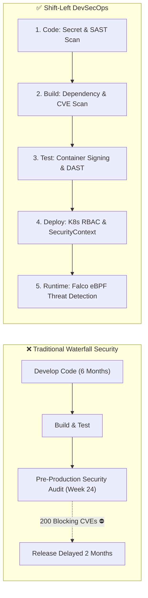
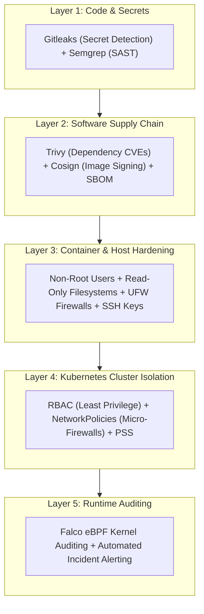

```mermaid
gantt
    title Relative Cost to Fix a Security Vulnerability
    dateFormat X
    axisFormat $ %s

    section Coding (IDE / Pre-commit)
    $80 :active, 0, 80
    section CI/CD Pipeline
    $450 : 0, 450
    section Staging QA Testing
    $1800 : 0, 1800
    section Production Breach Post-Mortem
    $7600+ :crit, 0, 7600
```

# Shift-Left Security & The DevSecOps Mindset (လုံခြုံရေးကို အစောဆုံး စဉ်းစားခြင်းနှင့် DevSecOps အတွေးအခေါ်)

ရိုးရာဆော့ဖ်ဝဲလ်ထုတ်လုပ်ရေးစနစ်များတွင် လုံခြုံရေးဆိုသည်မှာ ထွက်ရှိခါနီး Release Cycle ၏ နောက်ဆုံးအဆင့်တွင်မှ သီးသန့်စစ်ဆေးသည့် အတားအဆီးတစ်ခုကဲ့သို့ ဖြစ်နေခဲ့သည်။ မေဂျာထွက်ရှိမည့်ရက် မတိုင်မီ ပတ်သတင်းပတ်အနည်းငယ်အလိုတွင် သီးသန့်လုံခြုံရေးအဖွဲ့တစ်ခုက Penetration Test များလုပ်ဆောင်ကာ လုပ်ငန်းမလုပ်ဆောင်နိုင်တော့သည့် Blocking Ticket ၂၀၀ ခန့်ကို တင်ပြကြပြီး — ၎င်းက အင်ဂျင်နီယာများကို Release ရက်ဆွဲရွှေ့ဆိုင်းရန်နှင့် Architecture ကို ပြန်လည်ရေးသားရန် ဖိအားပေးခဲ့သည်။

**DevSecOps (Development + Security + Operations)** သည် အလိုအလျောက်လုံခြုံရေးစစ်ဆေးခြင်း (Automated Security Testing) ကို CI/CD ဆော့ဖ်ဝဲလ်ဖြန့်ဝေမှုပိုက်လိုင်း (Pipeline) ၏ အဆင့်တိုင်းတွင် ပေါင်းစပ်ထည့်သွင်းပေးသည်။

---

## ဘာကြောင့် "Shift-Left" ခေါ်တာလဲ။ ပြုပြင်ရခြင်း၏ ကုန်ကျစရိတ်

လုံခြုံရေးအားနည်းချက်များကို Lifecycle တွင် နောက်ကျမှ တွေ့ရှိလေလေ၊ ၎င်းတို့ကို ပြုပြင်ရန် ကုန်ကျစရိတ်နှင့် ခက်ခဲမှုနှုန်းမှာ ပိုမိုများပြားလာလေလေ ဖြစ်သည်-

1. **ကုဒ်ရေးသားသည့်အဆင့် (~$80)**: Git သို့ မတင်မီ IDE linter သို့မဟုတ် pre-commit hook ဖြင့် ချက်ချင်း ဖမ်းမိခြင်း။
2. **CI ပိုက်လိုင်းအဆင့် (~$450)**: Pull Request အလိုအလျောက်စစ်ဆေးမှု (Automated Scan) ပြုလုပ်နေစဉ် တွေ့ရှိခြင်း၊ Developer မှ ၁၅ မိနစ်အတွင်း ပြုပြင်နိုင်ခြင်း။
3. **Production တွင် ပေါက်ကြားခြင်း (~$7,600 - $4.4M+)**: ဒေတာများ ပေါက်ကြားခြင်း၊ အရေးပေါ် Hotfix များလုပ်ဆောင်ရခြင်း၊ GDPR/HIPAA စည်းမျဉ်းဒဏ်ငွေများပေးဆောင်ရခြင်းနှင့် နာမည်ပျက်စီးခြင်းတို့ ပါဝင်သည်။

---

## အလွှာ ၅ ဆင့်ပါဝင်သော အကာအကွယ်စနစ် (5 Layers of Defense-in-Depth)

 Firewall တစ်ခုတည်း သို့မဟုတ် နယ်နိမိတ်အကာအကွယ်တစ်ခုတည်းကို လုံးဝ မမှီခိုသင့်ပါ။ ခေတ်မီ Cloud လုံခြုံရေးသည် ထင်ရှားသည့် အလွှာ ၅ ဆင့်ဖြင့် **Defense-in-Depth (အဆင့်ဆင့်ကာကွယ်ခြင်း)** ကို ကျင့်သုံးသည်-

---

## STRIDE မူဘောင်ဖြင့် ခြိမ်းခြောက်မှုများကို ဆန်းစစ်ခြင်း (Threat Modeling)

ကုဒ် သို့မဟုတ် အခြေခံအဆောက်အအုံ (Infrastructure) မရေးသားမီ အင်ဂျင်နီယာများသည် ဖြစ်နိုင်ချေရှိသော တိုက်ခိုက်မှုလမ်းကြောင်းများကို ဖော်ထုတ်ရန် Microsoft ၏ **STRIDE** မူဘောင်ကို အသုံးပြုကြသည်-

| ခြိမ်းခြောက်မှု (Threat) | ဖော်ပြချက် | လက်တွေ့ဘဝ ဥပမာ | DevSecOps ကာကွယ်ရေးနည်းလမ်း |
| :--- | :--- | :--- | :--- |
| **S**poofing (အတုအယောင်ပြုလုပ်ခြင်း) | အခြားသူတစ်ဦးအဖြစ် ဟန်ဆောင်ခြင်း | တိုက်ခိုက်သူက မကောင်းသော Container Image ကို တင်ခြင်း | Sigstore Cosign ဒစ်ဂျစ်တယ် Image လက်မှတ်ရေးထိုးခြင်း |
| **T**ampering (ပြင်ဆင်ဖျက်ဆီးခြင်း) | ပို့ဆောင်နေစဉ် သို့မဟုတ် သိမ်းဆည်းထားစဉ် ဒေတာများကို ပြုပြင်ခြင်း | ဒေတာဘေ့စ် ရစ်ကတ်များကို တိုက်ရိုက်ပြင်ဆင်ခြင်း | TLS ကုဒ်ဝှက်စနစ် + ပြုပြင်မရသော Audit Logs များ |
| **R**epudiation (ငြင်းဆိုခြင်း) | လုပ်ဆောင်ချက်တစ်ခု လုပ်ခဲ့ကြောင်း ငြင်းဆိုခြင်း | အသုံးပြုသူက DB ကို မဖျက်ခဲ့ကြောင်း ငြင်းဆိုခြင်း | ဗဟိုချုပ်ကိုင်ထားသော (Append-only) Audit Logging စနစ် |
| **I**nformation Disclosure (အချက်အလက် ပေါက်ကြားခြင်း) | ကိုယ်ရေးကိုယ်တာ အချက်အလက်များကို ဖော်ပြမိခြင်း | Git တွင် Plain-text ဒေတာဘေ့စ် စကားဝှက် ပါသွားခြင်း | HashiCorp Vault / Sealed Secrets |
| **D**enial of Service (ဝန်ဆောင်မှု ရပ်တန့်စေခြင်း) | စနစ်အရင်းအမြစ်များကို ကုန်ခမ်းစေခြင်း | API ကို တစ်စက္ကန့်လျှင် တောင်းဆိုမှု ၁၀၀,၀၀၀ ဖြင့် ရေလွှမ်းမိုးခြင်း | Rate limiting + K8s resource requests/limits |
| **E**levation of Privilege (အခွင့်အရေး တိုးမြှင့်ခြင်း) | ခွင့်ပြုချက်မရှိဘဲ အက်ဒမင် အခွင့်အရေး ရယူခြင်း | Container မှ Root သို့ ထွက်ပြေးရန် အားနည်းချက်ကို အသုံးချခြင်း | Container များကို အခွင့်အရေးမရှိသော non-root ဖြင့် အလုပ်လုပ်စေခြင်း |