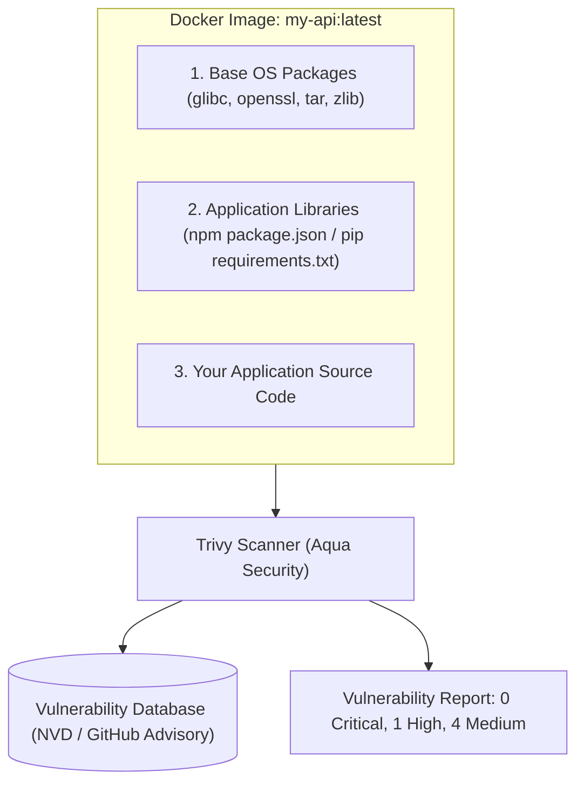

# Trivy ဖြင့် Container နှင့် Filesystem များကို CVE စစ်ဆေးခြင်း

Docker file ထဲတွင် `FROM node:20` ဟု ရေးသားလိုက်သောအခა Node.js တစ်ခုတည်းကိုသာ ဆွဲယူနေခြင်း မဟုတ်ပါ — ၎င်းသည် OS ပက်ကေ့ဂျ်ပေါင်း ၄၀၀ ကျော် (OpenSSL, curl, systemd, libc) ပါဝင်သည့် ပြီးပြည့်စုံသော Linux ဖြန့်ချိမှု (Debian/Ubuntu) တစ်ခုကိုပါ ဆွဲယူနေခြင်း ဖြစ်ပါသည်။

အဆိုပါ အခြေခံ ပက်ကေ့ဂျ်များထဲမှ တစ်ခုခုတွင် **Common Vulnerability and Exposure (CVE)** တစ်ခုခု ပါဝင်နေမည်ဆိုပါက သင်၏ ထုတ်လုပ်ရေး (Production) ကလပ်စတာ တစ်ခုလုံးသည် အဝေးမှ ကုဒ်လုပ်ဆောင်ခြင်း (Remote Code Execution) ဘေးအန္တရာယ်နှင့် ရင်ဆိုင်ရမည် ဖြစ်ပါသည်။



---

## CVSS အန္တရာယ်အဆင့်များကို နားလည်ခြင်း

လုံခြုံရေး အားနည်းချက်များကို **Common Vulnerability Scoring System (CVSS)** ကို အသုံးပြု၍ အဆင့်သတ်မှတ်ထားပါသည်:

| အန္တရာယ်အဆင့် | CVSS ရမှတ် | Production မူဝါဒ | လိုအပ်သော လုပ်ဆောင်ချက် |
| :--- | :--- | :--- | :--- |
| **CRITICAL** | 9.0 - 10.0 | ⛔ **ချက်ချင်း ရပ်တန့်မည်** | CI build မအောင်မြင်ပါ၊ deploy မလုပ်မီ ပြုပြင်ရမည် (Remote Code Execution) |
| **HIGH** | 7.0 - 8.9 | ⚠️ **ရပ်တန့်မည် သို့မဟုတ် 48 နာရီအတွင်း ဖြေရှင်းမည်** | ၄၈ နာရီအတွင်း Base image ကို ပြင်ဆင်ပါ သို့မဟုတ် မြှင့်တင်ပါ |
| **MEDIUM** | 4.0 - 6.9 | ℹ️ **မှတ်တမ်းတင်ပြီး စစ်ဆေးမည်** | နောက်လာမည့် sprint ထိန်းသိမ်းမှုတွင် ဖြေရှင်းမည် |
| **LOW** | 0.1 - 3.9 | ℹ️ **အချက်အလက်အဖြစ်သာ** | အန္တရာယ်နည်းသည်၊ ပုံမှန် မူတည်ချက် (dependency) အပ်ဒိတ်လုပ်သည့်အခါ ဖြေရှင်းမည် |

---

## လက်တွေ့လုပ်ဆောင်ခြင်း: Trivy ဖြင့် Container များကို စစ်ဆေးခြင်း

Trivy ကို ထည့်သွင်းပါ:
```bash
# macOS
brew install trivy

# Linux
sudo apt-get install wget apt-transport-https gnupg lsb-release
wget -qO - https://aquasecurity.github.io/trivy-repo/deb/public.key | sudo apt-key add -
echo "deb https://aquasecurity.github.io/trivy-repo/deb $(lsb_release -sc) main" | sudo tee -a /etc/apt/sources.list.d/trivy.list
sudo apt-get update && sudo apt-get install trivy
```

### ၁။ Docker Image တစ်ခုကို စစ်ဆေးခြင်း
```bash
$ trivy image --severity HIGH,CRITICAL node:18-bullseye

node:18-bullseye (debian 11.7)
==============================
Total: 34 (HIGH: 28, CRITICAL: 6)

┌────────────────┬────────────────┬──────────┬───────────────────┬───────────────┐
│ Library        │ Vulnerability  │ Severity │ Installed Version │ Fixed Version │
├────────────────┼────────────────┼──────────┼───────────────────┼───────────────┤
│ openssl        │ CVE-2023-0286  │ CRITICAL │ 1.1.1n-0+deb11u4  │ 1.1.1n-0+deb11u5│
│ libssl1.1      │ CVE-2023-0464  │ HIGH     │ 1.1.1n-0+deb11u4  │ 1.1.1n-0+deb11u5│
└────────────────┴────────────────┴──────────┴───────────────────┴───────────────┘
```

### ၂။ လုံခြုံရေးမြှင့်တင်ထားသော အနည်းငယ်သာပါသည့် Base (`alpine` သို့မဟုတ် `distroless`) နှင့် နှိုင်းယှဉ်ခြင်း
```bash
$ trivy image --severity HIGH,CRITICAL node:20-alpine

node:20-alpine (alpine 3.19.1)
==============================
Total: 0 (HIGH: 0, CRITICAL: 0)  ← 100% သန့်စင်သွားပါပြီ!
```

> [!TIP]
> ပုံမှန် Debian image (`node:20`) မှ Alpine image (`node:20-alpine`) သို့မဟုတ် Google Distroless image (`gcr.io/distroless/nodejs20-debian12`) သို့ ပြောင်းလဲခြင်းဖြင့် မလိုအပ်သော shell အသုံးအဆောင်များ၊ compilers များနှင့် package managers များကို ဖယ်ရှားပေးကာ CVE အားလုံး၏ ၉၅% ကျော်ကို ဖယ်ရှားပေးနိုင်ပါသည်။

---

## ၃. Software Bill of Materials (SBOM) ထုတ်လုပ်ခြင်း

လုပ်ငန်းသုံး စာချုပ်များနှင့် လိုက်နာရမည့် စံနှုန်းများစွာ (US Executive Order 14028 ကဲ့သို့သော) သည် **SBOM** (သင်၏ ဆော့ဖ်ဝဲ ပစ္စည်းတစ်ခုချင်းစီ၏ တရားဝင် စာရင်း) ကို ပံ့ပိုးပေးရန် လိုအပ်ပါသည်။

```bash
# CycloneDX JSON SBOM ကို ထုတ်လုပ်ခြင်း
trivy image --format cyclonedx --output sbom.json my-app:v1.0.0
```

---

## ၄. GitHub Actions တွင် Production CI/CD Gate ထည့်သွင်းခြင်း

```yaml
- name: Build Docker Image
  run: docker build -t my-app:${{ github.sha }} .

- name: Run Trivy Vulnerability Scanner
  uses: aquasecurity/trivy-action@master
  with:
    image-ref: 'my-app:${{ github.sha }}'
    format: 'table'
    exit-code: '1' # CRITICAL အားနည်းချက်များ ရှိနေပါက build ကို ရပ်တန့်မည်!
    ignore-unfixed: true
    severity: 'CRITICAL,HIGH'
```