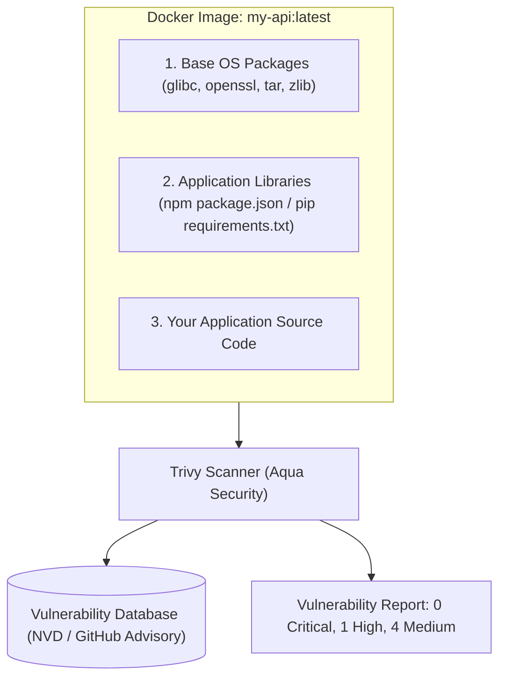

# Container & Filesystem CVE Scanning with Trivy

Docker file ထဲမှာ `FROM node:20` လို့ ရေးလိုက်တဲ့အခါမှာ Node.js ကို ယူလိုက်ရုံတင် မဟုတ်ပါဘူး — OS packages (OpenSSL, curl, systemd, libc) ၄၀၀ ကျော်ပါဝင်တဲ့ Linux distribution (Debian/Ubuntu) တစ်ခုလုံးကိုပါ တွဲယူလိုက်တာ ဖြစ်ပါတယ်။

အဲ့ဒီအထဲက အခြေခံကျတဲ့ package တစ်ခုခုမှာ **Common Vulnerability and Exposure (CVE)** တစ်ခုခု ပါနေမယ်ဆိုရင် သင့်ရဲ့ production cluster တစ်ခုလုံးဟာ remote code execution အန္တရာယ်နဲ့ ရင်ဆိုင်ရမှာ ဖြစ်ပါတယ်။



---

## CVSS Severity Levels များကို နားလည်ခြင်း

Vulnerability များကို **Common Vulnerability Scoring System (CVSS)** ကို သုံးပြီး အဆင့်သတ်မှတ်ပါတယ် -

| Severity | CVSS Score | Production Policy | Action Required |
| :--- | :--- | :--- | :--- |
| **CRITICAL** | 9.0 - 10.0 | ⛔ **Immediate Block** | CI build fail ဖြစ်မယ်၊ deploy မလုပ်ခင် သေချာပေါက် ရှင်းရမယ် (Remote Code Execution) |
| **HIGH** | 7.0 - 8.9 | ⚠️ **Block or 48h SLA** | ၄၈ နာရီအတွင်း base image ကို patch လုပ်တာဖြစ်စေ၊ upgrade လုပ်တာဖြစ်စေ လုပ်ရမယ် |
| **MEDIUM** | 4.0 - 6.9 | ℹ️ **Log & Triage** | နောက်လာမယ့် sprint maintenance မှာ ဖြေရှင်းမယ် |
| **LOW** | 0.1 - 3.9 | ℹ️ **Informational** | အန္တရာယ်နည်းတယ်၊ ပုံမှန် dependency updates လုပ်တဲ့အချိန်မှာ ရှင်းသွားမယ် |

---

## Hands-On: Trivy ကိုသုံးပြီး Containers များကို Scan လုပ်ခြင်း

Trivy ကို install လုပ်မယ် -
```bash
# macOS
brew install trivy

# Linux
sudo apt-get install wget apt-transport-https gnupg lsb-release
wget -qO - https://aquasecurity.github.io/trivy-repo/deb/public.key | sudo apt-key add -
echo "deb https://aquasecurity.github.io/trivy-repo/deb $(lsb_release -sc) main" | sudo tee -a /etc/apt/sources.list.d/trivy.list
sudo apt-get update && sudo apt-get install trivy
```

### 1. Docker Image တစ်ခုကို Scan လုပ်ခြင်း
```bash
$ trivy image --severity HIGH,CRITICAL node:18-bullseye

node:18-bullseye (debian 11.7)
==============================
Total: 34 (HIGH: 28, CRITICAL: 6)

┌────────────────┬────────────────┬──────────┬───────────────────┬───────────────┐
│ Library        │ Vulnerability  │ Severity │ Installed Version │ Fixed Version │
├────────────────┼────────────────┼──────────┼───────────────────┼───────────────┤
│ openssl        │ CVE-2023-0286  │ CRITICAL │ 1.1.1n-0+deb11u4  │ 1.1.1n-0+deb11u5│
│ libssl1.1      │ CVE-2023-0464  │ HIGH     │ 1.1.1n-0+deb11u4  │ 1.1.1n-0+deb11u5│
└────────────────┴────────────────┴──────────┴───────────────────┴───────────────┘
```

### 2. Hardened Minimal Base (`alpine` သို့မဟုတ် `distroless`) နဲ့ နှိုင်းယှဉ်ကြည့်ခြင်း
```bash
$ trivy image --severity HIGH,CRITICAL node:20-alpine

node:20-alpine (alpine 3.19.1)
==============================
Total: 0 (HIGH: 0, CRITICAL: 0)  ← 100% Clean!
```

> [!TIP]
> ပုံမှန် Debian image (`node:20`) ကနေ Alpine image (`node:20-alpine`) သို့မဟုတ် Google Distroless image (`gcr.io/distroless/nodejs20-debian12`) ကို ပြောင်းသုံးလိုက်ခြင်းအားဖြင့် မလိုအပ်တဲ့ shell utilities၊ compilers နဲ့ package managers တွေကို ဖယ်ရှားပေးလိုက်တာကြောင့် CVE တွေရဲ့ ၉၅% ကျော်ကို ဖယ်ရှားပြီးသား ဖြစ်သွားပါတယ်!

---

## 3. Software Bill of Materials (SBOM) တစ်ခု ထုတ်လုပ်ခြင်း

Enterprise contract တွေနဲ့ compliance standard အများစု (ဥပမာ- US Executive Order 14028) အရ သင့်ရဲ့ software artifact ထဲမှာ ပါဝင်တဲ့ ပစ္စည်းတွေအားလုံးရဲ့ စာရင်းအပြည့်အစုံဖြစ်တဲ့ **SBOM** ကို တင်ပြဖို့ လိုအပ်ပါတယ်။

```bash
# CycloneDX JSON SBOM ကို generate လုပ်ရန်
trivy image --format cyclonedx --output sbom.json my-app:v1.0.0
```

---

## 4. GitHub Actions တွင် Production CI/CD Gate ထည့်သွင်းခြင်း

```yaml
- name: Build Docker Image
  run: docker build -t my-app:${{ github.sha }} .

- name: Run Trivy Vulnerability Scanner
  uses: aquasecurity/trivy-action@master
  with:
    image-ref: 'my-app:${{ github.sha }}'
    format: 'table'
    exit-code: '1' # CRITICAL vulnerabilities ရှိနေရင် build ကို ရပ်ပစ်မယ်!
    ignore-unfixed: true
    severity: 'CRITICAL,HIGH'
```