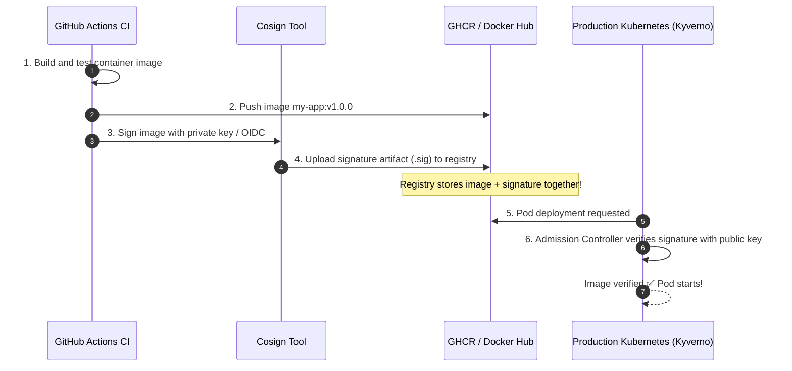

# Supply Chain Security: Signing Images with Cosign

Production Kubernetes cluster ထဲမှာ run နေတဲ့ Container image ဟာ developer တစ်ယောက်ရဲ့ Docker Hub password ကို ဟက်ကာတွေ ဝင်ယူပြီး poisoned လုပ်ထားတာမျိုးမဟုတ်ဘဲ၊ သင်တို့ရဲ့ ယုံကြည်စိတ်ချရတဲ့ GitHub Actions pipeline ကနေ တကယ်တမ်း တည်ဆောက်ခဲ့တာဖြစ်ကြောင်း ဘယ်လိုသိနိုင်မလဲ။

**Sigstore Cosign** က Container images နဲ့ OCI artifacts တွေအတွက် cryptographic signing, verification နဲ့ provenance (မူလအစ အထောက်အထား) တွေကို ပံ့ပိုးပေးပါတယ်။



---

## Generating Keypairs and Signing Locally

Cosign ကို install လုပ်ပါ:
```bash
brew install cosign
```

### 1. Generate a Cryptographic Keypair
```bash
$ cosign generate-key-pair

Enter password for private key: **********
Private key written to cosign.key
Public key written to cosign.pub
```

### 2. Sign a Container Image in the Registry
```bash
# Signs the image digest and pushes the signature to the registry
cosign sign --key cosign.key ghcr.io/my-org/production-api:v1.0.0
```

### 3. Verify the Image Signature
```bash
$ cosign verify --key cosign.pub ghcr.io/my-org/production-api:v1.0.0

Verification for ghcr.io/my-org/production-api:v1.0.0 --
The following checks were performed each with a list of signatures:
- The cosign claims were validated
- The signatures were verified against the specified public key

[{"critical":{"identity":{"docker-reference":"ghcr.io/my-org/production-api"},"image":{"docker-manifest-digest":"sha256:8a1b..."}}}]
```

image layers တွေထဲက တစ်ဘိုက် (byte) လောက်ကိုင်ရင်တောင် ဘယ်သူမဆို ဝင်ပြင်ခဲ့မယ်ဆိုရင် verification ဟာ ချက်ချင်းပဲ **exit code 1 နဲ့ fail** ဖြစ်သွားပါလိမ့်မယ်။

---

## Enforcing Signed Images in Kubernetes with Kyverno

တရားဝင် Signature မရှိတဲ့ Pod တိုင်းကို ပယ်ချဖို့ Kubernetes ကို အောက်ပါအတိုင်း configure လုပ်နိုင်ပါတယ်:

```yaml
apiVersion: kyverno.io/v1
kind: ClusterPolicy
metadata:
  name: check-image-signature
spec:
  validationFailureAction: Enforce # Block unsigned pods!
  rules:
    - name: verify-signature
      match:
        any:
          - resources:
              kinds:
                - Pod
      verifyImages:
        - imageReferences:
            - "ghcr.io/my-org/*"
          attestors:
            - entries:
                - keys:
                    publicKeys: |
                      -----BEGIN PUBLIC KEY-----
                      MFkwEwYHKoZIzj0CAQYIKoZIzj0DAQcDQgAE...
                      -----END PUBLIC KEY-----
```