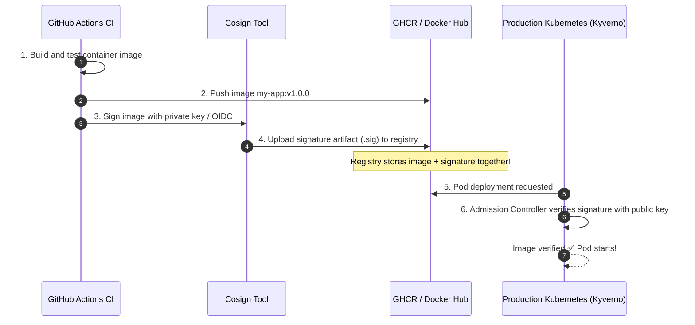

# Supply Chain Security: Signing Images with Cosign

သင်၏ ပရိုဒက်ရှင် (Production) Kubernetes ကာစတာအတွင်း အလုပ်လုပ်နေသော ကွန်တိန်နာ ရုပ်ပုံ (Container image) သည် developer တစ်ဦး၏ Docker Hub စကားဝှက်ကို ဟက်ကာများ ရယူသွားခြင်း (သို့မဟုတ်) ရယ်ဂျစ်ထရီကို အဆိပ်ခတ်ခြင်းတို့ကြောင့် မဟုတ်ဘဲ၊ သင်၏ ယုံကြည်စိတ်ချရသော GitHub Actions ပိုက်လိုင်းမှတဆင့် စစ်မှန်စွာ တည်ဆောက်ထားခြင်းဖြစ်ကြောင်း သင်မည်သို့ သိနိုင်မည်နည်း။

**Sigstore Cosign** သည် ကွန်တိန်နာ ရုပ်ပုံများနှင့် OCI အာတီဖက် (Artifact) များအတွက် Cryptographic လက်မှတ်ရေးထိုးခြင်း၊ စစ်ဆေးခြင်းနှင့် မူလအစကို စစ်ဆေးအတည်ပြုခြင်း (Provenance) တို့ကို ပံ့ပိုးပေးပါသည်။



---

## သော့တွဲများ (Keypairs) ထုတ်လုပ်ခြင်းနှင့် ဒေသတွင်း၌ လက်မှတ်ရေးထိုးခြင်း

Cosign ကို ထည့်သွင်းပါ -
```bash
brew install cosign
```

### ၁။ Cryptographic သော့တွဲ (Keypair) တစ်ခုကို ထုတ်လုပ်ပါ
```bash
$ cosign generate-key-pair

Enter password for private key: **********
Private key written to cosign.key
Public key written to cosign.pub
```

### ၂။ ရယ်ဂျစ်ထရီရှိ ကွန်တိန်နာ ရုပ်ပုံတစ်ပုံကို လက်မှတ်ရေးထိုးပါ
```bash
# Signs the image digest and pushes the signature to the registry
cosign sign --key cosign.key ghcr.io/my-org/production-api:v1.0.0
```

### ၃။ ရုပ်ပုံ၏ လက်မှတ်ကို စစ်ဆေးပါ
```bash
$ cosign verify --key cosign.pub ghcr.io/my-org/production-api:v1.0.0

Verification for ghcr.io/my-org/production-api:v1.0.0 --
The following checks were performed each with a list of signatures:
- The cosign claims were validated
- The signatures were verified against the specified public key

[{"critical":{"identity":{"docker-reference":"ghcr.io/my-org/production-api"},"image":{"docker-manifest-digest":"sha256:8a1b..."}}}]
```

အကယ်၍ မည်သူမဆို ရုပ်ပုံ အလွှာများ (Image layers) ထဲမှ တစ်ဘိုက် (Byte) လောက်ကိုပင် အလွန်အမင်း ပြင်ဆင်မွှေနှောက်ခဲ့လျှင် စစ်ဆေးအတည်ပြုခြင်းသည် ချက်ချင်းဆိုသလိုပင် **exit code 1 ဖြင့် မအောင်မြင်တော့ပါ (fails)**။

---

## Kyverno ကို အသုံးပြု၍ Kubernetes တွင် လက်မှတ်ရေးထိုးထားသော ရုပ်ပုံများကို တင်းကျပ်စွာ အကောင်အထည်ဖော်ခြင်း

မှန်ကန်သော လက်မှတ်မရှိသည့် မည်သည့် ပေါ့ဒ် (Pod) ကိုမဆို ပယ်ချရန် Kubernetes ကို သင် Config လုပ်နိုင်ပါသည် -

```yaml
apiVersion: kyverno.io/v1
kind: ClusterPolicy
metadata:
  name: check-image-signature
spec:
  validationFailureAction: Enforce # Block unsigned pods!
  rules:
    - name: verify-signature
      match:
        any:
          - resources:
              kinds:
                - Pod
      verifyImages:
        - imageReferences:
            - "ghcr.io/my-org/*"
          attestors:
            - entries:
                - keys:
                    publicKeys: |
                      -----BEGIN PUBLIC KEY-----
                      MFkwEwYHKoZIzj0CAQYIKoZIzj0DAQcDQgAE...
                      -----END PUBLIC KEY-----
```