```mermaid
flowchart LR
    Dev["Developer with raw password"] -->|kubeseal with Public Key| SS["SealedSecret.yaml (Encrypted Ciphertext)"]
    SS -->|Safe to commit| Git["Public GitHub Repository"]
    Git -->|ArgoCD sync| K8s["Kubernetes Cluster"]
    K8s --> Controller["Sealed Secrets Controller
(Has Private Key)"]
    Controller -->|Decrypts| Secret["Native K8s Secret (In-Memory)"]
    Secret --> Pod["Application Pod"]
```

# HashiCorp Vault & Sealed Secrets ဖြင့် လျှို့ဝှက်ချက်များ စီမံခန့်ခွဲခြင်း

စံသတ်မှတ်ထားသော Kubernetes တွင် `Secret` အရာဝတ္ထုတစ်ခုသည် **ကုဒ်ဝှက်ထားခြင်း မရှိပါ** (`echo "password" | base64` ကဲ့သို့ Base64 ဖြင့်သာ ကုဒ်ပြောင်းထားခြင်း ဖြစ်သည်)။ သင့် Git repository ကို ဖတ်ရှုနိုင်သူ သို့မဟုတ် `kubectl` ကို အသုံးပြုခွင့်ရှိသူတိုင်းသည် ၎င်းကို ချက်ချင်း ကုဒ်ဖြည်နိုင်ပါသည်-

```bash
$ echo "U3VwZXJTZWNyZXRQYXNzd29yZDEyMw==" | base64 -d
SuperSecretPassword123
```

စံသတ်မှတ်ထားသော Kubernetes Secrets များ သို့မဟုတ် `.env` ဖိုင်များကို Git သို့ မည်သည့်အခါမျှ commit မတင်ပါနှင့်။ ဤသင်ခန်းစာတွင်၊ သင်သည် **Bitnami Sealed Secrets** နှင့် **HashiCorp Vault** တို့ကို အသုံးပြု၍ production အဆင့် လျှို့ဝှက်ချက် စီမံခန့်ခွဲမှုကို ကျွမ်းကျင်လာမည် ဖြစ်ပါသည်။

---

## နည်းလမ်း ၁။ Bitnami Sealed Secrets (GitOps အတွက် အသင့်တော်ဆုံး)

Sealed Secrets သည် **Asymmetric Cryptography** (Public/Private Key ကုဒ်ဝှက်ခြင်း) ကို အသုံးပြုသည်-
၁။ **Public Key (Local Developer)**: အများပြည်သူမြင်နိုင်သော Git သို့ commit တင်ရန် ၁၀၀ ရာခိုင်နှုန်း စိတ်ချရသော `SealedSecret` manifest တစ်ခုအဖြစ် လျှို့ဝှက်ချက်များကို *ကုဒ်ဝှက် (encrypt)* နိုင်ရုံသာ လုပ်ဆောင်နိုင်ပါသည်။
၂။ **Private Key (Cluster Only)**: Kubernetes cluster controller အတွင်း၌သာ သီးသန့်တည်ရှိပြီး sealed secret ကို မမ်မိုရီအတွင်းရှိ မူရင်း Kubernetes Secret တစ်ခုအဖြစ် ကုဒ်ဖြည်ပေးပါသည်။



### လက်တွေ့လုပ်ဆောင်ခြင်း- SealedSecret တစ်ခု ဖန်တီးခြင်း
```bash
# ၁။ ယာယီ ဒေသတွင်း secret တစ်ခု ဖန်တီးပါ (Git သို့ ဒါကို commit မတင်ပါနှင့်)
kubectl create secret generic db-credentials   --from-literal=password='SuperSecureDBPassword2026!'   --dry-run=client -o yaml > secret.yaml

# ၂။ Cluster ၏ public encryption key ကို အသုံးပြု၍ secret ကို seal လုပ်ပါ
kubeseal --format=yaml < secret.yaml > sealed-secret.yaml

# ၃။ ပုံမှန် စာသား (plain-text) secret ဖိုင်ကို ဖျက်ပစ်ပါ!
rm secret.yaml
```

ယခုအခါ `sealed-secret.yaml` ကို စစ်ဆေးကြည့်ပါ-
```yaml
apiVersion: bitnamia.com/v1alpha1
kind: SealedSecret
metadata:
  name: db-credentials
  namespace: production
spec:
  encryptedData:
    password: AgBy19aX0zLk...[COMPLETELY ENCRYPTED CIPHERTEXT]...8qPw==
```

ဤဖိုင်သည် သင်၏ **အများပြည်သူသုံး Git repository သို့ commit တင်ရန် ၁၀၀ ရာခိုင်နှုန်း စိတ်ချရပါသည်**။

---

## နည်းလမ်း ၂။ HashiCorp Vault (Enterprise Dynamic Secrets)

**HashiCorp Vault** သည် ဗဟိုချုပ်ကိုင်ထားသော လျှို့ဝှက်ချက် စီမံခန့်ခွဲမှုအတွက် လုပ်ငန်းသုံး စံနှုန်းတစ်ခုဖြစ်ပြီး **Dynamic Secrets** (၁ နာရီအတွင်း အလိုအလျောက် သက်တမ်းကုန်ဆုံးမည့် ထူးခြားသော ဒေတာဘေ့စ် အထောက်အထားများကို အချိန်နှင့်တပြေးညီ ဖန်တီးပေးခြင်း) ကို ပံ့ပိုးပေးပါသည်။

```mermaid
flowchart LR
    App["Application Pod"] -->|1. Authenticate with K8s ServiceAccount| Vault["HashiCorp Vault Server"]
    Vault -->|2. Verify Token with K8s API| K8s["Kubernetes Control Plane"]
    Vault -->|3. Dynamically generate short-lived DB user| DB[("PostgreSQL Database")]
    Vault -->>App: 4. Returns credentials (TTL: 1 Hour)
```

### Vault Dynamic Secrets ၏ အကျိုးကျေးဇူးများ-
၁။ ** სტاتစ်တစ် (Static) စကားဝှက်များ မရှိခြင်း**: လျှောက်လွှာ (application) တစ်ခုက တောင်းဆိုမှသာ စကားဝှက်များ ပေါ်လာပါသည်။
၂။ **အလိုအလျောက် ပယ်ဖျက်ခြင်း**: Pod သေဆုံးသွားသောအခါ Vault သည် ဒေတာဘေ့စ်မှ အသုံးပြုသူကို အလိုအလျောက် ဖယ်ရှားပေးပါသည်။
၃။ **စစ်ဆေးခြင်း မှတ်တမ်း (Audit Trail)**: လျှို့ဝှက်ချက် ဝင်ရောက်အသုံးပြုမှုတိုင်းကို တောင်းဆိုသည့် pod ၏ အထောက်အထားနှင့်အတူ မှတ်တမ်းတင်ထားပါသည်။