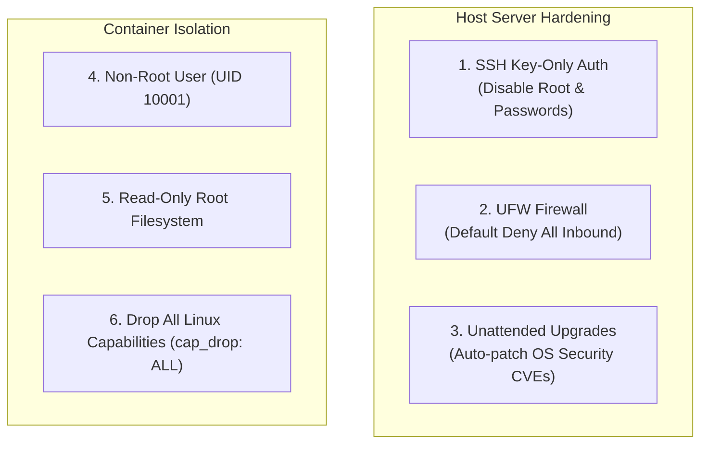

# Linux Server Hardening & Non-Root Containers

ဆာဗာ တခုတည်းကို မှားယွင်းစွာ ဖွဲ့စည်းထားမိရုံနဲ့ Cloud ပတ်ဝန်းကျင် တခုလုံးကို ထိခိုက်စေနိုင်ပါတယ်။ ဒီသင်ခန်းစာမှာတော့ Linux production host တွေနဲ့ ကွန်တိန်နာ (container) အလုပ်လုပ်ပုံ လုံခြုံရေးအတွက် မရှိမဖြစ် လိုအပ်တဲ့ hardening အဆင့်တွေကို သင်ယူရမှာ ဖြစ်ပါတယ်။



---

## 1. Linux Host နှင့် SSH ကို Hardening ပြုလုပ်ခြင်း

`/etc/ssh/sshd_config` ရှိ SSH daemon configuration ကို တည်းဖြတ်ပါ:

```text
# Disable password authentication completely (SSH Keys only!)
PasswordAuthentication no
ChallengeResponseAuthentication no

# Disable direct root login
PermitRootLogin no

# Enforce protocol 2 and limit failed attempts
Protocol 2
MaxAuthTries 3
ClientAliveInterval 300
ClientAliveCountMax 2

# Whitelist allowed users
AllowUsers devopsadmin
```

SSH ကို ပြန်လည်စတင်ပါ:
```bash
sudo systemctl restart sshd
```

---

## 2. UFW (Uncomplicated Firewall) ဖြင့် Firewall ကာကွယ်မှုပြုလုပ်ခြင်း

ဝင်ရောက်လာမည့် traffic (ingress policy) အတွက် **Default Deny** ကို သတ်မှတ်ပါ:

```bash
# 1. Set default policies
sudo ufw default deny incoming
sudo ufw default allow outgoing

# 2. Allow only required ports
sudo ufw allow 22/tcp   # SSH
sudo ufw allow 80/tcp   # HTTP
sudo ufw allow 443/tcp  # HTTPS

# 3. Enable firewall
sudo ufw enable

# 4. Check status
$ sudo ufw status verbose
Status: active
Logging: on (low)
Default: deny (incoming), allow (outgoing), disabled (routed)
To                         Action      From
--                         ------      ----
22/tcp                     ALLOW IN    Anywhere
80/tcp                     ALLOW IN    Anywhere
443/tcp                    ALLOW IN    Anywhere
```

---

## 3. ကွန်တိန်နာလုံခြုံရေး၏ ရွှေစည်းမျဉ်း- Root အနေဖြင့် လုံးဝမလုပ်ဆောင်ပါနှင့်!

မူလအားဖြင့် ကွန်တိန်နာများသည် `root` (UID 0) အနေဖြင့် လုပ်ဆောင်ကြပါတယ်။ တိုက်ခိုက်သူတစ်ဦးက သင်၏ Node.js သို့မဟုတ် Python အပလီကေးရှင်းတွင် အားနည်းချက် (vulnerability) တစ်ခုကို တွေ့ရှိခဲ့ပါက ၎င်းတို့သည် ကွန်တိန်နာအတွင်း၌ root အခွင့်အရေးကို ရရှိသွားမည်ဖြစ်ပြီး၊ ယင်းက **container escape attacks** (ကွန်တိန်နာမှ ထွက်ပြေးတိုက်ခိုက်မှုများ) ကို ပိုမိုလွယ်ကူစေပါတယ်။

### မကောင်းသော Dockerfile (Root ဖြင့် လုပ်ဆောင်ခြင်း):
```dockerfile
# ❌ VULNERABLE
FROM node:20-alpine
WORKDIR /app
COPY . .
CMD ["node", "server.js"] # Running as root!
```

### လုံခြုံရေးမြှင့်တင်ထားသော Production Dockerfile:
```dockerfile
# ✅ SECURE & HARDENED
FROM node:20-alpine AS builder
WORKDIR /app
COPY package*.json ./
RUN npm ci --only=production
COPY . .

FROM node:20-alpine
WORKDIR /app

# Create a dedicated, unprivileged system group and user
RUN addgroup -g 10001 -S appgroup &&     adduser -u 10001 -S appuser -G appgroup

COPY --from=builder --chown=appuser:appgroup /app /app

# Switch to unprivileged user!
USER 10001:10001

EXPOSE 3000
CMD ["node", "server.js"]
```

---

## 4. Kubernetes SecurityContext Hardening

သင်၏ Kubernetes pod manifest များတွင် read-only root filesystems များကို သတ်မှတ်ပြီး kernel capabilities များကို ဖြုတ်ချပါ:

```yaml
apiVersion: apps/v1
kind: Deployment
metadata:
  name: secure-web-api
spec:
  template:
    spec:
      securityContext:
        runAsNonRoot: true
        runAsUser: 10001
        runAsGroup: 10001
        fsGroup: 10001
      containers:
        - name: web
          image: my-app:v1.0.0
          securityContext:
            allowPrivilegeEscalation: false
            readOnlyRootFilesystem: true
            capabilities:
              drop:
                - ALL
          volumeMounts:
            - mountPath: /tmp # Only /tmp is writable
              name: temp-volume
      volumes:
        - name: temp-volume
          emptyDir: {}
```