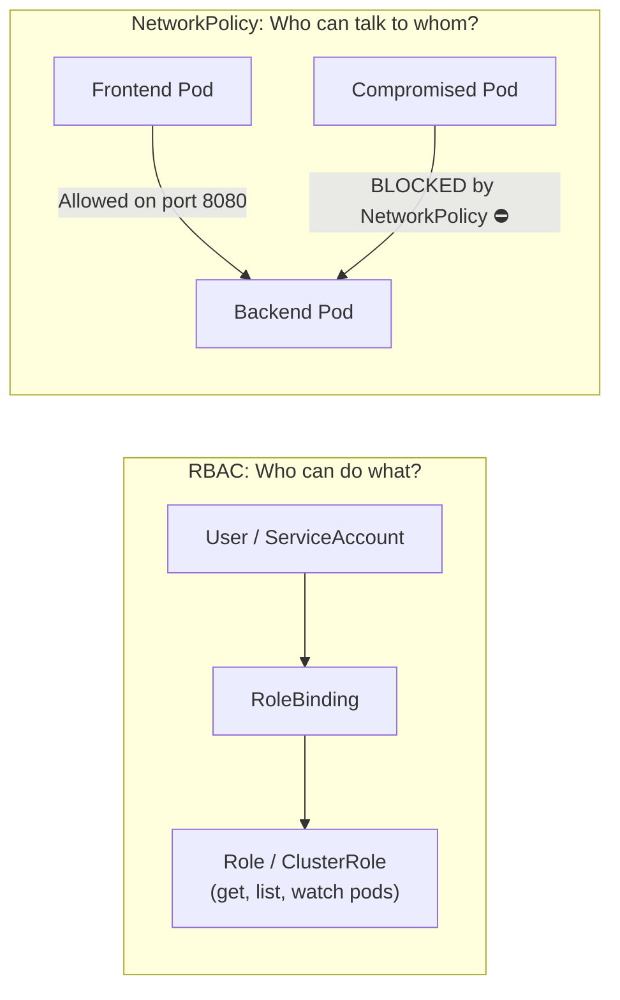

# Kubernetes Security: RBAC & NetworkPolicies

ပုံမှန် Kubernetes တပ်ဆင်မှု (default installation) တစ်ခုတွင် **လုံခြုံရေးသည် အကာအကွယ်မရှိ ပွင့်လင်းနေသည်**:
၁။ Developer သို့မဟုတ် Pod မဆို ကျယ်ပြန့်သောအခွင့်အရေးများ (privileges) ဖြင့် Kubernetes API ကို ဝင်ရောက်အသုံးပြုနိုင်ပါသည်။
၂။ Pod တိုင်းသည် နာမည်နေရာ (namespaces) အားလုံးရှိ အခြား Pod တိုင်းနှင့် ကွန်ရက်မှတစ်ဆင့် ဆက်သွယ်နိုင်ပါသည်။

ဤသင်ခန်းစာတွင်၊ သင်သည် **Role-Based Access Control (RBAC)** ဖြင့် ክတ်စတာ (cluster) ဝင်ရောက်ခွင့်ကို တင်းကျပ်မည်ဖြစ်ပြီး **NetworkPolicies** ကို အသုံးပြု၍ မိုက်ခရို-ဖိုင်းဝေါလ် (micro-firewalls) များကို တည်ဆောက်မည် ဖြစ်သည်။



---

## 1. Role-Based Access Control (RBAC)

RBAC သည် အဓိကအရင်းအမြစ် (resources) ၄ ခုကို အသုံးပြု၍ Kubernetes API ဝင်ရောက်ခွင့်ကို ထိန်းချုပ်သည်:

| ရင်းမြစ် (Resource) | နယ်ပယ် (Scope) | ရည်ရွယ်ချက် |
| :--- | :--- | :--- |
| **Role** | တစ်ခုတည်းသော Namespace | Namespace တစ်ခုအတွင်းရှိ ခွင့်ပြုချက်များကို သတ်မှတ်သည် (ဥပမာ- `staging`) |
| **ClusterRole** | Cluster တစ်ခုလုံး | Namespace အားလုံးရှိ ခွင့်ပြုချက်များကို သတ်မှတ်သည် (ဥပမာ- nodes, PVs များကို ဖတ်ရှုခြင်း) |
| **RoleBinding** | တစ်ခုတည်းသော Namespace | Namespace တစ်ခုအတွင်းရှိ အသုံးပြုသူ၊ အုပ်စု သို့မဟုတ် ServiceAccount တစ်ခုအား Role တစ်ခု ပေးအပ်သည် |
| **ClusterRoleBinding** | Cluster တစ်ခုလုံး | Cluster တစ်ခုလုံးတွင် ClusterRole တစ်ခုကို ပေးအပ်သည် |

### ဥပမာ- ဖတ်ရန်သက်သက် (Read-Only) Developer Role (`developer-role.yaml`):
```yaml
apiVersion: rbac.authorization.k8s.io/v1
kind: Role
metadata:
  namespace: production
  name: pod-reader
rules:
  - apiGroups: [""] # Core API group
    resources: ["pods", "pods/log"]
    verbs: ["get", "list", "watch"] # ဖျက်ခြင်း၊ ဖန်တီးခြင်း သို့မဟုတ် ပြင်ဆင်ခြင်း မပြုလုပ်နိုင်ပါ!
```

### အသုံးပြုသူ Alice အား Role ချိတ်ဆက်ခြင်း (Bind):
```yaml
apiVersion: rbac.authorization.k8s.io/v1
kind: RoleBinding
metadata:
  name: read-pods-alice
  namespace: production
subjects:
  - kind: User
    name: alice@company.com
    apiGroup: rbac.authorization.k8s.io
roleRef:
  kind: Role
  name: pod-reader
  apiGroup: rbac.authorization.k8s.io
```

### CLI မှတစ်ဆင့် ခွင့်ပြုချက်များကို စမ်းသပ်ခြင်း:
```bash
# Alice သည် pods များကို ဖျက်နိုင်စွမ်းရှိမရှိ စစ်ဆေးခြင်း:
$ kubectl auth can-i delete pods --namespace production --as alice@company.com
no

# Alice သည် pod log များကို ဖတ်နိုင်စွမ်းရှိမရှိ စစ်ဆေးခြင်း:
$ kubectl auth can-i get pods/log --namespace production --as alice@company.com
yes
```

---

## 2. Kubernetes NetworkPolicies (Micro-Segmentation)

မူလအနေဖြင့် ဟက်ကာတစ်ဦးသည် frontend pod တစ်ခုကို ထိုးဖောက်ဝင်ရောက်နိုင်ပါက ၎င်းတို့သည် အတွင်းပိုင်း IP များကို စကန်ဖတ်နိုင်ပြီး ငွေပေးချေမှု ဒေတာဘေ့စ်များနှင့် အတွင်းပိုင်း Redis cache များကို တိုက်ရိုက်ဝင်ရောက်သုံးစွဲနိုင်ပါသည်။

**NetworkPolicies** သည် Pod များအကြား ဖိုင်းဝေါလ် စည်းမျဉ်းများကို သတ်မှတ်ပေးသည်။

### အဆင့် ၁: Namespace အတွင်းရှိ ဝင်လာသော အသွားအလာ (Inbound Traffic) အားလုံးကို မူလအားဖြင့် ပိတ်ပင်ခြင်း (Default Deny All)
```yaml
apiVersion: networking.k8s.io/v1
kind: NetworkPolicy
metadata:
  name: default-deny-all
  namespace: production
spec:
  podSelector: {} # Namespace ရှိ pod အားလုံးကို ရွေးချယ်သည်
  policyTypes:
    - Ingress
```

### အဆင့် ၂: Backend API ကိုသာ Port 5432 တွင် ဒေတာဘေ့စ်သို့ ချိတ်ဆက်ခွင့်ပြုခြင်း
```yaml
apiVersion: networking.k8s.io/v1
kind: NetworkPolicy
metadata:
  name: allow-backend-to-postgres
  namespace: production
spec:
  podSelector:
    matchLabels:
      app: postgres-database # ပစ်မှတ် DB Pod
  policyTypes:
    - Ingress
  ingress:
    - from:
        - podSelector:
            matchLabels:
              app: backend-api # backend-api pods များကိုသာ ခွင့်ပြုသည်!
      ports:
        - protocol: TCP
          port: 5432
```