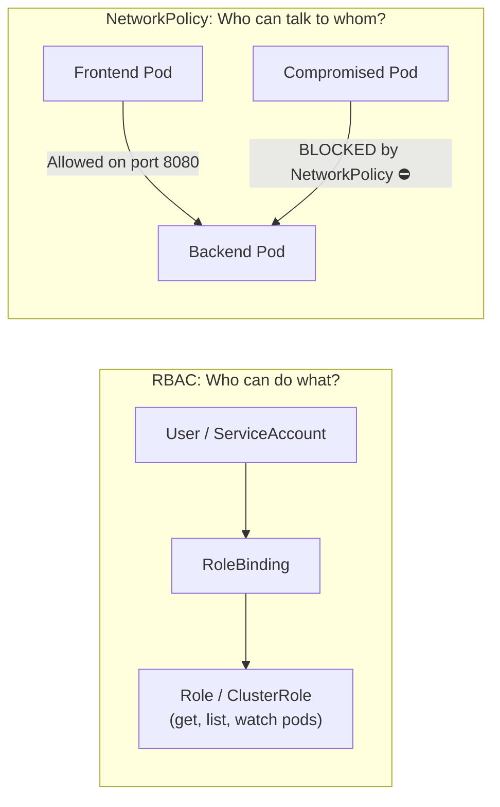

# Kubernetes Security: RBAC & NetworkPolicies

Default ဖြစ်တဲ့ Kubernetes installation မှာဆိုရင် **security က အစအဆုံး ဖွင့်ထားပါတယ် (wide open)**-
1. Developer သို့မဟုတ် pod တိုင်းဟာ Kubernetes API ကို privileges အပြည့်နဲ့ ဝင်ရောက်သုံးစွဲနိုင်ပါတယ်။
2. Pod တိုင်းဟာ namespace တွေအားလုံးမှာရှိတဲ့ အခြား pod တွေနဲ့ network ကနေ အလွယ်တကူ ဆက်သွယ်နိုင်ပါတယ်။

ဒီ lesson မှာတော့ **Role-Based Access Control (RBAC)** ကိုသုံးပြီး cluster access တွေကို ပိတ်ဆို့ tightening လုပ်မှာဖြစ်ပြီး **NetworkPolicies** တွေကိုသုံးပြီး micro-firewall တွေ တည်ဆောက်သွားမှာ ဖြစ်ပါတယ်။



---

## 1. Role-Based Access Control (RBAC)

RBAC ဟа core resources ၄ ခုကိုသုံးပြီး Kubernetes API တွေကို ဝင်ရောက်သုံးစွဲခွင့် (access) ကို ထိန်းချုပ်ပေးပါတယ်:

| Resource | Scope | Purpose |
| :--- | :--- | :--- |
| **Role** | Single Namespace | Namespace တစ်ခုတည်းအတွင်းမှာ permissions တွေကို သတ်မှတ်ပေးပါတယ် (ဥပမာ - `staging`) |
| **ClusterRole** | Entire Cluster | Cluster တစ်ခုလုံး အနှံ့ permissions တွေကို သတ်မှတ်ပေးပါတယ် (ဥပမာ - read nodes, PVs) |
| **RoleBinding** | Single Namespace | Namespace တစ်ခုအတွင်းမှာရှိတဲ့ user, group သို့မဟုတ် ServiceAccount တစ်ခုကို Role တစ်ခု ပေးအပ်ပါတယ် |
| **ClusterRoleBinding** | Entire Cluster | Cluster တစ်ခုလုံး အနှံ့ ClusterRole တစ်ခုကို ပေးအပ်ပါတယ် |

### Example: Read-Only Developer Role (`developer-role.yaml`):
```yaml
apiVersion: rbac.authorization.k8s.io/v1
kind: Role
metadata:
  namespace: production
  name: pod-reader
rules:
  - apiGroups: [""] # Core API group
    resources: ["pods", "pods/log"]
    verbs: ["get", "list", "watch"] # Cannot delete, create, or update!
```

### Bind Role to User Alice:
```yaml
apiVersion: rbac.authorization.k8s.io/v1
kind: RoleBinding
metadata:
  name: read-pods-alice
  namespace: production
subjects:
  - kind: User
    name: alice@company.com
    apiGroup: rbac.authorization.k8s.io
roleRef:
  kind: Role
  name: pod-reader
  apiGroup: rbac.authorization.k8s.io
```

### Test Permissions from CLI:
```bash
# Check if Alice can delete pods:
$ kubectl auth can-i delete pods --namespace production --as alice@company.com
no

# Check if Alice can read pod logs:
$ kubectl auth can-i get pods/log --namespace production --as alice@company.com
yes
```

---

## 2. Kubernetes NetworkPolicies (Micro-Segmentation)

Default အနေနဲ့ဆိုရင် တိုက်ခိုက်သူတစ်ဦး (attacker) က frontend pod တစ်ခုကို ထိုးဖောက်ဝင်ရောက်နိုင်ခဲ့ပြီဆိုရင် ၎င်းတို့အနေနဲ့ internal IP တွေကို scan ဖတ်နိုင်ပြီး payment database တွေနဲ့ internal Redis cache တွေကိုပါ တိုက်ရိုက် ဝင်ရောက်သုံးစွဲနိုင်သွားမှာ ဖြစ်ပါတယ်။

**NetworkPolicies** ကတော့ pod တွေကြားမှာ firewall rules တွေကို enforce လုပ်ပေးပါတယ်။

### Step 1: Default Deny All Inbound Traffic in Namespace
```yaml
apiVersion: networking.k8s.io/v1
kind: NetworkPolicy
metadata:
  name: default-deny-all
  namespace: production
spec:
  podSelector: {} # Selects all pods in namespace
  policyTypes:
    - Ingress
```

### Step 2: Allow Only Backend API to Connect to Database on Port 5432
```yaml
apiVersion: networking.k8s.io/v1
kind: NetworkPolicy
metadata:
  name: allow-backend-to-postgres
  namespace: production
spec:
  podSelector:
    matchLabels:
      app: postgres-database # Target DB Pod
  policyTypes:
    - Ingress
  ingress:
    - from:
        - podSelector:
            matchLabels:
              app: backend-api # ONLY backend-api pods permitted!
      ports:
        - protocol: TCP
          port: 5432
```