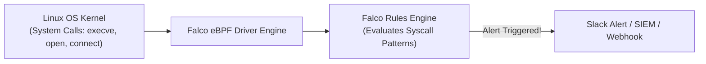

# Falco ဖြင့် Run-time ခြိမ်းခြောက်မှုများကို ထောက်လှမ်းခြင်း (Runtime Threat Detection)

Static code scan များ နှင့် container image vulnerability စစ်ဆေးခြင်းများသည် **deployment မလုပ်မီ** အချိန်တွင်သာ သင့်ကို ကာကွယ်ပေးနိုင်ပါသည်။ သို့သော် တိုက်ခိုက်သူတစ်ဦးသည် လိုက်ဗ်ထုတ်လုပ်ရေးဆာဗာ (live production server) တစ်ခုပေါ်တွင် နံနက် ၂:၀၀ နာရီအချိန်၌ zero-day အားနည်းချက် (ဥပမာ- Log4Shell) ကို အသုံးချတိုက်ခိုက်လာပါက ဘာဖြစ်မည်နည်း။

**Sysdig Falco** သည် cloud-native runtime ခြိမ်းခြောက်မှုများကို ထောက်လှမ်းရန်အတွက် CNCF အဆင့်သတ်မှတ်ထားသော စံနှုန်းတစ်ခုဖြစ်သည်။ ၎င်းသည် Linux kernel အတွင်းတွင် **eBPF (Extended Berkeley Packet Filter)** ကို အသုံးပြု၍ ထိုင်နေပြီး system call တိုင်းကို အချိန်နှင့်တပြေးညီ (real time) ခွဲခြမ်းစိတ်ဖြာပေးပါသည်။



---

## Falco က ဘာတွေကို ထောက်လှမ်းနိုင်သလဲ။

Falco သည် static scan များ လုံးဝလွတ်သွားတတ်သော အန္တရာယ်ရှိသည့် အပြုအမူများကို ထောက်လှမ်းနိုင်သည်-
1. **Interactive Shell စတင်ခြင်း (Shell Spawned)**: တစ်စုံတစ်ဦးသည် production container တစ်ခုအတွင်း၌ `kubectl exec` ကို Run ခဲ့ခြင်း သို့မဟုတ် `/bin/bash` shell ကို စတင်ဖွင့်လှစ်ခဲ့ခြင်း။
2. **Binary ပြုပြင်မွမ်းမံခြင်း**: လုပ်ငန်းစဉ် (process) တစ်ခုသည် `/bin`၊ `/sbin` သို့မဟုတ် `/usr/bin` ထဲသို့ ရေးသားရန် ကြိုးပမ်းခဲ့ခြင်း။
3. **အခွင့်ထူးတိုးမြှင့်ခြင်း (Privilege Escalation)**: လုပ်ငန်းစဉ်တစ်ခုသည် `/etc/shadow`၊ `/etc/sudoers` သို့မဟုတ် Kubernetes service account token များကို ပြုပြင်ခဲ့ခြင်း။
4. **គ្រីပတိုမိုင်းင်းလုပ်ခြင်း (Cryptomining)**: လူသိများသော Monero / Bitcoin mining pool များဆီသို့ အပြင်ဘက်သို့ ချိတ်ဆက်မှုများ ပြုလုပ်ခြင်း။
5. **အရေးကြီးဖိုင်များကို ဖတ်ရှုခြင်း**: သီးသန့် SSH သော့များ (`id_rsa`) သို့မဟုတ် PKI လက်မှတ်များကို ခွင့်ပြုချက်မရှိဘဲ ဖတ်ရှုခြင်း။

---

## Falco Rule တစ်ခု၏ ဖွဲ့စည်းပုံ

Falco rule များကို သန့်ရှင်းပြီး ရှင်းလင်းသော declarative syntax ကို အသုံးပြု၍ YAML ဖြင့် သတ်မှတ်ထားသည်-

```yaml
# /etc/falco/falco_rules.local.yaml

# Rule 1: Detect shell spawned inside production container
- rule: Terminal Shell Spawned in Production Container
  desc: Detect when bash/sh/zsh is launched inside a container
  condition: >
    container.id != host and
    evt.type = execve and
    evt.dir = < and
    proc.name in (bash, sh, zsh, ksh)
  output: >
    CRITICAL: Shell spawned in container
    (user=%user.name container_id=%container.id
    container_name=%container.name image=%container.image.repository
    cmdline=%proc.cmdline)
  priority: CRITICAL
  tags: [container, execution, pci-dss]

# Rule 2: Detect unauthorized read of sensitive credentials
- rule: Read Sensitive File in Container
  desc: Detect access to /etc/shadow or AWS credentials
  condition: >
    container.id != host and
    evt.type in (open, openat) and
    fd.name startswith "/root/.aws"
  output: >
    WARNING: AWS credentials accessed inside container
    (user=%user.name proc=%proc.name file=%fd.name)
  priority: WARNING
```

---

## Kubernetes တွင် Falco ကို ထည့်သွင်းခြင်း (Installing)

Helm ကို အသုံးပြု၍ worker node အားလုံးတွင် Falco ကို `DaemonSet` တစ်ခုအနေဖြင့် deploy လုပ်ပါ-

```bash
# 1. Add Falco Helm repo
helm repo add falcosecurity https://falcosecurity.github.io/charts
helm repo update

# 2. Install Falco with modern eBPF driver
helm install falco falcosecurity/falco   --namespace falco   --create-namespace   --set driver.kind=ebpf   --set falcosidekick.enabled=true   --set falcosidekick.config.slack.webhookurl="https://hooks.slack.com/services/T00/B00/XXXX"
```

---

## သင့်ရဲ့ Detection Rule ကို လိုက်ဗ်စမ်းသပ်ခြင်း

Test container တစ်ခုကို စတင်ပြီး shell တစ်ခုကို Run ကြည့်ပါ-
```bash
kubectl run test-pod --image=alpine -- rm -rf /bin/ls
```

မီလီစက္ကန့် ၂၀၀ အတွင်းမှာပင် Falco သည် သင့်ရဲ့ Slack `#security-alerts` ချန်နယ်သို့ သတိပေးချက် (Alert) ပို့ပေးပါမည်-
```text
🚨 [CRITICAL] Terminal Shell Spawned in Production Container
User: root
Pod: test-pod
Namespace: default
Image: alpine:latest
Command: rm -rf /bin/ls
Timestamp: 2026-08-19 02:30:15 UTC
```