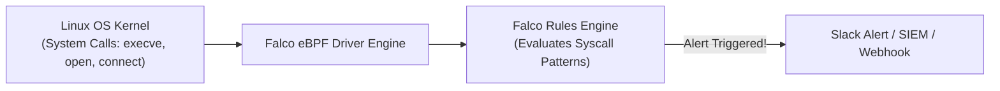

# Runtime Threat Detection with Falco

Static code scans နဲ့ container image vulnerability checks တွေက deployment **မလုပ်ခင်** အချိန်မှာပဲ ကာကွယ်ပေးနိုင်ပါတယ်။ ဒါပေမဲ့ production server အရှင်ပေါ်မှာ ည ၂ နာရီလောက်မှာ တိုက်ခိုက်သူတစ်ဦးက zero-day vulnerability တစ်ခုခု (ဥပမာ- Log4Shell လိုမျိုး) ကို exploit လုပ်လာခဲ့ရင် ဘာဖြစ်မလဲ?

**Sysdig Falco** ဆိုတာကတော့ cloud-native runtime threat detection အတွက် CNCF graduated ဖြစ်ပြီးသား standard တစ်ခု ဖြစ်ပါတယ်။ သူက **eBPF (Extended Berkeley Packet Filter)** ကိုသုံးပြီး Linux kernel ထဲမှာ ထိုင်နေကာ system call တိုင်းကို real-time အနေနဲ့ စစ်ဆေးပေးပါတယ်။



---

## Falco က ဘာတွေကို Detect လုပ်နိုင်လဲ?

Static scans တွေ လုံးဝလွတ်သွားတတ်တဲ့ malicious behavior တွေကို Falco က detect လုပ်ပေးနိုင်ပါတယ် -
1. **Interactive Shell Spawned**: လူတစ်ယောက်က production container ထဲမှာ `kubectl exec` လုပ်တာ ဒါမှမဟုတ် `/bin/bash` shell ကို spawn လုပ်တာ။
2. **Binary Modification**: Process တစ်ခုက `/bin`၊ `/sbin` ဒါမှမဟုတ် `/usr/bin` ထဲကို write လုပ်ဖို့ ကြိုးစားတာ။
3. **Privilege Escalation**: Process တစ်ခုက `/etc/shadow`၊ `/etc/sudoers` ဒါမှမဟုတ် Kubernetes service account tokens တွေကို modify လုပ်တာ။
4. **Cryptomining**: လူသိများတဲ့ Monero / Bitcoin mining pools တွေဆီ outbound connection ချိတ်တာ။
5. **Sensitive File Reads**: Private SSH keys (`id_rsa`) ဒါမှမဟုတ် PKI certificates တွေကို unauthorized ဖတ်တာ။

---

## Falco Rule တစ်ခုရဲ့ Anatomy

Falco rules တွေကို clean declarative syntax သုံးပြီး YAML နဲ့ 정의 (define) လုပ်ရပါတယ်။

```yaml
# /etc/falco/falco_rules.local.yaml

# Rule 1: Detect shell spawned inside production container
- rule: Terminal Shell Spawned in Production Container
  desc: Detect when bash/sh/zsh is launched inside a container
  condition: >
    container.id != host and
    evt.type = execve and
    evt.dir = < and
    proc.name in (bash, sh, zsh, ksh)
  output: >
    CRITICAL: Shell spawned in container
    (user=%user.name container_id=%container.id
    container_name=%container.name image=%container.image.repository
    cmdline=%proc.cmdline)
  priority: CRITICAL
  tags: [container, execution, pci-dss]

# Rule 2: Detect unauthorized read of sensitive credentials
- rule: Read Sensitive File in Container
  desc: Detect access to /etc/shadow or AWS credentials
  condition: >
    container.id != host and
    evt.type in (open, openat) and
    fd.name startswith "/root/.aws"
  output: >
    WARNING: AWS credentials accessed inside container
    (user=%user.name proc=%proc.name file=%fd.name)
  priority: WARNING
```

---

## Kubernetes ပေါ်မှာ Falco ကို Install လုပ်ခြင်း

Helm ကိုသုံးပြီး worker node တွေအားလုံးမှာ Falco ကို `DaemonSet` အနေနဲ့ deploy လုပ်ပါ -

```bash
# 1. Add Falco Helm repo
helm repo add falcosecurity https://falcosecurity.github.io/charts
helm repo update

# 2. Install Falco with modern eBPF driver
helm install falco falcosecurity/falco   --namespace falco   --create-namespace   --set driver.kind=ebpf   --set falcosidekick.enabled=true   --set falcosidekick.config.slack.webhookurl="https://hooks.slack.com/services/T00/B00/XXXX"
```

---

## ကိုယ့်ရဲ့ Detection Rule ကို Live Test လုပ်ကြည့်ခြင်း

Test container တစ်ခု spawn လုပ်ပြီး shell တစ်ခုကို run ကြည့်ပါ -
```bash
kubectl run test-pod --image=alpine -- rm -rf /bin/ls
```

၂၀၁ မီလီစက္ကန့်အတွင်းမှာပဲ Falco က သင့်ရဲ့ Slack `#security-alerts` channel ဆီကို alert ပို့ပေးပါလိမ့်မယ် -
```text
🚨 [CRITICAL] Terminal Shell Spawned in Production Container
User: root
Pod: test-pod
Namespace: default
Image: alpine:latest
Command: rm -rf /bin/ls
Timestamp: 2026-08-19 02:30:15 UTC
```