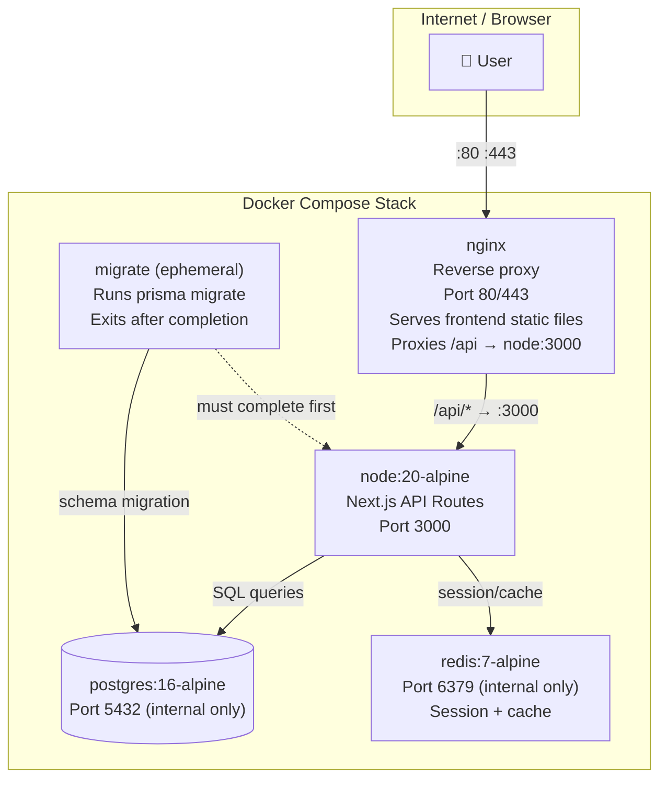

# ငါတို့ ဘာတွေ တည်ဆောက်နေကြလဲ

ဒီသင်ခန်းစာကတော့ Docker Compose ကို အသုံးပြုပြီး ပြီးပြည့်စုံပြီး production အဆင့်မီ သုံးထပ် (three-tier) အပလီကေးရှင်း stack တစ်ခုကို အစအဆုံး တည်ဆောက်ပုံကို ရှင်းပြပေးမှာ ဖြစ်ပါတယ်။ လိုင်းတစ်လိုင်းချင်းစီက ဘာလုပ်ပေးလဲနဲ့ ဘာကြောင့်လဲဆိုတာကို သေချာနားလည်နိုင်ဖို့ ဖိုင်တိုင်းမှာ မှတ်ချက်တွေ ရေးပေးထားပါတယ်။



---

## ပရောဂျက် တည်ဆောက်ပုံ (Project Structure)

```
myapp/
├── docker-compose.yml           # Main compose file
├── docker-compose.dev.yml       # Dev overrides
├── docker-compose.prod.yml      # Production overrides
├── .env                         # Default env vars (committed — no secrets)
├── .env.local                   # Local overrides (gitignored)
├── .env.production              # Production secrets (never committed)
├── Dockerfile                   # Multi-stage build
├── nginx/
│   ├── nginx.conf               # Nginx config
│   └── default.conf             # Virtual host config
├── db/
│   └── init.sql                 # First-time database setup
└── src/                         # Application source code
```

---

## အဆင့် ၁။ Multi-Stage Dockerfile

Multi-stage Dockerfile တစ်ခုက production image ကို ပေါ့ပါးစေပါတယ် — dev tools တွေ မပါဘူး၊ source maps တွေ မပါဘူး၊ dependency တစ်ခုလုံးအတွက် `node_modules` တွေလည်း မပါဝင်ပါဘူး:

```dockerfile
# Dockerfile

# ── Stage 1: Install dependencies ──────────────────────────────────────
FROM node:20-alpine AS deps
WORKDIR /app

# Copy package files first (leverages Docker layer cache)
# Only re-runs npm install when package.json or lock file changes
COPY package.json package-lock.json ./
RUN npm ci --only=production          # Production deps only

# ── Stage 2: Build the application ─────────────────────────────────────
FROM node:20-alpine AS builder
WORKDIR /app

# Copy all deps (including dev) for build step
COPY package.json package-lock.json ./
RUN npm ci                            # All deps for build
COPY . .
RUN npm run build                     # Next.js / webpack build

# ── Stage 3: Production runtime image ──────────────────────────────────
FROM node:20-alpine AS runner
WORKDIR /app

# Security: don't run as root
RUN addgroup -S appgroup && adduser -S appuser -G appgroup
USER appuser

ENV NODE_ENV=production

# Only copy what's needed at runtime (much smaller image)
COPY --from=deps    /app/node_modules ./node_modules
COPY --from=builder /app/.next        ./.next
COPY --from=builder /app/public       ./public
COPY --from=builder /app/package.json ./package.json

EXPOSE 3000

# Health check baked into the image
HEALTHCHECK --interval=30s --timeout=10s --start-period=20s --retries=3 \
  CMD wget -qO- http://localhost:3000/health || exit 1

CMD ["node_modules/.bin/next", "start"]
```

---

## အဆင့် ၂။ `.env` ဖိုင်

```bash
# .env — default values (safe to commit — no real secrets)
# Override with .env.local or environment-specific files

# Postgres
POSTGRES_USER=appuser
POSTGRES_DB=myapp
POSTGRES_PORT=5432

# App
NODE_ENV=development
APP_PORT=3000
LOG_LEVEL=info

# Redis
REDIS_PORT=6379
```

```bash
# .env.local — your personal local overrides (NEVER COMMIT — add to .gitignore)
POSTGRES_PASSWORD=dev_local_password_change_me
```

```bash
# .gitignore
.env.local
.env.production
.env.*.local
```

---

## အဆင့် ၃။ Nginx Config

```nginx
# nginx/default.conf
upstream api_backend {
    server api:3000;              # 'api' is the Docker service name — DNS resolves automatically
    keepalive 32;
}

server {
    listen 80;
    server_name _;

    # Security headers
    add_header X-Frame-Options "SAMEORIGIN";
    add_header X-Content-Type-Options "nosniff";
    add_header X-XSS-Protection "1; mode=block";
    add_header Referrer-Policy "strict-origin-when-cross-origin";

    # Gzip compression
    gzip on;
    gzip_types text/plain text/css application/json application/javascript;
    gzip_min_length 1000;

    # Proxy API requests to Next.js
    location /api/ {
        proxy_pass http://api_backend;
        proxy_http_version 1.1;
        proxy_set_header Upgrade $http_upgrade;
        proxy_set_header Connection 'upgrade';
        proxy_set_header Host $host;
        proxy_set_header X-Real-IP $remote_addr;
        proxy_set_header X-Forwarded-For $proxy_add_x_forwarded_for;
        proxy_set_header X-Forwarded-Proto $scheme;
        proxy_cache_bypass $http_upgrade;
        proxy_read_timeout 60s;
    }

    # Serve Next.js pages
    location / {
        proxy_pass http://api_backend;
        proxy_http_version 1.1;
        proxy_set_header Host $host;
        proxy_set_header X-Real-IP $remote_addr;
        proxy_cache_bypass $http_upgrade;
    }

    # Health check endpoint for load balancers
    location /nginx-health {
        access_log off;
        return 200 "healthy\n";
        add_header Content-Type text/plain;
    }
}
```

---

## အဆင့် ၄။ Database Init Script

```sql
-- db/init.sql — runs automatically on first container start
-- (Only runs when the data directory is empty — not on every restart)

-- Create the application user with limited permissions
CREATE USER appuser WITH PASSWORD 'changeme_in_env';

-- Create the database
CREATE DATABASE myapp OWNER appuser;

-- Connect to the new database
\c myapp

-- Enable useful extensions
CREATE EXTENSION IF NOT EXISTS "uuid-ossp";   -- UUID generation
CREATE EXTENSION IF NOT EXISTS "pg_trgm";     -- Trigram matching for search

-- Set search path
ALTER ROLE appuser SET search_path TO public;

-- Grant permissions
GRANT ALL PRIVILEGES ON DATABASE myapp TO appuser;
GRANT ALL ON SCHEMA public TO appuser;
```

---

## အဆင့် ၅။ အခြေခံ `docker-compose.yml`

```yaml
# docker-compose.yml — base config (shared across all environments)
services:

  # ── Database ─────────────────────────────────────────────────────────
  db:
    image: postgres:16-alpine
    environment:
      POSTGRES_USER: ${POSTGRES_USER}
      POSTGRES_PASSWORD: ${POSTGRES_PASSWORD}
      POSTGRES_DB: ${POSTGRES_DB}
    volumes:
      - postgres-data:/var/lib/postgresql/data
      - ./db/init.sql:/docker-entrypoint-initdb.d/01-init.sql:ro
    restart: unless-stopped
    networks:
      - backend
    healthcheck:
      test: ["CMD-SHELL", "pg_isready -U ${POSTGRES_USER} -d ${POSTGRES_DB}"]
      interval: 5s
      timeout: 5s
      retries: 10
      start_period: 15s

  # ── Cache ─────────────────────────────────────────────────────────────
  cache:
    image: redis:7-alpine
    command: >
      redis-server
      --save 60 1
      --loglevel warning
      --requirepass ${REDIS_PASSWORD}
      --maxmemory 256mb
      --maxmemory-policy allkeys-lru
    volumes:
      - redis-data:/data
    restart: unless-stopped
    networks:
      - backend
    healthcheck:
      test: ["CMD", "redis-cli", "-a", "${REDIS_PASSWORD}", "ping"]
      interval: 5s
      timeout: 3s
      retries: 5

  # ── Database Migration (runs once, then exits) ────────────────────────
  migrate:
    build:
      context: .
      dockerfile: Dockerfile
      target: builder        # Use builder stage (has dev deps for Prisma CLI)
    command: ["npx", "prisma", "migrate", "deploy"]
    environment:
      DATABASE_URL: "postgres://${POSTGRES_USER}:${POSTGRES_PASSWORD}@db:5432/${POSTGRES_DB}"
    depends_on:
      db:
        condition: service_healthy
    restart: "no"            # Never restart — it's a one-shot task
    networks:
      - backend

  # ── Application API ───────────────────────────────────────────────────
  api:
    build:
      context: .
      dockerfile: Dockerfile
      target: runner
    environment:
      NODE_ENV: ${NODE_ENV:-production}
      PORT: "3000"
      DATABASE_URL: "postgres://${POSTGRES_USER}:${POSTGRES_PASSWORD}@db:5432/${POSTGRES_DB}"
      REDIS_URL: "redis://:${REDIS_PASSWORD}@cache:6379"
    depends_on:
      migrate:
        condition: service_completed_successfully
      cache:
        condition: service_healthy
    restart: unless-stopped
    networks:
      - backend
    healthcheck:
      test: ["CMD-SHELL", "wget -qO- http://localhost:3000/health || exit 1"]
      interval: 30s
      timeout: 10s
      retries: 3
      start_period: 20s

  # ── Reverse Proxy ─────────────────────────────────────────────────────
  nginx:
    image: nginx:alpine
    ports:
      - "80:80"
    volumes:
      - ./nginx/default.conf:/etc/nginx/conf.d/default.conf:ro
    depends_on:
      api:
        condition: service_healthy
    restart: unless-stopped
    networks:
      - backend
    healthcheck:
      test: ["CMD", "wget", "-qO-", "http://localhost/nginx-health"]
      interval: 30s
      timeout: 5s
      retries: 3

networks:
  backend:
    driver: bridge

volumes:
  postgres-data:
  redis-data:
```

---

## အဆင့် ၆။ Development Override File

```yaml
# docker-compose.dev.yml — development additions/overrides
services:
  api:
    build:
      target: builder          # Use builder stage (has dev tools like nodemon)
    command: ["npm", "run", "dev"]   # Hot reload dev server
    environment:
      NODE_ENV: development
      LOG_LEVEL: debug
    volumes:
      - ./src:/app/src          # Hot reload — changes reflect immediately
      - ./public:/app/public
    ports:
      - "3000:3000"             # Also expose API port directly for development

  db:
    ports:
      - "127.0.0.1:5432:5432"  # Expose for DBeaver, TablePlus, pgAdmin

  cache:
    ports:
      - "127.0.0.1:6379:6379"  # Expose for Redis Insight, redis-cli

  # Adminer: web-based DB admin UI (dev only)
  adminer:
    image: adminer:latest
    ports:
      - "127.0.0.1:8080:8080"
    networks:
      - backend
    profiles: ["tools"]        # Only starts with: docker compose --profile tools up

  # Mailhog: catches all outgoing emails in development
  mailhog:
    image: mailhog/mailhog
    ports:
      - "127.0.0.1:1025:1025"  # SMTP
      - "127.0.0.1:8025:8025"  # Web UI
    networks:
      - backend
    profiles: ["tools"]
```

---

## အဆင့် ၇။ Stack ကို စတင်လည်ပတ်ခြင်း (Running the Stack)

```bash
# === Development ===

# Copy and fill in the .env.local
cp .env .env.local
# Edit .env.local: set POSTGRES_PASSWORD, REDIS_PASSWORD

# Start the full dev stack (builds images, runs migrations, starts everything)
docker compose -f docker-compose.yml -f docker-compose.dev.yml up -d

# With dev tools (Adminer + Mailhog)
docker compose -f docker-compose.yml -f docker-compose.dev.yml \
  --profile tools up -d

# Watch all logs
docker compose logs -f

# Watch just the API
docker compose logs -f api

# Open an interactive psql session
docker compose exec db psql -U appuser -d myapp

# Open a Redis CLI session
docker compose exec cache redis-cli -a ${REDIS_PASSWORD}

# Run a one-off command (e.g., Prisma Studio)
docker compose run --rm api npx prisma studio

# Tear everything down (keeps data)
docker compose -f docker-compose.yml -f docker-compose.dev.yml down

# Tear everything down AND wipe data (fresh start)
docker compose -f docker-compose.yml -f docker-compose.dev.yml down -v
```

---

## စတင်လည်ပတ်မည့် အစဉ်လိုက်ကို စစ်ဆေးခြင်း (Startup Order Verification)

```bash
# After docker compose up, verify each service is healthy
docker compose ps
# NAME            IMAGE              STATUS                   PORTS
# myapp-db-1      postgres:16-alpine  Up (healthy)             5432/tcp
# myapp-cache-1   redis:7-alpine     Up (healthy)             6379/tcp
# myapp-migrate-1 myapp-api          Exited (0)               ← Migration completed
# myapp-api-1     myapp-api          Up (healthy)             3000/tcp
# myapp-nginx-1   nginx:alpine       Up (healthy)             0.0.0.0:80->80/tcp

# Verify the API is responding
curl http://localhost/api/health
# {"status":"ok","db":"connected","cache":"connected"}

# Check migration ran successfully
docker compose logs migrate
# Prisma schema loaded from prisma/schema.prisma
# Running 3 migration(s)... Done ✅
```

---

## ဖြစ်လေ့ရှိသော ပြဿနာများကို ဖြေရှင်းခြင်း (Troubleshooting Common Issues)

```bash
# Container exits immediately — check the logs
docker compose logs api
# Or check the exit code
docker compose ps -a

# Port already in use
docker compose down  # Make sure nothing is already running
lsof -i :3000       # Find what's using the port on your host

# Database connection refused from API
# Almost always: API started before DB was ready
# Fix: ensure depends_on uses condition: service_healthy with a proper healthcheck

# Volume not updating (bind mount changes not reflected)
docker compose exec api ls /app/src  # Verify the bind mount is correct

# Images are stale (not picking up your Dockerfile changes)
docker compose build --no-cache api
docker compose up -d
```

---

## အနှစ်ချုပ် (Summary)

အောက်ပါတို့ပါဝင်သော production အဆင့်မီ သုံးထပ် stack တစ်ခုကို သင် တည်ဆောက်ပြီးပါပြီ -
- **Multi-stage Dockerfile** — လိုအပ်သော build artifacts များကိုသာ အသုံးပြုထားသည့် ပေါ့ပါးသော runtime image
- **Nginx reverse proxy** — static ဖိုင်များကို ကိုယ်တွယ်ပေးခြင်း၊ Node.js သို့ proxy လုပ်ပေးခြင်း၊ security headers များနှင့် gzip ထည့်သွင်းပေးခြင်း
- **Migration service** — `condition: service_completed_successfully` ကို အသုံးပြု၍ API မစတင်မီ Prisma migrations များကို အတိအကျ တစ်ကြိမ်သာ လုပ်ဆောင်ပေးခြင်း
- **Startup ordering** — `db → cache → migrate → api → nginx`၊ တစ်ခုချင်းစီသည် စစ်မှန်သော health checks များကို စောင့်ဆိုင်းခြင်း
- **Override pattern** — `docker-compose.dev.yml` သည် hot reload၊ ဒေသတွင်း ကလိုင်းယင့်များအတွက် ပို့စ်များကို ဖွင့်ပေးခြင်းနှင့် profile များမှတစ်ဆင့် ရွေးချယ်နိုင်သော dev tools များကို ပေါင်းထည့်ပေးခြင်း
- **Security** — database ကို အင်တာနက်သို့ တိုက်ရိုက်မထုတ်ပေးထားခြင်း၊ root မဟုတ်သော container user ကို အသုံးပြုခြင်း၊ Redis ကို စကားဝှက်ဖြင့် ကာကွယ်ထားခြင်း

နောက်သင်ခန်းစာတွင်, development, staging နှင့် production ပတ်ဝန်းကျင်များတစ်လျှောက် environment variables များနှင့် secret စီမံခန့်ခွဲမှုကို ကျွမ်းကျင်လာပါလိမ့်မည်။